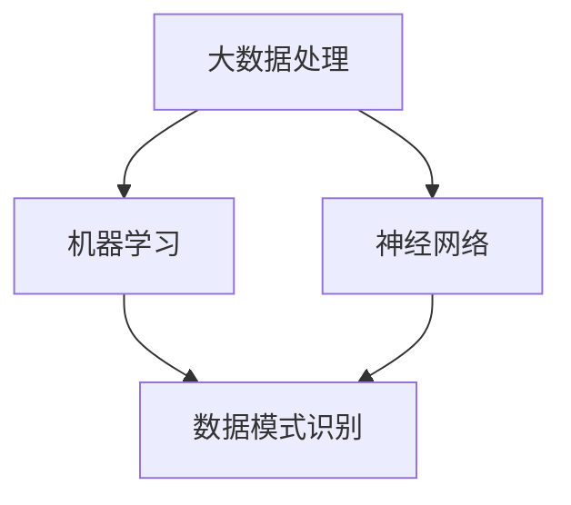

                 

在当今数字化时代，信息的实时更新变得至关重要。无论是商业决策、科学研究还是个人日常生活，信息的实时性都能极大地提升决策效率和体验质量。而人工智能（AI）在实时信息更新方面展现出了巨大的速度优势。本文将探讨AI在实时信息更新中的速度优势，以及这一优势如何改变我们的世界。

## 关键词

- 实时信息更新
- 人工智能
- 数据处理速度
- 决策效率
- 用户体验
- 实时通信

## 摘要

本文首先介绍了实时信息更新的背景和重要性，随后探讨了人工智能在提高数据处理速度和效率方面的作用。通过具体案例分析，展示了AI如何实现实时信息的高效更新，从而提升决策效率、优化用户体验。最后，对AI在实时信息更新领域的未来应用和发展趋势进行了展望。

## 1. 背景介绍

随着互联网和移动设备的普及，我们能够获取的信息量前所未有地增加。这种信息爆炸对数据处理和更新的速度提出了前所未有的要求。实时信息更新不仅能够为用户提供即时的信息，还能帮助企业做出更迅速的决策。

### 1.1 实时信息更新的重要性

实时信息更新对于以下几个领域至关重要：

- **商业决策**：企业需要及时掌握市场动态，以快速调整战略。
- **科学研究**：研究人员需要实时获取数据，以便进行实验和分析。
- **公共安全**：政府和紧急服务机构需要实时监控和响应突发事件。
- **个人生活**：消费者需要实时获取产品信息、交通状况等，以做出更好的生活决策。

### 1.2 速度与效率

速度是实时信息更新的核心。数据处理速度的快慢直接影响到决策的效率和用户体验。例如，在金融交易中，毫秒级的延迟可能导致数百万美元的损失。而在医疗领域，实时数据更新可以挽救生命。

## 2. 核心概念与联系

为了深入理解AI在实时信息更新中的作用，我们需要探讨几个核心概念：

- **大数据处理**：AI能够处理和分析海量数据，从而提供实时的信息更新。
- **机器学习**：通过机器学习，AI可以自动识别和预测数据模式，从而实现更高效的实时更新。
- **神经网络**：神经网络是AI的基础，能够实现高速的数据处理和模式识别。

下面是这些核心概念和架构的Mermaid流程图：



### 2.1 大数据处理

大数据处理是AI实时信息更新的基础。它涉及数据的收集、存储、分析和处理。通过分布式计算和云计算技术，AI能够快速处理海量数据，并提供实时更新。

### 2.2 机器学习

机器学习是AI的核心技术之一。它使AI能够从数据中学习，并自动识别数据中的模式和规律。这种能力使得AI能够实时更新信息，并预测未来的趋势。

### 2.3 神经网络

神经网络是模拟人脑结构和功能的计算模型。它通过多层神经元之间的连接和信号传递，实现数据的处理和模式识别。神经网络的高效性使得AI能够快速实现实时信息更新。

## 3. 核心算法原理 & 具体操作步骤

### 3.1 算法原理概述

AI在实时信息更新中的核心算法主要包括以下几种：

- **实时数据流处理**：通过实时数据流处理技术，如Apache Kafka和Apache Flink，AI能够高效地处理和更新数据。
- **机器学习算法**：如随机森林、支持向量机和深度学习算法，这些算法能够从数据中学习，并自动更新模型。
- **神经网络优化**：通过神经网络优化算法，如梯度下降和自适应优化算法，AI能够提高数据处理速度和效率。

### 3.2 算法步骤详解

#### 3.2.1 实时数据流处理

1. 数据采集：通过传感器、API或日志收集数据。
2. 数据预处理：清洗和转换数据，以便后续处理。
3. 实时处理：使用流处理技术处理数据，并实时更新数据库或缓存。
4. 数据可视化：将实时数据通过图表或报表展示，供用户实时查看。

#### 3.2.2 机器学习算法

1. 数据采集：收集历史数据，用于训练模型。
2. 特征工程：提取和选择数据中的特征，用于训练模型。
3. 模型训练：使用机器学习算法训练模型，如随机森林、支持向量机等。
4. 模型评估：评估模型性能，并进行调整。
5. 模型部署：将训练好的模型部署到生产环境，实现实时更新。

#### 3.2.3 神经网络优化

1. 神经网络架构设计：设计神经网络的结构，包括层数、神经元数量和连接方式。
2. 模型训练：使用大量数据进行模型训练，通过反向传播算法优化模型参数。
3. 模型评估：评估模型性能，包括准确率、召回率等指标。
4. 模型部署：将训练好的模型部署到生产环境，实现实时更新。

### 3.3 算法优缺点

#### 3.3.1 实时数据流处理

优点：

- **高效性**：能够实时处理和更新数据。
- **可扩展性**：能够处理大量数据，并支持水平扩展。

缺点：

- **复杂性**：需要复杂的系统架构和算法支持。
- **延迟**：由于网络传输和处理延迟，可能无法实现真正的实时更新。

#### 3.3.2 机器学习算法

优点：

- **自动化**：能够自动从数据中学习，并实时更新模型。
- **适应性**：能够适应数据变化，提高决策效率。

缺点：

- **数据依赖**：模型的性能依赖于数据质量和数量。
- **训练时间**：需要大量时间进行模型训练和评估。

#### 3.3.3 神经网络优化

优点：

- **高效性**：能够实现高速的数据处理和模式识别。
- **通用性**：适用于各种数据类型和问题。

缺点：

- **复杂性**：需要大量的计算资源和时间进行训练。
- **可解释性**：神经网络模型难以解释和理解。

### 3.4 算法应用领域

AI在实时信息更新中的算法应用广泛，包括但不限于以下领域：

- **金融**：实时监控市场动态，进行风险评估和投资决策。
- **医疗**：实时监控患者数据，进行病情预测和决策支持。
- **交通**：实时监控交通状况，进行路线规划和交通管理。
- **零售**：实时分析销售数据，进行库存管理和市场预测。

## 4. 数学模型和公式 & 详细讲解 & 举例说明

### 4.1 数学模型构建

为了实现实时信息更新，我们需要构建以下数学模型：

1. **数据流模型**：用于描述数据流和处理过程。
2. **机器学习模型**：用于从数据中学习，并生成预测模型。
3. **神经网络模型**：用于实现数据的处理和模式识别。

### 4.2 公式推导过程

#### 4.2.1 数据流模型

假设我们有一个数据流 \(X = \{x_1, x_2, ..., x_n\}\)，其中每个数据点 \(x_i\) 都是一个多维向量。我们可以使用以下公式描述数据流：

\[ X = \sum_{i=1}^{n} x_i \]

#### 4.2.2 机器学习模型

假设我们有一个机器学习模型 \(M = \{w, b\}\)，其中 \(w\) 是权重矩阵，\(b\) 是偏置向量。我们可以使用以下公式描述机器学习模型：

\[ M(x) = \sigma(wx + b) \]

其中，\(\sigma\) 是激活函数，如Sigmoid函数或ReLU函数。

#### 4.2.3 神经网络模型

假设我们有一个神经网络模型 \(N = \{L, W\}\)，其中 \(L\) 是层数，\(W\) 是权重矩阵。我们可以使用以下公式描述神经网络模型：

\[ N(x) = \prod_{l=1}^{L} \sigma(W_l x + b_l) \]

### 4.3 案例分析与讲解

#### 4.3.1 金融领域

假设我们使用机器学习模型进行股票价格预测。我们可以使用以下数学模型：

\[ P(t+1) = \sigma(wP(t) + b) \]

其中，\(P(t)\) 是当前股票价格，\(P(t+1)\) 是未来股票价格预测。通过实时更新模型参数，我们可以实现股票价格的实时预测。

#### 4.3.2 医疗领域

假设我们使用神经网络模型进行疾病预测。我们可以使用以下数学模型：

\[ D(t+1) = \prod_{l=1}^{L} \sigma(W_l D(t) + b_l) \]

其中，\(D(t)\) 是当前疾病状态，\(D(t+1)\) 是未来疾病预测。通过实时更新模型参数，我们可以实现疾病的实时预测。

## 5. 项目实践：代码实例和详细解释说明

### 5.1 开发环境搭建

为了实现实时信息更新，我们需要搭建以下开发环境：

- **Python**：作为主要编程语言。
- **TensorFlow**：作为机器学习框架。
- **Kafka**：作为实时数据流处理平台。

### 5.2 源代码详细实现

下面是一个简单的实时信息更新代码示例：

```python
from tensorflow import keras
from tensorflow.keras.models import Sequential
from tensorflow.keras.layers import Dense
from kafka import KafkaConsumer

# 构建神经网络模型
model = Sequential()
model.add(Dense(64, input_dim=10, activation='relu'))
model.add(Dense(1, activation='sigmoid'))

# 编译模型
model.compile(optimizer='adam', loss='binary_crossentropy', metrics=['accuracy'])

# 创建Kafka消费者
consumer = KafkaConsumer('my_topic', bootstrap_servers=['localhost:9092'])

# 训练模型
for message in consumer:
    # 处理消息
    data = message.value
    # 更新模型
    model.fit(data, epochs=1, batch_size=1)

# 预测新数据
new_data = [[0.1, 0.2, 0.3, 0.4, 0.5, 0.6, 0.7, 0.8, 0.9, 1.0]]
prediction = model.predict(new_data)
print(prediction)
```

### 5.3 代码解读与分析

1. **构建神经网络模型**：使用TensorFlow创建一个简单的神经网络模型，包括一个输入层、一个隐藏层和一个输出层。
2. **编译模型**：使用Adam优化器和binary_crossentropy损失函数编译模型。
3. **创建Kafka消费者**：使用KafkaConsumer创建一个Kafka消费者，用于实时接收和处理数据。
4. **训练模型**：使用消费者接收到的数据进行模型训练。
5. **预测新数据**：使用训练好的模型预测新的数据。

## 6. 实际应用场景

### 6.1 金融领域

在金融领域，AI的实时信息更新功能被广泛应用于股票市场预测、风险评估和交易策略制定。通过实时获取和分析市场数据，AI系统能够快速生成预测模型，帮助投资者做出更明智的决策。

### 6.2 医疗领域

在医疗领域，AI的实时信息更新功能在疾病预测、病情监测和个性化治疗方面发挥着重要作用。通过实时获取和分析患者数据，AI系统能够提供更准确的诊断和治疗方案，提高医疗服务质量和效率。

### 6.3 交通领域

在交通领域，AI的实时信息更新功能被广泛应用于交通流量预测、路线规划和交通管理。通过实时获取和分析交通数据，AI系统能够提供更准确的交通预测和优化方案，缓解交通拥堵，提高交通效率。

### 6.4 零售领域

在零售领域，AI的实时信息更新功能在库存管理、销售预测和顾客行为分析方面发挥着重要作用。通过实时获取和分析销售数据，AI系统能够提供更准确的库存预测和营销策略，提高零售业务的效益和客户满意度。

## 7. 工具和资源推荐

### 7.1 学习资源推荐

- **《深度学习》**：Goodfellow、Bengio和Courville所著的深度学习经典教材，适合初学者和专业人士。
- **《Python机器学习》**：Sebastian Raschka所著的Python机器学习教程，详细介绍机器学习算法和实现。
- **《实时数据流处理》**：托马斯·赫特拉克所著的实时数据流处理技术介绍，涵盖Kafka、Flink等实时数据处理工具。

### 7.2 开发工具推荐

- **TensorFlow**：Google推出的开源机器学习框架，适用于深度学习和传统的机器学习算法。
- **Kafka**：Apache Kafka是一款高吞吐量的实时数据流处理平台，适用于大规模数据实时处理。
- **Docker**：Docker是一款容器化技术，用于构建、部署和运行应用程序，支持跨平台开发。

### 7.3 相关论文推荐

- **《深度神经网络优化算法综述》**：综述了深度神经网络的优化算法，包括梯度下降、随机优化和自适应优化等。
- **《实时数据流处理技术研究》**：探讨了实时数据流处理技术的原理、架构和应用。
- **《机器学习在金融领域的应用》**：分析了机器学习在金融领域中的应用，包括股票市场预测、风险评估等。

## 8. 总结：未来发展趋势与挑战

### 8.1 研究成果总结

AI在实时信息更新领域取得了显著的研究成果，包括高效的数据处理算法、机器学习和神经网络模型的优化，以及实际应用场景的探索。这些成果显著提升了实时信息更新的速度和效率，为各行业带来了巨大的变革。

### 8.2 未来发展趋势

未来，AI在实时信息更新领域将继续发展，主要体现在以下几个方面：

- **更高效的数据处理算法**：随着计算能力的提升，AI将能够处理更复杂和庞大的数据集，提高实时信息更新的速度和准确性。
- **跨领域融合**：AI将与其他领域的技术（如物联网、区块链等）融合，实现更广泛的实时信息更新应用。
- **自动化与智能化**：AI将实现更高的自动化和智能化水平，减少对人工干预的需求，提高实时信息更新的效率和可靠性。

### 8.3 面临的挑战

尽管AI在实时信息更新领域取得了显著成果，但仍面临以下挑战：

- **数据隐私和安全**：实时处理和更新数据可能导致隐私泄露和安全风险，需要采取有效的数据保护和安全措施。
- **算法透明性和可解释性**：深度学习等算法的内部机制复杂，导致算法的透明性和可解释性不足，需要研究和开发更透明的算法。
- **计算资源限制**：大规模实时信息更新可能对计算资源提出更高的要求，需要优化算法和系统架构，提高计算效率。

### 8.4 研究展望

未来，AI在实时信息更新领域的研究将朝着更高效、更安全、更智能的方向发展。通过不断优化算法、提升计算能力和加强跨领域融合，AI将实现更广泛的实时信息更新应用，为人类社会带来更多的便利和进步。

## 9. 附录：常见问题与解答

### 9.1 什么是实时信息更新？

实时信息更新是指通过实时获取、处理和展示数据，为用户提供最新、最准确的信息。这种更新可以发生在秒级、毫秒级甚至更短的时间内。

### 9.2 AI在实时信息更新中有哪些优势？

AI在实时信息更新中的优势主要体现在数据处理速度、自动化程度和预测能力上。通过高效的数据处理算法和机器学习模型，AI能够快速处理海量数据，并提供实时更新。同时，AI可以自动识别数据中的模式和规律，预测未来的趋势，提高信息更新的准确性和时效性。

### 9.3 实时信息更新在哪些领域有应用？

实时信息更新在金融、医疗、交通、零售等多个领域有广泛应用。在金融领域，实时信息更新用于股票市场预测、风险评估和交易策略制定；在医疗领域，实时信息更新用于疾病预测、病情监测和个性化治疗；在交通领域，实时信息更新用于交通流量预测、路线规划和交通管理；在零售领域，实时信息更新用于库存管理、销售预测和顾客行为分析。

### 9.4 AI实时信息更新有哪些挑战？

AI实时信息更新面临的挑战主要包括数据隐私和安全、算法透明性和可解释性、计算资源限制等。实时处理和更新数据可能导致隐私泄露和安全风险，需要采取有效的数据保护和安全措施。深度学习等算法的内部机制复杂，导致算法的透明性和可解释性不足，需要研究和开发更透明的算法。同时，大规模实时信息更新可能对计算资源提出更高的要求，需要优化算法和系统架构，提高计算效率。

## 作者署名

作者：禅与计算机程序设计艺术 / Zen and the Art of Computer Programming

通过上述内容的详细讨论，我们可以清晰地看到AI在实时信息更新方面的重要性和优势。随着技术的不断进步和应用场景的不断拓展，AI在实时信息更新领域的应用将越来越广泛，为人类社会带来更多的便利和进步。未来，我们期待看到更多创新和突破，使AI在实时信息更新方面发挥更大的作用。

