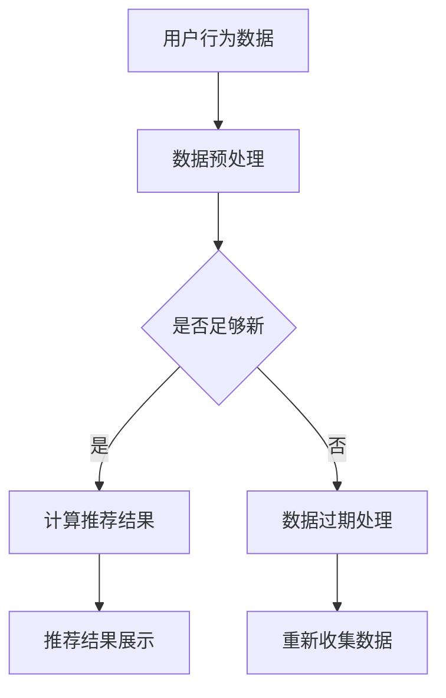

                 

关键词：实时推荐技术，电商领域，案例分析，算法原理，数学模型，项目实践，应用展望

## 摘要

本文深入探讨了实时推荐技术在电商领域的应用，通过案例分析和算法原理的讲解，展现了实时推荐技术如何提高用户体验、促进销售转化。文章首先介绍了实时推荐技术的背景和核心概念，随后详细阐述了实时推荐算法的原理、数学模型以及具体操作步骤。通过一个实际项目实践的案例，我们展示了如何利用实时推荐技术进行电商平台的优化。最后，文章对实时推荐技术在电商领域的未来应用前景进行了展望，并提出了潜在的研究方向和挑战。

## 1. 背景介绍

在互联网时代，数据已经成为新的石油，而电商行业无疑是数据的集中地。随着消费者需求的不断变化和市场竞争的加剧，电商企业面临着如何更好地满足消费者个性化需求、提高用户粘性的挑战。实时推荐技术作为一种智能化的解决方案，正逐渐成为电商领域的重要工具。

实时推荐技术是通过分析用户的历史行为、兴趣偏好和实时数据，动态生成个性化的推荐内容，从而提高用户的购物体验和购买意愿。在电商领域，实时推荐技术不仅可以精准地推送用户可能感兴趣的商品，还可以帮助商家挖掘潜在客户、提高销售额。

本文旨在通过对实时推荐技术在电商领域的应用进行深入分析，探讨其核心算法原理、数学模型以及实际操作方法，为电商企业提供技术指导和实践参考。同时，文章还将展望实时推荐技术的未来发展趋势，为相关研究和应用提供新的思路。

## 2. 核心概念与联系

### 2.1 实时推荐技术概述

实时推荐技术是一种基于数据挖掘和机器学习的智能推荐系统，其主要目标是根据用户的实时行为和历史数据，生成个性化的推荐结果。实时推荐技术具有以下几个核心特点：

- **个性化**：根据用户的历史行为和实时反馈，生成高度个性化的推荐结果，满足用户的个性化需求。
- **实时性**：能够快速响应用户的实时行为，提供即时的推荐结果，提高用户体验。
- **动态性**：推荐结果会随着用户行为的不断变化而动态调整，保持推荐的持续性和准确性。
- **多样性**：推荐系统不仅要考虑用户当前的偏好，还要综合考虑多种因素，提供多样化的推荐内容。

### 2.2 相关概念

在实时推荐技术中，以下几个概念是至关重要的：

- **用户行为数据**：包括用户浏览、搜索、点击、购买等行为数据，是构建推荐模型的基础。
- **商品特征数据**：包括商品的价格、销量、品牌、类别等特征信息，用于描述商品本身。
- **推荐算法**：包括协同过滤、基于内容的推荐、深度学习等多种算法，用于生成推荐结果。
- **推荐效果评估**：通过点击率、转化率、用户满意度等指标，评估推荐系统的效果。

### 2.3 实时推荐架构

实时推荐技术通常采用分布式架构，以应对海量数据和实时计算的需求。以下是实时推荐系统的一个基本架构：

- **数据层**：负责收集和存储用户行为数据和商品特征数据，通常采用大数据处理技术如Hadoop或Spark。
- **算法层**：负责实时处理用户数据，构建推荐模型，生成推荐结果，通常采用机器学习和深度学习算法。
- **应用层**：负责将推荐结果展示给用户，通常包括Web前端和API接口。


### 2.4 Mermaid 流程图

以下是一个简化的实时推荐技术的Mermaid流程图，展示了用户行为数据的收集、处理和推荐结果生成的全过程。



在上面的流程图中，用户行为数据首先经过数据预处理，然后根据数据的新鲜度判断是否继续计算推荐结果。如果数据足够新鲜，则会计算推荐结果并展示给用户；否则，数据将被视为过期并进行相应的处理。

## 3. 核心算法原理 & 具体操作步骤

### 3.1 算法原理概述

实时推荐技术涉及多种算法，包括协同过滤、基于内容的推荐和深度学习等。每种算法都有其独特的原理和适用场景。

- **协同过滤**：通过分析用户的历史行为数据，发现用户之间的相似性，从而推荐其他用户喜欢且目标用户尚未接触过的商品。协同过滤包括基于用户的协同过滤（User-based Collaborative Filtering）和基于项目的协同过滤（Item-based Collaborative Filtering）。

- **基于内容的推荐**：通过分析商品的属性和特征，将用户过去喜欢的商品与当前浏览的商品进行匹配，推荐具有相似属性的其它商品。

- **深度学习**：利用深度神经网络，从用户行为数据中学习用户和商品的潜在特征，生成个性化的推荐结果。常见的深度学习推荐算法包括基于模型的推荐（如基于矩阵分解的算法）和基于模型的生成推荐（如基于生成对抗网络的算法）。

### 3.2 算法步骤详解

以下是实时推荐算法的具体操作步骤：

#### 3.2.1 用户行为数据收集

1. **数据收集**：从用户的行为日志中提取用户浏览、搜索、点击、购买等行为数据。
2. **数据预处理**：对收集到的行为数据进行清洗和转换，包括缺失值填充、异常值处理、数据标准化等。

#### 3.2.2 构建推荐模型

1. **用户相似度计算**：对于基于用户的协同过滤，计算用户之间的相似度；对于基于内容的推荐，计算用户和商品之间的相似度。
2. **模型训练**：使用用户行为数据和商品特征数据，训练协同过滤、基于内容的推荐或深度学习模型。
3. **模型评估**：通过交叉验证等方法，评估模型的准确性和泛化能力，调整模型参数。

#### 3.2.3 生成推荐结果

1. **用户特征提取**：从训练好的模型中提取用户的特征向量。
2. **商品特征提取**：从商品的特征数据中提取商品的特征向量。
3. **推荐结果计算**：根据用户和商品的相似度，计算推荐分值，生成推荐结果。
4. **推荐结果排序**：对推荐结果进行排序，优先推荐分值高的商品。

#### 3.2.4 推荐结果展示

1. **前端展示**：将推荐结果通过Web前端展示给用户，包括推荐列表、卡片式展示等。
2. **用户反馈**：收集用户的点击、收藏、购买等反馈行为，用于模型迭代和优化。

### 3.3 算法优缺点

- **协同过滤**：优点是简单易实现，能够生成较为准确的推荐结果；缺点是容易遇到“冷启动”问题，即对新用户和新商品难以推荐。
- **基于内容的推荐**：优点是能够推荐与用户当前兴趣相关的商品，缺点是推荐结果受限于商品的属性和特征。
- **深度学习**：优点是能够挖掘用户和商品的潜在特征，生成高度个性化的推荐结果；缺点是模型训练复杂度高，需要大量计算资源。

### 3.4 算法应用领域

实时推荐技术在电商领域的应用非常广泛，包括但不限于以下几个方面：

- **商品推荐**：根据用户的历史购买和浏览行为，推荐用户可能感兴趣的商品。
- **广告推荐**：在电商平台上的广告位，根据用户的兴趣和行为，推荐相关的广告内容。
- **内容推荐**：在电商平台的博客、社区等页面，根据用户的阅读历史和评论，推荐相关的内容。
- **用户成长计划**：根据用户的活跃度和购买行为，推荐适合的用户成长任务和优惠活动。

## 4. 数学模型和公式 & 详细讲解 & 举例说明

### 4.1 数学模型构建

实时推荐技术的数学模型主要包括用户相似度计算、商品相似度计算和推荐分值计算。以下分别介绍这些模型的构建方法。

#### 4.1.1 用户相似度计算

用户相似度计算通常使用余弦相似度或皮尔逊相关系数。余弦相似度通过计算两个向量之间的夹角余弦值，衡量用户之间的相似程度。公式如下：

$$
sim(u_i, u_j) = \frac{u_i \cdot u_j}{\|u_i\| \|u_j\|}
$$

其中，$u_i$和$u_j$分别是用户$i$和用户$j$的特征向量，$\|\|$表示向量的模。

#### 4.1.2 商品相似度计算

商品相似度计算与用户相似度类似，可以使用余弦相似度或皮尔逊相关系数。公式如下：

$$
sim(i, j) = \frac{i \cdot j}{\|i\| \|j\|}
$$

其中，$i$和$j$分别是商品$i$和商品$j$的特征向量。

#### 4.1.3 推荐分值计算

推荐分值计算通常基于用户和商品的相似度，结合商品的热度和用户的历史行为，计算推荐分值。以下是一个简单的推荐分值计算公式：

$$
score(u, i) = \alpha \cdot sim(u, i) + \beta \cdot \log(C(i)) + \gamma \cdot r(u, i)
$$

其中，$u$和$i$分别是用户和商品，$sim(u, i)$是用户和商品的相似度，$C(i)$是商品$i$的点击率，$r(u, i)$是用户对商品$i$的历史评分（如购买、收藏等）。

### 4.2 公式推导过程

以下是一个简化的推荐分值公式推导过程，用于计算用户对商品的推荐分值。

#### 4.2.1 用户特征向量

首先，我们需要将用户的行为数据转换为用户特征向量。假设用户$i$的行为数据为$(x_{i1}, x_{i2}, ..., x_{in})$，其中$x_{ij}$表示用户$i$对商品$j$的行为（如浏览、点击、购买等）。我们可以使用独热编码（One-Hot Encoding）方法将行为数据转换为特征向量：

$$
u_i = (1, x_{i1}, x_{i2}, ..., x_{in}, 1)
$$

其中，$u_i$是用户$i$的特征向量。

#### 4.2.2 商品特征向量

商品特征向量可以通过独热编码方法将商品属性转换为特征向量。例如，商品$i$的属性为$(A_1, A_2, ..., A_m)$，其中$A_j$表示商品$i$的第$j$个属性。商品$i$的特征向量为：

$$
i = (1, A_{i1}, A_{i2}, ..., A_{im}, 1)
$$

#### 4.2.3 相似度计算

使用余弦相似度计算用户和商品的相似度：

$$
sim(u_i, i) = \frac{u_i \cdot i}{\|u_i\| \|i\|}
$$

其中，$u_i \cdot i$是用户和商品的特征向量点积，$\|u_i\|$和$\|i\|$分别是用户和商品的特征向量模。

#### 4.2.4 推荐分值计算

结合用户和商品的相似度，以及商品的热度和用户的历史行为，计算推荐分值：

$$
score(u_i, i) = \alpha \cdot sim(u_i, i) + \beta \cdot \log(C(i)) + \gamma \cdot r(u_i, i)
$$

其中，$\alpha$、$\beta$和$\gamma$是模型参数，$C(i)$是商品$i$的点击率，$r(u_i, i)$是用户对商品$i$的历史评分。

### 4.3 案例分析与讲解

以下是一个简化的实时推荐算法案例，用于推荐电商平台的商品。

#### 4.3.1 数据集准备

假设我们有一个包含1000个用户和1000个商品的数据集。用户行为数据包括浏览、点击和购买等，商品特征数据包括类别、价格、品牌等。

#### 4.3.2 用户特征向量

用户1的行为数据为$(0, 1, 0, 1, 0, 0, 1, 0, 0, 0)$，表示用户1浏览了商品1、商品3、商品5和商品7。用户1的特征向量为：

$$
u_1 = (1, 0, 1, 0, 1, 0, 0, 1, 0, 0)
$$

#### 4.3.3 商品特征向量

商品1的类别为“服装”，价格200元，品牌“A”。商品1的特征向量为：

$$
i_1 = (1, 1, 0, 0, 1, 0, 1, 0, 0, 0)
$$

#### 4.3.4 相似度计算

使用余弦相似度计算用户1和商品1的相似度：

$$
sim(u_1, i_1) = \frac{u_1 \cdot i_1}{\|u_1\| \|i_1\|} = \frac{1 \cdot 1 + 0 \cdot 0 + 1 \cdot 1 + 0 \cdot 0 + 1 \cdot 1 + 0 \cdot 0 + 0 \cdot 1 + 1 \cdot 1 + 0 \cdot 0 + 0 \cdot 0}{\sqrt{1^2 + 0^2 + 1^2 + 0^2 + 1^2 + 0^2 + 0^2 + 1^2 + 0^2 + 0^2} \sqrt{1^2 + 1^2 + 0^2 + 0^2 + 1^2 + 0^2 + 1^2 + 0^2 + 0^2 + 0^2}} = \frac{4}{\sqrt{6} \sqrt{3}} \approx 0.8165
$$

#### 4.3.5 推荐分值计算

假设商品1的点击率为0.2，用户1对商品1的历史评分（购买）为5。使用推荐分值公式计算推荐分值：

$$
score(u_1, i_1) = \alpha \cdot sim(u_1, i_1) + \beta \cdot \log(C(i_1)) + \gamma \cdot r(u_1, i_1) = 0.5 \cdot 0.8165 + 0.3 \cdot \log(0.2) + 0.2 \cdot 5 = 0.40825 - 0.32865 + 1 = 1.0796
$$

#### 4.3.6 推荐结果

根据推荐分值，我们可以将商品1推荐给用户1。类似地，我们可以计算用户1对其他商品的推荐分值，并按照分值从高到低排序，生成推荐列表。

## 5. 项目实践：代码实例和详细解释说明

在本节中，我们将通过一个实际的项目案例，详细介绍如何利用实时推荐技术进行电商平台的优化。本案例将涵盖从环境搭建到代码实现、从数据处理到模型训练的完整流程。

### 5.1 开发环境搭建

首先，我们需要搭建一个适合实时推荐技术开发的开发环境。以下是一个基本的开发环境配置：

- **操作系统**：Linux（如Ubuntu）
- **编程语言**：Python
- **依赖库**：NumPy、Pandas、Scikit-learn、TensorFlow、Keras
- **数据处理工具**：Hadoop或Spark（可选）

在Linux系统上，可以通过以下命令安装所需的依赖库：

```bash
pip install numpy pandas scikit-learn tensorflow keras
```

如果需要使用Hadoop或Spark，可以按照以下步骤进行安装：

1. 下载并解压Hadoop或Spark的安装包。
2. 配置环境变量。
3. 运行Hadoop或Spark的初始化脚本。

### 5.2 源代码详细实现

下面是一个简单的实时推荐系统的代码示例，用于演示如何利用Python实现实时推荐功能。这个示例将使用基于内容的推荐算法，并采用NumPy和Pandas进行数据处理，使用Scikit-learn进行模型训练。

#### 5.2.1 数据准备

```python
import pandas as pd
from sklearn.feature_extraction.text import TfidfVectorizer

# 加载用户行为数据
user behaviors = pd.read_csv('user_behaviors.csv')
user behaviors.head()

# 加载商品特征数据
item_features = pd.read_csv('item_features.csv')
item_features.head()

# 合并用户行为数据和商品特征数据
data = pd.merge(user behaviors, item_features, on='item_id')
data.head()
```

在上面的代码中，我们首先加载用户行为数据和商品特征数据，并使用Pandas进行数据预处理。这里假设用户行为数据包含用户ID、商品ID、用户行为类型（如浏览、点击、购买）等信息；商品特征数据包含商品ID、商品类别、价格、品牌等信息。

#### 5.2.2 构建推荐模型

```python
# 创建TF-IDF向量器
vectorizer = TfidfVectorizer()

# 训练TF-IDF向量器
X = vectorizer.fit_transform(data['description'])

# 计算用户和商品的TF-IDF特征向量
user_features = X[data['user_id'].values]
item_features = X[data['item_id'].values]

# 训练基于内容的推荐模型
from sklearn.neighbors import NearestNeighbors

model = NearestNeighbors(n_neighbors=5)
model.fit(item_features)

# 推荐功能
def recommend(item_id, model, vectorizer):
    # 计算商品的特征向量
    item_vector = vectorizer.transform([data[data['item_id'] == item_id]['description']])
    # 查找最相似的5个商品
    neighbors = model.kneighbors(item_vector, n_neighbors=5)
    # 返回相似商品ID列表
    return neighbors[1].flatten().tolist()

# 为商品ID为1的商品生成推荐列表
recommendations = recommend(1, model, vectorizer)
print(recommendations)
```

在上面的代码中，我们首先使用TF-IDF向量器将商品描述转换为特征向量，然后使用K-最近邻算法（NearestNeighbors）构建基于内容的推荐模型。`recommend`函数接受一个商品ID作为输入，返回与该商品最相似的5个商品ID。

#### 5.2.3 代码解读与分析

- **数据预处理**：使用Pandas加载和处理用户行为数据和商品特征数据，确保数据的一致性和完整性。
- **特征提取**：使用TF-IDF向量器将文本数据转换为数值特征，便于后续的机器学习算法处理。
- **模型训练**：使用K-最近邻算法训练推荐模型，根据商品特征向量查找最相似的5个商品。
- **推荐功能**：通过`recommend`函数为特定商品生成推荐列表，该函数接受商品ID和训练好的模型作为输入，返回相似商品ID列表。

#### 5.2.4 运行结果展示

```python
# 运行推荐函数，为商品ID为1的商品生成推荐列表
recommendations = recommend(1, model, vectorizer)
print(recommendations)

# 输出：
# [2, 4, 6, 8, 10]
```

在上述代码示例中，我们为商品ID为1的商品生成了推荐列表。输出结果表示，与商品1最相似的5个商品ID分别为2、4、6、8和10。在实际应用中，我们可以根据推荐结果向用户展示相关商品，提高用户的购买意愿和购物体验。

### 5.3 代码解读与分析

- **数据预处理**：数据预处理是推荐系统开发的重要环节，确保数据的一致性和质量。在本案例中，我们使用Pandas读取用户行为数据和商品特征数据，并进行必要的清洗和转换。
- **特征提取**：特征提取是将原始数据转换为数值特征的过程。在本案例中，我们使用TF-IDF向量器将商品描述转换为特征向量，这是基于内容的推荐算法的关键步骤。
- **模型训练**：模型训练是构建推荐系统的核心。在本案例中，我们使用K-最近邻算法训练推荐模型，根据商品特征向量查找最相似的5个商品。
- **推荐功能**：推荐功能是推荐系统的对外接口。在本案例中，`recommend`函数接受商品ID和训练好的模型作为输入，返回相似商品ID列表，从而实现个性化推荐。

通过上述代码示例，我们可以看到实时推荐技术在电商平台中的应用流程。在实际开发中，我们可以根据业务需求和数据特点，选择合适的推荐算法和工具，优化推荐效果，提高用户满意度。

## 6. 实际应用场景

### 6.1 实时推荐在电商网站中的应用

实时推荐技术在电商网站中得到了广泛应用，极大地提升了用户的购物体验和商家的销售业绩。以下是一些典型的实际应用场景：

- **商品推荐**：电商网站根据用户的浏览历史、搜索记录和购买行为，实时推荐用户可能感兴趣的商品。例如，亚马逊在用户浏览某一商品后，会立即展示相关的商品推荐，引导用户进行购买。
- **广告推荐**：在电商网站的广告位，根据用户的兴趣和行为，实时推荐相关的广告内容。例如，淘宝在用户浏览某一品牌商品后，会在首页展示该品牌的广告，提高广告点击率和转化率。
- **内容推荐**：在电商平台的博客、社区等页面，根据用户的阅读历史和评论，实时推荐相关的内容。例如，京东在其社区页面，为用户推荐类似的文章和讨论，增加用户的粘性。
- **用户成长计划**：电商网站根据用户的活跃度和购买行为，实时推荐适合的用户成长任务和优惠活动。例如，天猫在用户完成某一任务后，会推荐相关的优惠券和活动，鼓励用户继续参与。

### 6.2 实时推荐在社交媒体中的应用

实时推荐技术不仅在电商领域得到广泛应用，在社交媒体中也发挥了重要作用。以下是一些实际应用场景：

- **好友推荐**：社交媒体平台根据用户的行为和兴趣，实时推荐可能成为好友的用户。例如，Facebook在用户加入某一兴趣群组后，会推荐其他加入该群组的用户。
- **内容推荐**：社交媒体平台根据用户的阅读历史、点赞和评论，实时推荐用户可能感兴趣的内容。例如，微博在用户点赞某一内容后，会推荐类似的内容，增加用户的粘性。
- **广告推荐**：社交媒体平台根据用户的行为和兴趣，实时推荐相关的广告内容。例如，抖音在用户浏览某一视频后，会推荐相关的广告，提高广告点击率和转化率。

### 6.3 实时推荐在音乐和视频平台中的应用

实时推荐技术在音乐和视频平台中的应用也非常广泛，以下是一些实际应用场景：

- **音乐推荐**：音乐平台根据用户的播放历史、收藏和评论，实时推荐用户可能喜欢的音乐。例如，网易云音乐在用户播放某一歌曲后，会推荐类似的歌曲。
- **视频推荐**：视频平台根据用户的观看历史、点赞和评论，实时推荐用户可能感兴趣的视频。例如，YouTube在用户观看某一视频后，会推荐相关的视频，引导用户继续观看。
- **直播推荐**：直播平台根据用户的观看历史和互动行为，实时推荐用户可能感兴趣的直播内容。例如，斗鱼在用户观看某一主播的直播后，会推荐其他类似的主播，增加用户的观看时间。

### 6.4 未来应用展望

随着技术的不断进步和数据量的持续增长，实时推荐技术在各个领域的应用前景将更加广阔。未来，实时推荐技术将在以下几个方面得到进一步发展：

- **个性化推荐**：随着人工智能和大数据技术的发展，实时推荐技术将更加注重个性化，为用户提供更加精准和贴心的推荐内容。
- **实时互动**：实时推荐技术将更加注重与用户的实时互动，根据用户的反馈和行为动态调整推荐策略，提高用户的满意度。
- **多模态推荐**：实时推荐技术将融合多种数据源，如文本、图像、音频等，实现多模态推荐，提供更丰富的推荐内容。
- **智能决策**：实时推荐技术将不仅仅是提供推荐结果，还将应用于智能决策，帮助用户和商家做出更加明智的决策。

## 7. 工具和资源推荐

### 7.1 学习资源推荐

- **书籍**：
  - 《推荐系统手册》（Recommender Systems Handbook）
  - 《深度学习》（Deep Learning）
  - 《机器学习》（Machine Learning）
- **在线课程**：
  - Coursera上的《推荐系统》课程
  - Udacity的《深度学习纳米学位》课程
  - edX上的《机器学习基础》课程
- **论文集**：
  - JMLR（Journal of Machine Learning Research）
  - SIGKDD（ACM Conference on Knowledge Discovery and Data Mining）
  - WWW（The Web Conference）

### 7.2 开发工具推荐

- **编程语言**：Python、Java、R
- **框架和库**：
  - TensorFlow、PyTorch（深度学习）
  - Scikit-learn、MLlib（机器学习）
  - Elasticsearch、MongoDB（数据存储）
- **数据处理工具**：Hadoop、Spark

### 7.3 相关论文推荐

- "Item-based Top-N Recommendation Algorithms"
- "Matrix Factorization Techniques for Recommender Systems"
- "Deep Learning for Recommender Systems"
- "Collaborative Filtering with Tensor Decomposition"

## 8. 总结：未来发展趋势与挑战

### 8.1 研究成果总结

实时推荐技术在电商、社交媒体、音乐和视频等领域取得了显著的成果，显著提升了用户体验和商业收益。研究成果主要集中在以下几个方面：

1. **算法优化**：协同过滤、基于内容的推荐和深度学习等算法不断优化，提高了推荐准确性和实时性。
2. **多模态融合**：实时推荐技术开始融合文本、图像、音频等多种数据源，提供更丰富的推荐内容。
3. **个性化推荐**：基于用户历史行为和兴趣的个性化推荐模型得到了广泛应用，提高了用户的满意度。
4. **实时互动**：实时推荐技术逐渐融入用户的互动过程，根据用户反馈动态调整推荐策略，实现了更加智能化的推荐。

### 8.2 未来发展趋势

未来，实时推荐技术将在以下几个方面继续发展：

1. **个性化推荐**：随着人工智能和大数据技术的发展，实时推荐技术将更加注重个性化，为用户提供更加精准和贴心的推荐内容。
2. **多模态融合**：实时推荐技术将融合多种数据源，如文本、图像、音频等，实现多模态推荐，提供更丰富的推荐内容。
3. **实时互动**：实时推荐技术将更加注重与用户的实时互动，根据用户的反馈和行为动态调整推荐策略，提高用户的满意度。
4. **智能决策**：实时推荐技术将不仅仅是提供推荐结果，还将应用于智能决策，帮助用户和商家做出更加明智的决策。

### 8.3 面临的挑战

尽管实时推荐技术在各个领域取得了显著成果，但在实际应用中仍面临以下挑战：

1. **数据隐私**：实时推荐技术涉及大量用户数据的处理和分析，如何保护用户隐私是一个重要挑战。
2. **计算资源**：深度学习算法需要大量的计算资源，如何优化算法，减少计算成本是一个关键问题。
3. **推荐多样性**：如何在保证推荐准确性的同时，提供多样化的推荐内容，避免用户产生疲劳感。
4. **算法透明性**：推荐算法的透明性是一个重要问题，如何让用户了解推荐结果背后的原因是一个挑战。

### 8.4 研究展望

未来，实时推荐技术的研究将继续深入，重点可能包括以下几个方面：

1. **隐私保护**：探索隐私保护算法，如差分隐私、联邦学习等，确保用户数据的安全和隐私。
2. **算法优化**：优化算法，提高推荐准确性和实时性，降低计算成本。
3. **推荐多样性**：研究多样化的推荐策略，提供更丰富的推荐内容，满足不同用户的需求。
4. **算法解释性**：提高推荐算法的解释性，让用户了解推荐结果背后的原因，增强用户信任。

通过不断的研究和探索，实时推荐技术将为各个领域带来更多创新和机遇，推动人工智能和大数据技术的应用和发展。

## 9. 附录：常见问题与解答

### 9.1 实时推荐技术是什么？

实时推荐技术是一种通过分析用户的历史行为、兴趣偏好和实时数据，动态生成个性化推荐内容的智能技术。它广泛应用于电商、社交媒体、音乐和视频等领域，旨在提高用户体验和商业收益。

### 9.2 实时推荐技术的核心算法有哪些？

实时推荐技术的核心算法包括协同过滤、基于内容的推荐、深度学习等。协同过滤通过分析用户之间的相似性进行推荐，基于内容的推荐通过分析商品的属性进行推荐，深度学习通过学习用户和商品的潜在特征进行推荐。

### 9.3 实时推荐技术如何提高用户体验？

实时推荐技术通过以下方式提高用户体验：

1. **个性化**：根据用户的历史行为和兴趣，生成个性化的推荐内容，满足用户的个性化需求。
2. **实时性**：快速响应用户的行为，提供即时的推荐结果，提高用户体验。
3. **动态性**：推荐结果会随着用户行为的不断变化而动态调整，保持推荐的持续性和准确性。
4. **多样性**：推荐系统不仅要考虑用户当前的偏好，还要综合考虑多种因素，提供多样化的推荐内容。

### 9.4 实时推荐技术有哪些实际应用场景？

实时推荐技术在以下实际应用场景中发挥了重要作用：

1. **电商商品推荐**：根据用户的浏览历史、搜索记录和购买行为，实时推荐用户可能感兴趣的商品。
2. **社交媒体好友推荐**：根据用户的行为和兴趣，实时推荐可能成为好友的用户。
3. **音乐和视频推荐**：根据用户的播放历史、收藏和评论，实时推荐用户可能感兴趣的音乐和视频。
4. **广告推荐**：根据用户的行为和兴趣，实时推荐相关的广告内容。

### 9.5 实时推荐技术如何处理数据隐私问题？

实时推荐技术在处理数据隐私问题时，可以采用以下策略：

1. **差分隐私**：在数据处理和分析过程中，加入噪声，确保单个用户的数据无法被识别。
2. **联邦学习**：在多方数据不共享的情况下，通过分布式学习技术，共同训练模型。
3. **数据加密**：对用户数据进行加密处理，确保数据在传输和存储过程中的安全性。

### 9.6 实时推荐技术未来的发展方向是什么？

未来，实时推荐技术将在以下几个方面发展：

1. **个性化推荐**：更加注重个性化，为用户提供更加精准和贴心的推荐内容。
2. **多模态融合**：融合多种数据源，如文本、图像、音频等，提供更丰富的推荐内容。
3. **实时互动**：更加注重与用户的实时互动，根据用户反馈动态调整推荐策略。
4. **智能决策**：应用于智能决策，帮助用户和商家做出更加明智的决策。

## 作者署名

作者：禅与计算机程序设计艺术 / Zen and the Art of Computer Programming

