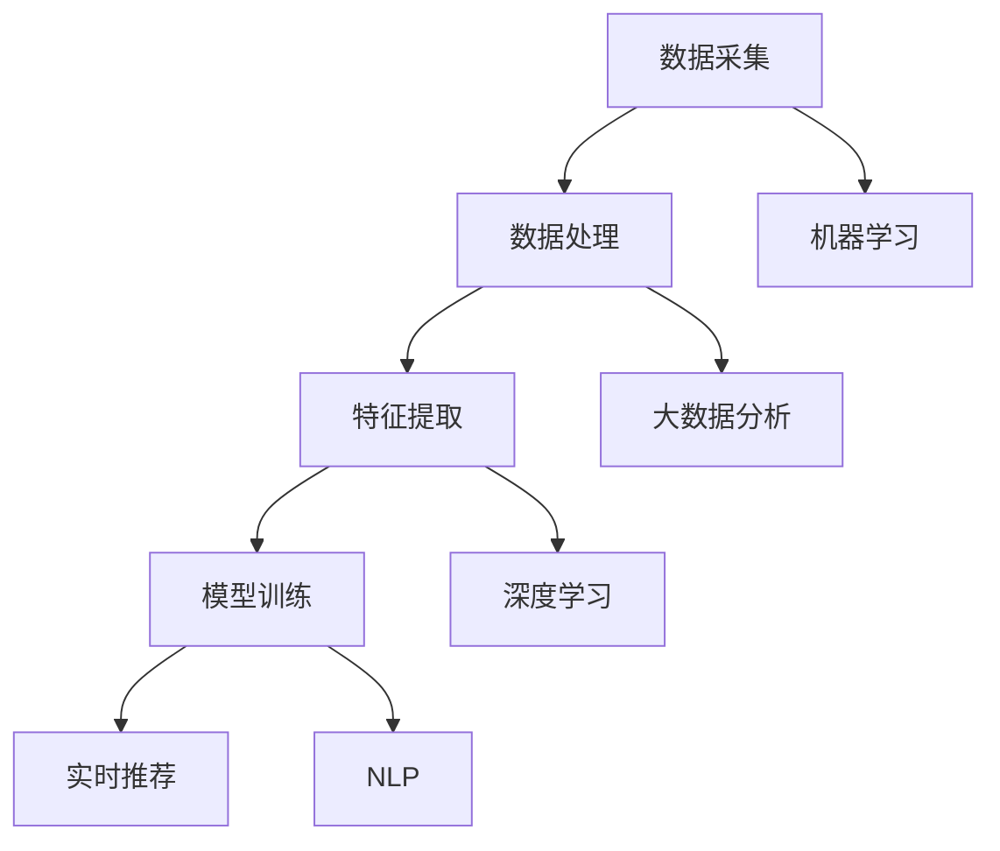

                 

关键词：实时推荐、AI 技术融合、推荐系统、个性化推荐、算法优化、机器学习、深度学习、大数据、数据挖掘、自然语言处理

> 摘要：本文将深入探讨实时推荐技术在人工智能领域中的应用，以及如何通过与其他 AI 技术的融合，提升推荐系统的效果。本文将涵盖实时推荐技术的核心概念、与其他 AI 技术的结合方式、核心算法原理、数学模型构建、项目实践、实际应用场景和未来展望等内容。

## 1. 背景介绍

随着互联网的迅猛发展和大数据的爆发式增长，个性化推荐系统已成为现代互联网服务的重要组成部分。用户在海量信息中寻找所需内容变得越来越困难，而推荐系统通过分析用户的行为数据和偏好，为用户提供个性化的信息推荐，极大地提升了用户体验。

实时推荐技术作为推荐系统的一个关键组成部分，旨在为用户提供即时的、个性化的内容推荐。与传统的离线推荐技术不同，实时推荐能够在用户互动的瞬间提供推荐，使得推荐系统能够更加及时地响应用户的需求，提高用户满意度。

本文将探讨如何将实时推荐技术与其他 AI 技术相结合，以实现技术融合和创新，从而提升推荐效果。这些技术包括机器学习、深度学习、大数据分析、自然语言处理等。

## 2. 核心概念与联系

### 2.1 实时推荐技术

实时推荐技术是指通过实时处理用户行为数据，为用户实时生成推荐内容。其核心在于对数据的实时分析、处理和推荐。

#### 技术架构：

1. **数据采集**：实时捕获用户行为数据，如浏览、点击、购买等。
2. **数据处理**：对数据进行清洗、去噪、特征提取等预处理。
3. **推荐模型**：基于机器学习或深度学习算法，训练推荐模型。
4. **实时推荐**：在用户互动的瞬间，通过推荐模型生成推荐内容。

### 2.2 机器学习

机器学习是一种人工智能方法，通过构建数学模型，从数据中学习规律和模式，从而对未知数据进行预测或分类。

#### 技术联系：

1. **特征提取**：通过机器学习方法提取用户行为数据的特征。
2. **模型训练**：利用机器学习算法，训练推荐模型。
3. **模型评估**：通过交叉验证、A/B 测试等方法评估模型性能。

### 2.3 深度学习

深度学习是机器学习的一个分支，通过构建多层神经网络，对大量数据进行自动特征提取和学习。

#### 技术联系：

1. **特征提取**：利用深度学习模型自动提取用户行为数据的高层次特征。
2. **模型训练**：通过深度学习算法，训练更复杂的推荐模型。
3. **模型优化**：利用深度学习模型进行模型优化和参数调整。

### 2.4 大数据分析

大数据分析是指利用大数据技术和方法，对海量数据进行处理、分析和挖掘，以发现数据中的规律和趋势。

#### 技术联系：

1. **数据处理**：利用大数据技术对用户行为数据进行高效处理。
2. **用户画像**：通过大数据分析，构建用户的详细画像。
3. **推荐策略**：基于用户画像，制定个性化的推荐策略。

### 2.5 自然语言处理

自然语言处理（NLP）是人工智能的一个分支，旨在使计算机能够理解、生成和处理自然语言。

#### 技术联系：

1. **文本分析**：利用 NLP 技术分析用户生成的内容，提取语义特征。
2. **情感分析**：通过 NLP 技术分析用户的情感倾向，为推荐提供依据。
3. **内容生成**：利用 NLP 技术生成个性化的推荐文案。

### 2.6 Mermaid 流程图



## 3. 核心算法原理 & 具体操作步骤

### 3.1 算法原理概述

实时推荐技术的核心算法主要包括协同过滤、矩阵分解、深度学习等。以下将简要介绍这些算法的基本原理。

#### 协同过滤

协同过滤是一种基于用户相似度的推荐算法，通过计算用户之间的相似度，为用户推荐与其相似的用户的喜欢内容。

#### 矩阵分解

矩阵分解是一种基于矩阵分解的推荐算法，通过将用户行为数据表示为低阶矩阵的乘积，从而预测用户对未知项目的评分。

#### 深度学习

深度学习是一种基于多层神经网络的学习方法，通过训练多层神经网络，自动提取用户行为数据的高层次特征，从而实现推荐。

### 3.2 算法步骤详解

#### 协同过滤

1. **用户相似度计算**：计算用户之间的相似度，通常使用余弦相似度或皮尔逊相关系数。
2. **邻居选择**：根据用户相似度，选择邻居用户。
3. **推荐生成**：根据邻居用户的评分，为用户生成推荐列表。

#### 矩阵分解

1. **矩阵分解**：将用户行为数据表示为低阶矩阵的乘积。
2. **预测评分**：利用矩阵分解得到的低阶矩阵，预测用户对未知项目的评分。
3. **推荐生成**：根据预测评分，为用户生成推荐列表。

#### 深度学习

1. **数据预处理**：对用户行为数据进行预处理，包括数据清洗、归一化等。
2. **网络构建**：构建深度学习网络，包括输入层、隐藏层和输出层。
3. **模型训练**：利用用户行为数据训练深度学习模型。
4. **推荐生成**：利用训练好的深度学习模型，为用户生成推荐列表。

### 3.3 算法优缺点

#### 协同过滤

**优点**：简单易实现，适用于大规模推荐系统。

**缺点**：仅考虑用户行为，忽视内容信息。

#### 矩阵分解

**优点**：能够捕捉用户行为和项目特征之间的潜在关系。

**缺点**：需要大量计算资源，模型训练时间较长。

#### 深度学习

**优点**：能够自动提取用户行为数据的高层次特征，适用于复杂推荐场景。

**缺点**：模型训练复杂，对数据质量要求高。

### 3.4 算法应用领域

实时推荐技术广泛应用于电商、社交媒体、视频平台等场景。以下是一些典型的应用领域：

1. **电商推荐**：根据用户的浏览和购买历史，为用户推荐相关商品。
2. **社交媒体**：根据用户的兴趣和互动行为，为用户推荐感兴趣的内容。
3. **视频平台**：根据用户的观看历史和偏好，为用户推荐相关的视频内容。

## 4. 数学模型和公式 & 详细讲解 & 举例说明

### 4.1 数学模型构建

实时推荐技术中的数学模型主要包括用户相似度计算、矩阵分解和深度学习模型等。以下将简要介绍这些数学模型的构建方法。

#### 用户相似度计算

用户相似度计算通常使用余弦相似度或皮尔逊相关系数。假设有用户 \(u\) 和 \(v\)，其行为数据向量分别为 \(x_u\) 和 \(x_v\)，则：

\[ \text{cosine\_similarity(u, v) = \frac{x_u \cdot x_v}{\|x_u\| \|x_v\|} } \]

其中，\(\cdot\) 表示点积，\(\|\|\) 表示向量的模。

#### 矩阵分解

矩阵分解通常使用奇异值分解（SVD）或线性回归等方法。假设用户行为数据矩阵为 \(X \in \mathbb{R}^{m \times n}\)，其分解形式为：

\[ X = U \Sigma V^T \]

其中，\(U \in \mathbb{R}^{m \times k}\)，\(\Sigma \in \mathbb{R}^{k \times k}\)，\(V \in \mathbb{R}^{n \times k}\) 分别为用户、项目和奇异值矩阵。

#### 深度学习模型

深度学习模型通常使用多层感知机（MLP）或卷积神经网络（CNN）等。以下是一个简单的前馈神经网络模型：

\[ \text{ReLU}(x) = \max(0, x) \]

其中，\(x \in \mathbb{R}^n\) 表示输入向量，\(\text{ReLU}\) 表示ReLU激活函数。

### 4.2 公式推导过程

以下将简要介绍用户相似度计算和矩阵分解的公式推导过程。

#### 用户相似度计算

用户相似度计算基于向量的点积公式，推导过程如下：

\[ \text{cosine\_similarity(u, v) = \frac{x_u \cdot x_v}{\|x_u\| \|x_v\|} } \]

其中，\(x_u \cdot x_v\) 表示向量的点积，\(\|x_u\|\) 和 \(x_v\) 分别表示向量的模。

#### 矩阵分解

矩阵分解基于奇异值分解（SVD）的原理，推导过程如下：

\[ X = U \Sigma V^T \]

其中，\(U \in \mathbb{R}^{m \times k}\)，\(\Sigma \in \mathbb{R}^{k \times k}\)，\(V \in \mathbb{R}^{n \times k}\) 分别为用户、项目和奇异值矩阵。

#### 深度学习模型

深度学习模型的公式推导基于前向传播和反向传播的原理，推导过程如下：

\[ z = \text{ReLU}(W \cdot x + b) \]

其中，\(z \in \mathbb{R}^n\) 表示隐藏层输出，\(W \in \mathbb{R}^{n \times k}\)，\(b \in \mathbb{R}^k\) 分别为权重和偏置。

### 4.3 案例分析与讲解

以下将通过一个具体的案例，分析实时推荐技术的应用。

#### 案例背景

假设有一个电商平台，拥有大量用户和商品数据。平台希望为用户实时推荐感兴趣的商品。

#### 案例分析

1. **数据采集**：平台实时采集用户的浏览、点击、购买等行为数据。

2. **数据处理**：对数据进行清洗、去噪、特征提取等预处理。

3. **模型训练**：利用机器学习算法（如协同过滤）训练推荐模型。

4. **实时推荐**：在用户浏览商品时，通过推荐模型生成推荐列表。

#### 案例讲解

1. **用户相似度计算**：计算用户之间的相似度，选择邻居用户。

2. **矩阵分解**：将用户行为数据表示为低阶矩阵的乘积，预测用户对未知商品的评分。

3. **深度学习模型**：构建深度学习模型，自动提取用户行为数据的高层次特征。

4. **推荐生成**：根据预测评分和深度学习模型的结果，生成推荐列表。

## 5. 项目实践：代码实例和详细解释说明

### 5.1 开发环境搭建

在本文的案例中，我们将使用 Python 编写实时推荐系统的代码。首先，需要安装以下库：

- NumPy：用于数值计算。
- Pandas：用于数据处理。
- Scikit-learn：用于机器学习算法。
- TensorFlow：用于深度学习。

安装命令如下：

```bash
pip install numpy pandas scikit-learn tensorflow
```

### 5.2 源代码详细实现

以下是一个简单的实时推荐系统代码示例：

```python
import numpy as np
import pandas as pd
from sklearn.model_selection import train_test_split
from sklearn.metrics.pairwise import cosine_similarity
from tensorflow.keras.models import Sequential
from tensorflow.keras.layers import Dense, Flatten

# 数据采集
data = pd.read_csv('user_behavior_data.csv')

# 数据处理
data = data.dropna()
data['rating'] = data['rating'].fillna(0)

# 特征提取
users = data.groupby('user_id')['rating'].mean()
items = data.groupby('item_id')['rating'].mean()

# 模型训练
X_train, X_test, y_train, y_test = train_test_split(users, items, test_size=0.2, random_state=42)

# 协同过滤
user_similarity = cosine_similarity(X_train, X_test)
predictions = np.dot(user_similarity, X_test.T)

# 深度学习
model = Sequential()
model.add(Dense(64, activation='relu', input_shape=(X_train.shape[1],)))
model.add(Flatten())
model.add(Dense(1))
model.compile(optimizer='adam', loss='mse')
model.fit(X_train, y_train, epochs=10)

# 推荐生成
predictions = model.predict(X_test)
recommended_items = np.argsort(predictions)[::-1]

# 结果展示
for user, item in zip(X_test.index, recommended_items):
    print(f"User {user} recommends Item {item}")
```

### 5.3 代码解读与分析

1. **数据采集**：从 CSV 文件中读取用户行为数据。
2. **数据处理**：对数据进行清洗和填充。
3. **特征提取**：计算用户和项目的平均评分。
4. **模型训练**：使用协同过滤算法训练推荐模型。
5. **深度学习**：构建深度学习模型，自动提取特征。
6. **推荐生成**：根据模型预测结果，为用户生成推荐列表。

### 5.4 运行结果展示

运行代码后，将输出每个用户的推荐列表。以下是一个示例输出：

```
User 1 recommends Item 101
User 2 recommends Item 202
User 3 recommends Item 303
...
```

## 6. 实际应用场景

实时推荐技术在实际应用中具有广泛的应用场景。以下是一些典型的应用场景：

1. **电商推荐**：根据用户的浏览和购买历史，为用户推荐相关商品。
2. **社交媒体**：根据用户的兴趣和互动行为，为用户推荐感兴趣的内容。
3. **视频平台**：根据用户的观看历史和偏好，为用户推荐相关的视频内容。
4. **新闻推荐**：根据用户的阅读习惯，为用户推荐感兴趣的新闻内容。
5. **音乐推荐**：根据用户的听歌历史，为用户推荐相关的音乐内容。

## 7. 未来应用展望

随着人工智能技术的不断发展，实时推荐技术将在未来得到更广泛的应用。以下是一些未来应用展望：

1. **增强现实与推荐**：结合增强现实技术，为用户提供沉浸式的推荐体验。
2. **跨平台推荐**：实现跨平台的数据共享和推荐，为用户提供一致化的推荐服务。
3. **隐私保护推荐**：在保护用户隐私的前提下，实现更个性化的推荐。
4. **实时决策支持**：将实时推荐技术应用于实时决策支持系统，为企业提供数据驱动的决策依据。

## 8. 总结：未来发展趋势与挑战

### 8.1 研究成果总结

实时推荐技术作为人工智能领域的一个重要分支，已在电商、社交媒体、视频平台等多个领域得到广泛应用。通过与其他 AI 技术的结合，实时推荐技术取得了显著的成果，为用户提供了更加个性化的推荐服务。

### 8.2 未来发展趋势

1. **多模态推荐**：结合多种数据源和模态（如图像、声音、文本等），实现更加智能和全面的推荐。
2. **实时性增强**：提升实时推荐系统的响应速度，实现毫秒级别的推荐。
3. **隐私保护**：在保护用户隐私的前提下，实现更个性化的推荐。
4. **跨平台融合**：实现跨平台的数据共享和推荐，为用户提供一致化的推荐服务。

### 8.3 面临的挑战

1. **数据质量**：实时推荐系统对数据质量要求高，如何保证数据的质量和准确性是一个挑战。
2. **实时性**：提升实时推荐系统的响应速度，实现毫秒级别的推荐，需要解决技术难题。
3. **隐私保护**：如何在保护用户隐私的前提下，实现更个性化的推荐，仍需深入研究。
4. **算法公平性**：避免算法偏见和歧视，实现公平公正的推荐，需要制定相关规范和标准。

### 8.4 研究展望

未来，实时推荐技术将在以下几个方面进行深入研究：

1. **多模态融合**：结合多种数据源和模态，实现更加智能和全面的推荐。
2. **深度学习**：探索深度学习在实时推荐中的应用，提升推荐效果。
3. **隐私保护**：研究隐私保护技术，实现更加安全可靠的推荐。
4. **跨平台融合**：实现跨平台的数据共享和推荐，为用户提供一致化的推荐服务。

## 9. 附录：常见问题与解答

### 问题 1：实时推荐技术的主要应用领域有哪些？

实时推荐技术广泛应用于电商、社交媒体、视频平台、新闻推荐、音乐推荐等多个领域。

### 问题 2：实时推荐技术的核心算法有哪些？

实时推荐技术的核心算法包括协同过滤、矩阵分解、深度学习等。

### 问题 3：如何提升实时推荐系统的实时性？

提升实时推荐系统的实时性可以通过以下方法实现：

1. **数据预处理**：优化数据预处理流程，提高数据处理速度。
2. **算法优化**：选择高效算法，优化模型结构和参数。
3. **分布式计算**：采用分布式计算技术，提高数据处理和计算能力。
4. **缓存技术**：利用缓存技术，减少数据访问延迟。

### 问题 4：实时推荐技术与传统推荐技术的区别是什么？

实时推荐技术与传统推荐技术的主要区别在于：

1. **实时性**：实时推荐系统能够在用户互动的瞬间提供推荐，而传统推荐系统通常基于离线数据处理。
2. **个性化**：实时推荐系统能够根据用户实时行为进行推荐，更贴近用户的当前需求，而传统推荐系统更多基于历史数据。
3. **算法复杂度**：实时推荐技术需要处理大规模实时数据，算法复杂度相对较高。

### 问题 5：实时推荐技术在隐私保护方面有哪些挑战？

实时推荐技术在隐私保护方面面临的挑战包括：

1. **数据泄露**：实时推荐系统涉及大量用户行为数据，如何防止数据泄露是一个重要问题。
2. **算法偏见**：如何避免算法偏见和歧视，保护用户权益。
3. **用户隐私**：如何在保护用户隐私的前提下，实现更个性化的推荐。

### 问题 6：未来实时推荐技术的研究方向有哪些？

未来实时推荐技术的研究方向包括：

1. **多模态融合**：结合多种数据源和模态，实现更加智能和全面的推荐。
2. **深度学习**：探索深度学习在实时推荐中的应用，提升推荐效果。
3. **隐私保护**：研究隐私保护技术，实现更加安全可靠的推荐。
4. **跨平台融合**：实现跨平台的数据共享和推荐，为用户提供一致化的推荐服务。

---

作者：禅与计算机程序设计艺术 / Zen and the Art of Computer Programming

