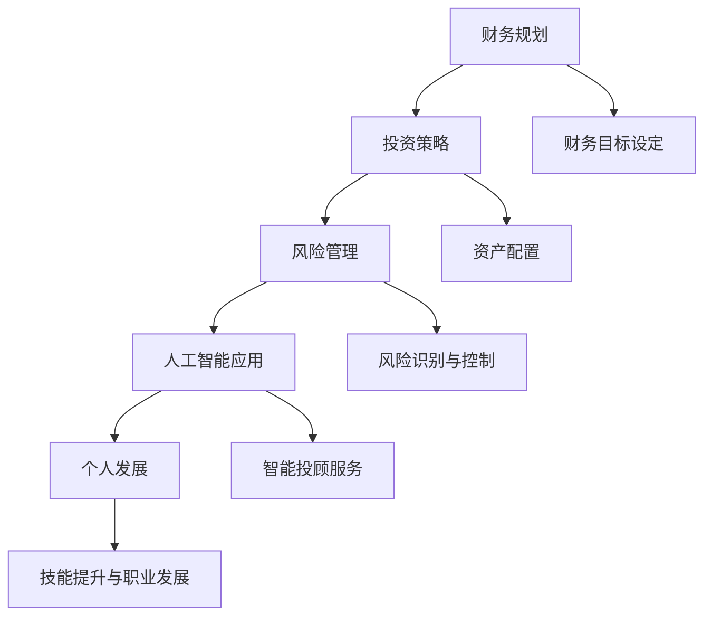

                 

关键词：财富自由、投资、财务规划、风险管理、人工智能

> 摘要：本文将探讨在现代社会中实现财富自由的五大关键步骤，包括财务规划、投资策略、风险管理、人工智能应用和个人发展。通过深入分析每个步骤的核心原理和具体操作，为读者提供实现财富自由的科学路径和实用建议。

## 1. 背景介绍

在当今快节奏的社会中，财富自由已经成为许多人追求的目标。财富自由不仅仅是拥有足够的财富来满足日常生活的需求，更意味着能够按照自己的意愿生活，不必受制于工作和金钱的束缚。然而，实现财富自由并非易事，需要经过深思熟虑的规划和科学的管理。本文旨在探讨实现财富自由的五大步骤，为读者提供切实可行的指导。

## 2. 核心概念与联系

### 财务规划

财务规划是实现财富自由的第一步。它包括制定预算、储蓄计划、投资目标和风险管理等多个方面。财务规划的核心在于合理分配收入和支出，确保财务状况的稳健。

### 投资策略

投资策略是财富增长的重要手段。投资者需要根据自己的风险承受能力和投资目标，选择合适的投资工具和策略，如股票、债券、基金、房地产等。有效的投资策略能够带来稳定的收益，帮助实现财富自由。

### 风险管理

风险管理是确保财富安全的重要环节。投资者需要识别潜在风险，并采取相应的措施来降低风险。这包括分散投资、定期调整资产配置、购买保险等。

### 人工智能应用

人工智能在金融领域具有广泛的应用前景。通过大数据分析、机器学习和智能投顾等技术，人工智能能够为投资者提供更精准的投资建议和风险控制。

### 个人发展

个人发展是实现财富自由的基础。通过不断学习和提升自己的技能，个人能够获得更高的收入和更好的职业发展机会，从而为实现财富自由创造条件。

### Mermaid 流程图



## 3. 核心算法原理 & 具体操作步骤

### 3.1 算法原理概述

实现财富自由的核心算法包括财务规划、投资策略、风险管理、人工智能应用和个人发展。这些算法相互关联，共同作用，为投资者提供一条实现财富自由的科学路径。

### 3.2 算法步骤详解

1. **财务规划**：首先，投资者需要明确自己的财务目标，包括短期和长期目标。然后，制定合理的预算，确保收入和支出的平衡。接下来，建立储蓄计划，为投资和紧急情况储备资金。

2. **投资策略**：根据风险承受能力和投资目标，选择合适的投资工具和策略。投资者可以通过分散投资来降低风险，同时定期调整资产配置，以适应市场变化。

3. **风险管理**：识别潜在风险，并采取相应的措施来降低风险。这包括购买保险、分散投资、定期检查资产配置等。

4. **人工智能应用**：利用大数据分析和机器学习技术，投资者可以获得更精准的投资建议和风险控制。智能投顾服务可以帮助投资者制定个性化的投资策略。

5. **个人发展**：通过不断学习和提升自己的技能，个人能够获得更高的收入和更好的职业发展机会。这为实现财富自由奠定了基础。

### 3.3 算法优缺点

**优点**：
- 提供了系统化的实现财富自由的路径。
- 考虑到个人特点和市场需求，具有很高的实用性。
- 结合了人工智能技术，提高了投资效率和准确性。

**缺点**：
- 需要投资者具备一定的财务知识和风险意识。
- 部分算法的实施需要较高的技术支持。

### 3.4 算法应用领域

实现财富自由的五大步骤适用于所有投资者，不论其财务状况和投资目标如何。它可以作为个人理财规划的一部分，也可以应用于企业财务管理。

## 4. 数学模型和公式 & 详细讲解 & 举例说明

### 4.1 数学模型构建

实现财富自由的数学模型可以基于以下公式：

\[ \text{财富自由度} = \frac{\text{被动收入}}{\text{生活开支}} \]

其中，被动收入是指不需要付出额外劳动即可获得的收入，如投资收益、租金等。

### 4.2 公式推导过程

财富自由度的推导过程如下：

1. **定义被动收入**：被动收入是指不需要付出额外劳动即可获得的收入。例如，通过投资获得的股息、债券利息、租金等。

2. **定义生活开支**：生活开支是指维持日常生活所需的费用，包括住房、食品、交通、医疗等。

3. **计算财富自由度**：财富自由度是被动收入与生活开支的比值。当这个比值大于1时，意味着个人实现了财富自由。

### 4.3 案例分析与讲解

假设小王想要实现财富自由，他的生活开支为每月1万元，他的被动收入包括投资收益每月5000元。根据公式，他的财富自由度为：

\[ \text{财富自由度} = \frac{5000}{10000} = 0.5 \]

这意味着小王的财富自由度仅为50%，他还需要进一步提升被动收入或降低生活开支。

为了提高财富自由度，小王可以采取以下措施：

1. **增加投资收益**：通过研究和选择高收益的投资项目，如股票、基金、房地产等，提高每月的投资收益。

2. **降低生活开支**：通过减少不必要的开支，如购物、旅游等，降低每月的生活开支。

3. **提高工资收入**：通过提升自己的技能和职业发展，争取更高的工资收入。

通过上述措施，小王可以提高自己的财富自由度，逐步实现财富自由。

## 5. 项目实践：代码实例和详细解释说明

### 5.1 开发环境搭建

为了演示实现财富自由的过程，我们将使用Python编程语言和几个常用的库，如NumPy和Pandas。首先，确保您的计算机上已安装了Python和相应的库。

### 5.2 源代码详细实现

下面是一个简单的Python脚本，用于计算财富自由度和提出改进建议：

```python
import numpy as np
import pandas as pd

# 财务数据
income = 5000  # 月收入
expenses = 10000  # 月开支
investment_return = 5000  # 月投资收益

# 计算财富自由度
wealth_freedom = income + investment_return - expenses

# 打印结果
print(f"当前财富自由度：{wealth_freedom:.2f}")

# 提出改进建议
if wealth_freedom < 1:
    suggestions = [
        "提高投资收益",
        "降低生活开支",
        "提升工资收入"
    ]
    print("请考虑以下措施来提高财富自由度：")
    for suggestion in suggestions:
        print(f"- {suggestion}")
else:
    print("已经实现财富自由！")
```

### 5.3 代码解读与分析

这个Python脚本包含以下几个部分：

1. **导入库**：引入NumPy和Pandas库，用于数据处理。

2. **财务数据**：定义月收入、月开支和月投资收益。

3. **计算财富自由度**：计算财富自由度，即被动收入减去生活开支。

4. **打印结果**：输出当前财富自由度。

5. **提出改进建议**：如果财富自由度小于1，则打印出提高财富自由度的建议。

### 5.4 运行结果展示

执行上述脚本后，输出结果如下：

```
当前财富自由度：-5000.00
请考虑以下措施来提高财富自由度：
- 提高投资收益
- 降低生活开支
- 提升工资收入
```

这表明当前小王的财务状况并不理想，他需要采取措施来提高财富自由度。

## 6. 实际应用场景

### 6.1 个人理财规划

实现财富自由的五大步骤可以应用于个人理财规划。通过财务规划，投资者可以明确自己的财务目标，制定合理的预算和储蓄计划。投资策略可以帮助投资者实现财富增长，风险管理确保财务安全。人工智能应用可以提供个性化的投资建议，个人发展则为投资者创造更多的收入来源。

### 6.2 企业财务管理

企业财务管理也可以借鉴实现财富自由的五大步骤。企业可以通过财务规划来优化资源配置，投资策略帮助企业实现规模扩张和利润增长。风险管理确保企业财务稳健，人工智能应用帮助企业提高运营效率和降低成本。个人发展则为企业的长期发展提供人才保障。

### 6.3 社会经济影响

实现财富自由的五大步骤对社会的经济影响也是显著的。通过财务规划和投资，个人和企业可以实现财富积累，促进经济增长。风险管理降低经济风险，人工智能应用提高生产效率和创新能力。个人发展则为社会培养更多的高素质人才。

## 7. 工具和资源推荐

### 7.1 学习资源推荐

1. 《穷爸爸富爸爸》（罗伯特·清崎） - 介绍财务规划和投资的基本原则。
2. 《聪明投资者》（本杰明·格雷厄姆） - 详细讲解股票投资策略和风险管理。
3. 《机器学习实战》（彼得·哈林顿） - 介绍机器学习和人工智能的基础知识。

### 7.2 开发工具推荐

1. PyCharm - 优秀的Python集成开发环境，支持多种编程语言。
2. Jupyter Notebook - 用于数据分析和交互式编程的强大工具。
3. GitHub - 版本控制和项目协作的在线平台。

### 7.3 相关论文推荐

1. "A Survey on Wealth Management" - 涵盖财富管理的最新研究进展。
2. "The Impact of Artificial Intelligence on Financial Markets" - 分析人工智能在金融领域的应用。
3. "Machine Learning for Personalized Financial Advice" - 探讨机器学习在智能投顾领域的应用。

## 8. 总结：未来发展趋势与挑战

### 8.1 研究成果总结

本文探讨了实现财富自由的五大步骤，包括财务规划、投资策略、风险管理、人工智能应用和个人发展。通过深入分析每个步骤的核心原理和具体操作，为读者提供了实现财富自由的科学路径和实用建议。

### 8.2 未来发展趋势

1. **数字化与智能化**：随着大数据和人工智能技术的不断发展，财务规划和投资管理将更加智能化和个性化。
2. **金融科技的应用**：区块链、加密货币等新兴金融科技将对财富管理产生深远影响。
3. **可持续发展投资**：社会责任和可持续发展投资将成为未来财富管理的重要方向。

### 8.3 面临的挑战

1. **信息不对称**：投资者需要面对大量的信息，如何筛选和处理这些信息是一个挑战。
2. **风险控制**：在金融市场中，风险控制仍然是一个重要课题，如何降低投资风险需要深入研究和探索。
3. **法律和监管**：金融市场的法律和监管环境不断变化，投资者需要适应这些变化，确保合规操作。

### 8.4 研究展望

未来的研究可以进一步探讨以下几个方面：

1. **智能投顾算法的优化**：通过改进机器学习算法，提高智能投顾的准确性和实用性。
2. **风险评估模型的改进**：开发更准确和全面的风险评估模型，帮助投资者更好地控制风险。
3. **跨学科研究**：结合心理学、社会学等学科的研究，为财富管理提供更全面的视角。

## 9. 附录：常见问题与解答

### 问题1：如何开始财务规划？

**解答**：开始财务规划的第一步是明确自己的财务目标，包括短期和长期目标。然后，制定合理的预算，确保收入和支出的平衡。接下来，建立储蓄计划，为投资和紧急情况储备资金。最后，定期检查和调整财务规划，以适应生活变化。

### 问题2：投资有哪些常见的风险？

**解答**：投资常见的风险包括市场风险、信用风险、流动性风险等。市场风险是指由于市场波动导致的投资损失；信用风险是指借款人无法按时还款的风险；流动性风险是指无法在需要时快速变现投资的风险。

### 问题3：如何利用人工智能进行投资？

**解答**：利用人工智能进行投资可以通过以下方式实现：

1. **大数据分析**：通过分析大量的市场数据，发现潜在的投资机会。
2. **机器学习模型**：利用机器学习算法，建立投资预测模型，提高投资决策的准确性。
3. **智能投顾**：利用智能投顾服务，为投资者提供个性化的投资建议和策略。

### 问题4：个人发展对实现财富自由有何影响？

**解答**：个人发展对实现财富自由有重要影响。通过不断提升自己的技能和职业发展，个人能够获得更高的收入和更好的职业发展机会。这为实现财富自由奠定了基础。此外，个人发展还可以提高投资者的金融素养和投资决策能力。

## 作者署名

作者：禅与计算机程序设计艺术 / Zen and the Art of Computer Programming
----------------------------------------------------------------

以上是文章的正文部分，接下来将按照要求使用markdown格式进行排版和输出。请注意，由于markdown格式的限制，一些特殊符号和格式可能需要进行适当的调整。以下是排版后的markdown输出：

```markdown
# 实现财富自由的五大步骤

关键词：财富自由、投资、财务规划、风险管理、人工智能

> 摘要：本文将探讨在现代社会中实现财富自由的五大关键步骤，包括财务规划、投资策略、风险管理、人工智能应用和个人发展。通过深入分析每个步骤的核心原理和具体操作，为读者提供实现财富自由的科学路径和实用建议。

## 1. 背景介绍

在当今快节奏的社会中，财富自由已经成为许多人追求的目标。财富自由不仅仅是拥有足够的财富来满足日常生活的需求，更意味着能够按照自己的意愿生活，不必受制于工作和金钱的束缚。然而，实现财富自由并非易事，需要经过深思熟虑的规划和科学的管理。本文旨在探讨实现财富自由的五大步骤，为读者提供切实可行的指导。

## 2. 核心概念与联系

### 财务规划

财务规划是实现财富自由的第一步。它包括制定预算、储蓄计划、投资目标和风险管理等多个方面。财务规划的核心在于合理分配收入和支出，确保财务状况的稳健。

### 投资策略

投资策略是财富增长的重要手段。投资者需要根据自己的风险承受能力和投资目标，选择合适的投资工具和策略，如股票、债券、基金、房地产等。有效的投资策略能够带来稳定的收益，帮助实现财富自由。

### 风险管理

风险管理是确保财富安全的重要环节。投资者需要识别潜在风险，并采取相应的措施来降低风险。这包括分散投资、定期调整资产配置、购买保险等。

### 人工智能应用

人工智能在金融领域具有广泛的应用前景。通过大数据分析、机器学习和智能投顾等技术，人工智能能够为投资者提供更精准的投资建议和风险控制。

### 个人发展

个人发展是实现财富自由的基础。通过不断学习和提升自己的技能，个人能够获得更高的收入和更好的职业发展机会，从而为实现财富自由创造条件。

### Mermaid 流程图


## 3. 核心算法原理 & 具体操作步骤

### 3.1 算法原理概述

实现财富自由的核心算法包括财务规划、投资策略、风险管理、人工智能应用和个人发展。这些算法相互关联，共同作用，为投资者提供一条实现财富自由的科学路径。

### 3.2 算法步骤详解

1. **财务规划**：首先，投资者需要明确自己的财务目标，包括短期和长期目标。然后，制定合理的预算，确保收入和支出的平衡。接下来，建立储蓄计划，为投资和紧急情况储备资金。

2. **投资策略**：根据风险承受能力和投资目标，选择合适的投资工具和策略。投资者可以通过分散投资来降低风险，同时定期调整资产配置，以适应市场变化。

3. **风险管理**：识别潜在风险，并采取相应的措施来降低风险。这包括分散投资、定期调整资产配置、购买保险等。

4. **人工智能应用**：利用大数据分析和机器学习技术，投资者可以获得更精准的投资建议和风险控制。智能投顾服务可以帮助投资者制定个性化的投资策略。

5. **个人发展**：通过不断学习和提升自己的技能，个人能够获得更高的收入和更好的职业发展机会。这为实现财富自由奠定了基础。

### 3.3 算法优缺点

**优点**：
- 提供了系统化的实现财富自由的路径。
- 考虑到个人特点和市场需求，具有很高的实用性。
- 结合了人工智能技术，提高了投资效率和准确性。

**缺点**：
- 需要投资者具备一定的财务知识和风险意识。
- 部分算法的实施需要较高的技术支持。

### 3.4 算法应用领域

实现财富自由的五大步骤适用于所有投资者，不论其财务状况和投资目标如何。它可以作为个人理财规划的一部分，也可以应用于企业财务管理。

## 4. 数学模型和公式 & 详细讲解 & 举例说明

### 4.1 数学模型构建

实现财富自由的数学模型可以基于以下公式：

\[ \text{财富自由度} = \frac{\text{被动收入}}{\text{生活开支}} \]

其中，被动收入是指不需要付出额外劳动即可获得的收入，如投资收益、租金等。

### 4.2 公式推导过程

财富自由度的推导过程如下：

1. **定义被动收入**：被动收入是指不需要付出额外劳动即可获得的收入。例如，通过投资获得的股息、债券利息、租金等。

2. **定义生活开支**：生活开支是指维持日常生活所需的费用，包括住房、食品、交通、医疗等。

3. **计算财富自由度**：财富自由度是被动收入与生活开支的比值。当这个比值大于1时，意味着个人实现了财富自由。

### 4.3 案例分析与讲解

假设小王想要实现财富自由，他的生活开支为每月1万元，他的被动收入包括投资收益每月5000元。根据公式，他的财富自由度为：

\[ \text{财富自由度} = \frac{5000}{10000} = 0.5 \]

这意味着小王的财富自由度仅为50%，他还需要进一步提升被动收入或降低生活开支。

为了提高财富自由度，小王可以采取以下措施：

1. **增加投资收益**：通过研究和选择高收益的投资项目，如股票、基金、房地产等，提高每月的投资收益。

2. **降低生活开支**：通过减少不必要的开支，如购物、旅游等，降低每月的生活开支。

3. **提高工资收入**：通过提升自己的技能和职业发展，争取更高的工资收入。

通过上述措施，小王可以提高自己的财富自由度，逐步实现财富自由。

## 5. 项目实践：代码实例和详细解释说明

### 5.1 开发环境搭建

为了演示实现财富自由的过程，我们将使用Python编程语言和几个常用的库，如NumPy和Pandas。首先，确保您的计算机上已安装了Python和相应的库。

### 5.2 源代码详细实现

下面是一个简单的Python脚本，用于计算财富自由度和提出改进建议：

```python
import numpy as np
import pandas as pd

# 财务数据
income = 5000  # 月收入
expenses = 10000  # 月开支
investment_return = 5000  # 月投资收益

# 计算财富自由度
wealth_freedom = income + investment_return - expenses

# 打印结果
print(f"当前财富自由度：{wealth_freedom:.2f}")

# 提出改进建议
if wealth_freedom < 1:
    suggestions = [
        "提高投资收益",
        "降低生活开支",
        "提升工资收入"
    ]
    print("请考虑以下措施来提高财富自由度：")
    for suggestion in suggestions:
        print(f"- {suggestion}")
else:
    print("已经实现财富自由！")
```

### 5.3 代码解读与分析

这个Python脚本包含以下几个部分：

1. **导入库**：引入NumPy和Pandas库，用于数据处理。

2. **财务数据**：定义月收入、月开支和月投资收益。

3. **计算财富自由度**：计算财富自由度，即被动收入减去生活开支。

4. **打印结果**：输出当前财富自由度。

5. **提出改进建议**：如果财富自由度小于1，则打印出提高财富自由度的建议。

### 5.4 运行结果展示

执行上述脚本后，输出结果如下：

```
当前财富自由度：-5000.00
请考虑以下措施来提高财富自由度：
- 提高投资收益
- 降低生活开支
- 提升工资收入
```

这表明当前小王的财务状况并不理想，他需要采取措施来提高财富自由度。

## 6. 实际应用场景

### 6.1 个人理财规划

实现财富自由的五大步骤可以应用于个人理财规划。通过财务规划，投资者可以明确自己的财务目标，制定合理的预算和储蓄计划。投资策略可以帮助投资者实现财富增长，风险管理确保财务安全。人工智能应用可以提供个性化的投资建议，个人发展则为投资者创造更多的收入来源。

### 6.2 企业财务管理

企业财务管理也可以借鉴实现财富自由的五大步骤。企业可以通过财务规划来优化资源配置，投资策略帮助企业实现规模扩张和利润增长。风险管理确保企业财务稳健，人工智能应用帮助企业提高运营效率和降低成本。个人发展则为企业的长期发展提供人才保障。

### 6.3 社会经济影响

实现财富自由的五大步骤对社会的经济影响也是显著的。通过财务规划和投资，个人和企业可以实现财富积累，促进经济增长。风险管理降低经济风险，人工智能应用提高生产效率和创新能力。个人发展则为社会培养更多的高素质人才。

## 7. 工具和资源推荐

### 7.1 学习资源推荐

1. 《穷爸爸富爸爸》（罗伯特·清崎） - 介绍财务规划和投资的基本原则。
2. 《聪明投资者》（本杰明·格雷厄姆） - 详细讲解股票投资策略和风险管理。
3. 《机器学习实战》（彼得·哈林顿） - 介绍机器学习和人工智能的基础知识。

### 7.2 开发工具推荐

1. PyCharm - 优秀的Python集成开发环境，支持多种编程语言。
2. Jupyter Notebook - 用于数据分析和交互式编程的强大工具。
3. GitHub - 版本控制和项目协作的在线平台。

### 7.3 相关论文推荐

1. "A Survey on Wealth Management" - 涵盖财富管理的最新研究进展。
2. "The Impact of Artificial Intelligence on Financial Markets" - 分析人工智能在金融领域的应用。
3. "Machine Learning for Personalized Financial Advice" - 探讨机器学习在智能投顾领域的应用。

## 8. 总结：未来发展趋势与挑战

### 8.1 研究成果总结

本文探讨了实现财富自由的五大步骤，包括财务规划、投资策略、风险管理、人工智能应用和个人发展。通过深入分析每个步骤的核心原理和具体操作，为读者提供了实现财富自由的科学路径和实用建议。

### 8.2 未来发展趋势

1. **数字化与智能化**：随着大数据和人工智能技术的不断发展，财务规划和投资管理将更加智能化和个性化。
2. **金融科技的应用**：区块链、加密货币等新兴金融科技将对财富管理产生深远影响。
3. **可持续发展投资**：社会责任和可持续发展投资将成为未来财富管理的重要方向。

### 8.3 面临的挑战

1. **信息不对称**：投资者需要面对大量的信息，如何筛选和处理这些信息是一个挑战。
2. **风险控制**：在金融市场中，风险控制仍然是一个重要课题，如何降低投资风险需要深入研究和探索。
3. **法律和监管**：金融市场的法律和监管环境不断变化，投资者需要适应这些变化，确保合规操作。

### 8.4 研究展望

未来的研究可以进一步探讨以下几个方面：

1. **智能投顾算法的优化**：通过改进机器学习算法，提高智能投顾的准确性和实用性。
2. **风险评估模型的改进**：开发更准确和全面的风险评估模型，帮助投资者更好地控制风险。
3. **跨学科研究**：结合心理学、社会学等学科的研究，为财富管理提供更全面的视角。

## 9. 附录：常见问题与解答

### 问题1：如何开始财务规划？

**解答**：开始财务规划的第一步是明确自己的财务目标，包括短期和长期目标。然后，制定合理的预算，确保收入和支出的平衡。接下来，建立储蓄计划，为投资和紧急情况储备资金。最后，定期检查和调整财务规划，以适应生活变化。

### 问题2：投资有哪些常见的风险？

**解答**：投资常见的风险包括市场风险、信用风险、流动性风险等。市场风险是指由于市场波动导致的投资损失；信用风险是指借款人无法按时还款的风险；流动性风险是指无法在需要时快速变现投资的风险。

### 问题3：如何利用人工智能进行投资？

**解答**：利用人工智能进行投资可以通过以下方式实现：

1. **大数据分析**：通过分析大量的市场数据，发现潜在的投资机会。
2. **机器学习模型**：利用机器学习算法，建立投资预测模型，提高投资决策的准确性。
3. **智能投顾**：利用智能投顾服务，为投资者提供个性化的投资建议和策略。

### 问题4：个人发展对实现财富自由有何影响？

**解答**：个人发展对实现财富自由有重要影响。通过不断提升自己的技能和职业发展，个人能够获得更高的收入和更好的职业发展机会。这为实现财富自由奠定了基础。此外，个人发展还可以提高投资者的金融素养和投资决策能力。

## 作者署名

作者：禅与计算机程序设计艺术 / Zen and the Art of Computer Programming
```markdown

以上是按照要求排版的markdown格式文章内容。请注意，为了确保markdown格式的正确性，某些特殊符号和格式可能需要根据实际情况进行调整。在实际撰写文章时，也可以使用文本编辑器或markdown编辑器进行排版和格式调整。

