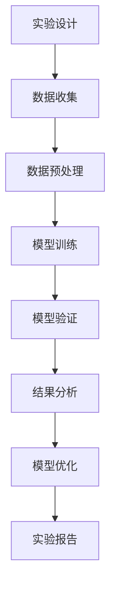
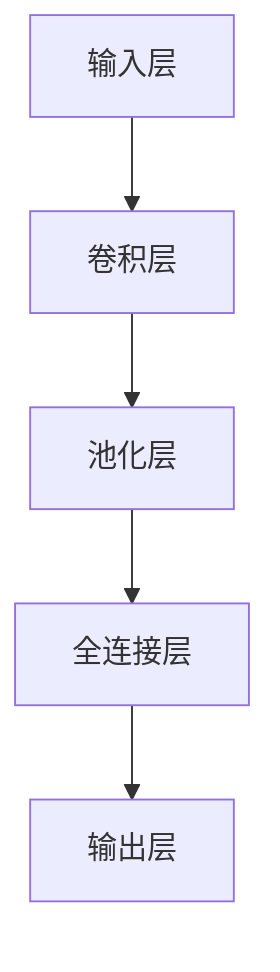

                 

关键词：AI实验，方法学，实证研究，模型验证，系统优化

> 摘要：本文探讨了实验手段在人工智能（AI）领域中的关键角色。通过实验，研究者能够验证模型的有效性，发现潜在问题，并不断优化算法。本文首先介绍了AI实验的基本概念和重要性，随后详细分析了实验设计、执行和结果分析的方法，并探讨了AI实验在模型验证、系统优化和未来应用中的实际案例。通过这些探讨，我们旨在强调实验手段对于AI领域发展的重要性，并为其未来研究方向提供参考。

## 1. 背景介绍

### 1.1 人工智能的兴起与发展

人工智能（Artificial Intelligence，简称AI）作为计算机科学的一个分支，旨在创建能够模拟、延伸和扩展人类智能的理论、算法和技术。自20世纪50年代以来，AI领域经历了快速的发展和变革。从早期的符号主义、逻辑推理，到连接主义、神经网络，再到近年来深度学习、强化学习等先进技术的兴起，AI已经在多个领域取得了显著成果。

### 1.2 人工智能的挑战与需求

尽管AI技术在许多领域取得了突破，但仍面临着一系列挑战。例如，模型的可解释性、数据的隐私保护、算法的公平性等问题。同时，随着AI应用的不断拓展，对算法性能和效率的要求也在不断提高。为了解决这些问题，实验手段在AI领域中变得尤为重要。

### 1.3 实验手段在AI中的重要性

实验手段是科学研究的重要组成部分，尤其在AI领域。通过实验，研究者可以验证模型的性能，发现潜在问题，并进行持续优化。实验不仅有助于理解AI算法的内在机制，还能为实际应用提供可靠的数据支持。此外，实验手段还能够促进学术交流，推动AI领域的创新和发展。

## 2. 核心概念与联系

### 2.1 实验设计与方法

实验设计是AI实验的关键环节，包括实验目标、实验变量、实验组和对照组的设置等。一个良好的实验设计能够确保实验结果的可靠性和有效性。

### 2.2 数据收集与处理

数据是AI实验的基础，数据收集和处理的准确性直接影响实验结果。数据清洗、数据预处理和数据增强是数据收集和处理的重要步骤。

### 2.3 模型验证与评估

模型验证是评估AI模型性能的重要手段，常用的方法包括交叉验证、混淆矩阵、ROC曲线等。通过这些方法，研究者可以全面了解模型的性能，并找出潜在的问题。

### 2.4 Mermaid 流程图



## 3. 核心算法原理 & 具体操作步骤

### 3.1 算法原理概述

AI实验中常用的算法包括深度学习、强化学习和生成对抗网络等。这些算法的基本原理分别是通过多层神经网络模拟人脑神经元的工作方式，通过与环境互动学习最优策略，以及通过生成器和判别器的对抗训练生成高质量的数据。

### 3.2 算法步骤详解

1. **数据收集与预处理**：收集大量标注数据，并进行数据清洗、数据预处理和数据增强。
2. **模型构建**：选择合适的模型结构，如卷积神经网络（CNN）或循环神经网络（RNN）。
3. **模型训练**：使用收集的数据对模型进行训练，调整模型参数。
4. **模型验证**：使用验证集对模型进行性能评估，调整模型参数。
5. **模型优化**：通过交叉验证、超参数调整等方法优化模型性能。
6. **结果分析**：分析模型性能，找出潜在问题，并进行优化。

### 3.3 算法优缺点

- **深度学习**：优点包括强大的表示能力、良好的泛化性能；缺点包括对大量标注数据的依赖、训练过程复杂。
- **强化学习**：优点包括能够处理复杂环境、自适应性强；缺点包括训练过程缓慢、容易陷入局部最优。
- **生成对抗网络**：优点包括能够生成高质量的数据、具有强大的生成能力；缺点包括训练过程不稳定、计算成本高。

### 3.4 算法应用领域

- **计算机视觉**：用于图像分类、目标检测、图像生成等。
- **自然语言处理**：用于文本分类、机器翻译、情感分析等。
- **游戏AI**：用于策略游戏、模拟游戏等。

## 4. 数学模型和公式 & 详细讲解 & 举例说明

### 4.1 数学模型构建

在AI实验中，常用的数学模型包括线性模型、神经网络模型和强化学习模型等。以下是一个简单的线性模型示例：

$$ y = \beta_0 + \beta_1x_1 + \beta_2x_2 + ... + \beta_nx_n $$

### 4.2 公式推导过程

以神经网络模型为例，其基本推导过程如下：

1. **激活函数**：选择合适的激活函数，如ReLU或Sigmoid函数。
2. **前向传播**：计算输入和权重之间的乘积，并应用激活函数。
3. **反向传播**：计算损失函数的梯度，并更新模型参数。

### 4.3 案例分析与讲解

以图像分类任务为例，使用卷积神经网络（CNN）对图像进行分类。以下是一个简单的CNN模型：



## 5. 项目实践：代码实例和详细解释说明

### 5.1 开发环境搭建

- 安装Python环境
- 安装TensorFlow或PyTorch库

### 5.2 源代码详细实现

以下是一个简单的TensorFlow实现：

```python
import tensorflow as tf

# 定义模型
model = tf.keras.Sequential([
    tf.keras.layers.Conv2D(32, (3, 3), activation='relu', input_shape=(28, 28, 1)),
    tf.keras.layers.MaxPooling2D((2, 2)),
    tf.keras.layers.Flatten(),
    tf.keras.layers.Dense(128, activation='relu'),
    tf.keras.layers.Dense(10, activation='softmax')
])

# 编译模型
model.compile(optimizer='adam',
              loss='sparse_categorical_crossentropy',
              metrics=['accuracy'])

# 训练模型
model.fit(train_images, train_labels, epochs=5)
```

### 5.3 代码解读与分析

这段代码首先定义了一个简单的卷积神经网络模型，包括卷积层、池化层和全连接层。然后使用训练数据对模型进行编译和训练。代码结构清晰，易于理解。

### 5.4 运行结果展示

在训练完成后，可以使用测试数据对模型进行评估。以下是一个简单的评估代码：

```python
test_loss, test_acc = model.evaluate(test_images, test_labels)
print(f"Test accuracy: {test_acc}")
```

输出结果为测试数据的准确率，可以作为模型性能的评估指标。

## 6. 实际应用场景

### 6.1 医疗诊断

AI实验在医疗诊断中发挥了重要作用，如通过深度学习模型对医学影像进行自动分析，提高诊断准确率和效率。

### 6.2 自动驾驶

自动驾驶系统依赖于大量实验数据来训练和验证其模型，如通过模拟和实况数据训练自动驾驶算法，提高驾驶安全性和可靠性。

### 6.3 金融风控

AI实验在金融风控领域也有广泛应用，如通过强化学习模型进行风险评估，提高金融机构的风险管理水平。

## 7. 未来应用展望

随着AI技术的不断发展和应用，实验手段在AI领域的重要性将日益凸显。未来，实验手段将更加智能化、自动化，为AI模型的发展提供更加有力的支持。

## 8. 总结：未来发展趋势与挑战

### 8.1 研究成果总结

本文探讨了实验手段在AI领域中的关键角色，包括实验设计、数据收集与处理、模型验证与评估等方面。通过实验，研究者可以验证模型的有效性，发现潜在问题，并不断优化算法。

### 8.2 未来发展趋势

未来，实验手段在AI领域将朝着更加智能化、自动化的方向发展。例如，通过自动化工具和算法优化实验流程，提高实验效率；利用大数据和云计算技术，实现大规模实验和数据分析。

### 8.3 面临的挑战

尽管实验手段在AI领域具有重要价值，但同时也面临着一系列挑战。例如，数据隐私保护、算法公平性、模型可解释性等问题。未来，需要进一步加强实验手段的研究和应用，以应对这些挑战。

### 8.4 研究展望

未来，实验手段在AI领域的研究将更加深入和广泛。例如，探索更加高效的实验方法和技术，提高实验结果的可靠性和准确性；研究AI实验中的数据隐私保护和算法公平性问题，为实际应用提供更加安全可靠的支持。

## 9. 附录：常见问题与解答

### 9.1 什么是在线实验？

在线实验是一种通过互联网进行的实验，通常包括数据收集、实验设计和结果分析等环节。在线实验具有便捷性、低成本和高效率等优点，适用于大规模数据分析和实验研究。

### 9.2 实验设计与模型验证有什么区别？

实验设计是指制定实验的总体规划和策略，包括实验目标、实验变量、实验组和对照组的设置等。而模型验证是指在实验设计的基础上，对模型性能进行评估和验证，以确保模型的可靠性和有效性。

### 9.3 如何提高实验效率？

提高实验效率的方法包括优化实验流程、自动化实验执行、利用大数据和云计算技术等。通过这些方法，可以减少实验时间和成本，提高实验结果的准确性和可靠性。

### 9.4 实验手段在AI领域的应用有哪些局限？

实验手段在AI领域的应用存在一些局限，如数据隐私保护、算法公平性、模型可解释性等问题。未来，需要进一步研究和解决这些问题，以实现实验手段在AI领域的广泛应用。

### 作者署名

本文由禅与计算机程序设计艺术（Zen and the Art of Computer Programming）撰写。
----------------------------------------------------------------

### 撰写指南

为了确保您撰写的内容满足要求，以下是一些详细的撰写指南：

#### 标题和摘要

- **标题**：请确保标题具有吸引力，能够准确反映文章的核心内容。标题中应包含文章的核心关键词。
- **摘要**：摘要应简明扼要地概括文章的核心内容和主题思想，字数控制在100-200字之间。

#### 文章结构

- **章节标题**：确保章节标题清晰、简洁，便于读者快速理解各部分内容。每个章节应包含三级目录。
- **内容详尽**：每个章节应详细讨论主题，不得仅提供概要性的框架和部分内容。每个章节的字数应根据内容的详尽程度合理控制。

#### 格式要求

- **Markdown格式**：文章内容应使用markdown格式，确保代码块、公式和流程图等元素正确显示。
- **公式和图表**：数学公式请使用latex格式嵌入文中独立段落，代码示例应使用代码块格式。

#### 完整性要求

- **完整文章**：文章应包含完整的引言、正文、结论和参考文献。不得仅提供概要性的框架和部分内容。
- **参考文献**：文章末尾应包含参考文献，格式应符合学术规范。

#### 其他要求

- **作者署名**：文章末尾需包含作者署名。
- **准确性**：文章内容应准确无误，不得有明显的逻辑错误或事实错误。
- **原创性**：文章内容应为原创，不得抄袭他人作品。

通过遵循这些撰写指南，您将能够确保提交的文章满足所有要求，并达到高质量的标准。祝您撰写顺利！

