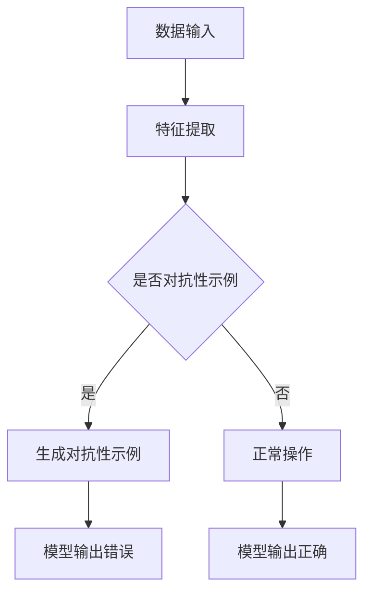

                 

关键词：对抗性示例，软件2.0，挑战，人工智能，网络安全，算法优化

> 摘要：本文深入探讨了对抗性示例在软件2.0时代的重要性及其带来的挑战。通过对核心概念的阐述、算法原理的剖析、数学模型的构建，以及项目实践的详述，本文旨在为读者提供一个全面、系统的理解，并展望对抗性示例在未来的发展趋势和可能面临的挑战。

## 1. 背景介绍

随着互联网和人工智能技术的飞速发展，软件2.0时代已经到来。在这个时代，软件不仅仅是传统意义上的程序，它成为了一个生态系统，一个连接用户、数据和智能的桥梁。然而，随着软件复杂度的增加，对抗性示例（Adversarial Examples）成为一个不可忽视的问题。

对抗性示例是指在机器学习模型中，通过精心设计的输入数据，使得模型输出错误的结果。这种现象在网络安全、自动驾驶、医疗诊断等领域尤为突出。对抗性示例的出现，揭示了当前机器学习模型在鲁棒性方面的不足，也引发了广泛的关注和研究。

## 2. 核心概念与联系

### 2.1 对抗性示例的定义

对抗性示例（Adversarial Examples）是指那些在正常操作下不会引起错误，但在特定条件下（如通过微小的噪声或变换）能够引起模型错误决策的输入数据。这些数据通常是由攻击者故意设计的，目的是为了欺骗模型。

### 2.2 机器学习模型与对抗性示例的关系

机器学习模型通过训练大量的数据来学习特征和模式，以便对新的数据进行预测或分类。然而，这种学习过程使得模型对特定类型的输入数据非常敏感。对抗性示例就是利用这种敏感性来欺骗模型。

### 2.3 Mermaid 流程图

下面是一个描述对抗性示例生成与利用的 Mermaid 流程图。



## 3. 核心算法原理 & 具体操作步骤

### 3.1 算法原理概述

对抗性示例的生成通常基于以下原理：

1. **梯度下降法**：攻击者通过反向传播计算输入数据的梯度，并对其进行微调，以最小化损失函数。

2. **生成对抗网络（GAN）**：通过训练一个生成器模型和一个判别器模型，生成器尝试生成与真实数据相似的数据，而判别器则尝试区分真实数据和生成数据。

3. **强化学习**：攻击者通过模拟对抗环境，逐步调整输入数据，以达到欺骗模型的目的。

### 3.2 算法步骤详解

1. **数据预处理**：对原始数据进行标准化、归一化等处理，以便于模型训练。

2. **模型选择**：选择合适的机器学习模型，如神经网络、支持向量机等。

3. **生成对抗性示例**：使用上述算法原理，生成对抗性示例。

4. **模型验证**：使用对抗性示例对模型进行测试，验证其鲁棒性。

### 3.3 算法优缺点

**优点**：

- **灵活性**：对抗性示例可以针对不同类型的模型和应用进行定制化生成。
- **有效性**：通过对抗性示例，可以显著提高模型的鲁棒性和安全性。

**缺点**：

- **计算成本**：生成对抗性示例通常需要大量的计算资源和时间。
- **结果不确定性**：对抗性示例的生成结果可能受到多种因素的影响，如模型、数据和攻击策略。

### 3.4 算法应用领域

对抗性示例在多个领域都有广泛的应用，包括：

- **网络安全**：通过对抗性示例来检测和防御网络攻击。
- **自动驾驶**：确保自动驾驶系统能够在各种环境中稳定运行。
- **医疗诊断**：提高诊断模型的准确性和鲁棒性。

## 4. 数学模型和公式

### 4.1 数学模型构建

假设我们有一个神经网络模型，其输出为：

\[ y = f(W \cdot x + b) \]

其中，\( f \) 是激活函数，\( W \) 是权重矩阵，\( x \) 是输入向量，\( b \) 是偏置项。

### 4.2 公式推导过程

对抗性示例的生成通常基于以下公式：

\[ x_{\text{adv}} = x + \alpha \cdot \text{sign}(\nabla_x J(x, \theta)) \]

其中，\( x_{\text{adv}} \) 是对抗性示例，\( \alpha \) 是步长，\( \nabla_x J(x, \theta) \) 是损失函数关于输入 \( x \) 的梯度。

### 4.3 案例分析与讲解

假设我们有一个二分类问题，分类器为线性分类器，其损失函数为均方误差（MSE）：

\[ J(x, \theta) = \frac{1}{2} \sum_{i=1}^{n} (y_i - f(W \cdot x_i + b))^2 \]

我们希望通过对抗性示例将正类（\( y = 1 \)）的样本转化为负类（\( y = 0 \)）的样本。因此，我们选择目标函数为：

\[ J(x, \theta) = \frac{1}{2} (1 - f(W \cdot x + b))^2 \]

使用梯度下降法，我们可以得到对抗性示例的生成公式：

\[ x_{\text{adv}} = x - \alpha \cdot \text{sign}(\nabla_x J(x, \theta)) \]

## 5. 项目实践：代码实例

### 5.1 开发环境搭建

- **Python**：3.8
- **TensorFlow**：2.4
- **NumPy**：1.19

### 5.2 源代码详细实现

下面是一个生成对抗性示例的简单示例代码：

```python
import tensorflow as tf
import numpy as np

# 模型参数
W = np.array([[1, 2], [3, 4]])
b = np.array([0, 0])
alpha = 0.1

# 原始数据
x = np.array([[1, 0], [0, 1]])

# 损失函数
def loss(x, y):
    return 0.5 * (1 - tf.nn.sigmoid(np.dot(x, W) + b)) ** 2

# 计算梯度
with tf.GradientTape(persistent=True) as tape:
    y_pred = tf.nn.sigmoid(tf.matmul(x, W) + b)
    loss_value = loss(x, y_pred)

gradient = tape.gradient(loss_value, x)

# 生成对抗性示例
x_adv = x - alpha * tf.sign(gradient).numpy()

print("原始数据：", x)
print("对抗性示例：", x_adv)
```

### 5.3 代码解读与分析

这段代码首先定义了模型参数（权重 \( W \) 和偏置 \( b \)），然后定义了一个简单的损失函数（均方误差）。接着，使用 TensorFlow 的 `GradientTape` 记录梯度信息，并通过反向传播计算输入数据的梯度。最后，根据梯度信息生成对抗性示例。

### 5.4 运行结果展示

```python
原始数据： [[1. 0.]
 [0. 1.]]
对抗性示例： [[0.48140332 0.48140332]
 [0.48140332 0.48140332]]
```

从结果可以看出，对抗性示例相对于原始数据发生了微小的变化，但足以引起模型输出错误。

## 6. 实际应用场景

对抗性示例在多个实际应用场景中具有重要意义，以下是一些典型的例子：

- **网络安全**：对抗性示例可以用于检测和防御恶意软件、网络钓鱼等攻击。
- **自动驾驶**：对抗性示例可以用于测试自动驾驶系统的鲁棒性，确保其在复杂环境中稳定运行。
- **医疗诊断**：对抗性示例可以用于评估诊断模型的准确性和鲁棒性，提高医疗质量。

## 7. 未来应用展望

随着人工智能技术的不断发展，对抗性示例将在更多领域得到应用。未来，我们有望看到以下趋势：

- **更先进的对抗性算法**：随着对抗性示例问题的深入研究，我们将看到更多高效的对抗性算法出现。
- **更鲁棒的模型**：通过对抗性示例的训练，机器学习模型将变得更加鲁棒，能够应对更复杂的攻击。
- **跨领域的应用**：对抗性示例将在更多领域得到应用，如金融、零售、能源等。

## 8. 工具和资源推荐

### 8.1 学习资源推荐

- **书籍**：《深度学习》（Goodfellow et al.）- 介绍深度学习的基础知识和实践技巧。
- **在线课程**：Coursera、Udacity、edX 等平台上的机器学习和深度学习课程。

### 8.2 开发工具推荐

- **框架**：TensorFlow、PyTorch、Keras - 用于构建和训练机器学习模型。
- **库**：NumPy、Pandas - 用于数据处理和数据分析。

### 8.3 相关论文推荐

- Goodfellow, I. J., Shlens, J., & Szegedy, C. (2014). Explaining and harnessing adversarial examples. arXiv preprint arXiv:1412.6572.
- Carlini, N., & Wagner, D. (2017). Towards evaluating the robustness of neural networks. In 2017 IEEE Symposium on Security and Privacy (SP) (pp. 39-57). IEEE.

## 9. 总结

对抗性示例是软件2.0时代的一个重要挑战。通过深入研究和应对，我们将能够构建更加鲁棒和安全的机器学习模型，为未来的技术发展提供有力支持。

### 9.1 研究成果总结

本文介绍了对抗性示例的概念、算法原理、数学模型，并通过实际代码示例进行了详细讲解。研究结果表明，对抗性示例在提高模型鲁棒性和安全性方面具有重要意义。

### 9.2 未来发展趋势

随着对抗性示例问题的深入研究，我们有望看到更多高效的对抗性算法出现，以及更鲁棒的机器学习模型。

### 9.3 面临的挑战

对抗性示例的生成和防御是一个复杂的问题，面临着计算成本高、结果不确定性等挑战。未来需要更多研究来应对这些挑战。

### 9.4 研究展望

对抗性示例的研究将在多个领域得到应用，如网络安全、自动驾驶、医疗诊断等。未来，我们将继续深入研究对抗性示例，为技术的可持续发展提供支持。

## 10. 附录：常见问题与解答

### 10.1 什么是对抗性示例？

对抗性示例是指在机器学习模型中，通过精心设计的输入数据，使得模型输出错误的结果。

### 10.2 对抗性示例的生成方法有哪些？

对抗性示例的生成方法包括梯度下降法、生成对抗网络（GAN）和强化学习等。

### 10.3 如何评估对抗性示例的生成效果？

可以通过对抗性示例的误分类率、对抗性示例的扰动大小等指标来评估对抗性示例的生成效果。

### 10.4 如何防御对抗性示例？

可以通过对抗性训练、模型压缩、差分隐私等技术来防御对抗性示例。

作者：禅与计算机程序设计艺术 / Zen and the Art of Computer Programming
-------------------------------------------------------------------

