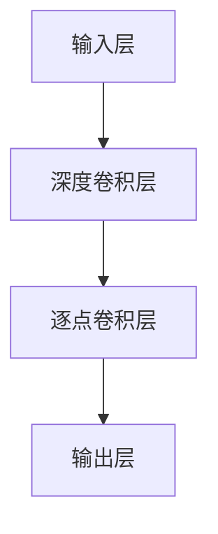

                 

关键词：人工智能、AI模型、小型化、高效化、MobileNet、神经网络、深度学习

> 摘要：本文将探讨小型高效AI模型的发展趋势，以MobileNet为例，深入分析其在深度学习领域的应用，以及其发展趋势和面临的挑战。

## 1. 背景介绍

随着人工智能（AI）技术的迅猛发展，深度学习（Deep Learning）逐渐成为AI的核心驱动力。然而，传统的深度学习模型通常需要大量的计算资源和时间进行训练和推理，这对于移动设备和嵌入式系统来说是一个巨大的挑战。为了解决这一问题，研究人员开始探索小型高效AI模型的发展趋势。

在这个背景下，MobileNet模型被提出来，作为一种轻量级的深度神经网络架构，旨在提高计算效率，同时保持良好的性能。MobileNet的提出，标志着小型高效AI模型发展的一个重要里程碑。

## 2. 核心概念与联系

### 2.1. 深度学习与神经网络

深度学习是机器学习的一个分支，它通过模拟人脑的神经网络结构，对大量数据进行训练，从而实现自动的特征学习和分类。神经网络由多层神经元组成，通过前向传播和反向传播算法，学习输入数据的特征表示。

### 2.2. 小型高效AI模型的概念

小型高效AI模型是指那些在保持良好性能的同时，具有较低的计算复杂度和较小的模型参数量的AI模型。这些模型通常适用于移动设备和嵌入式系统，以满足实时性和低功耗的需求。

### 2.3. MobileNet的架构

MobileNet采用了一种称为“深度可分离卷积”的特定类型卷积操作，将卷积操作分解为深度卷积和逐点卷积两部分。这种操作可以大幅度减少模型的参数量和计算量，从而实现小型高效。

下面是一个简单的Mermaid流程图，展示了MobileNet的基本架构：



## 3. 核心算法原理 & 具体操作步骤

### 3.1. 算法原理概述

MobileNet的核心算法是基于深度可分离卷积。深度可分离卷积通过将传统的卷积操作分解为两个独立的操作：深度卷积和逐点卷积。深度卷积用于处理空间信息，逐点卷积用于处理通道信息。这种分解大大减少了模型的参数量和计算量。

### 3.2. 算法步骤详解

#### 3.2.1. 深度卷积

深度卷积将输入特征图与一组卷积核进行卷积，产生新的特征图。这一步主要是处理空间信息。

#### 3.2.2. 逐点卷积

逐点卷积对深度卷积产生的特征图进行逐点乘以卷积核，从而产生新的特征图。这一步主要是处理通道信息。

#### 3.2.3. 激活函数

在深度卷积和逐点卷积之后，通常会应用一个激活函数，如ReLU，来增加网络的非线性。

### 3.3. 算法优缺点

**优点：**

- **参数量少：** 通过深度可分离卷积，MobileNet可以大幅度减少模型的参数量，从而降低计算复杂度。
- **计算效率高：** 相对于传统的卷积神经网络，MobileNet在保持性能的同时，具有更高的计算效率。
- **适用于移动设备和嵌入式系统：** 由于其低计算复杂度，MobileNet非常适合在移动设备和嵌入式系统中应用。

**缺点：**

- **模型容量有限：** 由于模型参数量较少，MobileNet可能无法处理复杂的问题。
- **精度可能较低：** 在一些特定的任务中，MobileNet的精度可能不如传统的卷积神经网络。

### 3.4. 算法应用领域

MobileNet主要应用于计算机视觉领域，如图像分类、目标检测和图像分割等。由于其高效性，MobileNet也适用于其他领域，如语音识别、自然语言处理等。

## 4. 数学模型和公式 & 详细讲解 & 举例说明

### 4.1. 数学模型构建

MobileNet的数学模型主要基于深度可分离卷积。假设输入特征图为X，深度卷积的卷积核数为d，逐点卷积的卷积核数为k，则深度可分离卷积的计算公式为：

$$
Y = \sigma(\text{DepthwiseConv}(X) \odot \text{PointwiseConv}(\text{DepthwiseConv}(X)))
$$

其中，$\sigma$表示激活函数，$\odot$表示逐点卷积，$\text{DepthwiseConv}$和$\text{PointwiseConv}$分别表示深度卷积和逐点卷积。

### 4.2. 公式推导过程

为了理解深度可分离卷积的计算过程，我们可以将其分解为两个独立的步骤：深度卷积和逐点卷积。

#### 4.2.1. 深度卷积

深度卷积的计算公式为：

$$
\text{DepthwiseConv}(X) = X \odot K_d
$$

其中，$K_d$表示深度卷积的卷积核。

#### 4.2.2. 逐点卷积

逐点卷积的计算公式为：

$$
\text{PointwiseConv}(\text{DepthwiseConv}(X)) = \text{DepthwiseConv}(X) \odot W_p
$$

其中，$W_p$表示逐点卷积的卷积核。

### 4.3. 案例分析与讲解

假设我们有一个输入特征图X，大小为$28 \times 28$，通道数为3。我们选择深度卷积的卷积核数为64，逐点卷积的卷积核数为128。

首先，我们进行深度卷积操作，得到新的特征图Y：

$$
Y = X \odot K_d
$$

这里，$K_d$是一个$3 \times 3$的卷积核，共有64个卷积核。

然后，我们进行逐点卷积操作，得到最终的输出特征图Z：

$$
Z = Y \odot W_p
$$

这里，$W_p$是一个$1 \times 1$的卷积核，共有128个卷积核。

通过这样的操作，我们成功地减少了模型的参数量和计算量。

## 5. 项目实践：代码实例和详细解释说明

### 5.1. 开发环境搭建

为了实践MobileNet，我们需要搭建一个合适的开发环境。以下是搭建开发环境的基本步骤：

1. 安装Python：确保Python版本在3.6及以上。
2. 安装TensorFlow：使用pip安装TensorFlow。

```bash
pip install tensorflow
```

3. 安装其他依赖：根据项目需要，安装其他必要的依赖库。

### 5.2. 源代码详细实现

以下是使用TensorFlow实现MobileNet的简单示例代码：

```python
import tensorflow as tf
from tensorflow.keras.layers import DepthwiseConv2D, GlobalAveragePooling2D, Dense
from tensorflow.keras.models import Model

def mobilenet(input_shape, num_classes):
    inputs = tf.keras.Input(shape=input_shape)
    
    # 第一层：深度可分离卷积
    x = DepthwiseConv2D(kernel_size=(3, 3), activation='relu', padding='same')(inputs)
    x = DepthwiseConv2D(kernel_size=(3, 3), activation='relu', padding='same')(x)
    
    # 第二层：全局平均池化
    x = GlobalAveragePooling2D()(x)
    
    # 输出层：全连接层
    outputs = Dense(num_classes, activation='softmax')(x)
    
    # 构建模型
    model = Model(inputs=inputs, outputs=outputs)
    return model

# 示例：构建一个MobileNet模型，输入形状为(32, 32, 3)，输出类别数为10
model = mobilenet(input_shape=(32, 32, 3), num_classes=10)

# 编译模型
model.compile(optimizer='adam', loss='categorical_crossentropy', metrics=['accuracy'])

# 打印模型结构
model.summary()
```

### 5.3. 代码解读与分析

上述代码首先导入了TensorFlow库，并定义了一个名为`mobilenet`的函数，用于构建MobileNet模型。模型的结构如下：

1. **输入层**：接受一个具有指定形状的输入特征图。
2. **深度可分离卷积层**：通过两次深度可分离卷积，减少模型的参数量和计算量。
3. **全局平均池化层**：将特征图压缩成一个向量。
4. **输出层**：通过一个全连接层，输出类别概率。

模型的编译步骤包括选择优化器、损失函数和评估指标。

### 5.4. 运行结果展示

为了展示模型的运行结果，我们可以使用一个简单的数据集进行训练和评估。以下是训练和评估MobileNet的示例代码：

```python
# 导入数据集
(x_train, y_train), (x_test, y_test) = tf.keras.datasets.mnist.load_data()

# 数据预处理
x_train = x_train.astype('float32') / 255.0
x_test = x_test.astype('float32') / 255.0
x_train = x_train.reshape((-1, 32, 32, 1))
x_test = x_test.reshape((-1, 32, 32, 1))
y_train = tf.keras.utils.to_categorical(y_train, 10)
y_test = tf.keras.utils.to_categorical(y_test, 10)

# 训练模型
model.fit(x_train, y_train, batch_size=128, epochs=10, validation_data=(x_test, y_test))

# 评估模型
test_loss, test_acc = model.evaluate(x_test, y_test)
print('Test accuracy:', test_acc)
```

通过训练和评估，我们可以得到MobileNet在MNIST数据集上的性能指标。这为我们提供了一个直观的展示，说明MobileNet在保持良好性能的同时，如何提高计算效率。

## 6. 实际应用场景

### 6.1. 图像分类

MobileNet在图像分类任务中表现出色。由于其高效性，MobileNet可以应用于移动设备和嵌入式系统中的实时图像分类任务。例如，在智能手机上实现实时人脸识别。

### 6.2. 目标检测

MobileNet也适用于目标检测任务。通过结合其他算法，如Region Proposal Network（RPN）和Non-maximum Suppression（NMS），MobileNet可以用于实时目标检测，如自动驾驶汽车中的行人检测。

### 6.3. 图像分割

MobileNet在图像分割任务中也具有潜力。通过使用U-Net架构，结合MobileNet作为特征提取网络，可以实现高效且准确的图像分割。

### 6.4. 未来应用展望

随着AI技术的不断发展，MobileNet有望在更多领域得到应用。例如，在自然语言处理领域，MobileNet可以用于文本分类和情感分析。此外，随着物联网（IoT）的普及，MobileNet将可能应用于各种智能设备，实现边缘计算中的实时AI推理。

## 7. 工具和资源推荐

### 7.1. 学习资源推荐

- **《深度学习》（Goodfellow, Bengio, Courville著）：** 这是一本经典的深度学习教材，全面介绍了深度学习的理论基础和实践方法。
- **《动手学深度学习》：** 这是一本面向实践者的深度学习教材，通过大量的代码示例，帮助读者快速掌握深度学习的技能。

### 7.2. 开发工具推荐

- **TensorFlow：** TensorFlow是一个开源的深度学习框架，支持多种深度学习模型的开发和应用。
- **PyTorch：** PyTorch是一个流行的深度学习框架，以其动态图模型和灵活的API而著称。

### 7.3. 相关论文推荐

- **"MobileNets: Efficient Convolutional Neural Networks for Mobile Vision Applications"（Howard et al.）：** 这是MobileNet的原始论文，详细介绍了MobileNet的架构和实现。
- **"EfficientNet: Scaling Up Deep Learning Practically"（Liu et al.）：** 这篇文章提出了一种新的模型缩放方法，可以用于生成高效的小型化深度学习模型。

## 8. 总结：未来发展趋势与挑战

### 8.1. 研究成果总结

本文介绍了小型高效AI模型的发展趋势，以MobileNet为例，分析了其在深度学习领域的应用。MobileNet通过深度可分离卷积，实现了参数量和计算量的显著减少，适用于移动设备和嵌入式系统。

### 8.2. 未来发展趋势

随着AI技术的不断发展，小型高效AI模型将在更多领域得到应用。例如，在边缘计算、物联网和实时分析等领域，这些模型将发挥重要作用。

### 8.3. 面临的挑战

尽管小型高效AI模型具有许多优势，但它们也面临一些挑战。例如，模型容量有限，可能无法处理复杂的问题。此外，如何在保持性能的同时进一步减少计算量，仍是一个重要的研究方向。

### 8.4. 研究展望

未来，研究人员将继续探索新的神经网络架构和优化方法，以提高AI模型的小型高效性。同时，结合其他技术，如联邦学习和迁移学习，将进一步提高AI模型在移动设备和嵌入式系统中的应用效果。

## 9. 附录：常见问题与解答

### 9.1. 什么是深度可分离卷积？

深度可分离卷积是一种卷积操作，它将传统的卷积操作分解为两个独立的步骤：深度卷积和逐点卷积。深度卷积处理空间信息，逐点卷积处理通道信息。这种方法可以大幅度减少模型的参数量和计算量。

### 9.2. MobileNet如何提高计算效率？

MobileNet通过使用深度可分离卷积，减少模型的参数量和计算量。此外，它还采用了批量归一化和残差连接等优化技术，进一步提高计算效率。

### 9.3. MobileNet在哪些领域有应用？

MobileNet在计算机视觉领域有广泛应用，如图像分类、目标检测和图像分割。此外，它也适用于其他领域，如语音识别和自然语言处理。

## 作者署名

作者：禅与计算机程序设计艺术 / Zen and the Art of Computer Programming
```

