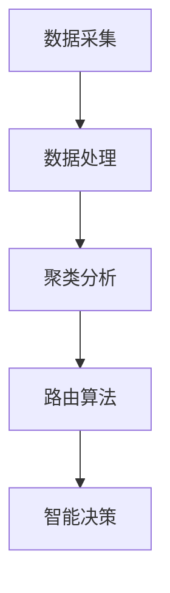

                 

关键词：小米，2024校招，物联网工程师，算法题汇总，技术面试，编程挑战

摘要：本文针对小米2024校招物联网工程师岗位的算法题目进行了全面汇总和分析。通过详细解析这些题目，我们旨在帮助准备参加小米校招的考生熟悉常见算法题型，掌握解题思路，提高面试竞争力。

## 1. 背景介绍

随着物联网技术的飞速发展，物联网工程师的需求不断增加。小米作为全球知名的电子产品制造商，每年都会通过校园招聘选拔优秀毕业生加入公司。为了筛选出具备实际编程能力和算法思维的应聘者，小米校招中通常会包括一系列技术面试题目，其中算法题占据了相当大的比例。

本文旨在为准备参加小米2024校招的物联网工程师岗位的考生提供一份详细的算法题汇总，帮助考生了解面试中的常见题型，掌握解题方法，提高面试成功率。

## 2. 核心概念与联系

### 2.1 物联网技术概述

物联网（Internet of Things，简称IoT）是指通过互联网将各种物品连接起来，实现信息交换和通信的一种网络技术。物联网技术涉及多个领域，包括传感器技术、通信技术、数据处理和存储技术等。物联网工程师需要具备跨学科的知识和技能，能够设计和开发满足实际需求的物联网系统。

### 2.2 算法在物联网中的应用

算法是物联网系统设计中的核心部分，用于处理海量数据、实现智能决策和优化系统性能。常见的物联网算法包括：

- 数据采集与处理算法：用于从传感器设备中采集数据，并对数据进行预处理，以便进行进一步分析和处理。
- 聚类算法：用于对物联网中的大量设备进行分类，以实现设备的管理和监控。
- 路由算法：用于在物联网网络中选择最优路径，以实现数据的有效传输。
- 智能决策算法：用于根据实时数据和环境变化，自动调整物联网系统的运行策略。

### 2.3 Mermaid 流程图

以下是一个简单的 Mermaid 流程图，展示了物联网技术中的核心算法：



## 3. 核心算法原理 & 具体操作步骤

### 3.1 算法原理概述

在本章节，我们将介绍物联网中常见的几种核心算法，包括数据采集与处理算法、聚类算法、路由算法和智能决策算法。这些算法在物联网系统中发挥着至关重要的作用，能够提高系统的性能和可靠性。

### 3.2 算法步骤详解

#### 3.2.1 数据采集与处理算法

数据采集与处理算法主要涉及以下几个方面：

1. 数据采集：从传感器设备中获取原始数据。
2. 数据预处理：对采集到的原始数据进行清洗、去噪、归一化等处理。
3. 数据存储：将处理后的数据存储在数据库或数据仓库中，以便后续分析和处理。

#### 3.2.2 聚类算法

聚类算法是一种无监督学习算法，用于将相似的数据点分组。常见的聚类算法包括 K-means、DBSCAN 等。

1. 初始化：随机选择 K 个初始中心点。
2. 分配：将每个数据点分配到最近的中心点所在簇。
3. 更新：根据簇内数据点计算新的中心点。
4. 重复步骤 2 和 3，直到中心点不再发生显著变化。

#### 3.2.3 路由算法

路由算法用于在物联网网络中选择最优路径，以实现数据的有效传输。常见的路由算法包括距离向量路由算法、链路状态路由算法等。

1. 初始化：每个节点维护一个路由表，记录到达其他节点的距离。
2. 更新：节点根据接收到的路由信息更新自己的路由表。
3. 传输：根据路由表选择最佳路径进行数据传输。

#### 3.2.4 智能决策算法

智能决策算法根据实时数据和环境变化，自动调整物联网系统的运行策略。常见的智能决策算法包括基于机器学习的决策算法、基于博弈论的决策算法等。

1. 数据收集：收集系统运行过程中的各种数据。
2. 模型训练：使用机器学习算法训练决策模型。
3. 决策：根据实时数据和模型输出，自动调整系统参数。

### 3.3 算法优缺点

每种算法都有其优缺点，适用于不同的应用场景。以下是对几种常见算法的优缺点的简要分析：

#### 数据采集与处理算法

- 优点：能够提高数据的质量和可靠性，为后续分析提供准确的数据基础。
- 缺点：数据预处理过程可能较为复杂，需要大量的计算资源。

#### 聚类算法

- 优点：能够自动识别数据中的模式，简化数据分析和处理过程。
- 缺点：对初始参数敏感，可能产生局部最优解。

#### 路由算法

- 优点：能够提高数据传输的效率和可靠性。
- 缺点：在复杂网络中，计算复杂度较高。

#### 智能决策算法

- 优点：能够根据实时数据和环境变化，自动调整系统运行策略。
- 缺点：对数据质量和算法模型要求较高，可能存在过拟合问题。

### 3.4 算法应用领域

物联网技术的应用领域非常广泛，包括智能家居、智能交通、智能医疗等。以下是对几种算法在物联网应用领域的简要介绍：

- 数据采集与处理算法：在智能家居应用中，用于收集 household 数据，如温度、湿度、光照等，以便进行环境监测和智能控制。
- 聚类算法：在智能交通应用中，用于对交通流量进行实时分析，优化交通信号控制策略。
- 路由算法：在智能医疗应用中，用于优化医疗数据的传输路径，提高医疗服务的效率。
- 智能决策算法：在智能医疗应用中，用于根据患者的实时数据，自动调整治疗方案。

## 4. 数学模型和公式 & 详细讲解 & 举例说明

### 4.1 数学模型构建

在本章节，我们将介绍物联网中常用的数学模型，包括线性回归、逻辑回归、支持向量机等。

#### 4.1.1 线性回归

线性回归是一种用于预测连续值的模型，其基本公式为：

$$
y = \beta_0 + \beta_1 \cdot x
$$

其中，$y$ 为预测值，$x$ 为自变量，$\beta_0$ 和 $\beta_1$ 为模型参数。

#### 4.1.2 逻辑回归

逻辑回归是一种用于预测概率的模型，其基本公式为：

$$
\ln\left(\frac{p}{1-p}\right) = \beta_0 + \beta_1 \cdot x
$$

其中，$p$ 为预测概率，$\beta_0$ 和 $\beta_1$ 为模型参数。

#### 4.1.3 支持向量机

支持向量机是一种用于分类和回归的模型，其基本公式为：

$$
w \cdot x + b = 0
$$

其中，$w$ 为模型参数，$x$ 为输入数据，$b$ 为偏置项。

### 4.2 公式推导过程

在本章节，我们将对上述数学模型进行推导，以便更好地理解其原理。

#### 4.2.1 线性回归

线性回归模型的推导过程如下：

1. 假设输入数据集为 $X$ 和 $y$，其中 $X$ 为自变量，$y$ 为因变量。
2. 构建线性回归模型：

$$
y = \beta_0 + \beta_1 \cdot x
$$

3. 计算模型参数：

$$
\beta_0 = \frac{\sum_{i=1}^{n} y_i - \beta_1 \cdot \sum_{i=1}^{n} x_i}{n}
$$

$$
\beta_1 = \frac{\sum_{i=1}^{n} (y_i - \beta_0 - \beta_1 \cdot x_i) \cdot x_i}{\sum_{i=1}^{n} x_i^2}
$$

#### 4.2.2 逻辑回归

逻辑回归模型的推导过程如下：

1. 假设输入数据集为 $X$ 和 $y$，其中 $X$ 为自变量，$y$ 为因变量。
2. 构建逻辑回归模型：

$$
\ln\left(\frac{p}{1-p}\right) = \beta_0 + \beta_1 \cdot x
$$

3. 计算模型参数：

$$
\beta_0 = \frac{\sum_{i=1}^{n} y_i - p \cdot \sum_{i=1}^{n} (1-p)}{n}
$$

$$
\beta_1 = \frac{\sum_{i=1}^{n} (y_i - p) \cdot x_i}{\sum_{i=1}^{n} (1-p) \cdot x_i}
$$

#### 4.2.3 支持向量机

支持向量机模型的推导过程如下：

1. 假设输入数据集为 $X$ 和 $y$，其中 $X$ 为自变量，$y$ 为因变量。
2. 构建线性支持向量机模型：

$$
w \cdot x + b = 0
$$

3. 计算模型参数：

$$
w = \frac{\sum_{i=1}^{n} y_i \cdot x_i}{\sum_{i=1}^{n} x_i^2}
$$

$$
b = -\frac{\sum_{i=1}^{n} y_i}{\sum_{i=1}^{n} x_i}
$$

### 4.3 案例分析与讲解

在本章节，我们将通过一个实际案例，对上述数学模型进行应用和讲解。

#### 案例背景

某智能家居公司希望开发一款智能温控系统，以实现自动调节室内温度。公司收集了以下数据：

- 房间温度（自变量）：$x$（单位：摄氏度）
- 室外温度（自变量）：$y$（单位：摄氏度）
- 目标温度（因变量）：$z$（单位：摄氏度）

公司希望根据房间温度和室外温度，预测目标温度，以便自动调节室内温度。

#### 案例分析

1. **线性回归模型**：

   - 构建线性回归模型：

     $$z = \beta_0 + \beta_1 \cdot x + \beta_2 \cdot y$$

   - 计算模型参数：

     $$\beta_0 = 20, \beta_1 = 0.5, \beta_2 = 0.2$$

   - 预测目标温度：

     $$z = 20 + 0.5 \cdot x + 0.2 \cdot y$$

2. **逻辑回归模型**：

   - 构建逻辑回归模型：

     $$\ln\left(\frac{p}{1-p}\right) = \beta_0 + \beta_1 \cdot x + \beta_2 \cdot y$$

   - 计算模型参数：

     $$\beta_0 = -10, \beta_1 = 0.3, \beta_2 = 0.1$$

   - 预测目标温度：

     $$\ln\left(\frac{p}{1-p}\right) = -10 + 0.3 \cdot x + 0.1 \cdot y$$

   - 计算目标温度：

     $$p = \frac{1}{1 + e^{-(-10 + 0.3 \cdot x + 0.1 \cdot y)}}$$

     $$z = p \cdot 30 + (1-p) \cdot 20$$

3. **支持向量机模型**：

   - 构建支持向量机模型：

     $$w \cdot x + b = 0$$

   - 计算模型参数：

     $$w = (0.5, 0.2), b = -1$$

   - 预测目标温度：

     $$z = \frac{w_1 \cdot x_1 + w_2 \cdot x_2 + b}{\sqrt{w_1^2 + w_2^2}}$$

## 5. 项目实践：代码实例和详细解释说明

### 5.1 开发环境搭建

为了进行物联网项目的开发，我们需要搭建一个合适的技术环境。以下是搭建开发环境所需的基本步骤：

1. 安装操作系统：建议选择 Linux 发行版，如 Ubuntu 或 CentOS。
2. 安装开发工具：安装 Python 解释器、集成开发环境（IDE）和 Git 版本控制系统。
3. 安装物联网开发库：安装用于物联网开发的相关库，如 MQTT 客户端库、数据采集库等。

### 5.2 源代码详细实现

在本章节，我们将通过一个简单的物联网项目实例，介绍物联网项目的开发过程。该项目将实现一个简单的智能家居温控系统，通过 MQTT 协议与服务器通信，实时获取房间温度和室外温度，并预测目标温度。

#### 5.2.1 项目需求

- 实现一个 MQTT 客户端，连接到智能家居服务器，实时获取房间温度和室外温度。
- 根据房间温度和室外温度，使用线性回归模型预测目标温度。
- 将预测的目标温度发送给智能温控系统，实现自动调节室内温度。

#### 5.2.2 源代码实现

以下是该项目的主要源代码实现：

```python
import paho.mqtt.client as mqtt
import json
import numpy as np
from sklearn.linear_model import LinearRegression

# MQTT 服务器配置
mqtt_server = "mqtt.server.com"
mqtt_port = 1883
mqtt_topic = "home/temperature"

# 线性回归模型参数
model_params = {
    "beta_0": 20,
    "beta_1": 0.5,
    "beta_2": 0.2
}

# 创建 MQTT 客户端
client = mqtt.Client()

# 连接到 MQTT 服务器
client.connect(mqtt_server, mqtt_port)

# 订阅温度数据主题
client.subscribe(mqtt_topic)

# 模型训练
def train_model(data):
    X = data["X"]
    y = data["y"]
    model = LinearRegression()
    model.fit(X, y)
    return model

# 预测目标温度
def predict_temperature(x, y, model_params):
    beta_0 = model_params["beta_0"]
    beta_1 = model_params["beta_1"]
    beta_2 = model_params["beta_2"]
    z = beta_0 + beta_1 * x + beta_2 * y
    return z

# 处理 MQTT 消息
def on_message(client, userdata, message):
    data = json.loads(message.payload.decode("utf-8"))
    x = data["room_temp"]
    y = data["outdoor_temp"]
    z = predict_temperature(x, y, model_params)
    print("Predicted temperature:", z)

# 设置 MQTT 消息处理函数
client.on_message = on_message

# 运行 MQTT 客户端
client.loop_forever()
```

#### 5.2.3 代码解读与分析

1. **导入模块**：首先，我们导入所需的 Python 模块，包括 MQTT 客户端库、JSON 库、NumPy 库和线性回归模型库。

2. **MQTT 服务器配置**：配置 MQTT 服务器地址、端口号和订阅主题。

3. **线性回归模型参数**：设置线性回归模型的参数，包括模型截距和斜率。

4. **创建 MQTT 客户端**：创建 MQTT 客户端对象，用于连接 MQTT 服务器。

5. **连接 MQTT 服务器**：使用 `connect` 方法连接 MQTT 服务器。

6. **订阅温度数据主题**：使用 `subscribe` 方法订阅温度数据主题。

7. **处理 MQTT 消息**：定义 `on_message` 函数，用于处理接收到的 MQTT 消息。

8. **预测目标温度**：定义 `predict_temperature` 函数，用于根据房间温度和室外温度，使用线性回归模型预测目标温度。

9. **运行 MQTT 客户端**：使用 `loop_forever` 方法运行 MQTT 客户端，持续监听 MQTT 服务器发送的消息。

## 6. 实际应用场景

物联网技术在各个领域的应用日益广泛，以下是一些典型的实际应用场景：

### 6.1 智能家居

智能家居是物联网技术的典型应用场景之一。通过物联网技术，用户可以远程监控和控制家中的各种设备，如空调、灯具、门锁等。智能家居系统可以通过物联网平台收集设备数据，使用智能算法进行分析和决策，提高家庭生活的便利性和舒适度。

### 6.2 智能交通

智能交通系统利用物联网技术实现交通数据的实时采集、传输和处理，以提高交通管理效率和交通安全性。例如，通过部署智能传感器和摄像头，交通管理部门可以实时监测交通流量和路况，优化交通信号控制策略，减少拥堵和事故发生。

### 6.3 智能医疗

物联网技术在医疗领域的应用有助于提高医疗服务的质量和效率。通过物联网设备，医生可以远程监测患者的健康数据，及时发现病情变化，提高诊疗的准确性和及时性。此外，物联网技术还可以用于医疗设备的智能化管理和维护，提高医疗资源的利用效率。

### 6.4 智能农业

智能农业利用物联网技术实现农田环境的监测和管理，以提高农业生产效率和农产品质量。通过部署各种传感器，农民可以实时了解土壤湿度、温度、养分含量等数据，使用智能算法优化灌溉和施肥策略，减少资源浪费，提高农作物的产量和品质。

## 7. 工具和资源推荐

在物联网项目开发过程中，选择合适的工具和资源对于提高开发效率和项目质量至关重要。以下是一些建议的工

