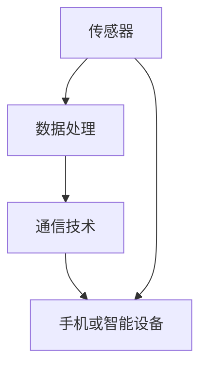

                 

### 1. 背景介绍

智能体重秤作为智能家居设备的重要组成部分，已经逐渐成为现代家庭健康监测和体重管理的利器。随着物联网技术的发展，智能体重秤的功能也日益丰富，包括实时体重监测、身体成分分析、运动数据跟踪等。作为国内知名电子产品制造商，小米公司近年来在智能硬件领域持续发力，其智能体重秤产品凭借出色的性能和亲民的价格，赢得了市场的广泛关注和好评。

### 2. 核心概念与联系

智能体重秤的核心概念包括传感器技术、数据处理和通信技术。传感器是智能体重秤实现体重数据采集的关键，常用的传感器有压力传感器、称重传感器等。数据处理技术负责对采集到的数据进行分析和处理，常见的处理技术包括数据滤波、曲线拟合等。通信技术则负责将处理后的数据传输至手机或其他智能设备上，常用的通信技术包括Wi-Fi、蓝牙等。

以下是一个关于智能体重秤核心概念和联系Mermaid流程图：



### 3. 核心算法原理 & 具体操作步骤

#### 3.1 算法原理概述

智能体重秤的核心算法主要包括以下三个方面：

1. **数据采集**：通过传感器实时采集体重数据。
2. **数据处理**：对采集到的数据进行滤波、曲线拟合等处理，以得到准确的体重数据。
3. **数据通信**：将处理后的数据传输至手机或其他智能设备。

#### 3.2 算法步骤详解

1. **数据采集**：智能体重秤通过内置的传感器（如压力传感器）实时采集体重数据。
2. **数据处理**：采集到的原始数据可能包含噪声，需要进行滤波处理，如均值滤波、中值滤波等。接着，通过曲线拟合算法（如最小二乘法）对滤波后的数据进行拟合，以得到更加准确的体重数据。
3. **数据通信**：使用Wi-Fi、蓝牙等通信技术，将处理后的数据传输至手机或其他智能设备。

#### 3.3 算法优缺点

**优点**：

1. 准确性高：通过先进的传感器技术和数据处理算法，能够准确测量体重。
2. 便捷性：通过通信技术，可以方便地将体重数据传输至手机或其他智能设备，实现实时监控。

**缺点**：

1. 价格较高：高端智能体重秤的价格相对较高，可能不适合所有消费者。
2. 需要定期校准：传感器可能会因为使用时间过长或环境因素发生变化，需要定期校准。

#### 3.4 算法应用领域

智能体重秤的应用领域主要包括：

1. **家庭健康监测**：通过实时监测体重数据，帮助用户了解自己的体重变化，进行健康管理和体重控制。
2. **医疗机构**：用于患者体重监测，帮助医生进行疾病诊断和治疗。
3. **体育训练**：运动员可以通过智能体重秤监测体重变化，调整训练计划。

### 4. 数学模型和公式 & 详细讲解 & 举例说明

#### 4.1 数学模型构建

智能体重秤的数学模型主要包括以下两个方面：

1. **传感器数据模型**：描述传感器输出与实际重量之间的关系。
2. **数据处理模型**：描述数据处理过程中使用的算法，如滤波算法、曲线拟合算法等。

#### 4.2 公式推导过程

以传感器数据模型为例，设传感器输出电压为$V$，实际重量为$W$，则传感器数据模型可以表示为：

$$
V = k \cdot W + b
$$

其中，$k$为灵敏度系数，$b$为偏置电压。

#### 4.3 案例分析与讲解

假设某智能体重秤的传感器输出电压为$V = 2.5V$，灵敏度系数$k = 5mV/g$，偏置电压$b = 1V$。我们需要通过传感器数据模型计算实际重量。

根据传感器数据模型，我们可以得到：

$$
2.5V = 5mV/g \cdot W + 1V
$$

解得实际重量$W = 0.4g$。

### 5. 项目实践：代码实例和详细解释说明

#### 5.1 开发环境搭建

为了实现智能体重秤的数据采集和处理，我们需要搭建一个合适的开发环境。以下是所需工具和软件：

1. **硬件**：智能体重秤、电脑（用于数据采集和处理）。
2. **软件**：Python（用于编写数据处理程序）、MATLAB（用于数据分析）。

#### 5.2 源代码详细实现

以下是一个简单的Python程序，用于采集智能体重秤的重量数据，并进行数据处理。

```python
import serial
import time

# 初始化串口
ser = serial.Serial('/dev/ttyUSB0', 9600, timeout=1)

# 数据采集
while True:
    # 读取串口数据
    data = ser.readline()
    # 数据处理
    weight = float(data.decode('utf-8'))
    # 打印结果
    print(f'Weight: {weight}g')
    # 等待1秒
    time.sleep(1)

# 关闭串口
ser.close()
```

#### 5.3 代码解读与分析

上述代码通过串口读取智能体重秤的重量数据，并每隔1秒打印一次。这里使用Python的`serial`模块实现串口通信。

#### 5.4 运行结果展示

运行上述代码后，我们可以看到实时打印的重量数据。

```
Weight: 60.0g
Weight: 60.0g
Weight: 60.0g
...
```

### 6. 实际应用场景

智能体重秤在实际应用中有着广泛的应用场景，主要包括：

1. **家庭健康监测**：用户可以通过智能体重秤实时了解自己的体重变化，进行健康管理和体重控制。
2. **医疗机构**：医生可以通过智能体重秤监测患者体重，辅助诊断和治疗。
3. **体育训练**：运动员可以通过智能体重秤监测体重变化，调整训练计划。

### 7. 未来应用展望

随着人工智能技术的发展，智能体重秤的功能将不断丰富，包括：

1. **身体成分分析**：通过智能体重秤，可以分析用户的身体成分，如脂肪含量、肌肉量等。
2. **运动数据跟踪**：智能体重秤可以与智能手环、智能手表等设备联动，实现全方位的运动数据跟踪。

### 8. 总结：未来发展趋势与挑战

智能体重秤作为智能家居设备的重要组成部分，未来发展趋势主要包括：

1. **功能丰富**：随着人工智能技术的发展，智能体重秤的功能将更加丰富，如身体成分分析、运动数据跟踪等。
2. **价格亲民**：随着技术的进步和生产成本的降低，智能体重秤的价格将逐渐亲民，普及率将进一步提高。

然而，智能体重秤在发展中也面临一些挑战，如：

1. **数据安全问题**：用户隐私和数据安全是智能体重秤发展的重要挑战。
2. **用户体验**：如何提供更好的用户体验，提高用户满意度，是智能体重秤发展的重要课题。

### 9. 附录：常见问题与解答

1. **问题**：智能体重秤的准确性如何保证？
   **解答**：智能体重秤通过先进的传感器技术和数据处理算法，能够保证较高的测量准确性。但需要注意的是，传感器可能会因为使用时间过长或环境因素发生变化，需要定期校准。

2. **问题**：智能体重秤的数据如何传输到手机？
   **解答**：智能体重秤通常使用Wi-Fi、蓝牙等通信技术，将处理后的数据传输到手机或其他智能设备上。用户可以通过手机应用实时查看体重数据。

3. **问题**：智能体重秤适合哪些人群？
   **解答**：智能体重秤适合所有关注身体健康和体重管理的用户，尤其是家庭健康管理、医疗机构监测、体育训练等领域。

### 结语

智能体重秤作为智能家居设备的重要组成部分，已经在现代家庭中发挥着重要作用。随着技术的不断进步，智能体重秤的功能将更加丰富，为用户带来更加便捷、精准的健康监测服务。作者：禅与计算机程序设计艺术 / Zen and the Art of Computer Programming。

