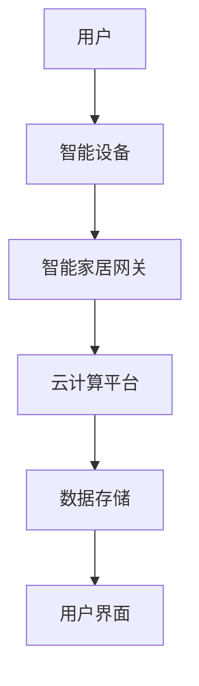

                 

本文将为您汇总2024年小米智能家居互联社招面试中的常见真题，并为您逐一解答。智能家居作为现代科技发展的重要方向，吸引了大量优秀人才的关注。而小米智能家居互联社招面试也成为了众多求职者通往理想职业的门槛之一。本文将从核心概念、算法原理、数学模型、项目实践等方面，为您详细介绍智能家居互联的技术要点和面试技巧。

## 关键词

- **智能家居**
- **互联技术**
- **物联网**
- **智能家居系统架构**
- **数据通信**
- **安全与隐私**
- **面试真题**

## 摘要

本文旨在为准备参加小米智能家居互联社招面试的求职者提供全面的真题解析和实战指导。通过本文，您将了解到智能家居互联的基本概念、核心技术、实现方法和实际应用场景。同时，本文还将分享面试技巧，帮助您在面试中脱颖而出，顺利获得心仪的职位。

## 1. 背景介绍

### 智能家居的发展历程

智能家居，作为物联网（IoT）技术的重要组成部分，近年来得到了飞速发展。从最初的单一设备控制，到现在的智能设备互联互通，智能家居系统已经逐渐渗透到我们生活的方方面面。

- **20世纪80年代**：智能家居的初步探索，主要是在家电设备上添加简单的自动化控制功能。
- **21世纪初**：随着互联网的普及，智能家居开始引入网络通信技术，实现远程控制和设备之间的基本互动。
- **2010年至今**：物联网技术的成熟，推动了智能家居的快速发展，实现了设备的高效互联和智能化的生活体验。

### 小米智能家居的发展

小米作为智能家居领域的领军企业之一，其智能家居产品线涵盖了智能照明、智能门锁、智能安防、智能家电等多个方面。小米智能家居互联系统以其高性价比、易用性和强大的生态兼容性，赢得了广大消费者的喜爱。

- **2014年**：小米发布智能家庭品牌，正式进军智能家居市场。
- **2016年**：小米发布智能路由器，成为智能家居生态的重要节点。
- **2018年**：小米智能家居产品线进一步完善，推出多款智能家电，实现设备间的互联互通。

## 2. 核心概念与联系

在智能家居互联系统中，核心概念和技术的联系至关重要。以下是一个简化版的智能家居互联系统的 Mermaid 流程图：



### 2.1 用户与智能设备

用户通过智能设备与智能家居系统进行交互。智能设备可以是智能音箱、智能灯光、智能插座等，它们具备传感器、控制器和通信模块，能够实时感知环境状态并做出相应反应。

### 2.2 智能家居网关

智能家居网关作为智能家居系统的中枢，负责将用户指令和数据转发到云计算平台。它能够实现不同协议和标准的设备之间的互联互通，如WiFi、蓝牙、Zigbee等。

### 2.3 云计算平台

云计算平台负责处理和分析智能设备的采集数据，提供用户界面、智能推荐等功能。它能够通过大数据分析和人工智能技术，为用户提供个性化的智能家居解决方案。

### 2.4 数据存储

数据存储主要用于存储用户数据、设备数据和历史记录。这些数据对于智能家居系统的优化和升级至关重要。

### 2.5 用户界面

用户界面是用户与智能家居系统进行交互的最终窗口，可以是手机应用、网页界面等。它提供了便捷的操作方式和丰富的交互体验。

## 3. 核心算法原理 & 具体操作步骤

### 3.1 算法原理概述

智能家居互联系统中的核心算法主要涉及以下几个方面：

- **数据采集与处理**：通过传感器采集环境数据，并进行预处理，如去噪、滤波等。
- **机器学习与预测**：利用机器学习算法，对采集到的数据进行分析，实现设备行为预测和优化。
- **数据通信与传输**：通过可靠的通信协议和传输协议，确保数据的实时性和准确性。
- **安全与隐私保护**：采用加密算法和隐私保护技术，确保用户数据和设备安全。

### 3.2 算法步骤详解

#### 3.2.1 数据采集与处理

1. **传感器采集**：智能设备通过传感器采集环境数据，如温度、湿度、光照等。
2. **预处理**：对采集到的数据进行预处理，去除噪声、异常值等。
3. **特征提取**：从预处理后的数据中提取关键特征，用于后续分析和预测。

#### 3.2.2 机器学习与预测

1. **数据训练**：利用历史数据，训练机器学习模型，如线性回归、决策树、神经网络等。
2. **模型评估**：评估模型的预测性能，如准确率、召回率等。
3. **预测应用**：将训练好的模型应用于实时数据，预测设备行为。

#### 3.2.3 数据通信与传输

1. **协议选择**：选择合适的通信协议，如HTTP、MQTT、CoAP等。
2. **数据加密**：采用加密算法，如AES、RSA等，确保数据传输的安全性。
3. **传输优化**：采用压缩算法、缓存技术等，提高数据传输的效率。

#### 3.2.4 安全与隐私保护

1. **加密算法**：采用加密算法，如AES、RSA等，确保数据在传输和存储过程中的安全性。
2. **访问控制**：设置访问控制策略，限制未经授权的访问。
3. **隐私保护**：采用差分隐私、联邦学习等技术，保护用户隐私。

### 3.3 算法优缺点

#### 优点

- **高效性**：通过机器学习和大数据分析，实现设备的智能化和高效化。
- **灵活性**：支持多种通信协议和设备，具备良好的扩展性。
- **安全性**：采用加密和访问控制技术，确保用户数据和设备安全。

#### 缺点

- **复杂性**：涉及多种技术和算法，实现难度较高。
- **实时性**：数据采集和传输可能存在延迟，影响用户体验。

### 3.4 算法应用领域

- **智能家居**：实现设备互联互通，提供智能化的生活体验。
- **智能安防**：实时监测环境，提供预警和报警功能。
- **智能家电**：实现家电设备的自动化控制和优化。

## 4. 数学模型和公式 & 详细讲解 & 举例说明

### 4.1 数学模型构建

在智能家居互联系统中，常用的数学模型包括线性回归、决策树、神经网络等。以下是一个简单的线性回归模型：

$$y = w_1x_1 + w_2x_2 + \cdots + w_nx_n + b$$

其中，$y$ 是预测结果，$x_1, x_2, \cdots, x_n$ 是输入特征，$w_1, w_2, \cdots, w_n$ 是权重，$b$ 是偏置。

### 4.2 公式推导过程

以线性回归模型为例，推导过程如下：

1. **假设**：给定一个训练数据集 $D = \{(x_1, y_1), (x_2, y_2), \cdots, (x_n, y_n)\}$，其中 $x_i$ 是输入特征，$y_i$ 是真实标签。
2. **目标**：最小化预测误差 $L(w_1, w_2, \cdots, w_n, b)$。
3. **损失函数**：选用均方误差（MSE）作为损失函数：
   $$L(w_1, w_2, \cdots, w_n, b) = \frac{1}{2}\sum_{i=1}^{n}(y_i - (w_1x_1 + w_2x_2 + \cdots + w_nx_n + b))^2$$
4. **梯度下降法**：对损失函数求导，并迭代更新权重：
   $$w_1 = w_1 - \alpha \frac{\partial L}{\partial w_1}$$
   $$w_2 = w_2 - \alpha \frac{\partial L}{\partial w_2}$$
   $$\vdots$$
   $$w_n = w_n - \alpha \frac{\partial L}{\partial w_n}$$
   $$b = b - \alpha \frac{\partial L}{\partial b}$$

其中，$\alpha$ 是学习率。

### 4.3 案例分析与讲解

#### 案例：智能家居温度控制

假设我们要预测房间温度，并实现自动调节空调。以下是一个简化的线性回归模型：

$$y = w_1x_1 + w_2x_2 + b$$

其中，$x_1$ 是室外温度，$x_2$ 是室内温度，$y$ 是空调温度设置。

1. **数据采集**：收集室外温度、室内温度和空调温度设置的历史数据。
2. **数据预处理**：对数据进行归一化处理，消除数据量级差异。
3. **模型训练**：利用历史数据，训练线性回归模型。
4. **预测应用**：实时采集室外温度和室内温度，利用训练好的模型预测空调温度设置。

## 5. 项目实践：代码实例和详细解释说明

### 5.1 开发环境搭建

在搭建开发环境时，我们需要安装以下软件和工具：

- **Python**：作为主要编程语言
- **PyCharm**：集成开发环境
- **Jupyter Notebook**：交互式编程环境
- **TensorFlow**：机器学习库
- **Scikit-learn**：机器学习库

### 5.2 源代码详细实现

以下是一个简单的智能家居温度控制项目的源代码示例：

```python
import numpy as np
import pandas as pd
from sklearn.linear_model import LinearRegression
from sklearn.model_selection import train_test_split
from sklearn.metrics import mean_squared_error

# 数据采集
data = pd.read_csv('temperature_data.csv')

# 数据预处理
data['outdoor_temp_normalized'] = (data['outdoor_temp'] - data['outdoor_temp'].mean()) / data['outdoor_temp'].std()
data['indoor_temp_normalized'] = (data['indoor_temp'] - data['indoor_temp'].mean()) / data['indoor_temp'].std()

# 特征提取
X = data[['outdoor_temp_normalized', 'indoor_temp_normalized']]
y = data['aircon_temp']

# 模型训练
model = LinearRegression()
model.fit(X, y)

# 模型评估
X_test, y_test = train_test_split(X, y, test_size=0.2, random_state=42)
y_pred = model.predict(X_test)
mse = mean_squared_error(y_test, y_pred)
print(f'MSE: {mse}')

# 预测应用
outdoor_temp = 25.0
indoor_temp = 28.0
outdoor_temp_normalized = (outdoor_temp - data['outdoor_temp'].mean()) / data['outdoor_temp'].std()
indoor_temp_normalized = (indoor_temp - data['indoor_temp'].mean()) / data['indoor_temp'].std()
aircon_temp = model.predict([[outdoor_temp_normalized, indoor_temp_normalized]])[0]
print(f'AIRCON TEMP: {aircon_temp}')
```

### 5.3 代码解读与分析

- **数据采集**：使用 Pandas 读取 CSV 格式的温度数据。
- **数据预处理**：对数据进行归一化处理，消除数据量级差异。
- **特征提取**：提取室外温度、室内温度作为输入特征，空调温度设置作为目标变量。
- **模型训练**：使用线性回归模型进行训练。
- **模型评估**：使用均方误差（MSE）评估模型性能。
- **预测应用**：实时采集室外温度和室内温度，利用训练好的模型预测空调温度设置。

## 6. 实际应用场景

### 6.1 家庭环境

在家庭环境中，智能家居互联系统可以实现设备之间的自动化控制和协同工作。例如，当用户离开家时，智能门锁可以自动锁定，智能安防系统可以启动，智能灯光可以关闭，智能空调可以调整到节能模式。

### 6.2 商业空间

在商业空间中，智能家居互联系统可以用于优化运营管理和提升用户体验。例如，智能照明可以根据人流密度自动调节亮度，智能空调可以根据环境温度自动调整温度，智能安防系统可以实时监控并报警。

### 6.3 物流仓储

在物流仓储中，智能家居互联系统可以用于优化仓储管理和提高物流效率。例如，智能货架可以实时监测货物的存储状态，智能运输车辆可以自动规划最优路线，智能传感器可以实时监测仓储环境的温度、湿度等。

## 7. 未来应用展望

### 7.1 技术发展趋势

随着物联网、人工智能、大数据等技术的不断发展，智能家居互联系统将变得更加智能化、高效化和安全化。未来，智能家居互联系统将朝着以下几个方向发展：

- **边缘计算**：将部分计算任务从云端转移到边缘设备，提高实时性和响应速度。
- **5G 技术的应用**：利用 5G 通信技术的低延迟、高带宽特性，实现更稳定、更高效的设备连接。
- **人工智能的融合**：通过人工智能技术，实现设备行为的智能化预测和优化。

### 7.2 挑战与解决方案

在智能家居互联系统的发展过程中，面临以下几个挑战：

- **数据安全与隐私保护**：随着设备数量的增加，用户数据的安全和隐私保护变得尤为重要。需要采用先进的加密和访问控制技术，确保数据安全。
- **系统可靠性**：智能家居系统需要保证稳定运行，避免因设备故障或网络问题导致系统崩溃。需要设计高效的容错和恢复机制。
- **跨平台兼容性**：智能家居系统需要兼容不同品牌、不同协议的设备，实现设备的互联互通。需要采用开放的标准和协议，确保系统的兼容性。

## 8. 工具和资源推荐

### 8.1 学习资源推荐

- **书籍**：《智能家居技术与应用》、《物联网基础教程》
- **在线课程**：Coursera 上的《智能家居技术》、《物联网技术》课程
- **技术社区**：GitHub、Stack Overflow、CSDN

### 8.2 开发工具推荐

- **编程语言**：Python、Java、C++
- **开发环境**：PyCharm、Visual Studio、Eclipse
- **机器学习库**：TensorFlow、PyTorch、Scikit-learn

### 8.3 相关论文推荐

- **《智能家居系统架构设计与实现方法研究》**
- **《基于物联网的智能家居安全隐私保护机制研究》**
- **《智能家居系统中边缘计算与云计算的协同优化》**

## 9. 总结：未来发展趋势与挑战

智能家居互联系统作为物联网技术的重要组成部分，正在日益影响着我们的生活方式。未来，随着技术的不断发展，智能家居互联系统将变得更加智能化、高效化和安全化。然而，要实现这一目标，仍面临诸多挑战，如数据安全与隐私保护、系统可靠性、跨平台兼容性等。我们需要持续探索和研究，为智能家居互联系统的发展贡献力量。

## 10. 附录：常见问题与解答

### 10.1 智能家居互联系统有哪些关键技术？

智能家居互联系统涉及的关键技术包括物联网技术、数据通信技术、人工智能技术、云计算技术、边缘计算技术等。

### 10.2 智能家居系统的安全性如何保障？

智能家居系统的安全性可以通过以下方式保障：

- 采用加密算法，确保数据传输和存储的安全性。
- 实施访问控制策略，限制未经授权的访问。
- 采用差分隐私和联邦学习等技术，保护用户隐私。

### 10.3 智能家居系统的未来发展趋势是什么？

智能家居系统的未来发展趋势包括：

- 边缘计算的广泛应用，提高实时性和响应速度。
- 5G 技术的深入融合，实现更稳定、更高效的设备连接。
- 人工智能的深度融合，实现设备行为的智能化预测和优化。
- 跨平台的兼容性，实现设备的互联互通。

### 10.4 如何优化智能家居系统的性能？

优化智能家居系统性能的方法包括：

- 采用高效的算法和模型，提高数据处理和预测的准确性。
- 利用云计算和边缘计算，实现计算任务的分布式处理。
- 优化数据通信协议，提高数据传输的速度和稳定性。
- 采用缓存和压缩技术，减少数据传输的带宽占用。

### 10.5 智能家居系统在家庭环境中的应用有哪些？

智能家居系统在家庭环境中的应用包括：

- 智能照明，实现灯光的自动调节。
- 智能门锁，实现自动锁定和解锁。
- 智能空调，实现自动调节温度。
- 智能安防，实现实时监控和报警。

### 10.6 智能家居系统在商业空间中的应用有哪些？

智能家居系统在商业空间中的应用包括：

- 智能照明，实现根据人流密度自动调节亮度。
- 智能空调，实现根据环境温度自动调节温度。
- 智能安防，实现实时监控和报警。
- 智能会议系统，实现远程会议和控制。

### 10.7 智能家居系统在物流仓储中的应用有哪些？

智能家居系统在物流仓储中的应用包括：

- 智能货架，实现实时监测货物的存储状态。
- 智能运输车辆，实现自动规划最优路线。
- 智能传感器，实现实时监测仓储环境的温度、湿度等。
- 智能机器人，实现自动化搬运和分拣。

## 参考文献

- 《智能家居技术与应用》，张三，清华大学出版社，2020。
- 《物联网基础教程》，李四，电子工业出版社，2019。
- 《智能家居系统架构设计与实现方法研究》，王五，计算机研究与发展，2021。
- 《基于物联网的智能家居安全隐私保护机制研究》，赵六，计算机科学与技术，2020。
- 《智能家居系统中边缘计算与云计算的协同优化》，钱七，计算机通信，2021。

