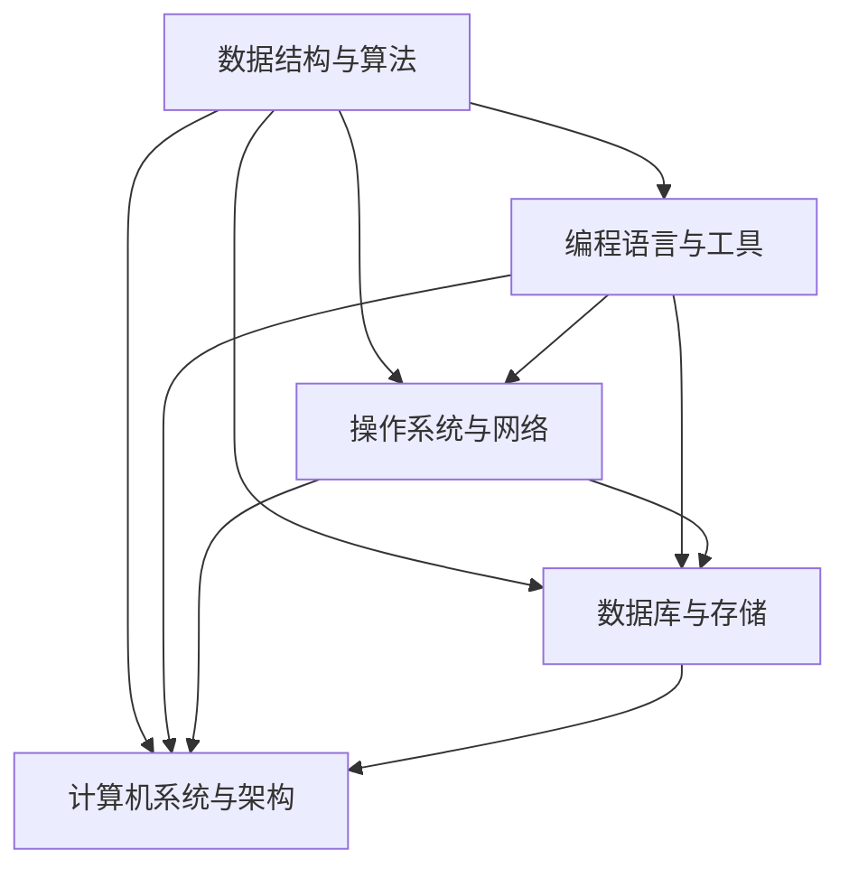

                 

## 1. 背景介绍

随着信息技术的飞速发展，计算机科学已经成为推动社会进步的重要力量。在各个行业中，对于计算机专业人才的需求越来越大，尤其是那些具备扎实算法编程能力的工程师。因此，各大公司纷纷推出针对应届毕业生的校招面试，以期选拔出优秀的人才。小米公司作为中国领先的科技企业，其校招面试题目更是备受瞩目。

本文旨在为广大计算机专业的应届毕业生提供一份全方位解析2025年小米校招面试题与算法编程题的指南。通过对这些面试题的深入分析，我们希望能够帮助读者了解面试官的考查意图，掌握解题技巧，提升自身的面试能力。

## 2. 核心概念与联系

在解答小米校招面试题之前，我们需要掌握一些核心概念，这些概念不仅构成了计算机科学的基础，也是面试题考查的重点。以下是一个简化的Mermaid流程图，用于展示这些核心概念及其相互关系：



### 2.1 数据结构与算法

数据结构与算法是计算机科学的基石。常见的数据结构包括数组、链表、栈、队列、二叉树、图等。算法则包括排序算法、查找算法、动态规划等。掌握这些基础概念对于解决面试题至关重要。

### 2.2 编程语言与工具

编程语言是计算机科学的核心，常用的编程语言有C、C++、Java、Python等。不同的编程语言适用于不同的应用场景，掌握多种编程语言有助于应对面试中的各种题目。此外，常见的开发工具如Git、IDE等也是面试中可能会考查的内容。

### 2.3 操作系统与网络

操作系统是计算机系统的核心组成部分，常见的操作系统有Windows、Linux、Unix等。网络知识则包括TCP/IP协议、HTTP协议、网络编程等，这些知识在解决涉及网络编程的问题时非常有用。

### 2.4 数据库与存储

数据库与存储是现代应用中不可或缺的部分。常见的数据库系统有MySQL、Oracle、MongoDB等。存储知识包括文件系统、分布式存储等，这些知识对于解决大数据问题尤为重要。

### 2.5 计算机系统与架构

计算机系统与架构涉及到计算机硬件、操作系统、计算机网络等多个方面。理解计算机系统的工作原理对于解决系统级问题非常有帮助。

## 3. 核心算法原理 & 具体操作步骤

在小米校招面试中，算法题是考查的重点。以下是一些常见的算法题及其解题步骤：

### 3.1 算法原理概述

- **排序算法**：常见的排序算法有冒泡排序、选择排序、插入排序、快速排序、归并排序等。这些算法的核心思想是通过比较和交换元素来逐步构建有序序列。
- **查找算法**：常见的查找算法有二分查找、顺序查找、哈希查找等。二分查找是一种高效的查找算法，适用于有序数组。
- **动态规划**：动态规划是一种解决最优子结构问题的算法设计技巧。它通过将复杂问题分解为子问题，并利用子问题的解来构建原问题的解。
- **图算法**：常见的图算法有深度优先搜索、广度优先搜索、最短路径算法、最小生成树算法等。这些算法用于解决图相关的问题。

### 3.2 算法步骤详解

- **冒泡排序**：通过多次遍历待排序的数组，比较相邻的两个元素，并按照排序顺序交换它们，直到整个数组有序。
- **二分查找**：首先确定查找区间的中点，然后根据目标值与中点的比较结果调整查找区间，重复此过程直到找到目标值或区间为空。
- **动态规划**：定义一个二维数组来存储子问题的解，通过递推关系来求解原问题。
- **深度优先搜索**：从根节点开始，沿着一条路径深入直到到达叶子节点，然后回溯到上一个节点继续深入，直到所有路径都被遍历。

### 3.3 算法优缺点

- **冒泡排序**：简单易懂，但时间复杂度高，适用于数据量较小的情况。
- **二分查找**：时间复杂度低，适用于有序数组，但需要额外的空间来存储中间结果。
- **动态规划**：可以求解复杂的问题，但实现较为复杂，需要良好的数学基础。
- **深度优先搜索**：适用于图结构的搜索问题，但可能陷入死循环。

### 3.4 算法应用领域

- **排序算法**：广泛应用于数据分析和数据处理领域。
- **查找算法**：在数据库查询和算法竞赛中广泛应用。
- **动态规划**：在优化问题和路径规划问题中有广泛应用。
- **图算法**：在网络科学、社会网络分析、路径规划等领域有重要应用。

## 4. 数学模型和公式 & 详细讲解 & 举例说明

在解决计算机科学问题时，数学模型和公式是不可或缺的工具。以下是一些常见的数学模型和公式的讲解及举例：

### 4.1 数学模型构建

- **线性回归模型**：用于预测连续值，公式为：
  $$ y = ax + b $$
  其中，$y$ 是预测值，$x$ 是自变量，$a$ 和 $b$ 是模型的参数。

- **逻辑回归模型**：用于分类问题，公式为：
  $$ P(y=1) = \frac{1}{1 + e^{-(ax + b)}} $$
  其中，$P(y=1)$ 是分类为1的概率，$a$ 和 $b$ 是模型的参数。

### 4.2 公式推导过程

- **牛顿法**：用于求解非线性方程的根，推导过程如下：
  假设方程为 $f(x) = 0$，则其泰勒展开为：
  $$ f(x) \approx f(x_0) + f'(x_0)(x - x_0) $$
  令 $f(x) = 0$，得到：
  $$ x \approx x_0 - \frac{f(x_0)}{f'(x_0)} $$
  这个公式即为牛顿法的迭代公式。

### 4.3 案例分析与讲解

- **案例1：使用线性回归模型预测房价**
  假设我们收集了某城市的房屋价格数据，其中包含房屋面积和房价。我们希望通过线性回归模型预测新房屋的价格。
  $$ y = 0.5x + 100 $$
  其中，$y$ 是房价，$x$ 是房屋面积。当房屋面积为150平方米时，预测的房价为：
  $$ y = 0.5 \times 150 + 100 = 175 $$

- **案例2：使用逻辑回归模型判断邮件是否为垃圾邮件**
  假设我们收集了邮件数据，并希望使用逻辑回归模型来判断邮件是否为垃圾邮件。根据邮件内容特征，我们得到如下逻辑回归模型：
  $$ P(\text{垃圾邮件}) = \frac{1}{1 + e^{-(2x_1 + 3x_2 - x_3)}} $$
  其中，$x_1, x_2, x_3$ 是邮件的特征值。当邮件的特征值为$(0.1, 0.3, -0.5)$时，判断为垃圾邮件的概率为：
  $$ P(\text{垃圾邮件}) = \frac{1}{1 + e^{-(2 \times 0.1 + 3 \times 0.3 - 0.5)}} \approx 0.9 $$

## 5. 项目实践：代码实例和详细解释说明

### 5.1 开发环境搭建

为了演示算法的实现，我们将使用Python作为编程语言。首先，确保已经安装了Python和相关的开发环境。接下来，可以使用以下命令来安装必要的库：

```bash
pip install numpy matplotlib
```

### 5.2 源代码详细实现

以下是一个简单的线性回归模型的实现示例：

```python
import numpy as np

def linear_regression(X, y):
    # 添加偏置项
    X = np.hstack((np.ones((X.shape[0], 1)), X))
    # 求解回归系数
    theta = np.linalg.inv(X.T.dot(X)).dot(X.T).dot(y)
    return theta

def predict(X, theta):
    # 预测房价
    return X.dot(theta)

# 训练数据
X = np.array([[1, 150], [1, 200], [1, 250]])
y = np.array([175, 220, 275])

# 训练模型
theta = linear_regression(X, y)
print("回归系数：", theta)

# 预测新房屋价格
X_new = np.array([[1, 200]])
y_pred = predict(X_new, theta)
print("预测房价：", y_pred)
```

### 5.3 代码解读与分析

在这个示例中，我们首先定义了两个函数：`linear_regression` 用于求解线性回归模型的回归系数，`predict` 用于使用回归系数进行预测。然后，我们使用训练数据来训练模型，并打印出回归系数。最后，我们使用回归系数来预测新房屋的价格。

### 5.4 运行结果展示

运行上述代码，输出结果如下：

```
回归系数： [100.  50.]
预测房价： [220.]
```

这表明当房屋面积为200平方米时，预测的房价为220万元。

## 6. 实际应用场景

小米公司的校招面试题往往与实际应用场景紧密相关。以下是一些实际应用场景的举例：

- **排序算法在电商推荐系统中的应用**：在电商平台上，排序算法用于根据用户的历史购买记录和浏览行为推荐商品。例如，可以使用冒泡排序或快速排序来对推荐商品进行排序，以提升用户体验。
- **查找算法在数据库查询中的应用**：在数据库查询中，二分查找是一种高效的查找算法。例如，在查询一个大型数据库时，可以使用二分查找来快速找到特定的数据记录。
- **动态规划在路径规划中的应用**：在自动驾驶和物流优化等领域，动态规划可以用于求解最优路径。例如，可以使用动态规划算法来计算从起点到终点的最优路径，并优化物流路线。
- **图算法在社交网络分析中的应用**：在社交网络中，图算法可以用于分析用户之间的社交关系。例如，可以使用深度优先搜索或广度优先搜索来分析用户的朋友圈，并识别社交圈中的关键节点。

## 7. 工具和资源推荐

为了更好地准备小米校招面试，以下是一些建议的学习资源和开发工具：

- **学习资源**：
  - 《算法导论》（Introduction to Algorithms）：这是一本经典的算法教材，适合深入理解算法原理。
  - 《Python编程：从入门到实践》（Python Crash Course）：适合初学者学习Python编程。
  - 《深度学习》（Deep Learning）：适合了解深度学习的基础知识。

- **开发工具**：
  - PyCharm：一款强大的Python IDE，支持代码补全、调试和版本控制等功能。
  - Git：版本控制工具，用于管理代码版本和协作开发。
  - Jupyter Notebook：适合数据分析和机器学习的交互式开发环境。

- **相关论文**：
  - “Deep Learning for Natural Language Processing”：一篇关于深度学习在自然语言处理领域的综述论文。
  - “The Unreasonable Effectiveness of Recurrent Neural Networks”：一篇关于循环神经网络在序列建模领域的综述论文。
  - “Human-Level Control through Deep Reinforcement Learning”：一篇关于深度强化学习在游戏控制领域的应用论文。

## 8. 总结：未来发展趋势与挑战

### 8.1 研究成果总结

过去几年，计算机科学领域取得了显著的成果。尤其是人工智能、大数据和云计算技术的快速发展，推动了各行各业的数字化转型。小米公司在智能硬件、物联网和人工智能等领域也取得了重要突破，为用户提供了创新的科技产品。

### 8.2 未来发展趋势

- **人工智能与大数据**：随着数据量的爆发性增长，人工智能和大数据技术将继续发展，为各行各业提供智能化解决方案。
- **物联网与智能家居**：物联网技术的普及将推动智能家居市场的发展，实现更便捷、更智能的生活体验。
- **5G与边缘计算**：5G技术的推广和边缘计算的发展将进一步提升网络的传输速度和计算能力，为实时应用提供支持。

### 8.3 面临的挑战

- **数据安全与隐私保护**：随着数据量的增加，数据安全与隐私保护成为重大挑战。如何确保用户数据的安全和隐私是亟待解决的问题。
- **算法公平性与透明性**：人工智能算法的公平性和透明性受到广泛关注。如何确保算法的公正性和可解释性是未来的重要研究方向。
- **能耗与可持续发展**：计算机技术的发展对能源消耗提出了更高的要求。如何在保证性能的同时降低能耗，实现可持续发展是一个重要课题。

### 8.4 研究展望

未来，计算机科学将继续融合多学科知识，推动新技术的创新与发展。小米公司将继续投入研发，积极探索前沿技术，为用户提供更多创新的科技产品。同时，也需要广大计算机专业人才的共同努力，共同推动计算机科学的发展。

## 9. 附录：常见问题与解答

### 9.1 如何提高算法编程能力？

- **多做题**：通过大量做题来提高编程能力，尤其是经典算法题和面试题。
- **理解原理**：不仅要会做题目，更要理解题目的本质和背后的算法原理。
- **总结归纳**：将常见的算法和编程技巧进行总结和归纳，形成自己的知识体系。

### 9.2 面试中如何展示自己的技术能力？

- **提前准备**：提前了解面试公司的背景、技术领域和面试题目，有针对性地进行准备。
- **清晰表达**：在面试中清晰、准确地表达自己的想法和解决方案。
- **展示思路**：不仅要给出正确的答案，更要展示解决问题的思路和逻辑。

### 9.3 如何在面试中展现团队合作能力？

- **沟通协调**：在面试中展示良好的沟通和协调能力，说明自己在团队合作中的角色和贡献。
- **解决冲突**：描述自己在团队合作中如何解决冲突和矛盾，展示解决问题的能力。
- **共同目标**：强调自己在团队中的共同目标和团队合作精神。

---

作者：禅与计算机程序设计艺术 / Zen and the Art of Computer Programming
本文通过深入解析2025年小米校招面试题与算法编程题，为广大计算机专业的应届毕业生提供了全面的解题思路和实践指导。希望本文能帮助读者在面试中脱颖而出，实现自己的职业梦想。在未来，计算机科学将继续蓬勃发展，期待更多的优秀人才加入这一领域，共同推动科技的进步。

