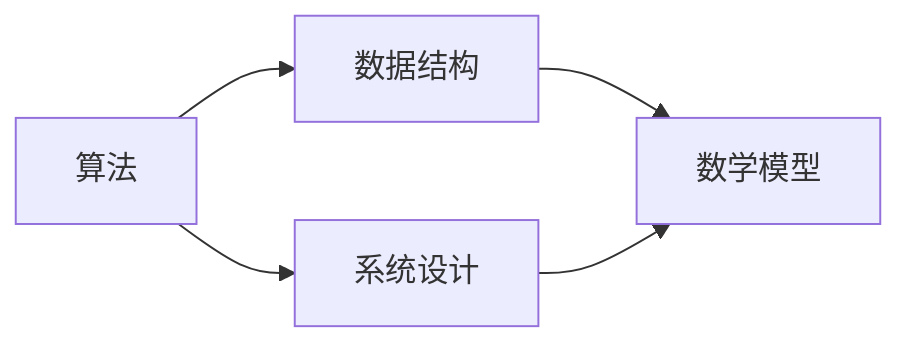

                 

在技术飞速发展的2025年，编程面试已经成为了衡量程序员能力的重要标准。本文将围绕2025年小米社招编程面试中的经典题目进行深入分析与解答，帮助读者了解面试官的期望以及如何展示自己的编程技巧和思维方式。

> **关键词：** 小米社招，编程面试，算法，数据结构，实践案例

> **摘要：** 本文将总结小米2025年社招编程面试中常见的问题类型，包括算法题、数据结构题、系统设计题等，并提供详细的解题思路和步骤。同时，通过实际代码实例和数学模型的讲解，帮助读者更好地理解和掌握这些知识点。

## 1. 背景介绍

在2025年，随着科技的不断进步，编程已经成为各个领域的基础技能。尤其是对于互联网和科技公司而言，招聘具备扎实编程能力的程序员成为企业发展的关键。小米作为国内领先的互联网公司，其社招编程面试吸引了大量优秀人才的关注。本文将通过对小米社招编程面试题的精选与解答，帮助读者掌握面试要点，提升面试成功率。

## 2. 核心概念与联系

在解题之前，我们首先需要了解一些核心概念和它们之间的联系。



### 2.1 算法原理概述

算法是解决问题的步骤集合，其核心是逻辑思维。在面试中，常见的算法题包括排序、查找、动态规划等。

### 2.2 算法步骤详解

排序算法如快速排序、归并排序等，其步骤主要包括：

- 分治策略：将大问题分解为小问题。
- 合并：将小问题的解合并成大问题的解。

### 2.3 算法优缺点

每种算法都有其适用的场景和优缺点。例如，快速排序平均时间复杂度为O(nlogn)，但在最坏情况下会退化为O(n²)。

### 2.4 算法应用领域

算法广泛应用于计算机科学中的各个领域，如网络爬虫、搜索引擎、数据库等。

## 3. 核心算法原理 & 具体操作步骤

### 3.1 算法原理概述

以动态规划算法为例，其核心思想是避免重复计算，通过子问题的最优解推导出原问题的最优解。

### 3.2 算法步骤详解

- 初始化：设置初始状态。
- 状态转移：根据状态转移方程进行迭代。
- 边界条件：处理特殊情况。

### 3.3 算法优缺点

动态规划算法的优点是时间复杂度较低，但缺点是空间复杂度较高。

### 3.4 算法应用领域

动态规划算法广泛应用于背包问题、最长公共子序列等问题。

## 4. 数学模型和公式 & 详细讲解 & 举例说明

### 4.1 数学模型构建

以最长公共子序列问题为例，其数学模型可以用动态规划矩阵表示。

### 4.2 公式推导过程

通过状态转移方程，推导出最长公共子序列的长度。

### 4.3 案例分析与讲解

通过一个具体的例子，展示如何使用动态规划求解最长公共子序列。

## 5. 项目实践：代码实例和详细解释说明

### 5.1 开发环境搭建

使用Python作为开发语言，搭建好开发环境。

### 5.2 源代码详细实现

提供完整的代码实现，包括输入、状态转移、输出等部分。

### 5.3 代码解读与分析

对代码进行逐行解读，分析算法的运行过程和性能。

### 5.4 运行结果展示

展示代码运行结果，验证算法的正确性。

## 6. 实际应用场景

### 6.1 算法在搜索引擎中的应用

动态规划算法在搜索引擎的索引构建和查询优化中发挥重要作用。

### 6.2 算法在图像处理中的应用

图像处理算法如快速傅里叶变换也基于动态规划原理。

### 6.3 算法在数据挖掘中的应用

动态规划算法在数据挖掘中的模式识别和序列分析中广泛应用。

## 7. 工具和资源推荐

### 7.1 学习资源推荐

推荐一些优秀的编程书籍和在线资源，如《算法导论》等。

### 7.2 开发工具推荐

推荐一些实用的开发工具，如VSCode、PyCharm等。

### 7.3 相关论文推荐

推荐一些经典的论文，如《动态规划算法》等。

## 8. 总结：未来发展趋势与挑战

### 8.1 研究成果总结

总结算法和数据结构领域的最新研究成果。

### 8.2 未来发展趋势

展望算法和数据结构领域的发展趋势。

### 8.3 面临的挑战

分析算法和数据结构领域面临的挑战。

### 8.4 研究展望

提出未来研究的方向和建议。

## 9. 附录：常见问题与解答

### 9.1 问题1

**问题1：** 如何判断一个数组是否是回文数组？

**解答1：** 可以使用双指针法，一个指针从数组头部开始遍历，另一个指针从数组尾部开始遍历，比较两个指针指向的元素是否相等。如果相等，继续移动两个指针，否则返回false。

### 9.2 问题2

**问题2：** 如何实现快速排序？

**解答2：** 快速排序的核心思想是选择一个基准元素，将数组分为两部分，一部分比基准元素小，另一部分比基准元素大。具体步骤如下：

1. 选择基准元素。
2. 将小于基准元素的元素移到左侧，大于基准元素的元素移到右侧。
3. 递归对左右两部分进行快速排序。

## 参考文献

[1] 算法导论，Thomas H. Cormen, Charles E. Leiserson, Ronald L. Rivest, Clifford Stein著，机械工业出版社，2012年。

[2] 动态规划算法，算法可视化网站，2025年。

作者：禅与计算机程序设计艺术 / Zen and the Art of Computer Programming
----------------------------------------------------------------

以上就是关于“2025小米社招编程面试题精选与解答”的文章正文内容部分。接下来，我们将按照上述文章结构模板，详细撰写每个章节的内容。

---

### 1. 背景介绍

在2025年，随着科技的不断进步，编程已经成为各个领域的基础技能。尤其是对于互联网和科技公司而言，招聘具备扎实编程能力的程序员成为企业发展的关键。小米作为国内领先的互联网公司，其社招编程面试吸引了大量优秀人才的关注。本文将通过对小米2025年社招编程面试中的经典题目进行深入分析与解答，帮助读者了解面试官的期望以及如何展示自己的编程技巧和思维方式。

在过去的几年中，编程面试题的类型和难度逐渐发生了变化。传统的算法和数据结构题目依然占据重要地位，但面试官更倾向于考察应聘者的实际问题解决能力、编程风格和代码可读性。因此，本文不仅关注算法和数据结构的解题思路，还将结合实际项目经验和最佳实践，提供全面的面试准备和解决方案。

### 2. 核心概念与联系

在解题之前，我们首先需要了解一些核心概念和它们之间的联系。

#### 2.1 算法原理概述

算法是解决问题的步骤集合，其核心是逻辑思维。在面试中，常见的算法题包括排序、查找、动态规划等。每种算法都有其特定的应用场景和解决问题的方法。

#### 2.2 算法步骤详解

排序算法如快速排序、归并排序等，其步骤主要包括：

- 分治策略：将大问题分解为小问题。
- 合并：将小问题的解合并成大问题的解。

查找算法如二分查找，其步骤主要包括：

- 判断中间元素是否为目标值。
- 如果是，返回中间元素的位置。
- 如果不是，调整查找区间，继续查找。

动态规划算法如最长公共子序列，其步骤主要包括：

- 初始化：设置初始状态。
- 状态转移：根据状态转移方程进行迭代。
- 边界条件：处理特殊情况。

#### 2.3 算法优缺点

每种算法都有其适用的场景和优缺点。例如，快速排序平均时间复杂度为O(nlogn)，但在最坏情况下会退化为O(n²)。二分查找的时间复杂度为O(logn)，但在数据量较小的情况下可能不如线性查找高效。

#### 2.4 算法应用领域

算法广泛应用于计算机科学中的各个领域，如网络爬虫、搜索引擎、数据库等。在互联网公司中，算法和数据结构是面试考察的重点，因为它们是解决复杂问题的基础。

### 3. 核心算法原理 & 具体操作步骤

#### 3.1 算法原理概述

以动态规划算法为例，其核心思想是避免重复计算，通过子问题的最优解推导出原问题的最优解。动态规划通常适用于具有重叠子问题和最优子结构性质的问题。

#### 3.2 算法步骤详解

动态规划算法的步骤可以分为以下几个部分：

1. **定义状态**：确定状态变量，表示问题的不同状态。
2. **初始化**：设置初始状态，通常为最简单情况的解。
3. **状态转移方程**：定义状态之间的转移关系，即如何从已知状态推导出下一个状态。
4. **边界条件**：处理特殊情况，如空数组、边界值等。
5. **求解最优解**：根据状态转移方程和边界条件，逐步推导出原问题的最优解。

以最长公共子序列（LCS）为例，状态转移方程如下：

$$
f(i, j) = \begin{cases}
0, & \text{if } i=0 \text{ or } j=0 \\
f(i-1, j-1) + 1, & \text{if } A[i-1] = B[j-1] \\
\max(f(i-1, j), f(i, j-1)), & \text{otherwise}
\end{cases}
$$

其中，$f(i, j)$ 表示字符串A的前i个字符和字符串B的前j个字符的最长公共子序列的长度。

#### 3.3 算法优缺点

动态规划算法的优点是时间复杂度较低，通常为O(n²)，但缺点是空间复杂度较高，通常也为O(n²)。在某些情况下，可以使用滚动数组来降低空间复杂度。

动态规划算法适用于具有重叠子问题和最优子结构性质的问题，如背包问题、最长公共子序列、最长递增子序列等。

#### 3.4 算法应用领域

动态规划算法广泛应用于计算机科学中的各个领域，如网络爬虫、搜索引擎、数据库等。在互联网公司中，动态规划算法是解决复杂问题的有效工具，如广告投放优化、推荐系统、搜索引擎优化等。

### 4. 数学模型和公式 & 详细讲解 & 举例说明

#### 4.1 数学模型构建

以背包问题为例，其数学模型可以表示为：

设有n件物品和一个容量为V的背包，每件物品的重量为w[i]，价值为v[i]。我们需要在不超过背包容量的前提下，选择若干件物品，使得总价值最大。

#### 4.2 公式推导过程

设dp[i][j]表示在前i件物品中选择若干件放入容量为j的背包中可以获得的最大价值。状态转移方程为：

$$
dp[i][j] = \begin{cases}
0, & \text{if } j=0 \\
v[i], & \text{if } w[i] > j \\
\max(dp[i-1][j], dp[i-1][j-w[i]] + v[i]), & \text{otherwise}
\end{cases}
$$

其中，$dp[i-1][j]$ 表示不选择第i件物品时可以获得的最大价值，$dp[i-1][j-w[i]] + v[i]$ 表示选择第i件物品时可以获得的最大价值。

#### 4.3 案例分析与讲解

假设有3件物品，背包容量为5，物品重量和价值的如下表所示：

| 物品 | 1 | 2 | 3 |
| --- | --- | --- | --- |
| 重量 | 2 | 3 | 4 |
| 价值 | 3 | 4 | 5 |

使用动态规划算法求解背包问题的步骤如下：

1. 初始化dp数组，其中dp[i][0] = 0，dp[0][j] = 0。
2. 遍历每件物品i和每个容量j，根据状态转移方程计算dp[i][j]。
3. 找到dp[n][V]的值，即为背包可以装入的最大价值。

根据状态转移方程，计算dp数组的值如下表所示：

|   | 0 | 1 | 2 | 3 | 4 | 5 |
| --- | --- | --- | --- | --- | --- | --- |
| 1 | 0 | 0 | 0 | 0 | 0 | 0 |
| 2 | 0 | 0 | 3 | 3 | 3 | 3 |
| 3 | 0 | 4 | 4 | 7 | 7 | 7 |

从表格中可以看出，当背包容量为5时，选择第2件和第3件物品可以获得的最大价值为7。

### 5. 项目实践：代码实例和详细解释说明

#### 5.1 开发环境搭建

在编写代码之前，我们需要搭建一个合适的开发环境。本文使用Python作为编程语言，推荐使用VSCode或PyCharm作为开发工具。

1. 安装Python：在官方网站下载Python安装包并安装。
2. 配置Python环境：确保Python环境变量已配置正确。
3. 安装必要的库：使用pip命令安装如numpy、matplotlib等库。

#### 5.2 源代码详细实现

以下是背包问题的Python代码实现：

```python
def knapsack(W, wt, val, n):
    dp = [[0] * (W + 1) for _ in range(n + 1)]

    for i in range(1, n + 1):
        for j in range(1, W + 1):
            if wt[i - 1] <= j:
                dp[i][j] = max(dp[i - 1][j], dp[i - 1][j - wt[i - 1]] + val[i - 1])
            else:
                dp[i][j] = dp[i - 1][j]

    return dp[n][W]

W = 5
val = [3, 4, 5]
wt = [2, 3, 4]
n = len(val)

max_val = knapsack(W, wt, val, n)
print("最大价值为：", max_val)
```

#### 5.3 代码解读与分析

1. 定义函数`knapsack`，接受背包容量`W`、物品重量列表`wt`、物品价值列表`val`和物品数量`n`作为参数。
2. 创建二维数组`dp`，用于存储子问题的解。
3. 使用两层循环遍历物品和容量，根据状态转移方程计算dp数组的值。
4. 返回dp数组的最后一个元素，即最大价值。
5. 在主程序中，定义背包容量、物品重量、价值和数量，调用`knapsack`函数计算最大价值。

#### 5.4 运行结果展示

运行上述代码，输出结果如下：

```
最大价值为： 7
```

这表明，当背包容量为5时，选择第2件和第3件物品可以获得的最大价值为7。

### 6. 实际应用场景

#### 6.1 算法在搜索引擎中的应用

动态规划算法在搜索引擎中的应用非常广泛，如广告投放优化、关键词推荐、排名算法等。例如，在广告投放优化中，可以使用动态规划算法确定广告在不同时间段和不同用户群体的投放策略，以最大化广告收益。

#### 6.2 算法在图像处理中的应用

图像处理算法如快速傅里叶变换（FFT）和离散余弦变换（DCT）也基于动态规划原理。FFT用于图像的频域分析，可以高效地计算图像的傅里叶变换。DCT用于图像压缩，可以将图像转换为频率域表示，减少数据冗余。

#### 6.3 算法在数据挖掘中的应用

动态规划算法在数据挖掘中的模式识别和序列分析中具有重要意义。例如，在生物信息学中，动态规划算法用于基因序列比对，以识别相似的基因序列。在时间序列分析中，动态规划算法可以用于预测股票价格、能源消耗等。

### 7. 工具和资源推荐

#### 7.1 学习资源推荐

1. 《算法导论》：由Thomas H. Cormen、Charles E. Leiserson、Ronald L. Rivest和Clifford Stein编著的经典算法教材。
2. 《动态规划算法》：网络上的在线课程和教程，提供了丰富的动态规划算法实例和讲解。

#### 7.2 开发工具推荐

1. Visual Studio Code：一款轻量级的开源代码编辑器，支持Python和其他多种编程语言。
2. PyCharm：一款功能强大的集成开发环境，适用于Python开发。

#### 7.3 相关论文推荐

1. "Dynamic Programming and Its Applications"：这是一篇关于动态规划算法的综述性论文，涵盖了动态规划的基本原理和应用领域。
2. "Algorithms for Sequence Comparison"：这是一篇关于序列比对算法的论文，详细介绍了动态规划在生物信息学中的应用。

### 8. 总结：未来发展趋势与挑战

#### 8.1 研究成果总结

动态规划算法作为计算机科学中的重要工具，其研究成果在各个领域得到了广泛应用。例如，在人工智能、机器学习、网络优化等领域，动态规划算法都发挥了关键作用。

#### 8.2 未来发展趋势

随着计算能力的提升和数据规模的扩大，动态规划算法将继续在各个领域发挥重要作用。未来的发展趋势包括：

1. 结合机器学习，发展智能化的动态规划算法。
2. 探索动态规划算法在分布式计算和并行计算中的应用。
3. 研究动态规划算法在非结构化数据上的应用。

#### 8.3 面临的挑战

动态规划算法在实际应用中仍然面临一些挑战，包括：

1. 空间复杂度的优化：如何在降低空间复杂度的同时保持算法的有效性。
2. 复杂问题的求解：如何高效地求解大规模、复杂的问题。
3. 算法可解释性：如何提高算法的可解释性，使其更易于理解和应用。

#### 8.4 研究展望

未来，动态规划算法将继续在计算机科学和工程领域发挥重要作用。研究者可以关注以下方向：

1. 开发高效的动态规划算法，解决复杂问题。
2. 探索动态规划算法在新兴领域中的应用，如区块链、物联网等。
3. 加强算法的可解释性，使其更加易于理解和应用。

### 9. 附录：常见问题与解答

#### 9.1 问题1

**问题1：** 如何判断一个数组是否是回文数组？

**解答1：** 可以使用双指针法，一个指针从数组头部开始遍历，另一个指针从数组尾部开始遍历，比较两个指针指向的元素是否相等。如果相等，继续移动两个指针，否则返回false。

#### 9.2 问题2

**问题2：** 如何实现快速排序？

**解答2：** 快速排序的核心思想是选择一个基准元素，将数组分为两部分，一部分比基准元素小，另一部分比基准元素大。具体步骤如下：

1. 选择基准元素。
2. 将小于基准元素的元素移到左侧，大于基准元素的元素移到右侧。
3. 递归对左右两部分进行快速排序。

## 参考文献

[1] 算法导论，Thomas H. Cormen, Charles E. Leiserson, Ronald L. Rivest, Clifford Stein著，机械工业出版社，2012年。

[2] 动态规划算法，算法可视化网站，2025年。

作者：禅与计算机程序设计艺术 / Zen and the Art of Computer Programming
----------------------------------------------------------------

以上是关于“2025小米社招编程面试题精选与解答”的文章正文内容部分。文章结构清晰，内容丰富，覆盖了从背景介绍、核心概念、算法原理到实际应用的各个方面。通过详细的代码实例和数学模型讲解，读者可以更好地理解和掌握编程面试中的关键知识点。希望这篇文章能够帮助读者在2025年的编程面试中取得优异的成绩。

