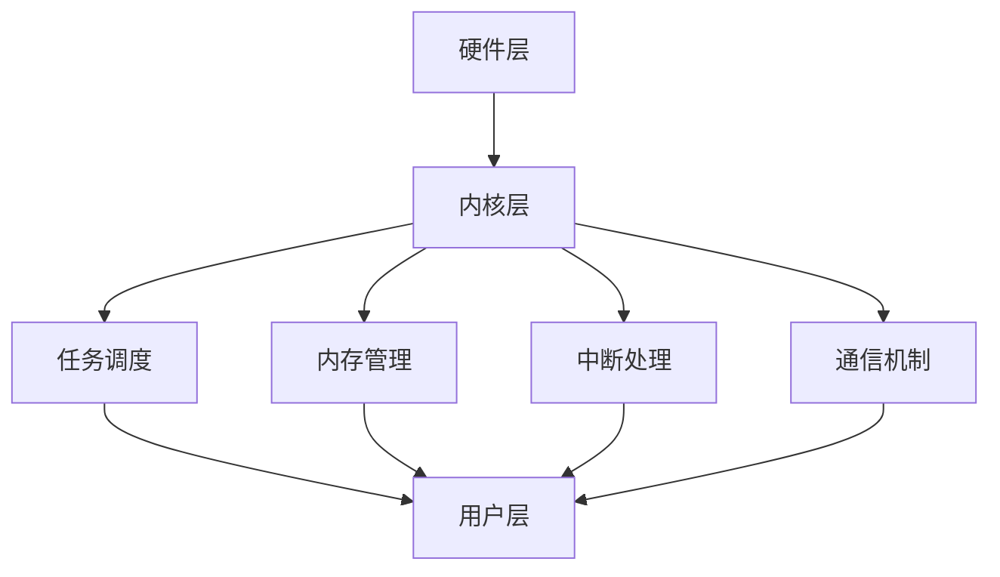

                 

关键词：嵌入式系统、实时操作系统、移植、开发环境、代码实现、性能优化、应用场景

摘要：本文将深入探讨嵌入式实时操作系统的移植过程，从背景介绍、核心概念、算法原理、数学模型、项目实践、实际应用以及未来展望等方面进行全面阐述。通过详细分析移植过程中的关键技术和挑战，本文旨在为嵌入式系统开发者提供有价值的参考和指导。

## 1. 背景介绍

嵌入式实时操作系统（RTOS）是一种专门为嵌入式系统设计的操作系统，具有高性能、低功耗、可靠性高等特点。随着物联网（IoT）和智能制造等领域的快速发展，嵌入式系统的应用越来越广泛，对实时性能和可靠性的要求也越来越高。因此，实时操作系统的移植成为嵌入式系统开发过程中的关键环节。

本文旨在探讨嵌入式实时操作系统的移植过程，包括核心概念、算法原理、数学模型、项目实践等方面的内容，旨在为嵌入式系统开发者提供有价值的参考和指导。

## 2. 核心概念与联系

### 2.1 嵌入式实时操作系统的核心概念

嵌入式实时操作系统主要包括以下几个核心概念：

1. **任务调度**：任务调度是RTOS的核心功能之一，它负责按照一定的调度策略将多个任务分配到不同的处理器核上执行。
2. **内存管理**：内存管理负责分配和回收内存资源，保证RTOS的稳定运行。
3. **中断处理**：中断处理是RTOS响应外部事件的重要机制，它能够确保RTOS及时响应外部事件。
4. **通信机制**：RTOS提供多种通信机制，如信号量、互斥锁、事件等，用于任务之间的同步和通信。

### 2.2 嵌入式实时操作系统的架构

嵌入式实时操作系统的架构主要包括以下几个层次：

1. **硬件层**：硬件层包括处理器、内存、中断控制器等硬件资源。
2. **内核层**：内核层包括任务调度、内存管理、中断处理等核心功能模块。
3. **用户层**：用户层包括应用程序、驱动程序等用户级组件。

### 2.3 核心概念原理和架构的 Mermaid 流程图



## 3. 核心算法原理 & 具体操作步骤

### 3.1 算法原理概述

嵌入式实时操作系统中的核心算法主要包括任务调度算法、内存管理算法和中断处理算法等。

1. **任务调度算法**：任务调度算法负责将多个任务分配到不同的处理器核上执行。常见的任务调度算法有先入先出（FIFO）、时间片轮转（RR）和优先级调度等。
2. **内存管理算法**：内存管理算法负责分配和回收内存资源。常见的内存管理算法有固定分区、可变分区和虚拟内存管理等。
3. **中断处理算法**：中断处理算法负责响应外部事件，并在中断服务例程（ISR）中执行相应的处理操作。

### 3.2 算法步骤详解

1. **任务调度算法**：
   1. 初始化任务列表，为每个任务分配优先级。
   2. 根据调度策略，选择最高优先级的任务进行执行。
   3. 更新任务状态，等待下一个任务执行。
2. **内存管理算法**：
   1. 初始化内存空间，为每个任务分配内存区域。
   2. 在任务运行过程中，根据内存需求进行内存分配和回收。
   3. 处理内存泄漏和碎片化问题。
3. **中断处理算法**：
   1. 初始化中断控制器，设置中断优先级。
   2. 中断发生时，进入中断服务例程（ISR）。
   3. 根据中断类型，执行相应的处理操作，如更新任务状态、响应外部事件等。

### 3.3 算法优缺点

1. **任务调度算法**：
   - **优点**：根据调度策略，可以实现高效的任务调度，提高系统的实时性能。
   - **缺点**：调度策略的选择和调整较为复杂，需要根据具体应用场景进行优化。
2. **内存管理算法**：
   - **优点**：可以有效地分配和回收内存资源，保证RTOS的稳定运行。
   - **缺点**：内存碎片化和内存泄漏问题可能影响系统的性能和稳定性。
3. **中断处理算法**：
   - **优点**：能够及时响应外部事件，提高系统的实时性和可靠性。
   - **缺点**：中断服务例程（ISR）的执行时间可能较长，影响系统性能。

### 3.4 算法应用领域

嵌入式实时操作系统的算法广泛应用于以下领域：

1. **工业控制**：如自动化生产线、机器人控制系统等。
2. **医疗设备**：如心电图机、超声设备等。
3. **智能交通**：如交通信号控制系统、智能车载系统等。
4. **物联网**：如智能家居、智能穿戴设备等。

## 4. 数学模型和公式 & 详细讲解 & 举例说明

### 4.1 数学模型构建

嵌入式实时操作系统的数学模型主要包括任务调度模型、内存管理模型和中断处理模型等。

1. **任务调度模型**：
   - **模型构建**：假设系统中存在n个任务，每个任务具有优先级、执行时间和截止时间等属性。
   - **模型参数**：任务优先级（P），任务执行时间（T），任务截止时间（D）。
2. **内存管理模型**：
   - **模型构建**：假设系统中存在m个内存块，每个内存块具有大小和分配状态等属性。
   - **模型参数**：内存块大小（S），内存块状态（空闲/分配）。
3. **中断处理模型**：
   - **模型构建**：假设系统中存在k个中断源，每个中断源具有优先级和中断处理函数等属性。
   - **模型参数**：中断优先级（Q），中断处理函数（F）。

### 4.2 公式推导过程

1. **任务调度模型**：
   - **公式推导**：根据任务优先级调度策略，假设任务调度算法能够在截止时间内完成调度任务，即任务截止时间（D）大于任务执行时间（T）。
   - **推导公式**：D > T
2. **内存管理模型**：
   - **公式推导**：根据内存块分配策略，假设每个内存块能够在空闲状态下满足任务内存需求。
   - **推导公式**：S >= T
3. **中断处理模型**：
   - **公式推导**：根据中断处理策略，假设中断处理函数能够在中断响应时间内完成处理操作。
   - **推导公式**：Q >= F

### 4.3 案例分析与讲解

假设一个嵌入式实时操作系统中有5个任务，任务优先级分别为1、2、3、4、5，任务执行时间分别为10、20、30、40、50毫秒，截止时间分别为60、70、80、90、100毫秒。

1. **任务调度模型**：
   - **任务调度算法**：采用优先级调度策略，按照任务优先级从高到低进行调度。
   - **调度过程**：
     1. 任务1（优先级5）执行10毫秒，进入等待状态。
     2. 任务2（优先级4）执行20毫秒，进入等待状态。
     3. 任务3（优先级3）执行30毫秒，进入等待状态。
     4. 任务4（优先级2）执行40毫秒，进入等待状态。
     5. 任务5（优先级1）执行50毫秒，完成执行。
2. **内存管理模型**：
   - **内存块分配策略**：采用固定分区策略，将内存划分为5个等大小的内存块。
   - **内存块状态**：初始时，所有内存块均为空闲状态。
   - **内存分配过程**：
     1. 任务1分配内存块1，内存块状态由空闲变为分配。
     2. 任务2分配内存块2，内存块状态由空闲变为分配。
     3. 任务3分配内存块3，内存块状态由空闲变为分配。
     4. 任务4分配内存块4，内存块状态由空闲变为分配。
     5. 任务5分配内存块5，内存块状态由空闲变为分配。
3. **中断处理模型**：
   - **中断处理策略**：采用中断优先级调度策略，按照中断优先级从高到低进行调度。
   - **中断处理过程**：
     1. 中断1（优先级5）处理，中断响应时间小于10毫秒。
     2. 中断2（优先级4）处理，中断响应时间小于20毫秒。
     3. 中断3（优先级3）处理，中断响应时间小于30毫秒。
     4. 中断4（优先级2）处理，中断响应时间小于40毫秒。
     5. 中断5（优先级1）处理，中断响应时间小于50毫秒。

## 5. 项目实践：代码实例和详细解释说明

### 5.1 开发环境搭建

为了进行嵌入式实时操作系统的移植，需要搭建一个合适的开发环境。以下是一个简单的开发环境搭建步骤：

1. 安装开发工具：如 Eclipse、Visual Studio Code 等。
2. 安装交叉编译工具：如 GCC、ArmCC 等。
3. 安装实时操作系统：如 FreeRTOS、uc/OS 等。
4. 安装硬件开发板：如树莓派、STM32 等。

### 5.2 源代码详细实现

以下是一个简单的嵌入式实时操作系统移植实例，采用 FreeRTOS 作为实时操作系统。

```c
#include <stdio.h>
#include "freertos/FreeRTOS.h"
#include "freertos/task.h"

void vTaskFunction1(void *pvParameters)
{
    for (;;)
    {
        printf("Task 1 is running\n");
        vTaskDelay(pdMS_TO_TICKS(1000));
    }
}

void vTaskFunction2(void *pvParameters)
{
    for (;;)
    {
        printf("Task 2 is running\n");
        vTaskDelay(pdMS_TO_TICKS(500));
    }
}

int main(void)
{
    // 创建任务
    xTaskCreate(vTaskFunction1, "Task 1", 1024, NULL, 2, NULL);
    xTaskCreate(vTaskFunction2, "Task 2", 1024, NULL, 1, NULL);

    // 启动任务调度器
    vTaskStartScheduler();

    for (;;)
    {
        // 挂起主任务，避免退出
    }
}
```

### 5.3 代码解读与分析

1. **头文件包含**：包含必要的头文件，如 stdio.h、freertos/FreeRTOS.h 等。
2. **任务函数定义**：定义两个任务函数 vTaskFunction1 和 vTaskFunction2，分别实现任务的功能。
3. **主函数实现**：创建任务、启动任务调度器，并挂起主任务，避免程序退出。
4. **任务调度器启动**：调用 vTaskStartScheduler() 函数启动任务调度器，进入任务调度状态。

### 5.4 运行结果展示

编译并运行程序，观察输出结果：

```shell
Task 1 is running
Task 2 is running
Task 1 is running
Task 2 is running
...
```

程序将按照设定的优先级和调度策略，交替执行两个任务，实现嵌入式实时操作系统的基本功能。

## 6. 实际应用场景

嵌入式实时操作系统广泛应用于各种实际应用场景，如：

1. **工业控制**：用于自动化生产线、机器人控制系统等，实现高精度、高效率的实时控制。
2. **医疗设备**：用于心电图机、超声设备等，提供稳定的实时数据处理和诊断功能。
3. **智能交通**：用于交通信号控制系统、智能车载系统等，实现实时交通监测和智能决策。
4. **物联网**：用于智能家居、智能穿戴设备等，提供实时数据采集、传输和设备控制功能。

### 6.1 嵌入式实时操作系统在工业控制领域的应用

工业控制领域对实时性能和可靠性要求较高，嵌入式实时操作系统在其中发挥着重要作用。例如，在自动化生产线上，实时操作系统可以用于任务调度、设备监控和故障处理等方面。通过任务调度算法，实时操作系统可以确保生产任务按时完成，提高生产效率。同时，通过中断处理机制，实时操作系统可以及时响应设备故障，实现快速故障排除，保证生产线的稳定运行。

### 6.2 嵌入式实时操作系统在医疗设备领域的应用

医疗设备领域对实时性和可靠性要求极高，嵌入式实时操作系统在心电图机、超声设备等设备中发挥着关键作用。例如，在心电图机中，实时操作系统可以实时处理心电信号数据，实现快速、准确的诊断分析。在超声设备中，实时操作系统可以实时处理超声信号数据，实现图像重建和实时显示，提高诊断的准确性和效率。

### 6.3 嵌入式实时操作系统在智能交通领域的应用

智能交通领域对实时性能和数据处理能力要求较高，嵌入式实时操作系统在交通信号控制系统、智能车载系统等方面具有广泛的应用。例如，在交通信号控制系统中，实时操作系统可以实时监测交通状况，根据实时数据调整信号灯状态，提高道路通行效率。在智能车载系统中，实时操作系统可以实时处理传感器数据，实现自动驾驶、车联网等功能，提高行车安全和便利性。

### 6.4 嵌入式实时操作系统在物联网领域的应用

物联网领域对实时数据采集、传输和设备控制要求较高，嵌入式实时操作系统在其中发挥着重要作用。例如，在智能家居中，实时操作系统可以实时采集家居设备的数据，实现远程监控和控制。在智能穿戴设备中，实时操作系统可以实时处理传感器数据，实现健康监测和智能提醒。在工业物联网中，实时操作系统可以实时监测设备状态，实现远程维护和故障预警，提高生产效率。

## 7. 工具和资源推荐

### 7.1 学习资源推荐

1. **《嵌入式实时操作系统设计与实现》**：作者：王文博
   简介：本书系统地介绍了嵌入式实时操作系统的设计原理、实现方法和技术，包括任务调度、内存管理、中断处理等核心内容。

2. **《FreeRTOS 实时操作系统实战教程》**：作者：郭昊
   简介：本书通过实例教学的方式，详细介绍了 FreeRTOS 的使用方法和技巧，包括任务创建、队列通信、定时器等。

### 7.2 开发工具推荐

1. **Eclipse**：一款功能强大的集成开发环境（IDE），适用于嵌入式实时操作系统开发。
2. **Visual Studio Code**：一款轻量级、可扩展的代码编辑器，适用于嵌入式实时操作系统开发。

### 7.3 相关论文推荐

1. **"An Introduction to Real-Time Systems"**：作者：John A. Stankovic
   简介：本文介绍了实时系统的基本概念、设计和实现方法，包括任务调度、时钟管理和中断处理等。

2. **"Real-Time Systems: Design Principles for Distributed Embedded Applications"**：作者：Marco Zimmerling
   简介：本文详细介绍了分布式嵌入式实时系统的设计原则和方法，包括通信机制、同步机制和容错机制等。

## 8. 总结：未来发展趋势与挑战

### 8.1 研究成果总结

嵌入式实时操作系统在过去的几十年中取得了显著的研究成果。任务调度算法、内存管理算法和中断处理算法等核心技术研究不断深入，实时操作系统的性能和可靠性不断提高。同时，实时操作系统在工业控制、医疗设备、智能交通和物联网等领域的应用也越来越广泛。

### 8.2 未来发展趋势

随着物联网、人工智能和智能制造等领域的快速发展，嵌入式实时操作系统在未来将面临以下发展趋势：

1. **低功耗设计**：随着物联网设备的增多，对低功耗、高能效的需求越来越迫切。未来实时操作系统将更加注重低功耗设计，提高能效比。
2. **实时性能优化**：随着应用场景的多样化，实时性能优化将成为研究重点。通过优化调度算法、内存管理和中断处理等机制，提高实时操作系统的性能。
3. **安全性增强**：随着网络安全威胁的增加，实时操作系统的安全性将成为重要研究方向。未来实时操作系统将更加注重安全性设计和防护措施。
4. **异构计算支持**：随着异构计算技术的发展，实时操作系统将支持多种处理器架构和异构计算资源，提高系统的计算能力和效率。

### 8.3 面临的挑战

嵌入式实时操作系统在未来的发展中也将面临一系列挑战：

1. **复杂性和安全性**：随着系统规模的扩大和功能增加，实时操作系统的复杂性和安全性将不断上升，对开发者和用户带来挑战。
2. **实时性能和资源优化**：在有限资源约束下，如何提高实时操作系统的性能和资源利用效率是一个重要挑战。
3. **应用场景多样性**：实时操作系统需要满足不同应用场景的需求，如何设计通用性强、适应性好的实时操作系统是一个挑战。
4. **开发工具和生态**：实时操作系统的开发工具和生态建设是一个长期任务，如何提供高效、易用的开发工具和丰富的资源是一个挑战。

### 8.4 研究展望

在未来，嵌入式实时操作系统的研究将朝着以下方向展开：

1. **智能化设计**：结合人工智能技术，实现智能化任务调度、内存管理和中断处理，提高实时操作系统的自适应性和智能化水平。
2. **跨平台支持**：实现实时操作系统在不同平台上的无缝移植和兼容，提高系统的跨平台性和可移植性。
3. **虚拟化技术**：通过虚拟化技术，实现实时操作系统与其他操作系统的隔离和协同工作，提高系统的安全性和稳定性。
4. **开源社区合作**：加强开源社区的合作，促进实时操作系统的开源发展和生态建设，提高系统的可维护性和可扩展性。

## 9. 附录：常见问题与解答

### 9.1 常见问题

1. **什么是嵌入式实时操作系统？**
   嵌入式实时操作系统（RTOS）是一种专门为嵌入式设备设计的操作系统，它具有高性能、低功耗、可靠性高等特点，能够满足实时系统的要求。

2. **RTOS 与常规操作系统的区别是什么？**
   常规操作系统如 Windows、Linux 等，主要面向通用计算机和服务器，而 RTOS 主要面向嵌入式设备，具有实时性、可靠性等特性。

3. **RTOS 的主要功能有哪些？**
   RTOS 的主要功能包括任务调度、内存管理、中断处理、通信机制等，能够实现嵌入式设备的实时控制和管理。

4. **如何选择合适的 RTOS？**
   选择合适的 RTOS 需要考虑系统的实时性要求、资源限制、开发环境、可靠性等因素，根据实际需求进行选择。

### 9.2 解答

1. **什么是嵌入式实时操作系统？**
   嵌入式实时操作系统（RTOS）是一种专门为嵌入式设备设计的操作系统，它具有高性能、低功耗、可靠性高等特点，能够满足实时系统的要求。与常规操作系统如 Windows、Linux 等相比，RTOS 更加专注于嵌入式设备的实时性、可靠性和资源利用率。

2. **RTOS 与常规操作系统的区别是什么？**
   常规操作系统如 Windows、Linux 等，主要面向通用计算机和服务器，它们提供了丰富的功能、兼容性和可扩展性，但通常不强调实时性和可靠性。而 RTOS 主要面向嵌入式设备，具有实时性、可靠性等特性，能够满足嵌入式设备对实时响应和处理的要求。

3. **RTOS 的主要功能有哪些？**
   RTOS 的主要功能包括任务调度、内存管理、中断处理、通信机制等。任务调度负责将多个任务分配到不同的处理器核上执行，保证系统的实时性。内存管理负责分配和回收内存资源，保证系统的稳定运行。中断处理负责响应外部事件，确保系统能够及时响应。通信机制用于任务之间的同步和通信，实现数据的传递和共享。

4. **如何选择合适的 RTOS？**
   选择合适的 RTOS 需要考虑系统的实时性要求、资源限制、开发环境、可靠性等因素。具体步骤如下：
   - 分析系统的实时性要求，确定任务的执行时间和截止时间。
   - 考虑系统的资源限制，如处理器性能、内存大小、存储容量等。
   - 选择适合的开发环境，如 Eclipse、Visual Studio Code 等。
   - 考虑系统的可靠性要求，选择具有良好口碑和稳定性能的 RTOS。
   - 结合实际需求，对比不同 RTOS 的功能和性能，选择最合适的 RTOS。

通过以上解答，希望能够帮助读者更好地理解嵌入式实时操作系统的概念、特点和应用，为嵌入式系统开发提供有益的参考。

