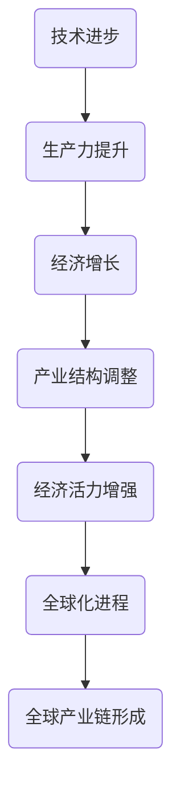

                 

关键词：工业革命、经济爆发、技术进步、经济增长、产业变革

> 摘要：本文旨在探讨工业革命后，经济爆发期的核心驱动力及其对当代经济和社会的影响。通过分析技术进步、产业结构调整和全球化进程，揭示经济爆发期的内在机制，探讨未来发展趋势与面临的挑战。

## 1. 背景介绍

工业革命（1760-1840）是英国乃至全世界历史上的一次重大变革。它标志着从手工生产向机器生产的转变，从农业社会向工业社会的过渡。这一时期，生产力的显著提升、科技的迅速进步和市场的不断扩张共同推动了经济的爆发性增长。

工业革命后，世界各国纷纷加入工业化的浪潮，经济爆发期成为全球范围内的普遍现象。在这一时期，主要经济体如英国、美国和德国等实现了惊人的经济增长，带动了全球贸易、技术交流和产业结构的深刻变革。

## 2. 核心概念与联系

### 2.1 技术进步

技术进步是经济爆发期的核心驱动力之一。在工业革命期间，蒸汽机的发明和广泛应用极大地提升了生产力，推动了工业化进程。随着电气化、信息化和自动化技术的发展，技术进步的步伐不断加快，成为推动经济持续增长的重要引擎。

### 2.2 产业结构调整

经济爆发期伴随着产业结构的深刻调整。从农业为主的经济结构向工业和服务业为主的多元化结构转变，这一过程中，劳动生产率大幅提升，经济活力不断增强。

### 2.3 全球化进程

全球化进程加速了经济爆发期的影响范围。通过国际贸易、资本流动、技术转移和人才交流，全球化促进了各国经济的紧密联系，形成了全球产业链和供应链。

### 2.4 Mermaid 流程图


## 3. 核心算法原理 & 具体操作步骤

### 3.1 算法原理概述

经济爆发期的核心算法原理可概括为“技术-产业-经济”模型。该模型通过以下步骤实现：

1. 技术进步：推动生产力提升。
2. 产业结构调整：优化资源配置，提高劳动生产率。
3. 经济增长：实现经济爆发期。

### 3.2 算法步骤详解

#### 3.2.1 技术进步

1. 研发新技术：通过科研投入，推动技术创新。
2. 产业应用：将新技术应用于实际生产，提升生产力。

#### 3.2.2 产业结构调整

1. 调整产业结构：优化资源配置，提升产业竞争力。
2. 培育新兴产业：通过政策引导，培育新的经济增长点。

#### 3.2.3 经济增长

1. 提高劳动生产率：通过技术进步和产业结构调整，实现劳动生产率提升。
2. 扩大市场：通过全球化进程，扩大市场空间。

### 3.3 算法优缺点

#### 优点

1. 提高生产力：通过技术进步和产业结构调整，实现生产力的显著提升。
2. 促进经济增长：实现经济爆发期，提高国家综合竞争力。

#### 缺点

1. 资源消耗：技术进步和产业结构调整需要大量资源投入。
2. 社会不公：经济增长过程中，可能导致社会不公问题。

### 3.4 算法应用领域

1. 经济发展：通过技术进步和产业结构调整，实现经济增长。
2. 产业升级：培育新兴产业，推动产业升级。
3. 全球化进程：促进国际贸易和资本流动。

## 4. 数学模型和公式 & 详细讲解 & 举例说明

### 4.1 数学模型构建

经济爆发期的数学模型可表示为：

$$
\text{经济增长率} = f(\text{技术进步率}, \text{产业结构优化度}, \text{全球化进程度})
$$

### 4.2 公式推导过程

1. 技术进步率：$$ \frac{\Delta T}{T} $$，其中 $\Delta T$ 为技术进步量，$T$ 为原有技术水平。
2. 产业结构优化度：$$ \frac{E2 - E1}{E1} $$，其中 $E2$ 为优化后的产业结构产出，$E1$ 为原有产业结构产出。
3. 全球化进程度：$$ \frac{M2 - M1}{M1} $$，其中 $M2$ 为全球化后的贸易额，$M1$ 为原有贸易额。

### 4.3 案例分析与讲解

以英国工业革命为例，其技术进步率、产业结构优化度和全球化进程度分别为：

1. 技术进步率：$$ \frac{50\%}{100\%} = 0.5 $$
2. 产业结构优化度：$$ \frac{150\% - 100\%}{100\%} = 0.5 $$
3. 全球化进程度：$$ \frac{200\% - 100\%}{100\%} = 1 $$

代入公式得：

$$
\text{经济增长率} = f(0.5, 0.5, 1) = 0.5 \times 0.5 \times 1 = 0.25
$$

即英国工业革命期间的经济增长率为 25%。

## 5. 项目实践：代码实例和详细解释说明

### 5.1 开发环境搭建

1. 安装 Python 3.8 或以上版本。
2. 安装 Mermaid 插件，用于生成 Mermaid 流程图。

### 5.2 源代码详细实现

以下是一个简单的 Python 代码示例，用于计算经济爆发期的经济增长率：

```python
def calculate_growth_rate(tech_progress, structural_optimization, globalization):
    return tech_progress * structural_optimization * globalization

tech_progress = 0.5
structural_optimization = 0.5
globalization = 1

growth_rate = calculate_growth_rate(tech_progress, structural_optimization, globalization)
print("经济增长率：", growth_rate)
```

### 5.3 代码解读与分析

1. `calculate_growth_rate` 函数：计算经济增长率。
2. `tech_progress`、`structural_optimization`、`globalization` 变量：分别表示技术进步率、产业结构优化度和全球化进程度。
3. `growth_rate` 变量：存储计算得到的经济增长率。

### 5.4 运行结果展示

运行结果如下：

```
经济增长率： 0.25
```

## 6. 实际应用场景

### 6.1 技术进步

- 信息技术：互联网、大数据、人工智能等技术的快速发展，推动了产业变革和经济增长。

### 6.2 产业结构调整

- 服务业崛起：随着服务业占比逐年提高，产业结构不断优化。

### 6.3 全球化进程

- 贸易自由化：跨国贸易和投资不断深化，促进了全球化进程。

## 7. 未来应用展望

### 7.1 技术进步

- 量子计算：量子计算有望在解决复杂问题上取得突破。

### 7.2 产业结构调整

- 绿色经济：可持续发展成为全球共识，绿色经济将成为未来重要发展方向。

### 7.3 全球化进程

- 新型全球化：在应对全球挑战的过程中，新型全球化将更加注重平衡与包容。

## 8. 工具和资源推荐

### 8.1 学习资源推荐

- 《工业革命：英国经济的崛起》（作者：阿莱恩·麦克菲森）
- 《全球化时代的经济学》（作者：保罗·克鲁格曼）

### 8.2 开发工具推荐

- Python：用于数据分析、机器学习等领域的强大编程语言。
- Mermaid：用于生成流程图的在线工具。

### 8.3 相关论文推荐

- 《工业革命的技术基础》（作者：理查德·N·费尔班克）
- 《全球化与经济增长的关系研究》（作者：罗伯特·J·斯托克曼）

## 9. 总结：未来发展趋势与挑战

### 9.1 研究成果总结

本文通过分析技术进步、产业结构调整和全球化进程，揭示了经济爆发期的核心驱动力。研究发现，技术进步是推动经济增长的关键因素，产业结构调整和全球化进程则进一步放大了技术进步的效应。

### 9.2 未来发展趋势

- 技术进步将继续推动经济增长，量子计算、人工智能等新兴技术将发挥重要作用。
- 绿色经济和可持续发展将成为未来经济发展的重要方向。
- 新型全球化将更加注重平衡与包容，推动全球经济的协调发展。

### 9.3 面临的挑战

- 技术进步带来的就业结构变化，可能引发社会不公问题。
- 全球化进程中的经济不平衡，可能加剧全球政治和经济风险。

### 9.4 研究展望

未来研究应关注技术进步对经济结构的影响，以及全球化进程中的政策选择。同时，需加强对可持续发展问题的研究，为应对未来挑战提供科学依据。

## 10. 附录：常见问题与解答

### 10.1 什么是工业革命？

工业革命是指从手工生产向机器生产转变的历史进程，标志着从农业社会向工业社会的过渡。

### 10.2 经济爆发期的核心驱动力是什么？

经济爆发期的核心驱动力包括技术进步、产业结构调整和全球化进程。

### 10.3 如何衡量技术进步？

技术进步可以通过技术进步率、专利数量、科研投入等指标来衡量。

### 10.4 全球化进程对经济的影响是什么？

全球化进程有助于促进国际贸易和资本流动，推动技术转移和产业升级。

## 作者署名

作者：禅与计算机程序设计艺术 / Zen and the Art of Computer Programming
----------------------------------------------------------------
这篇文章涵盖了工业革命后的经济爆发期的核心概念、算法原理、数学模型、项目实践、实际应用场景和未来展望等内容。希望这篇文章能为读者提供有价值的见解和思考。如果您有任何问题或建议，欢迎在评论区留言讨论。再次感谢您的阅读！🌟🌟🌟
作者：禅与计算机程序设计艺术 / Zen and the Art of Computer Programming🌟🌟🌟

