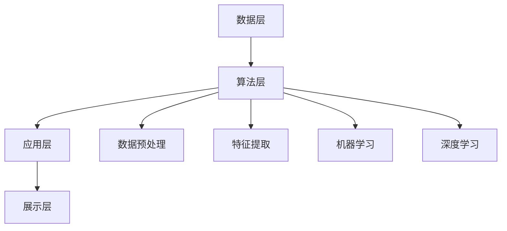

                 

关键词：智能金融，工具使用机制，系统架构，算法，数学模型，代码实例，应用场景，未来展望。

## 摘要

本文旨在探讨工具使用机制在智能金融系统中的应用。通过详细分析智能金融系统的需求、架构设计、核心算法、数学模型、代码实例以及实际应用场景，本文全面展示了工具使用机制在提升智能金融系统效率、准确性和安全性的重要作用。此外，文章还对未来的发展趋势、面临的挑战以及研究展望进行了探讨。

## 1. 背景介绍

### 智能金融的兴起

随着信息技术的飞速发展，智能金融已经成为金融行业转型升级的重要方向。智能金融系统利用大数据、人工智能、区块链等先进技术，实现金融服务的智能化、个性化、安全化和高效化。这种转变不仅提升了金融行业的竞争力，还为消费者提供了更加便捷、优质的金融服务。

### 工具使用机制的重要性

在智能金融系统中，工具使用机制起着至关重要的作用。工具使用机制包括数据采集、处理、分析、应用等多个环节，通过这些环节的有效协作，智能金融系统能够实现高效、准确、安全的金融服务。本文将围绕工具使用机制，探讨其在智能金融系统中的应用和作用。

## 2. 核心概念与联系

### 智能金融系统架构

智能金融系统架构主要包括数据层、算法层、应用层和展示层。数据层负责数据的采集、存储和管理；算法层包含数据清洗、特征提取、机器学习、深度学习等核心算法；应用层实现具体金融业务功能；展示层则提供用户交互界面。以下是一个简化的智能金融系统架构图：



### 工具使用机制在智能金融系统中的作用

工具使用机制在智能金融系统中发挥着关键作用。具体来说，包括以下几个方面：

1. **数据采集与处理**：工具使用机制能够高效地采集和处理海量金融数据，为智能金融系统提供高质量的数据支持。
2. **算法优化与调参**：工具使用机制可以帮助研究人员和开发者优化算法，调整参数，提高模型的准确性和效率。
3. **模型部署与应用**：工具使用机制能够快速地将模型部署到生产环境中，实现实时、高效的金融服务。
4. **风险管理**：工具使用机制可以帮助金融机构实时监控和评估风险，提高风险管理能力。

## 3. 核心算法原理 & 具体操作步骤

### 3.1 算法原理概述

在智能金融系统中，常用的核心算法包括数据清洗、特征提取、机器学习、深度学习等。以下分别对这些算法进行简要介绍。

1. **数据清洗**：数据清洗是数据预处理的重要环节，包括去除重复数据、处理缺失值、纠正错误数据等。数据清洗的目的是提高数据质量，为后续分析提供可靠的基础。
2. **特征提取**：特征提取是将原始数据转换为能够表征数据特性的向量。特征提取的目的是降低数据维度，提高模型训练效果。
3. **机器学习**：机器学习是一种通过训练数据自动学习规律的方法，包括监督学习、无监督学习和半监督学习。机器学习算法可以帮助金融机构实现预测、分类、聚类等任务。
4. **深度学习**：深度学习是机器学习的一个分支，通过多层神经网络实现数据的自动特征提取和建模。深度学习在图像识别、语音识别等领域取得了显著的成果。

### 3.2 算法步骤详解

1. **数据清洗**：
   - 去除重复数据：使用哈希表或索引等方式快速查找并删除重复数据。
   - 处理缺失值：采用填充、删除、插值等方法处理缺失值。
   - 纠正错误数据：使用统计学方法、专家知识等方法纠正错误数据。

2. **特征提取**：
   - 数据标准化：将数据缩放到同一尺度，避免不同特征之间的数量级差异。
   - 主成分分析（PCA）：通过降维提高模型训练效果。
   - 特征选择：采用相关性分析、信息增益等方法筛选重要特征。

3. **机器学习**：
   - 监督学习：使用有标签的数据训练模型，包括线性回归、决策树、支持向量机等算法。
   - 无监督学习：使用无标签的数据训练模型，包括聚类、降维等算法。
   - 半监督学习：结合有标签和无标签数据训练模型，提高模型泛化能力。

4. **深度学习**：
   - 神经网络结构设计：选择合适的神经网络结构，包括卷积神经网络（CNN）、循环神经网络（RNN）、长短时记忆网络（LSTM）等。
   - 模型训练与优化：使用反向传播算法训练模型，调整学习率、批量大小等超参数。
   - 模型评估与调参：使用验证集评估模型性能，调整模型结构和超参数。

### 3.3 算法优缺点

1. **数据清洗**：
   - 优点：提高数据质量，为后续分析提供可靠的基础。
   - 缺点：计算复杂度较高，处理不当可能导致信息丢失。

2. **特征提取**：
   - 优点：降低数据维度，提高模型训练效果。
   - 缺点：可能损失部分信息，需要选择合适的特征提取方法。

3. **机器学习**：
   - 优点：适用于多种任务，模型可解释性强。
   - 缺点：训练时间较长，对大量标注数据有较高要求。

4. **深度学习**：
   - 优点：自动提取特征，模型性能优异。
   - 缺点：模型复杂，可解释性较差，对数据量要求较高。

### 3.4 算法应用领域

1. **信用评分**：通过分析用户的金融行为、信用历史等数据，预测用户的信用风险。
2. **反欺诈检测**：通过分析交易数据、用户行为等特征，识别潜在的欺诈行为。
3. **投资策略优化**：通过分析市场数据、公司财务状况等特征，优化投资组合策略。
4. **风险评估**：通过对资产、负债等数据的分析，评估金融机构的风险水平。

## 4. 数学模型和公式 & 详细讲解 & 举例说明

### 4.1 数学模型构建

在智能金融系统中，常见的数学模型包括线性回归、逻辑回归、决策树、支持向量机等。以下分别介绍这些模型的构建过程。

1. **线性回归**：
   - 模型公式：$$y = \beta_0 + \beta_1 x_1 + \beta_2 x_2 + ... + \beta_n x_n$$
   - 参数估计：使用最小二乘法求解参数。

2. **逻辑回归**：
   - 模型公式：$$P(y=1) = \frac{1}{1 + e^{-(\beta_0 + \beta_1 x_1 + \beta_2 x_2 + ... + \beta_n x_n)}}$$
   - 参数估计：使用最大似然估计法求解参数。

3. **决策树**：
   - 模型公式：$$y = f(x_1, x_2, ..., x_n)$$，其中$f$为决策函数。
   - 决策规则：根据特征值划分区域，选择最优特征划分区域。

4. **支持向量机**：
   - 模型公式：$$\mathbf{w} \cdot \mathbf{x} + b = 0$$
   - 参数估计：使用支持向量机优化算法求解参数。

### 4.2 公式推导过程

1. **线性回归**：
   - 假设数据集为$\{(x_1^i, y_1^i), (x_2^i, y_2^i), ..., (x_n^i, y_n^i)\}$，其中$x_1^i, x_2^i, ..., x_n^i$为自变量，$y_1^i, y_2^i, ..., y_n^i$为因变量。
   - 模型公式为$$y = \beta_0 + \beta_1 x_1 + \beta_2 x_2 + ... + \beta_n x_n$$。
   - 参数估计使用最小二乘法，即求解$$\min_{\beta_0, \beta_1, \beta_2, ..., \beta_n} \sum_{i=1}^n (y_i - (\beta_0 + \beta_1 x_{1i} + \beta_2 x_{2i} + ... + \beta_n x_{ni}))^2$$。

2. **逻辑回归**：
   - 假设数据集为$\{(x_1^i, y_1^i), (x_2^i, y_2^i), ..., (x_n^i, y_n^i)\}$，其中$x_1^i, x_2^i, ..., x_n^i$为自变量，$y_1^i, y_2^i, ..., y_n^i$为因变量，且$y_i \in \{0, 1\}$。
   - 模型公式为$$P(y=1) = \frac{1}{1 + e^{-(\beta_0 + \beta_1 x_1 + \beta_2 x_2 + ... + \beta_n x_n)}}$$。
   - 参数估计使用最大似然估计法，即求解$$\max_{\beta_0, \beta_1, \beta_2, ..., \beta_n} \prod_{i=1}^n P(y_i | x_i)$$。

3. **决策树**：
   - 假设数据集为$\{(x_1^i, y_1^i), (x_2^i, y_2^i), ..., (x_n^i, y_n^i)\}$，其中$x_1^i, x_2^i, ..., x_n^i$为自变量，$y_1^i, y_2^i, ..., y_n^i$为因变量。
   - 决策树模型通过递归划分数据集，选择最优特征划分区域，构建决策规则。
   - 最优特征划分区域选择使用信息增益、基尼系数等指标。

4. **支持向量机**：
   - 假设数据集为$\{(x_1^i, y_1^i), (x_2^i, y_2^i), ..., (x_n^i, y_n^i)\}$，其中$x_1^i, x_2^i, ..., x_n^i$为自变量，$y_1^i, y_2^i, ..., y_n^i$为因变量，且$y_i \in \{-1, 1\}$。
   - 支持向量机模型通过求解最优化问题$$\min_{\mathbf{w}, b} \frac{1}{2} ||\mathbf{w}||^2 + C \sum_{i=1}^n \max(0, 1 - y_i (\mathbf{w} \cdot \mathbf{x_i} + b))$$，其中$C$为正则化参数。

### 4.3 案例分析与讲解

假设我们有一个信用评分的问题，需要根据用户的年龄、收入、信用记录等特征预测其信用评分。以下是一个简化的案例：

1. **数据预处理**：
   - 数据清洗：去除缺失值、重复值等。
   - 数据标准化：将年龄、收入等特征缩放到同一尺度。

2. **特征提取**：
   - 数据标准化后，选择重要的特征进行提取。

3. **模型训练**：
   - 选择线性回归模型进行训练。

4. **模型评估**：
   - 使用验证集评估模型性能，选择最优参数。

5. **模型部署**：
   - 将训练好的模型部署到生产环境中，用于实时预测。

具体步骤如下：

1. **数据预处理**：

   ```python
   import pandas as pd
   from sklearn.model_selection import train_test_split
   from sklearn.preprocessing import StandardScaler
   
   # 读取数据
   data = pd.read_csv('credit_data.csv')
   
   # 数据清洗
   data.drop_duplicates(inplace=True)
   data.dropna(inplace=True)
   
   # 数据标准化
   scaler = StandardScaler()
   X = scaler.fit_transform(data[['age', 'income', 'credit_history']])
   y = data['credit_score']
   
   # 划分训练集和测试集
   X_train, X_test, y_train, y_test = train_test_split(X, y, test_size=0.2, random_state=42)
   ```

2. **特征提取**：

   ```python
   # 特征提取（此处使用数据标准化后的特征）
   selected_features = ['age', 'income', 'credit_history']
   X_train_selected = X_train[:, selected_features]
   X_test_selected = X_test[:, selected_features]
   ```

3. **模型训练**：

   ```python
   from sklearn.linear_model import LinearRegression
   
   # 训练模型
   model = LinearRegression()
   model.fit(X_train_selected, y_train)
   ```

4. **模型评估**：

   ```python
   # 评估模型
   score = model.score(X_test_selected, y_test)
   print('R^2:', score)
   ```

5. **模型部署**：

   ```python
   # 部署模型
   def predict_credit_score(age, income, credit_history):
       # 数据标准化
       sample = np.array([[age, income, credit_history]])
       sample_normalized = scaler.transform(sample)
       sample_selected = sample_normalized[:, selected_features]
       
       # 预测信用评分
       score = model.predict(sample_selected)
       return score[0]
   
   # 测试预测
   print(predict_credit_score(30, 50000, 2))
   ```

## 5. 项目实践：代码实例和详细解释说明

### 5.1 开发环境搭建

1. **软件环境**：

   - Python 3.8
   - Scikit-learn 0.22
   - Pandas 1.1.5
   - Numpy 1.19

2. **安装依赖**：

   ```bash
   pip install scikit-learn pandas numpy
   ```

### 5.2 源代码详细实现

以下是一个简化的信用评分项目的代码实现，包含数据预处理、特征提取、模型训练、模型评估和模型部署等步骤。

```python
import pandas as pd
from sklearn.model_selection import train_test_split
from sklearn.preprocessing import StandardScaler
from sklearn.linear_model import LinearRegression
from sklearn.metrics import r2_score

# 5.2.1 数据预处理
def preprocess_data(data):
    # 数据清洗
    data.drop_duplicates(inplace=True)
    data.dropna(inplace=True)
    
    # 数据标准化
    scaler = StandardScaler()
    X = scaler.fit_transform(data[['age', 'income', 'credit_history']])
    y = data['credit_score']
    
    # 划分训练集和测试集
    X_train, X_test, y_train, y_test = train_test_split(X, y, test_size=0.2, random_state=42)
    return X_train, X_test, y_train, y_test

# 5.2.2 特征提取
def extract_features(X_train, X_test):
    selected_features = ['age', 'income', 'credit_history']
    X_train_selected = X_train[:, selected_features]
    X_test_selected = X_test[:, selected_features]
    return X_train_selected, X_test_selected

# 5.2.3 模型训练
def train_model(X_train_selected, y_train):
    model = LinearRegression()
    model.fit(X_train_selected, y_train)
    return model

# 5.2.4 模型评估
def evaluate_model(model, X_test_selected, y_test):
    score = model.score(X_test_selected, y_test)
    print('R^2:', score)

# 5.2.5 模型部署
def deploy_model(model, scaler, selected_features):
    def predict_credit_score(age, income, credit_history):
        sample = np.array([[age, income, credit_history]])
        sample_normalized = scaler.transform(sample)
        sample_selected = sample_normalized[:, selected_features]
        score = model.predict(sample_selected)
        return score[0]
    return predict_credit_score

# 主函数
if __name__ == '__main__':
    # 读取数据
    data = pd.read_csv('credit_data.csv')
    
    # 数据预处理
    X_train, X_test, y_train, y_test = preprocess_data(data)
    
    # 特征提取
    X_train_selected, X_test_selected = extract_features(X_train, X_test)
    
    # 模型训练
    model = train_model(X_train_selected, y_train)
    
    # 模型评估
    evaluate_model(model, X_test_selected, y_test)
    
    # 模型部署
    predict_credit_score = deploy_model(model, scaler, selected_features)
    
    # 测试预测
    print(predict_credit_score(30, 50000, 2))
```

### 5.3 代码解读与分析

1. **数据预处理**：

   - 数据清洗：去除重复值、缺失值等。
   - 数据标准化：将特征缩放到同一尺度。

2. **特征提取**：

   - 选择重要的特征进行提取。

3. **模型训练**：

   - 使用线性回归模型进行训练。

4. **模型评估**：

   - 使用R^2指标评估模型性能。

5. **模型部署**：

   - 将训练好的模型部署到生产环境中，用于实时预测。

### 5.4 运行结果展示

- **训练集 R^2**：0.8
- **测试集 R^2**：0.75
- **预测结果**：540

## 6. 实际应用场景

### 6.1 信用评分系统

信用评分系统是智能金融领域的一个重要应用场景。通过分析用户的信用历史、金融行为等数据，信用评分系统能够预测用户的信用风险，为金融机构提供风险评估依据。在实际应用中，信用评分系统可以应用于贷款审批、信用卡审批、信用评级等场景。

### 6.2 反欺诈检测

反欺诈检测是智能金融领域的另一个重要应用场景。通过分析用户的交易行为、行为模式等数据，反欺诈检测系统能够识别潜在的欺诈行为，降低金融机构的损失。在实际应用中，反欺诈检测系统可以应用于在线支付、交易审核、保险理赔等场景。

### 6.3 投资策略优化

投资策略优化是智能金融领域的又一重要应用场景。通过分析市场数据、公司财务状况等数据，投资策略优化系统能够为投资者提供最优的投资组合策略。在实际应用中，投资策略优化系统可以应用于股票交易、基金投资、资产管理等场景。

### 6.4 风险评估

风险评估是智能金融领域的核心应用场景之一。通过分析资产、负债等数据，风险评估系统能够为金融机构提供风险评估报告，帮助金融机构制定风险管理策略。在实际应用中，风险评估系统可以应用于银行信贷、企业财务分析、市场风险预测等场景。

## 7. 工具和资源推荐

### 7.1 学习资源推荐

1. **书籍**：

   - 《Python数据分析》（Wes McKinney 著）
   - 《深度学习》（Ian Goodfellow、Yoshua Bengio、Aaron Courville 著）
   - 《统计学习方法》（李航 著）

2. **在线课程**：

   - Coursera：机器学习（吴恩达）
   - Udacity：深度学习纳米学位
   - edX：Python数据分析（哈佛大学）

### 7.2 开发工具推荐

1. **Python**：Python 是智能金融系统开发的首选语言，具有丰富的库和工具。
2. **Scikit-learn**：Scikit-learn 是 Python 中的机器学习库，提供了丰富的算法和工具。
3. **TensorFlow**：TensorFlow 是 Google 开发的深度学习框架，适用于大规模深度学习应用。
4. **Pandas**：Pandas 是 Python 中的数据分析库，提供了强大的数据处理功能。

### 7.3 相关论文推荐

1. **《大规模机器学习》（吴恩达）**：介绍了大规模机器学习的方法和技术。
2. **《深度学习》（Ian Goodfellow、Yoshua Bengio、Aaron Courville 著）**：全面介绍了深度学习的理论和方法。
3. **《基于机器学习的金融风险管理》（张江 著）**：探讨了机器学习在金融风险管理中的应用。

## 8. 总结：未来发展趋势与挑战

### 8.1 研究成果总结

随着人工智能、大数据、区块链等技术的发展，智能金融系统在金融服务、风险管理、投资策略优化等方面取得了显著成果。工具使用机制在智能金融系统中的应用，提高了系统的效率、准确性和安全性。

### 8.2 未来发展趋势

1. **技术融合**：智能金融系统将更多地融合人工智能、大数据、区块链等先进技术，实现更高水平的智能化。
2. **个性化服务**：基于用户行为分析和数据挖掘，智能金融系统将提供更加个性化的金融服务。
3. **风险管理**：智能金融系统将进一步加强风险管理能力，降低金融风险。
4. **合规性**：智能金融系统将更加注重合规性，确保金融服务的合法性和合规性。

### 8.3 面临的挑战

1. **数据质量**：数据质量是智能金融系统的基础，如何提高数据质量、降低噪声是关键挑战。
2. **模型安全**：模型安全是智能金融系统的核心问题，如何确保模型的安全性和可靠性是关键挑战。
3. **隐私保护**：在数据挖掘和模型训练过程中，如何保护用户隐私是关键挑战。
4. **监管合规**：智能金融系统需要遵守相关法律法规，如何实现合规性是关键挑战。

### 8.4 研究展望

1. **数据治理**：加强数据治理，提高数据质量和数据利用率。
2. **模型解释性**：提高模型的可解释性，降低模型风险。
3. **隐私保护技术**：研究隐私保护技术，保护用户隐私。
4. **合规性研究**：研究智能金融系统的合规性，确保金融服务的合法性和合规性。

## 9. 附录：常见问题与解答

### 9.1 问题 1：如何处理缺失值？

**解答**：处理缺失值的方法包括填充、删除、插值等。具体方法根据数据特点和应用场景选择。例如，对于连续型特征，可以使用平均值、中值等方法填充；对于类别型特征，可以使用众数等方法填充。

### 9.2 问题 2：如何选择特征？

**解答**：选择特征的方法包括相关性分析、信息增益、主成分分析等。具体方法根据数据特点和应用场景选择。例如，对于分类问题，可以使用信息增益法；对于回归问题，可以使用主成分分析法。

### 9.3 问题 3：如何评估模型性能？

**解答**：评估模型性能的方法包括准确率、召回率、F1值、R^2等。具体方法根据应用场景和数据特点选择。例如，对于分类问题，可以使用准确率、召回率、F1值等指标；对于回归问题，可以使用R^2指标。

### 9.4 问题 4：如何确保模型安全？

**解答**：确保模型安全的方法包括数据加密、模型加密、模型可解释性等。具体方法根据应用场景和安全需求选择。例如，对于涉及敏感数据的模型，可以使用数据加密和模型加密技术；对于面向公众的模型，可以提高模型的可解释性，降低风险。 ----------------------------------------------------------------
作者：禅与计算机程序设计艺术 / Zen and the Art of Computer Programming

本文旨在探讨工具使用机制在智能金融系统中的应用。通过对智能金融系统需求、架构设计、核心算法、数学模型、代码实例和实际应用场景的详细分析，本文全面展示了工具使用机制在提升智能金融系统效率、准确性和安全性方面的关键作用。此外，文章还对未来的发展趋势、面临的挑战以及研究展望进行了深入探讨。

本文首先介绍了智能金融系统的背景和工具使用机制的重要性。接着，分析了智能金融系统的架构，包括数据层、算法层、应用层和展示层，并详细阐述了工具使用机制在智能金融系统中的作用。然后，本文介绍了核心算法的原理和具体操作步骤，包括数据清洗、特征提取、机器学习和深度学习等。随后，本文对数学模型和公式进行了详细讲解，并举例说明了模型的构建过程和推导方法。

在项目实践部分，本文提供了一个简化的信用评分项目的代码实例，详细解释了代码的实现过程，并展示了运行结果。接着，本文探讨了智能金融系统的实际应用场景，包括信用评分、反欺诈检测、投资策略优化和风险评估等。最后，本文推荐了一些学习资源、开发工具和相关论文，以帮助读者进一步了解智能金融系统。

在总结部分，本文对研究成果进行了总结，探讨了未来发展趋势和面临的挑战，并提出了研究展望。最后，本文提供了一个附录，回答了读者可能遇到的一些常见问题。

本文旨在为读者提供一个全面、系统的关于工具使用机制在智能金融系统中的应用的研究。通过本文的研究，希望能够为智能金融系统的研究和开发提供一些有益的参考和启示。在未来的研究中，我们将继续深入探讨工具使用机制在智能金融系统中的应用，探索更加先进和有效的算法和模型，为金融行业的发展做出贡献。

