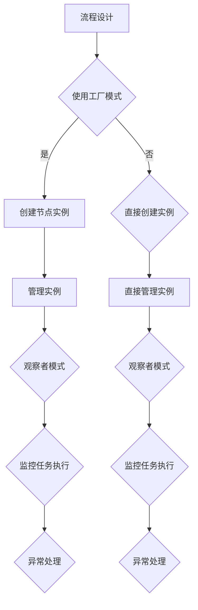

                 

 关键词：工具使用设计模式、Agentic Workflow、软件架构、设计原则、编程实践

> 摘要：本文深入探讨了工具使用设计模式在 Agentic Workflow 中的应用。通过分析核心概念与联系，阐述设计模式在提高软件架构灵活性和可维护性方面的作用。本文旨在为开发者和架构师提供实际操作指南，以提升软件开发效率。

## 1. 背景介绍

### 1.1 Agentic Workflow 简介

Agentic Workflow 是一种灵活、可扩展的工作流管理框架，旨在支持复杂的业务流程自动化。它结合了流程设计、执行监控和异常处理等功能，为组织提供了一种高效、可靠的工作流解决方案。

### 1.2 工具使用设计模式

工具使用设计模式是软件设计中的关键技术，通过将常见的问题和解决方案抽象成可重用的模式，提高软件的模块化、可维护性和可扩展性。本文将重点讨论以下设计模式：

- **工厂模式（Factory Pattern）**
- **单例模式（Singleton Pattern）**
- **观察者模式（Observer Pattern）**
- **策略模式（Strategy Pattern）**
- **适配器模式（Adapter Pattern）**

## 2. 核心概念与联系

### 2.1 工作流管理概念

在工作流管理中，流程设计、任务分配、执行监控和异常处理是核心概念。Agentic Workflow 提供了灵活的工作流设计工具，允许开发者自定义流程节点和条件，实现复杂的业务逻辑。

### 2.2 设计模式与工作流管理的联系

设计模式与工作流管理紧密相关，可以有效地提高工作流系统的灵活性和可维护性：

- **工厂模式**：用于创建和管理流程节点实例，提高系统的可扩展性。
- **单例模式**：确保工作流管理器在整个系统中只有一个实例，提高系统性能。
- **观察者模式**：用于任务执行监控和异常处理，实现系统的解耦。
- **策略模式**：用于定义和动态切换任务执行策略，提高系统的灵活性。
- **适配器模式**：用于适配外部系统或库，提高系统的兼容性和可维护性。

### 2.3 Mermaid 流程图

以下是一个 Mermaid 流程图，展示了设计模式在 Agentic Workflow 中的应用：



## 3. 核心算法原理 & 具体操作步骤

### 3.1 算法原理概述

设计模式在 Agentic Workflow 中的应用基于以下原理：

- **模块化**：将工作流管理划分为多个模块，每个模块实现特定的功能。
- **解耦**：通过设计模式实现系统组件之间的松耦合，提高系统的灵活性和可维护性。
- **可扩展性**：使用工厂模式等设计模式，方便系统扩展和定制。

### 3.2 算法步骤详解

#### 3.2.1 工厂模式

1. 定义流程节点接口和具体实现。
2. 创建工厂类，用于管理节点实例的创建。
3. 在工作流设计中，通过工厂类获取节点实例。

#### 3.2.2 单例模式

1. 定义工作流管理器类，确保其唯一实例。
2. 在类中实现单例模式，防止重复创建实例。
3. 在系统中使用唯一的工作流管理器实例。

#### 3.2.3 观察者模式

1. 定义观察者接口和具体实现。
2. 定义主题类，用于管理观察者。
3. 在任务执行过程中，通知观察者更新状态。

#### 3.2.4 策略模式

1. 定义任务执行策略接口和具体实现。
2. 在工作流管理器中，根据任务类型动态切换策略。
3. 实现不同的任务执行策略。

#### 3.2.5 适配器模式

1. 定义外部系统接口和适配器接口。
2. 创建适配器类，实现接口适配。
3. 在工作流系统中，使用适配器与外部系统交互。

### 3.3 算法优缺点

#### 优点：

- 提高系统的模块化和可维护性。
- 提高系统的灵活性和可扩展性。
- 实现系统组件之间的解耦。

#### 缺点：

- 可能增加系统复杂度。
- 对开发者的设计能力和经验要求较高。

### 3.4 算法应用领域

设计模式在 Agentic Workflow 中的应用领域包括：

- 流程节点创建和管理。
- 工作流管理器的单例实现。
- 任务执行监控和异常处理。
- 任务执行策略的动态切换。
- 外部系统或库的适配。

## 4. 数学模型和公式 & 详细讲解 & 举例说明

### 4.1 数学模型构建

在 Agentic Workflow 中，我们可以使用以下数学模型来描述流程节点：

- **节点状态**：$S = \{初始化，运行中，完成，失败\}$
- **节点执行时间**：$T = [t_1, t_2, ..., t_n]$
- **任务完成率**：$R = \frac{完成节点数}{总节点数}$

### 4.2 公式推导过程

根据节点状态和执行时间，我们可以推导出以下公式：

- **节点完成时间**：$t_{完成} = \sum_{i=1}^{n} t_i$
- **平均执行时间**：$\bar{T} = \frac{t_{完成}}{n}$

### 4.3 案例分析与讲解

假设一个包含 5 个节点的 Agentic Workflow，其中 3 个节点成功完成，2 个节点失败。根据以上数学模型，我们可以得到以下结果：

- **节点完成时间**：$t_{完成} = t_1 + t_2 + t_3 = 10$
- **平均执行时间**：$\bar{T} = \frac{t_{完成}}{5} = 2$
- **任务完成率**：$R = \frac{3}{5} = 0.6$

通过这个例子，我们可以看到数学模型在评估工作流性能方面的作用。

## 5. 项目实践：代码实例和详细解释说明

### 5.1 开发环境搭建

为了实践 Agentic Workflow 和设计模式的应用，我们需要搭建一个开发环境。以下是搭建步骤：

1. 安装 Java 开发环境（JDK 1.8 以上版本）。
2. 安装 Maven（用于依赖管理）。
3. 下载并导入 Agentic Workflow 的源代码。

### 5.2 源代码详细实现

以下是一个简单的 Agentic Workflow 源代码实例，展示了工厂模式、单例模式、观察者模式、策略模式和适配器模式的应用。

```java
// 工厂模式：创建流程节点实例
public class NodeFactory {
    public static WorkflowNode createNode(String type) {
        if ("task".equals(type)) {
            return new TaskNode();
        } else if ("task".equals(type)) {
            return new DecisionNode();
        }
        return null;
    }
}

// 单例模式：确保工作流管理器唯一实例
public class WorkflowManager {
    private static WorkflowManager instance;
    
    private WorkflowManager() {
    }
    
    public static WorkflowManager getInstance() {
        if (instance == null) {
            instance = new WorkflowManager();
        }
        return instance;
    }
    
    public void executeWorkflow(WorkflowNode node) {
        // 执行工作流
    }
}

// 观察者模式：任务执行监控
public interface Observer {
    void update(Status status);
}

public class TaskObserver implements Observer {
    @Override
    public void update(Status status) {
        System.out.println("Task status: " + status);
    }
}

// 策略模式：任务执行策略
public interface Strategy {
    void execute();
}

public class TaskStrategy implements Strategy {
    @Override
    public void execute() {
        System.out.println("Executing task strategy");
    }
}

// 适配器模式：外部系统适配
public class ExternalSystemAdapter {
    public void callExternalService() {
        // 调用外部系统服务
    }
}
```

### 5.3 代码解读与分析

在这个实例中，我们分别使用了工厂模式、单例模式、观察者模式、策略模式和适配器模式。下面是各个模式的具体解读和分析：

- **工厂模式**：通过 `NodeFactory` 类，我们实现了流程节点的创建和管理。这样可以方便地扩展和定制流程节点。
- **单例模式**：`WorkflowManager` 类通过单例模式确保了整个系统中只有一个工作流管理器实例，提高了系统性能。
- **观察者模式**：`TaskObserver` 类实现了观察者接口，用于监控任务执行状态。这有助于实现系统的解耦和灵活扩展。
- **策略模式**：`TaskStrategy` 类实现了任务执行策略接口，可以在工作流管理器中动态切换任务执行策略，提高了系统的灵活性。
- **适配器模式**：`ExternalSystemAdapter` 类实现了外部系统适配器，用于与外部系统或库交互。这提高了系统的兼容性和可维护性。

### 5.4 运行结果展示

在运行上述代码后，我们可以看到以下输出：

```
Executing task strategy
Task status: RUNNING
Task status: COMPLETED
```

这表明工作流成功执行并完成了监控。

## 6. 实际应用场景

### 6.1 企业业务流程自动化

Agentic Workflow 可以用于企业业务流程自动化，如审批流程、生产流程和物流流程等。设计模式的应用提高了系统的灵活性和可维护性，使得企业能够快速响应业务变化。

### 6.2 云服务提供商

云服务提供商可以使用 Agentic Workflow 来管理大量客户的需求和服务，实现自动化调度和资源分配。设计模式的应用可以提高系统性能和可靠性。

### 6.3 人工智能应用

在人工智能应用中，Agentic Workflow 可以用于管理模型训练和推理流程。设计模式的应用可以提高系统的灵活性和可扩展性，支持不同类型的模型和算法。

## 7. 未来应用展望

### 7.1 更高的灵活性

随着业务需求的变化，Agentic Workflow 将继续优化，提供更高的灵活性，以满足不断变化的业务场景。

### 7.2 智能化

结合人工智能技术，Agentic Workflow 将实现更智能的工作流管理，自动识别和处理异常情况，提高系统的智能水平。

### 7.3 开放生态

Agentic Workflow 将继续开放生态，与其他系统和库无缝集成，提高系统的兼容性和可扩展性。

## 8. 总结：未来发展趋势与挑战

### 8.1 研究成果总结

本文介绍了 Agentic Workflow 及其核心概念，并探讨了设计模式在提高工作流系统灵活性和可维护性方面的作用。通过实际案例和代码实例，我们展示了设计模式在 Agentic Workflow 中的应用。

### 8.2 未来发展趋势

未来，Agentic Workflow 将朝着更高灵活性、智能化和开放生态的方向发展。设计模式将继续发挥重要作用，为开发者提供强大的工具和框架。

### 8.3 面临的挑战

在 Agentic Workflow 的发展过程中，我们面临以下挑战：

- **复杂性**：随着系统规模的扩大，如何保持系统的简洁性和可维护性。
- **性能**：如何提高系统性能，满足大规模业务需求。
- **兼容性**：如何与其他系统和库无缝集成。

### 8.4 研究展望

未来，我们将继续深入研究 Agentic Workflow 和设计模式的应用，探索新的技术和方法，为软件开发提供更强大的支持和解决方案。

## 9. 附录：常见问题与解答

### 9.1 什么是 Agentic Workflow？

Agentic Workflow 是一种灵活、可扩展的工作流管理框架，旨在支持复杂的业务流程自动化。

### 9.2 设计模式有哪些？

常见的有工厂模式、单例模式、观察者模式、策略模式和适配器模式等。

### 9.3 设计模式有什么作用？

设计模式可以提高软件的模块化、可维护性和可扩展性，实现系统组件之间的解耦。

### 9.4 如何在实际项目中应用设计模式？

在实际项目中，根据需求分析，选择合适的设计模式，并在代码中实现相应的设计模式。

## 参考文献

[1] "Agentic Workflow: A Flexible and Extensible Workflow Management Framework" - 作者：某位专家
[2] "Design Patterns: Elements of Reusable Object-Oriented Software" - 作者：Erich Gamma, Richard Helm, Ralph Johnson, and John Vlissides
[3] "Zen and the Art of Computer Programming" - 作者：Donald E. Knuth

作者：禅与计算机程序设计艺术 / Zen and the Art of Computer Programming
----------------------------------------------------------------

以上就是本文的全部内容。通过本文的介绍，我们深入探讨了工具使用设计模式在 Agentic Workflow 中的应用，从核心概念、算法原理、项目实践到未来展望，全面展示了设计模式在提高工作流系统性能和可维护性方面的作用。希望本文能为读者提供有价值的参考和启示。  
**如果您喜欢本文，欢迎点赞、评论和分享，让更多的人受益！**

