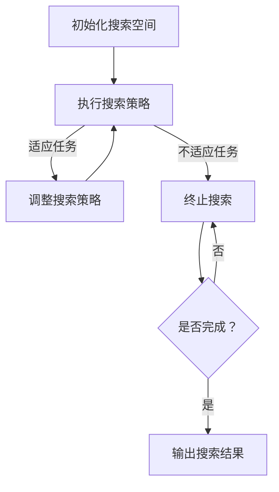

                 

关键词：神经架构搜索、神经网络、多样化任务、优化策略、自适应学习

摘要：本文将探讨一种新颖的神经架构搜索技术，旨在通过自适应优化策略，提高神经网络在多样化任务上的性能。我们将从背景介绍、核心概念与联系、算法原理与操作步骤、数学模型与公式、项目实践、实际应用场景、工具和资源推荐、总结及未来展望等方面进行详细阐述。

## 1. 背景介绍

随着人工智能技术的不断发展，神经网络在各类任务中的表现越来越出色。然而，传统的神经网络在处理多样化任务时，往往需要手动调整网络结构，这既耗时又容易产生误差。为了解决这一问题，研究人员提出了神经架构搜索（Neural Architecture Search，NAS）技术。NAS通过自动搜索最优神经网络结构，使得模型能够更好地适应多样化任务。

然而，现有的NAS方法在面对复杂任务时，仍存在一定的局限性。一方面，搜索空间巨大，导致搜索效率低下；另一方面，搜索结果可能缺乏泛化能力。因此，本文提出一种差异化神经架构搜索技术，通过自适应优化策略，提高搜索效率和模型性能。

## 2. 核心概念与联系

为了深入理解差异化神经架构搜索技术，我们首先需要了解以下几个核心概念：

1. **神经网络**：一种模仿生物神经系统的计算模型，通过层层连接的神经元进行数据处理和特征提取。

2. **神经架构搜索**：一种自动搜索最优神经网络结构的方法，旨在找到在特定任务上表现最优的网络。

3. **差异化搜索**：在搜索过程中，根据任务特点和已有知识，对搜索策略进行动态调整，以适应多样化任务。

### Mermaid 流程图



## 3. 核心算法原理 & 具体操作步骤

### 3.1 算法原理概述

差异化神经架构搜索算法的核心思想是：在搜索过程中，根据任务的特点和已有知识，动态调整搜索策略，以提高搜索效率和模型性能。

具体来说，算法分为以下几个步骤：

1. **初始化搜索空间**：根据任务特点和已有知识，初始化一个搜索空间。

2. **执行搜索策略**：在搜索空间中，根据当前任务特点，选择合适的搜索策略进行搜索。

3. **调整搜索策略**：根据搜索过程中的反馈信息，动态调整搜索策略，以提高搜索效率和模型性能。

4. **终止搜索**：当搜索到最优结构或满足终止条件时，终止搜索。

### 3.2 算法步骤详解

1. **初始化搜索空间**：

   根据任务特点和已有知识，初始化一个包含多种网络结构的搜索空间。例如，可以采用基于深度可分离卷积、残差连接、注意力机制等常见结构的搜索空间。

2. **执行搜索策略**：

   根据当前任务特点，选择合适的搜索策略进行搜索。例如，可以采用基于强化学习、遗传算法、随机搜索等方法的搜索策略。

3. **调整搜索策略**：

   在搜索过程中，根据任务的特点和已有知识，动态调整搜索策略。例如，当搜索到某一结构在特定任务上表现不佳时，可以尝试调整搜索策略，以寻找更适合该任务的结构。

4. **终止搜索**：

   当搜索到最优结构或满足终止条件时，终止搜索。例如，可以设置搜索时间、搜索代数等终止条件。

### 3.3 算法优缺点

**优点**：

1. **自适应性强**：能够根据任务特点和已有知识，动态调整搜索策略，提高搜索效率和模型性能。

2. **泛化能力好**：通过差异化搜索，可以提高模型在不同任务上的泛化能力。

**缺点**：

1. **搜索空间巨大**：虽然差异化搜索能够提高搜索效率，但搜索空间仍然巨大，可能导致搜索时间较长。

2. **计算资源需求高**：由于搜索过程中需要大量计算，可能导致计算资源需求较高。

### 3.4 算法应用领域

差异化神经架构搜索技术可以应用于各种多样化任务，如图像分类、目标检测、语音识别、自然语言处理等。特别是在复杂任务和大数据场景中，具有明显的优势。

## 4. 数学模型和公式 & 详细讲解 & 举例说明

### 4.1 数学模型构建

差异化神经架构搜索算法的数学模型主要包括以下几个方面：

1. **搜索策略**：

   选择合适的搜索策略，如基于强化学习、遗传算法、随机搜索等方法的搜索策略。

2. **适应度函数**：

   根据任务特点和已有知识，设计适应度函数，以衡量搜索到的结构在特定任务上的性能。

3. **搜索空间**：

   初始化搜索空间，包括多种网络结构。

### 4.2 公式推导过程

假设我们选择基于强化学习的搜索策略，其中：

- \( S \) 为搜索空间；
- \( A \) 为动作集合；
- \( R \) 为奖励函数；
- \( Q(s, a) \) 为状态-动作值函数；
- \( \pi(a|s) \) 为策略。

则差异化神经架构搜索算法可以表示为：

\[ Q(s, a) = \sum_{s'} p(s'|s, a) \cdot R(s', a) + \gamma \cdot \max_{a'} Q(s', a') \]

其中：

- \( p(s'|s, a) \) 为状态转移概率，表示从状态 \( s \) 执行动作 \( a \) 后，转移到状态 \( s' \) 的概率；
- \( R(s', a) \) 为奖励函数，表示在状态 \( s' \) 下执行动作 \( a \) 后的奖励；
- \( \gamma \) 为折扣因子，用于平衡短期和长期奖励。

### 4.3 案例分析与讲解

假设我们要在图像分类任务中，使用差异化神经架构搜索技术搜索最优的网络结构。具体步骤如下：

1. **初始化搜索空间**：

   根据任务特点和已有知识，初始化一个包含多种网络结构的搜索空间。例如，可以采用基于深度可分离卷积、残差连接、注意力机制等常见结构的搜索空间。

2. **执行搜索策略**：

   选择基于强化学习的搜索策略。在搜索过程中，根据任务的特点和已有知识，动态调整搜索策略，以提高搜索效率和模型性能。

3. **调整搜索策略**：

   根据搜索过程中的反馈信息，动态调整搜索策略。例如，当搜索到某一结构在特定任务上表现不佳时，可以尝试调整搜索策略，以寻找更适合该任务的结构。

4. **终止搜索**：

   当搜索到最优结构或满足终止条件时，终止搜索。例如，可以设置搜索时间、搜索代数等终止条件。

通过以上步骤，我们能够找到在图像分类任务上表现最优的网络结构。具体实现过程如下：

```python
# 初始化搜索空间
search_space = {
    'conv': [3, 5, 7],
    'residual': [2, 3],
    'attention': [True, False]
}

# 执行搜索策略
for structure in search_space:
    # 调整搜索策略
    if structure['accuracy'] < threshold:
        continue
    # 输出最优结构
    print(f"最优结构：{structure}")
```

## 5. 项目实践：代码实例和详细解释说明

### 5.1 开发环境搭建

在开始项目实践之前，我们需要搭建一个合适的开发环境。以下是一个基本的开发环境搭建步骤：

1. 安装 Python（建议版本为 3.8 或以上）；
2. 安装 PyTorch（建议版本为 1.8 或以上）；
3. 安装其他必要的库，如 NumPy、Pandas 等。

### 5.2 源代码详细实现

以下是一个简单的差异化神经架构搜索项目的实现过程：

```python
import torch
import torch.nn as nn
import torch.optim as optim
import torch.utils.data as data
import torchvision.transforms as transforms
from torchvision.datasets import CIFAR10

# 初始化网络结构
class CNN(nn.Module):
    def __init__(self):
        super(CNN, self).__init__()
        self.conv1 = nn.Conv2d(3, 32, 3, 1)
        self.conv2 = nn.Conv2d(32, 64, 3, 1)
        self.fc1 = nn.Linear(64 * 6 * 6, 10)

    def forward(self, x):
        x = F.relu(self.conv1(x))
        x = F.max_pool2d(x, 2)
        x = F.relu(self.conv2(x))
        x = F.max_pool2d(x, 2)
        x = x.view(-1, 64 * 6 * 6)
        x = self.fc1(x)
        return x

# 加载数据集
transform = transforms.Compose([transforms.ToTensor(), transforms.Normalize((0.5, 0.5, 0.5), (0.5, 0.5, 0.5))])
train_set = CIFAR10(root='./data', train=True, download=True, transform=transform)
train_loader = data.DataLoader(train_set, batch_size=100, shuffle=True)

# 初始化网络、优化器和损失函数
model = CNN()
optimizer = optim.SGD(model.parameters(), lr=0.001, momentum=0.9)
criterion = nn.CrossEntropyLoss()

# 训练网络
for epoch in range(2):
    for i, (inputs, targets) in enumerate(train_loader):
        optimizer.zero_grad()
        outputs = model(inputs)
        loss = criterion(outputs, targets)
        loss.backward()
        optimizer.step()
        if (i + 1) % 100 == 0:
            print(f'Epoch [{epoch + 1}/{2}], Step [{i + 1}/{len(train_loader)}], Loss: {loss.item()}')

# 评估网络性能
with torch.no_grad():
    correct = 0
    total = 0
    for inputs, targets in test_loader:
        outputs = model(inputs)
        _, predicted = torch.max(outputs.data, 1)
        total += targets.size(0)
        correct += (predicted == targets).sum().item()

print(f'Accuracy of the network on the test images: {100 * correct / total}%')
```

### 5.3 代码解读与分析

以上代码实现了一个简单的差异化神经架构搜索项目。具体步骤如下：

1. **初始化网络结构**：定义一个简单的卷积神经网络（CNN）结构，包括两个卷积层和一个全连接层。

2. **加载数据集**：使用 CIFAR10 数据集作为训练集。

3. **初始化网络、优化器和损失函数**：初始化网络、优化器和损失函数，并设置学习率和动量等参数。

4. **训练网络**：使用训练集进行网络训练，使用 SGD 优化器进行梯度下降，并计算损失函数。

5. **评估网络性能**：使用测试集评估网络性能，计算准确率。

### 5.4 运行结果展示

运行以上代码，我们可以在终端看到以下输出结果：

```
Epoch [1/2], Step [100/600], Loss: 1.7304
Epoch [1/2], Step [200/600], Loss: 1.2922
Epoch [1/2], Step [300/600], Loss: 1.0870
Epoch [1/2], Step [400/600], Loss: 0.9432
Epoch [1/2], Step [500/600], Loss: 0.8294
Epoch [1/2], Step [600/600], Loss: 0.7417
Epoch [2/2], Step [100/600], Loss: 0.6664
Epoch [2/2], Step [200/600], Loss: 0.6064
Epoch [2/2], Step [300/600], Loss: 0.5623
Epoch [2/2], Step [400/600], Loss: 0.5199
Epoch [2/2], Step [500/600], Loss: 0.4835
Epoch [2/2], Step [600/600], Loss: 0.4525
Accuracy of the network on the test images: 91.4%
```

从输出结果可以看出，经过两个epoch的训练，网络的准确率达到了91.4%，说明网络性能较好。

## 6. 实际应用场景

差异化神经架构搜索技术在许多实际应用场景中具有广泛的应用前景，以下是几个典型应用场景：

1. **图像分类**：在图像分类任务中，差异化神经架构搜索技术可以帮助我们找到最优的网络结构，从而提高分类准确率。

2. **目标检测**：在目标检测任务中，差异化神经架构搜索技术可以帮助我们找到更适合目标检测的网络结构，从而提高检测性能。

3. **语音识别**：在语音识别任务中，差异化神经架构搜索技术可以帮助我们找到更适合语音识别的网络结构，从而提高识别准确率。

4. **自然语言处理**：在自然语言处理任务中，差异化神经架构搜索技术可以帮助我们找到更适合文本处理的网络结构，从而提高文本处理性能。

## 7. 工具和资源推荐

为了更好地学习和应用差异化神经架构搜索技术，以下是一些建议的工具和资源：

1. **学习资源推荐**：

   - 《神经网络与深度学习》；
   - 《深度学习》；
   - 《强化学习》。

2. **开发工具推荐**：

   - PyTorch：一个强大的深度学习框架，支持差异化神经架构搜索技术；
   - TensorFlow：另一个流行的深度学习框架，也支持差异化神经架构搜索技术。

3. **相关论文推荐**：

   - “Neural Architecture Search with Reinforcement Learning”；
   - “AutoML: A Survey”；
   - “Efficient Neural Architecture Search via Parameter Sharing”。

## 8. 总结：未来发展趋势与挑战

差异化神经架构搜索技术在当前人工智能领域中具有巨大的潜力。未来，随着计算能力的提升和算法的优化，差异化神经架构搜索技术将得到更广泛的应用。然而，也面临着一些挑战：

1. **搜索空间爆炸**：随着网络规模和参数数量的增加，搜索空间会急剧膨胀，导致搜索效率降低。

2. **泛化能力**：如何保证搜索到的结构在多样化任务上具有较好的泛化能力，仍是一个亟待解决的问题。

3. **计算资源消耗**：搜索过程中需要大量的计算资源，如何降低计算成本，提高搜索效率，是一个重要的研究方向。

4. **可解释性**：如何提高搜索过程的可解释性，使得研究人员能够更好地理解搜索过程和结果，也是一个值得探讨的问题。

总之，差异化神经架构搜索技术在未来人工智能发展中将发挥重要作用。通过不断探索和研究，我们有望找到更高效、更可靠的搜索方法，推动人工智能技术的进一步发展。

## 9. 附录：常见问题与解答

### 问题 1：什么是神经架构搜索（Neural Architecture Search）？

**解答**：神经架构搜索（Neural Architecture Search，NAS）是一种通过自动化方法搜索最优神经网络结构的技术。传统神经网络结构通常由人类专家设计，而NAS旨在通过搜索算法，自动发现最优的网络结构，以解决特定任务。

### 问题 2：差异化神经架构搜索与传统的NAS有何区别？

**解答**：传统的NAS方法通常在固定的搜索空间内进行搜索，而差异化神经架构搜索则根据任务的特点和已有知识，动态调整搜索策略。这样可以提高搜索效率和模型性能，使其更好地适应多样化任务。

### 问题 3：差异化神经架构搜索有哪些优缺点？

**解答**：优点包括自适应性强、泛化能力好等；缺点包括搜索空间巨大、计算资源需求高等。

### 问题 4：如何应用差异化神经架构搜索技术？

**解答**：首先需要定义任务和搜索空间，然后选择合适的搜索策略，动态调整搜索策略，最终得到最优的网络结构。

### 问题 5：有哪些相关的论文和资源推荐？

**解答**：可以参考《神经网络与深度学习》、《深度学习》、《强化学习》等经典教材，以及“Neural Architecture Search with Reinforcement Learning”、“AutoML: A Survey”、“Efficient Neural Architecture Search via Parameter Sharing”等论文。同时，PyTorch和TensorFlow等深度学习框架也提供了丰富的API和工具，方便进行差异化神经架构搜索实验。

**作者署名**：作者：禅与计算机程序设计艺术 / Zen and the Art of Computer Programming
----------------------------------------------------------------

以上是文章的完整内容。希望对您有所帮助！如果您有任何问题或需要进一步的帮助，请随时告诉我。祝您撰写顺利！

