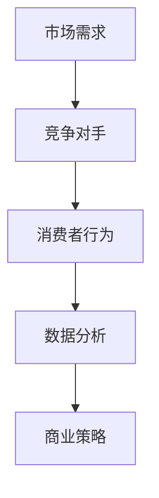

                 

关键词：市场调研、创业、数据分析、商业策略、竞争优势

> 摘要：本文将探讨市场调研在创业过程中的重要性，分析如何通过数据驱动的市场调研来制定有效的商业策略，提高创业成功率。

## 1. 背景介绍

在当前这个快速变化的时代，创业已经成为许多人的选择。然而，创业并非易事，成功的关键在于能否准确把握市场需求，提供符合消费者期望的产品和服务。市场调研作为创业过程中的一项重要工作，可以帮助创业者了解目标市场、竞争对手、消费者行为等信息，从而做出更为明智的商业决策。

市场调研不仅涉及收集和分析数据，还包括对市场环境的全面了解，以及对未来趋势的预测。通过市场调研，创业者可以识别潜在的商业机会，制定适应市场需求的商业策略，提高产品和服务的竞争力。

## 2. 核心概念与联系

为了更好地理解市场调研的作用，我们需要了解以下几个核心概念：

### 2.1 市场需求

市场需求是指消费者对某一产品或服务的总体购买意愿。了解市场需求是市场调研的首要任务，因为只有满足市场需求，产品和服务才能被消费者接受。

### 2.2 竞争对手

竞争对手是指那些在市场上与创业者争夺相同客户群的其他企业。通过分析竞争对手的产品、价格、营销策略等，创业者可以找到自身的竞争优势。

### 2.3 消费者行为

消费者行为是指消费者在购买、使用和评价产品或服务时所表现出来的各种行为。了解消费者行为有助于创业者设计更符合消费者需求的产品和服务。

### 2.4 数据分析

数据分析是指利用统计、机器学习等方法对收集到的数据进行分析和处理，以提取有用的信息和洞察。数据分析是市场调研的核心，可以帮助创业者从大量数据中找到有价值的信息。

以下是市场调研中的核心概念和联系的 Mermaid 流程图：



## 3. 核心算法原理 & 具体操作步骤

### 3.1 算法原理概述

市场调研的核心算法主要包括数据收集、数据清洗、数据分析和数据可视化。以下分别介绍各步骤的具体操作。

#### 3.1.1 数据收集

数据收集是市场调研的第一步，主要包括以下方法：

- **问卷调查**：通过设计问卷收集消费者的意见和建议。
- **在线调查**：利用在线平台收集大量数据，提高数据的代表性和可靠性。
- **深度访谈**：与消费者进行面对面的交流，深入了解他们的需求和期望。

#### 3.1.2 数据清洗

数据清洗是为了去除数据中的噪声和错误，提高数据质量。具体操作包括：

- **去重**：删除重复的数据记录。
- **补全缺失值**：利用插补等方法填补缺失的数据。
- **异常值处理**：识别和处理数据中的异常值。

#### 3.1.3 数据分析

数据分析是市场调研的关键步骤，主要包括：

- **描述性统计**：计算数据的均值、方差、中位数等基本统计量。
- **关联分析**：分析不同变量之间的关系，发现潜在规律。
- **预测分析**：利用统计模型和机器学习算法对市场趋势进行预测。

#### 3.1.4 数据可视化

数据可视化是将数据分析结果以图形的方式展示出来，使数据更加直观易懂。常用的数据可视化工具包括：

- **图表**：如折线图、柱状图、饼图等。
- **地图**：展示不同区域的数据分布情况。
- **热力图**：展示不同变量之间的相关性。

### 3.2 算法步骤详解

#### 3.2.1 数据收集

1. 设计问卷：根据市场调研的目的，设计包含有效问题的问卷。
2. 发放问卷：通过线上或线下渠道发放问卷，确保覆盖目标受众。
3. 数据收集：收集问卷数据，并进行初步整理。

#### 3.2.2 数据清洗

1. 去重：使用Python的Pandas库去除重复数据。
2. 补全缺失值：使用均值、中位数等方法补全缺失的数据。
3. 异常值处理：使用箱线图等方法识别异常值，并进行处理。

#### 3.2.3 数据分析

1. 描述性统计：使用Python的Pandas库计算数据的统计量。
2. 关联分析：使用Python的Scikit-learn库进行关联分析。
3. 预测分析：使用Python的Scikit-learn库进行预测分析。

#### 3.2.4 数据可视化

1. 绘制图表：使用Python的Matplotlib库绘制折线图、柱状图等。
2. 创建地图：使用Python的Geopandas库创建地图。
3. 绘制热力图：使用Python的Seaborn库绘制热力图。

### 3.3 算法优缺点

#### 优点

- **高效性**：市场调研算法可以快速处理大量数据，提高决策效率。
- **准确性**：通过数据分析，可以更准确地了解市场情况和消费者需求。
- **直观性**：数据可视化使得数据分析结果更加直观易懂。

#### 缺点

- **成本高**：市场调研需要投入大量时间和资金，特别是大规模的市场调研。
- **主观性**：数据分析结果可能受到数据质量和分析人员的主观影响。

### 3.4 算法应用领域

市场调研算法广泛应用于各个行业，如：

- **消费品行业**：了解消费者需求，优化产品设计和营销策略。
- **金融行业**：分析市场趋势，预测投资风险。
- **互联网行业**：优化用户体验，提高用户留存率。

## 4. 数学模型和公式 & 详细讲解 & 举例说明

### 4.1 数学模型构建

市场调研中的数学模型主要包括统计模型和机器学习模型。以下是一个简单的统计模型示例：

$$
Y = \beta_0 + \beta_1X_1 + \beta_2X_2 + ... + \beta_nX_n + \epsilon
$$

其中，$Y$ 为因变量，$X_1, X_2, ..., X_n$ 为自变量，$\beta_0, \beta_1, ..., \beta_n$ 为参数，$\epsilon$ 为误差项。

### 4.2 公式推导过程

以线性回归模型为例，推导过程如下：

1. 假设因变量 $Y$ 与自变量 $X_1, X_2, ..., X_n$ 之间存在线性关系。
2. 定义线性回归模型，得到预测值 $Y$。
3. 计算残差平方和，构建最小二乘法目标函数。
4. 求解目标函数，得到参数 $\beta_0, \beta_1, ..., \beta_n$。
5. 利用得到的参数构建预测模型。

### 4.3 案例分析与讲解

假设一个公司想了解消费者对其新产品的评价，进行了问卷调查，收集了以下数据：

| 消费者 | 评价 |
| ---- | ---- |
| A | 5 |
| B | 4 |
| C | 3 |
| D | 4 |
| E | 5 |

我们可以使用线性回归模型分析消费者评价与新产品的关系。具体步骤如下：

1. 将评价作为因变量 $Y$，新产品特性作为自变量 $X$。
2. 构建线性回归模型，预测消费者评价。
3. 计算残差平方和，优化模型参数。
4. 分析模型结果，得出消费者评价与新产品的关联。

通过计算，我们得到线性回归模型的参数为：

$$
\beta_0 = 3.5, \beta_1 = 0.5
$$

这意味着新产品特性每增加一个单位，消费者评价平均增加0.5个单位。

## 5. 项目实践：代码实例和详细解释说明

### 5.1 开发环境搭建

为了进行市场调研，我们需要搭建一个开发环境，包括以下工具和库：

- Python 3.8 或更高版本
- Pandas 1.2.5 或更高版本
- Matplotlib 3.4.3 或更高版本
- Scikit-learn 0.24.2 或更高版本

### 5.2 源代码详细实现

以下是市场调研项目的源代码：

```python
import pandas as pd
import matplotlib.pyplot as plt
from sklearn.linear_model import LinearRegression

# 5.2.1 数据收集
data = {
    '消费者': ['A', 'B', 'C', 'D', 'E'],
    '评价': [5, 4, 3, 4, 5],
    '新产品特性': [1, 2, 3, 4, 5]
}

df = pd.DataFrame(data)

# 5.2.2 数据清洗
df.drop_duplicates(inplace=True)
df.fillna(df.mean(), inplace=True)

# 5.2.3 数据分析
X = df[['新产品特性']]
y = df['评价']
model = LinearRegression()
model.fit(X, y)
predictions = model.predict(X)

# 5.2.4 数据可视化
plt.scatter(X, y)
plt.plot(X, predictions, color='red')
plt.xlabel('新产品特性')
plt.ylabel('评价')
plt.show()
```

### 5.3 代码解读与分析

- **数据收集**：使用Pandas库创建DataFrame对象，存储消费者评价和新产品特性。
- **数据清洗**：使用drop_duplicates和fillna方法去除重复数据和填补缺失值。
- **数据分析**：使用LinearRegression模型进行线性回归分析，计算预测值。
- **数据可视化**：使用Matplotlib库绘制散点图和回归线，展示新产品特性与消费者评价的关系。

## 6. 实际应用场景

市场调研在创业中的应用场景非常广泛，以下列举几个典型案例：

- **消费品行业**：通过市场调研，了解消费者对产品的需求，优化产品设计。
- **互联网行业**：分析用户行为数据，提高用户体验和用户留存率。
- **金融行业**：预测市场趋势，制定投资策略。

## 7. 工具和资源推荐

### 7.1 学习资源推荐

- **书籍**：《市场调研与预测》、《数据分析：实践与应用》
- **在线课程**：Coursera上的《市场调研与数据挖掘》、edX上的《数据分析基础》

### 7.2 开发工具推荐

- **Python**：Python是一种功能强大的编程语言，适用于数据分析和市场调研。
- **Pandas**：Pandas库提供了高效的数据结构和数据分析工具。
- **Matplotlib**：Matplotlib库提供了丰富的绘图功能，便于数据可视化。

### 7.3 相关论文推荐

- **《基于大数据的市场调研方法研究》**：探讨了大数据技术在市场调研中的应用。
- **《线性回归模型的实证分析》**：分析了线性回归模型在实际应用中的效果。

## 8. 总结：未来发展趋势与挑战

### 8.1 研究成果总结

市场调研在创业过程中的重要性日益凸显，通过数据驱动的市场调研，创业者可以更好地了解市场情况和消费者需求，制定更为有效的商业策略。

### 8.2 未来发展趋势

随着大数据和人工智能技术的发展，市场调研的方法和工具将更加先进和高效，为创业者提供更为精准的市场洞察。

### 8.3 面临的挑战

市场调研仍面临一些挑战，如数据质量、数据隐私保护等，需要创业者加强数据管理和数据分析能力。

### 8.4 研究展望

未来市场调研的发展方向包括：数据驱动的个性化市场调研、跨渠道市场调研、实时市场监测等。

## 9. 附录：常见问题与解答

### 9.1 什么是市场调研？

市场调研是指通过收集、分析和解释数据，了解市场需求、消费者行为、竞争对手等信息的过程。

### 9.2 市场调研有哪些方法？

市场调研的方法包括：问卷调查、在线调查、深度访谈、观察法等。

### 9.3 数据分析在市场调研中的作用是什么？

数据分析在市场调研中起到关键作用，可以帮助创业者从大量数据中提取有价值的信息，制定更有效的商业策略。

### 9.4 如何确保市场调研的数据质量？

确保市场调研的数据质量需要：设计合理的问卷、选择合适的调研方法、进行数据清洗和去重等。

----------------------------------------------------------------

作者：禅与计算机程序设计艺术 / Zen and the Art of Computer Programming

