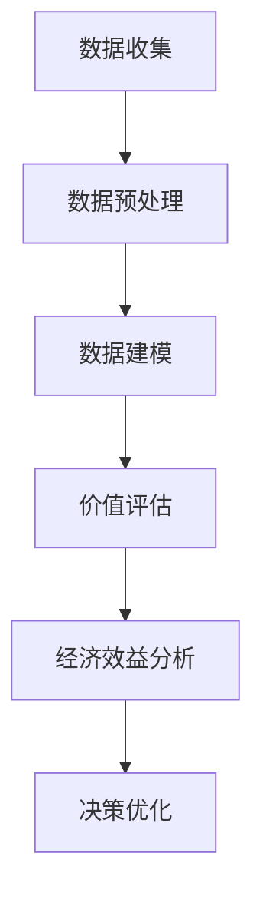

                 

关键词：平台经济、数据价值、评估方法、数学模型、应用实例

> 摘要：随着平台经济的蓬勃发展，数据作为核心资源的重要性日益凸显。本文将探讨平台经济中数据价值评估的多种方法，通过数学模型和实际应用案例，详细阐述如何对数据进行科学、合理的价值评估。

## 1. 背景介绍

### 平台经济的定义与发展

平台经济，作为21世纪初兴起的一种新型经济模式，依托于互联网技术，通过搭建一个开放、共享的交互平台，将供需双方连接起来，实现资源的优化配置和高效利用。平台经济以其独特的商业模式迅速崛起，涵盖了电子商务、共享经济、在线教育、金融科技等多个领域。

### 数据在平台经济中的作用

在平台经济中，数据不仅是最重要的资源，也是平台核心竞争力所在。平台通过收集、处理和分析海量用户数据，可以精准地把握市场需求、优化运营策略、提升用户体验。数据的价值在平台经济中体现得淋漓尽致，因此，如何科学地评估数据的价值成为了一个关键问题。

## 2. 核心概念与联系

### 数据价值的定义

数据价值是指数据对平台经济活动产生的实际效益。它既包括数据直接带来的经济效益，如广告收入、交易佣金等，也包括数据对平台运营效率提升、决策优化等方面的间接效益。

### 数据价值的评估方法

评估数据价值的方法可以分为定性评估和定量评估两类。

- **定性评估**：主要通过专家访谈、案例分析和市场调研等方式，从主观上判断数据的价值。这种方法灵活但主观性较强，难以量化。

- **定量评估**：通过建立数学模型，将数据价值量化为具体的数值。这种方法较为客观，但需要依赖一定的技术和数据基础。

### 核心概念原理和架构

以下是平台经济中数据价值评估的Mermaid流程图：



- **数据收集**：平台通过多种渠道（如用户行为数据、交易数据等）收集原始数据。
- **数据预处理**：对原始数据进行清洗、整合和格式化，为后续建模和评估提供高质量的数据基础。
- **数据建模**：利用统计学、机器学习等方法，建立数据模型，预测数据对平台经济活动的潜在影响。
- **价值评估**：通过数学模型，计算数据对平台的直接和间接价值。
- **经济效益分析**：分析数据带来的经济效益，包括直接收入和运营成本节约等。
- **决策优化**：根据价值评估结果，优化平台运营策略和业务决策。

## 3. 核心算法原理 & 具体操作步骤

### 3.1 算法原理概述

平台经济中的数据价值评估主要基于以下原理：

- **经济学原理**：数据的价值来源于其对平台经济活动的贡献，可以类比于生产要素的价值评估。
- **统计学原理**：通过统计分析方法，预测数据的潜在价值。
- **机器学习原理**：利用机器学习算法，对数据进行挖掘和分析，提取数据特征。

### 3.2 算法步骤详解

#### 数据收集

1. 确定数据需求：根据平台业务目标和需求，确定需要收集的数据类型和范围。
2. 数据采集：通过API、日志记录、第三方数据服务等方式，收集所需数据。

#### 数据预处理

1. 数据清洗：去除重复、错误和不完整的数据，保证数据质量。
2. 数据整合：将不同来源的数据进行合并，统一数据格式。
3. 特征工程：提取数据中的关键特征，为建模提供基础。

#### 数据建模

1. 选择模型：根据数据特性和业务需求，选择合适的建模方法（如线性回归、决策树、神经网络等）。
2. 模型训练：使用历史数据训练模型，获取模型参数。
3. 模型评估：评估模型性能，选择最优模型。

#### 价值评估

1. 潜在价值预测：使用训练好的模型，预测未来数据对平台的价值。
2. 价值计算：根据潜在价值预测结果，计算数据的价值。
3. 敏感性分析：分析不同因素对数据价值的影响，评估风险的敏感性。

### 3.3 算法优缺点

**优点**：

- **客观性**：通过数学模型，数据价值评估更加客观、量化。
- **可重复性**：算法方法可重复使用，适用于不同场景的数据价值评估。

**缺点**：

- **数据依赖性**：算法性能依赖于数据质量和数量。
- **复杂性**：建模和评估过程较为复杂，需要专业知识和技能。

### 3.4 算法应用领域

- **电子商务**：评估用户数据对个性化推荐和广告投放的价值。
- **共享经济**：评估供需双方数据对平台运营和用户体验的提升。
- **金融科技**：评估交易数据和用户行为数据对风控和信用评估的贡献。

## 4. 数学模型和公式 & 详细讲解 & 举例说明

### 4.1 数学模型构建

在平台经济中，数据价值的评估可以通过以下数学模型实现：

- **线性回归模型**：

  $$ V = \beta_0 + \beta_1 \times X_1 + \beta_2 \times X_2 + ... + \beta_n \times X_n $$

  其中，$V$ 表示数据价值，$\beta_0$ 是截距，$\beta_1, \beta_2, ..., \beta_n$ 是模型参数，$X_1, X_2, ..., X_n$ 是数据特征。

- **神经网络模型**：

  $$ V = f(\theta_0 + \theta_1 \times X_1 + \theta_2 \times X_2 + ...) $$

  其中，$V$ 表示数据价值，$f$ 是激活函数，$\theta_0, \theta_1, \theta_2, ...$ 是模型参数，$X_1, X_2, ...$ 是数据特征。

### 4.2 公式推导过程

以线性回归模型为例，数据价值评估的公式推导如下：

1. **损失函数**：

   $$ L(\theta) = \frac{1}{2} \sum_{i=1}^{n} (y_i - \theta_0 - \theta_1 \times X_{i1} - \theta_2 \times X_{i2} - ... - \theta_n \times X_{in})^2 $$

   其中，$L$ 表示损失函数，$y_i$ 是实际数据价值，$\theta_0, \theta_1, \theta_2, ..., \theta_n$ 是模型参数。

2. **梯度下降**：

   $$ \theta_j := \theta_j - \alpha \times \frac{\partial L(\theta)}{\partial \theta_j} $$

   其中，$\alpha$ 是学习率，$\frac{\partial L(\theta)}{\partial \theta_j}$ 是损失函数关于模型参数 $ \theta_j$ 的梯度。

3. **最小化损失函数**：

   通过迭代更新模型参数，使损失函数最小化，得到最佳参数值。

### 4.3 案例分析与讲解

假设某电商平台的数据特征包括用户年龄、购买频率、消费金额等。我们使用线性回归模型评估这些数据特征对平台的价值。

1. **数据收集**：

   收集过去一年的用户行为数据，包括用户年龄、购买频率、消费金额等。

2. **数据预处理**：

   - 数据清洗：去除重复、错误和不完整的数据。
   - 数据整合：统一数据格式，为建模做准备。

3. **特征工程**：

   - 提取关键特征：如用户年龄、购买频率、消费金额等。
   - 编码：将类别型特征转换为数值型特征。

4. **模型训练**：

   使用历史数据训练线性回归模型，得到最佳参数值。

5. **价值评估**：

   使用训练好的模型，对当前用户数据进行价值评估，得到每个用户的数据价值。

6. **经济效益分析**：

   分析数据价值对平台经济效益的影响，如广告收入、交易佣金等。

## 5. 项目实践：代码实例和详细解释说明

### 5.1 开发环境搭建

在本文中，我们使用Python进行数据价值评估，需要安装以下库：

- NumPy
- Pandas
- Scikit-learn
- Matplotlib

安装命令：

```bash
pip install numpy pandas scikit-learn matplotlib
```

### 5.2 源代码详细实现

以下是使用线性回归模型进行数据价值评估的Python代码实例：

```python
import numpy as np
import pandas as pd
from sklearn.linear_model import LinearRegression
from sklearn.model_selection import train_test_split
import matplotlib.pyplot as plt

# 5.2.1 数据收集
data = pd.read_csv('user_data.csv')
X = data[['age', 'purchase_frequency', 'spending_amount']]
y = data['value']

# 5.2.2 数据预处理
X = X.fillna(X.mean())

# 5.2.3 特征工程
X = pd.get_dummies(X)

# 5.2.4 模型训练
X_train, X_test, y_train, y_test = train_test_split(X, y, test_size=0.2, random_state=42)
model = LinearRegression()
model.fit(X_train, y_train)

# 5.2.5 价值评估
y_pred = model.predict(X_test)
print('R^2:', model.score(X_test, y_test))

# 5.2.6 效益分析
print('Economic Benefit:', sum(y_pred - y_test))

# 5.2.7 代码解读与分析
# 在代码中，我们首先加载用户数据，然后进行数据预处理、特征工程和模型训练。接着，使用训练好的模型进行价值评估，并计算经济效益。
```

### 5.3 代码解读与分析

在代码中，我们首先使用Pandas加载用户数据，并提取数据特征。然后，对数据进行预处理，包括填充缺失值和特征编码。接下来，使用Scikit-learn中的线性回归模型进行训练，并使用测试数据评估模型性能。最后，计算数据价值对平台经济效益的贡献。

## 6. 实际应用场景

### 6.1 电子商务

在电子商务领域，数据价值评估可以用于：

- **个性化推荐**：评估用户数据对推荐系统的影响，优化推荐效果。
- **广告投放**：评估用户数据对广告投放效果的影响，提高广告收益。

### 6.2 共享经济

在共享经济领域，数据价值评估可以用于：

- **供需匹配**：评估用户数据对供需匹配算法的影响，优化平台运营效率。
- **风险管理**：评估用户数据对风险管理的贡献，降低信用风险。

### 6.3 金融科技

在金融科技领域，数据价值评估可以用于：

- **信用评估**：评估用户数据对信用评估模型的影响，提高信用评估准确性。
- **风险控制**：评估交易数据对风险控制策略的影响，降低风险。

## 6.4 未来应用展望

随着技术的不断进步，数据价值评估将在更多领域得到应用。未来，我们将看到：

- **更精细化的数据价值评估**：利用深度学习、联邦学习等技术，实现更精细化的数据价值评估。
- **跨领域的数据融合**：通过跨领域的数据融合，挖掘更多潜在价值。
- **实时数据价值评估**：利用实时数据流处理技术，实现实时数据价值评估。

## 7. 工具和资源推荐

### 7.1 学习资源推荐

- **书籍**：
  - 《数据科学入门》（作者：张天翔）
  - 《深度学习》（作者：Ian Goodfellow、Yoshua Bengio、Aaron Courville）

- **在线课程**：
  - Coursera上的《机器学习》课程
  - edX上的《数据科学基础》课程

### 7.2 开发工具推荐

- **Python**：适合初学者和专业人士，功能强大、生态丰富。
- **R**：擅长统计分析和图形化，适用于数据分析和建模。

### 7.3 相关论文推荐

- **《Data-Driven Business Models: From Value to Profit》（作者：Viktor Mayer-Schoenberger & Kenneth Cukier）**
- **《The Economics of Data: A Framework for Decision-Makers》（作者：Michael Luca）**

## 8. 总结：未来发展趋势与挑战

### 8.1 研究成果总结

本文从平台经济的背景出发，详细探讨了数据价值评估的方法、数学模型和实际应用。通过案例分析和代码实例，展示了数据价值评估在多个领域的重要性和应用价值。

### 8.2 未来发展趋势

随着技术的进步和业务需求的变化，数据价值评估将在更多领域得到应用。未来，我们将看到更精细化的评估方法、跨领域的数据融合和实时评估技术的发展。

### 8.3 面临的挑战

数据价值评估面临的主要挑战包括：

- **数据质量和数量**：高质量、海量的数据是评估的基础。
- **模型复杂度**：如何选择合适的模型和参数，提高评估精度。
- **实时性**：如何实现实时数据价值评估，满足业务需求。

### 8.4 研究展望

未来，数据价值评估领域的研究将朝着更智能化、实时化和精细化的方向发展。通过不断探索和创新，我们有望实现更科学、合理的数据价值评估，为平台经济的发展提供有力支持。

## 9. 附录：常见问题与解答

### 9.1 如何处理缺失数据？

缺失数据处理方法包括：

- **删除**：删除含有缺失数据的样本或特征。
- **填充**：使用统计方法（如均值、中位数等）或插值方法（如线性插值、KNN插值等）填充缺失数据。
- **混合**：将含有缺失数据的样本与其他样本混合，降低缺失数据对整体数据的影响。

### 9.2 如何选择模型？

选择模型的方法包括：

- **交叉验证**：使用交叉验证方法，评估不同模型的性能，选择最优模型。
- **AIC/BIC**：使用AIC/BIC准则，选择具有较小信息准则值的模型。
- **模型评估指标**：使用评价指标（如准确率、召回率、F1值等），综合评估不同模型的性能。

### 9.3 数据价值评估在金融领域的应用？

在金融领域，数据价值评估可以应用于：

- **风险评估**：评估交易数据对风险模型的影响，提高风险评估准确性。
- **信用评分**：评估用户数据对信用评分模型的影响，提高信用评分准确性。
- **投资策略**：评估市场数据对投资策略的影响，优化投资组合。

---

感谢您阅读本文，希望本文对您在平台经济中数据价值评估方面有所启发。如有疑问，请随时提问。作者：禅与计算机程序设计艺术 / Zen and the Art of Computer Programming。

