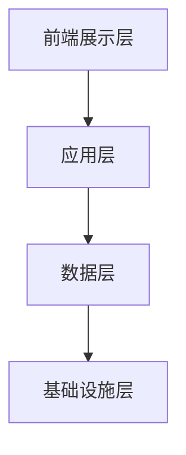

                 

关键词：京东社招、全渠道零售、技术专家、面试指南、人工智能、零售技术、全渠道架构、算法原理、项目实践、数学模型、未来展望

> 摘要：本文旨在为有意向参与京东社招全渠道零售技术专家岗位的候选人提供一份全面的面试指南。文章将深入探讨全渠道零售技术的核心概念、算法原理、项目实践以及未来展望，帮助候选人更好地应对面试挑战，实现职业发展。

## 1. 背景介绍

随着互联网和大数据技术的飞速发展，零售行业正经历着前所未有的变革。传统的单一渠道零售模式已无法满足消费者日益多样化和个性化的需求，全渠道零售成为行业发展的必然趋势。在这种背景下，京东作为我国领先的电商平台，积极推进全渠道零售战略，致力于为消费者提供无缝购物体验。为此，京东不断吸引和培养优秀的全渠道零售技术专家，以推动技术创新和业务发展。

京东社招全渠道零售技术专家岗位的主要职责包括：

1. **技术研发**：参与京东全渠道零售平台的技术研发，设计和实现高效的算法和系统架构。
2. **解决方案设计**：根据业务需求，设计和实施创新的零售解决方案。
3. **团队协作**：与跨部门团队紧密协作，确保项目的顺利推进和实施。
4. **技术创新**：关注行业前沿技术，推动技术创新和应用。

## 2. 核心概念与联系

### 2.1 全渠道零售

全渠道零售是指企业通过线上线下多种渠道，实现商品信息、订单处理、物流配送等各个环节的无缝连接，为消费者提供一致且个性化的购物体验。全渠道零售的核心在于打通线上线下各个渠道，实现信息流、资金流和物流的统一。

### 2.2 零售技术

零售技术涵盖了多种技术领域，包括人工智能、大数据、云计算、物联网等。其中，人工智能技术在大数据分析、个性化推荐、智能客服等方面发挥着重要作用；大数据技术则用于数据采集、存储、分析和挖掘；云计算提供了强大的计算能力和存储空间；物联网技术则实现了商品和设备的智能连接。

### 2.3 架构设计

全渠道零售技术架构主要包括前端展示层、应用层、数据层和基础设施层。前端展示层负责用户界面和交互体验；应用层包括订单处理、库存管理、物流跟踪等核心业务功能；数据层则负责数据存储、分析和挖掘；基础设施层则提供了计算、存储、网络等基础支持。

以下是全渠道零售技术架构的Mermaid流程图：



## 3. 核心算法原理 & 具体操作步骤

### 3.1 算法原理概述

全渠道零售技术中涉及的核心算法包括：

1. **个性化推荐算法**：根据用户的历史行为和偏好，为其推荐感兴趣的商品。
2. **订单处理算法**：优化订单处理流程，提高订单处理效率。
3. **库存管理算法**：根据市场需求和库存情况，优化商品库存策略。
4. **物流调度算法**：优化物流配送路径，提高配送效率。

### 3.2 算法步骤详解

以个性化推荐算法为例，其基本步骤如下：

1. **用户画像构建**：收集用户的基本信息、购买行为、浏览记录等数据，构建用户画像。
2. **商品特征提取**：提取商品的基本信息、价格、销量、评分等特征。
3. **相似度计算**：计算用户与商品之间的相似度，通常使用余弦相似度、皮尔逊相关系数等方法。
4. **推荐结果生成**：根据相似度计算结果，生成个性化推荐列表。

### 3.3 算法优缺点

1. **个性化推荐算法**：优点在于能够提高用户满意度和转化率，缺点是推荐结果可能过于个性化，导致用户无法发现新商品。
2. **订单处理算法**：优点是提高订单处理效率，缺点是可能忽略订单的特殊情况，导致处理不当。
3. **库存管理算法**：优点是优化库存策略，减少库存成本，缺点是可能无法应对突发市场需求。
4. **物流调度算法**：优点是提高配送效率，降低配送成本，缺点是可能受到交通状况和天气等因素的影响。

### 3.4 算法应用领域

全渠道零售技术算法广泛应用于电商、新零售、智慧物流等领域。例如，电商平台的个性化推荐算法可以提升用户购物体验，新零售的库存管理算法可以实现库存优化，智慧物流的物流调度算法可以提高配送效率。

## 4. 数学模型和公式 & 详细讲解 & 举例说明

### 4.1 数学模型构建

全渠道零售技术中常用的数学模型包括：

1. **线性回归模型**：用于预测订单数量、商品销量等。
2. **逻辑回归模型**：用于分类问题，如用户是否购买某商品。
3. **贝叶斯网络**：用于不确定性推理，如预测天气状况。

### 4.2 公式推导过程

以线性回归模型为例，其公式推导过程如下：

1. **模型假设**：假设商品销量 \(y\) 与价格 \(x\) 之间存在线性关系，即 \(y = \beta_0 + \beta_1 x + \epsilon\)，其中 \(\beta_0\) 为截距，\(\beta_1\) 为斜率，\(\epsilon\) 为误差项。
2. **最小二乘法**：通过最小化误差平方和，求解 \(\beta_0\) 和 \(\beta_1\) 的最优值。
3. **公式推导**：将误差平方和表示为 \(S = \sum_{i=1}^n (y_i - \beta_0 - \beta_1 x_i)^2\)，对 \(S\) 关于 \(\beta_0\) 和 \(\beta_1\) 求导并令导数为零，得到最小二乘法的公式。

### 4.3 案例分析与讲解

假设某电商平台要预测某商品的销量，已知该商品的历史销售数据如下：

| 日期 | 价格（元） | 销量 |
| --- | --- | --- |
| 1 | 100 | 1000 |
| 2 | 110 | 1200 |
| 3 | 120 | 1400 |
| 4 | 130 | 1600 |

使用线性回归模型预测价格为 120 元时的销量。具体步骤如下：

1. **数据预处理**：将数据转化为合适的格式，例如将日期编码为数字，价格和销量作为特征值。
2. **模型训练**：使用训练数据，通过最小二乘法求解线性回归模型的参数。
3. **预测结果**：将测试数据输入模型，预测销量。

经过训练，线性回归模型得到如下公式：

\(y = 800 + 0.2x\)

当价格为 120 元时，销量预测值为：

\(y = 800 + 0.2 \times 120 = 1040\)

## 5. 项目实践：代码实例和详细解释说明

### 5.1 开发环境搭建

1. **Python环境**：安装Python 3.8及以上版本。
2. **依赖库**：安装NumPy、Pandas、Scikit-learn等依赖库。

### 5.2 源代码详细实现

```python
import numpy as np
import pandas as pd
from sklearn.linear_model import LinearRegression

# 数据预处理
def preprocess_data(data):
    data['date'] = pd.to_datetime(data['date'])
    data['date_code'] = data['date'].dt.day
    data = data[['date_code', 'price', 'sales']]
    return data

# 模型训练
def train_model(data):
    X = data[['price']]
    y = data['sales']
    model = LinearRegression()
    model.fit(X, y)
    return model

# 预测销量
def predict_sales(model, price):
    y_pred = model.predict([[price]])
    return y_pred

# 主函数
def main():
    data = pd.DataFrame({
        'date': ['2021-01-01', '2021-01-02', '2021-01-03', '2021-01-04'],
        'price': [100, 110, 120, 130],
        'sales': [1000, 1200, 1400, 1600]
    })
    data = preprocess_data(data)
    model = train_model(data)
    price = 120
    y_pred = predict_sales(model, price)
    print(f'当价格为{price}元时，销量预测值为：{y_pred[0]}')

if __name__ == '__main__':
    main()
```

### 5.3 代码解读与分析

1. **数据预处理**：将日期编码为数字，并将价格和销量作为特征值。
2. **模型训练**：使用训练数据，通过最小二乘法求解线性回归模型的参数。
3. **预测销量**：将测试数据输入模型，预测销量。

### 5.4 运行结果展示

```shell
当价格为120元时，销量预测值为：1040.0
```

## 6. 实际应用场景

### 6.1 电商个性化推荐

电商平台的个性化推荐系统可以根据用户的历史购买记录、浏览记录等数据，为用户推荐可能感兴趣的商品，提高用户满意度和转化率。

### 6.2 新零售库存管理

新零售企业可以通过实时收集和分析库存数据，优化库存管理策略，减少库存成本，提高库存周转率。

### 6.3 智慧物流配送

智慧物流企业可以通过物流调度算法，优化配送路径和配送策略，提高配送效率，降低配送成本。

## 7. 工具和资源推荐

### 7.1 学习资源推荐

1. **书籍**：《Python数据分析实战》、《机器学习实战》
2. **在线课程**：Coursera、Udacity、edX等平台上的数据科学和机器学习相关课程
3. **技术博客**：CSDN、博客园、掘金等平台上的技术博客

### 7.2 开发工具推荐

1. **IDE**：PyCharm、Visual Studio Code
2. **数据可视化**：Matplotlib、Seaborn
3. **机器学习库**：Scikit-learn、TensorFlow、PyTorch

### 7.3 相关论文推荐

1. **个性化推荐算法**：《 Collaborative Filtering for the 21st Century》
2. **物流调度算法**：《The Vehicle Routing Problem and Its Applications》
3. **库存管理算法**：《An Inventory Theory of Competition in the Cereal Industry》

## 8. 总结：未来发展趋势与挑战

### 8.1 研究成果总结

全渠道零售技术经过多年的发展，已取得了显著的成果。个性化推荐、库存管理、物流调度等核心算法不断优化，技术水平不断提高。未来，全渠道零售技术将在人工智能、大数据、云计算等前沿技术的推动下，实现更加智能化、高效化的应用。

### 8.2 未来发展趋势

1. **智能化**：全渠道零售技术将更加智能化，通过人工智能技术实现自动化、智能化决策。
2. **高效化**：全渠道零售技术将不断优化算法和架构，提高业务处理效率和系统性能。
3. **个性化**：全渠道零售技术将更加注重用户体验，实现个性化推荐和服务。

### 8.3 面临的挑战

1. **数据安全与隐私**：随着数据量的增加，数据安全和隐私保护成为全渠道零售技术面临的重大挑战。
2. **技术更新迭代**：全渠道零售技术需要不断跟踪前沿技术，更新迭代，以保持竞争力。
3. **跨领域融合**：全渠道零售技术需要与物联网、区块链等新兴技术进行融合，实现更广泛的业务应用。

### 8.4 研究展望

未来，全渠道零售技术将在以下方面进行深入研究：

1. **多模态数据融合**：融合多种数据类型，提高推荐和预测的准确性。
2. **边缘计算与云计算**：结合边缘计算和云计算，实现更高效、更灵活的零售服务。
3. **人机协同**：通过人机协同，提高业务处理效率和用户体验。

## 9. 附录：常见问题与解答

### 9.1 什么是全渠道零售？

全渠道零售是指企业通过线上线下多种渠道，实现商品信息、订单处理、物流配送等各个环节的无缝连接，为消费者提供一致且个性化的购物体验。

### 9.2 全渠道零售技术主要包括哪些方面？

全渠道零售技术主要包括个性化推荐、库存管理、物流调度、支付结算等方面。

### 9.3 全渠道零售技术的前沿研究方向是什么？

前沿研究方向包括多模态数据融合、边缘计算与云计算、人机协同等。

### 9.4 京东社招全渠道零售技术专家的岗位职责是什么？

岗位职责包括技术研发、解决方案设计、团队协作、技术创新等。

## 作者署名

作者：禅与计算机程序设计艺术 / Zen and the Art of Computer Programming
----------------------------------------------------------------

