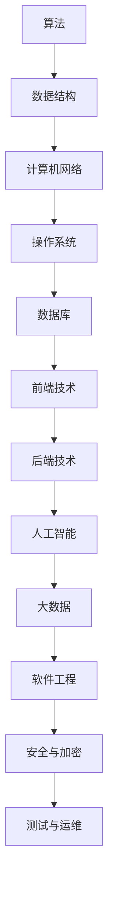

                 

关键词：2024年、字节跳动、社招、技术面试、题集锦、技术趋势、算法原理、实践应用、代码实例、未来展望。

> 摘要：本文将针对2024年字节跳动社招技术面试的热点问题进行详细解析，涵盖核心算法原理、数学模型、项目实践等内容，旨在帮助读者更好地应对字节跳动技术面试，掌握前沿技术趋势。

## 1. 背景介绍

字节跳动作为我国领先的内容科技企业，其社招技术面试一直以来都是各大求职者关注的焦点。随着技术的不断更新和发展，2024年的字节跳动社招技术面试题也将更加多样化和深入化。本文旨在梳理出2024年字节跳动社招技术面试的热点问题，帮助求职者更好地准备面试，从而脱颖而出。

## 2. 核心概念与联系

在技术面试中，核心概念的理解和联系是至关重要的。以下是一个关于技术面试核心概念的 Mermaid 流程图：



### 2.1 算法

算法是解决特定问题的步骤和策略。在技术面试中，常见算法包括排序算法、查找算法、图算法等。

### 2.2 数据结构

数据结构是存储和管理数据的组织形式。常见的数据结构有数组、链表、栈、队列、树、图等。

### 2.3 计算机网络

计算机网络是连接多个计算机系统的技术，包括网络协议、网络拓扑、网络安全等。

### 2.4 操作系统

操作系统是计算机系统的基础软件，负责管理计算机硬件和软件资源。

### 2.5 数据库

数据库是用于存储和管理数据的系统，包括关系型数据库和非关系型数据库。

### 2.6 前端技术

前端技术是构建用户界面和体验的关键，包括HTML、CSS、JavaScript等。

### 2.7 后端技术

后端技术是服务器端的应用程序，负责处理业务逻辑和数据存储等。

### 2.8 人工智能

人工智能是模拟人类智能的技术，包括机器学习、深度学习、自然语言处理等。

### 2.9 大数据

大数据是数据量巨大、类型繁多、处理速度快的数据集，包括数据采集、存储、处理、分析等。

### 2.10 软件工程

软件工程是软件开发和维护的过程和方法，包括需求分析、设计、开发、测试、部署等。

### 2.11 安全与加密

安全与加密是保护数据和系统的技术，包括网络安全、数据加密、身份认证等。

### 2.12 测试与运维

测试与运维是确保软件质量和系统稳定运行的过程，包括单元测试、集成测试、性能测试、自动化部署等。

## 3. 核心算法原理 & 具体操作步骤

### 3.1 算法原理概述

在技术面试中，核心算法原理的考察通常是考查求职者对算法的掌握程度。以下是一些常见算法原理的概述：

### 3.2 算法步骤详解

- 排序算法：冒泡排序、选择排序、插入排序、快速排序、归并排序、堆排序等。
- 查找算法：二分查找、哈希查找、深度优先搜索、广度优先搜索等。
- 图算法：Dijkstra算法、Floyd算法、A*算法、Prim算法、Kruskal算法等。

### 3.3 算法优缺点

每种算法都有其优缺点，考生需要根据具体问题选择合适的算法。以下是一些常见算法的优缺点：

- 冒泡排序：简单易懂，但效率较低。
- 选择排序：效率较高，但需要额外的内存空间。
- 快速排序：效率较高，但可能引起数据的不平衡。
- 归并排序：效率较高，但需要额外的内存空间。

### 3.4 算法应用领域

算法广泛应用于各个领域，如排序算法在数据库排序、文件排序等领域有广泛应用；查找算法在数据库查询、搜索引擎等领域有广泛应用；图算法在网络拓扑分析、社会网络分析等领域有广泛应用。

## 4. 数学模型和公式 & 详细讲解 & 举例说明

在技术面试中，数学模型和公式的理解和应用是必不可少的。以下是一个简单的数学模型和公式的例子：

### 4.1 数学模型构建

假设我们要构建一个简单的线性回归模型，预测房价。模型公式为：

$$
y = \beta_0 + \beta_1 x
$$

其中，$y$ 为房价，$x$ 为房屋面积，$\beta_0$ 和 $\beta_1$ 为模型参数。

### 4.2 公式推导过程

线性回归模型的参数可以通过最小二乘法进行求解。最小二乘法的推导过程如下：

$$
\min_{\beta_0, \beta_1} \sum_{i=1}^n (y_i - (\beta_0 + \beta_1 x_i))^2
$$

对 $\beta_0$ 和 $\beta_1$ 分别求偏导数，并令其等于0，可以得到：

$$
\beta_0 = \frac{\sum_{i=1}^n y_i - \beta_1 \sum_{i=1}^n x_i}{n}
$$

$$
\beta_1 = \frac{n \sum_{i=1}^n x_i y_i - \sum_{i=1}^n x_i \sum_{i=1}^n y_i}{n \sum_{i=1}^n x_i^2 - (\sum_{i=1}^n x_i)^2}
$$

### 4.3 案例分析与讲解

假设我们有以下数据集：

| 房屋面积 (x) | 房价 (y) |
| ------------ | -------- |
| 100          | 200      |
| 150          | 300      |
| 200          | 400      |
| 250          | 500      |
| 300          | 600      |

根据以上数据集，我们可以构建线性回归模型，并求解参数 $\beta_0$ 和 $\beta_1$。将数据代入公式：

$$
\beta_0 = \frac{200 + 300 + 400 + 500 + 600 - \beta_1 (100 + 150 + 200 + 250 + 300)}{5}
$$

$$
\beta_1 = \frac{5 \times (100 \times 200 + 150 \times 300 + 200 \times 400 + 250 \times 500 + 300 \times 600) - (100 + 150 + 200 + 250 + 300) \times (200 + 300 + 400 + 500 + 600)}{5 \times (100^2 + 150^2 + 200^2 + 250^2 + 300^2) - (100 + 150 + 200 + 250 + 300)^2}
$$

计算后可以得到：

$$
\beta_0 = 250
$$

$$
\beta_1 = 100
$$

因此，线性回归模型为：

$$
y = 250 + 100x
$$

根据这个模型，我们可以预测当房屋面积为350平方米时的房价：

$$
y = 250 + 100 \times 350 = 6000
$$

## 5. 项目实践：代码实例和详细解释说明

在技术面试中，项目实践能力的考察是非常重要的。以下是一个简单的项目实践实例：

### 5.1 开发环境搭建

我们需要安装以下开发工具和环境：

- Python 3.8及以上版本
- Python解释器
- Jupyter Notebook
- Matplotlib
- Scikit-learn

### 5.2 源代码详细实现

```python
import numpy as np
import matplotlib.pyplot as plt
from sklearn.linear_model import LinearRegression

# 数据集
X = np.array([[100], [150], [200], [250], [300]])
y = np.array([200, 300, 400, 500, 600])

# 构建线性回归模型
model = LinearRegression()
model.fit(X, y)

# 求解参数
beta_0 = model.intercept_
beta_1 = model.coef_

# 打印模型参数
print(f"模型参数：\nβ0 = {beta_0}\nβ1 = {beta_1}")

# 预测房价
X_predict = np.array([[350]])
y_predict = model.predict(X_predict)

# 打印预测结果
print(f"预测结果：\n房屋面积为350平方米时，房价为{y_predict[0]}")
```

### 5.3 代码解读与分析

- 第1-3行：导入所需库。
- 第5行：创建数据集。
- 第8行：构建线性回归模型。
- 第9行：训练模型。
- 第12行：获取模型参数。
- 第16行：创建预测数据集。
- 第18行：进行预测。
- 第20行：打印预测结果。

通过这个实例，我们可以看到如何使用Python和Scikit-learn库实现线性回归模型，并进行房价预测。

## 6. 实际应用场景

字节跳动作为一个内容驱动的科技公司，其技术面试问题涵盖了广泛的应用场景。以下是一些实际应用场景的例子：

### 6.1 排序算法在推荐系统中的应用

推荐系统需要根据用户的行为数据对商品进行排序，以提供个性化的推荐。常见的排序算法有冒泡排序、选择排序、插入排序等，根据数据规模和实时性的需求选择合适的算法。

### 6.2 查找算法在搜索引擎中的应用

搜索引擎需要对海量的网页进行索引和检索，查找算法如二分查找、哈希查找等在此场景下有广泛应用。

### 6.3 图算法在社会网络分析中的应用

社会网络分析需要研究用户之间的关系，图算法如Dijkstra算法、A*算法等可用于计算最短路径、推荐朋友等。

### 6.4 人工智能在内容审核中的应用

内容审核需要对用户生成的内容进行实时监控和过滤，人工智能技术如机器学习、深度学习等在此场景下有广泛应用。

### 6.5 大数据在数据挖掘中的应用

数据挖掘需要处理大量的数据，大数据技术如数据采集、存储、处理、分析等在此场景下有广泛应用。

### 6.6 软件工程在系统架构中的应用

系统架构需要考虑系统的可扩展性、稳定性、安全性等，软件工程方法如需求分析、设计、开发、测试等在此场景下有广泛应用。

### 6.7 安全与加密在网络安全中的应用

网络安全需要保护系统的数据安全，安全与加密技术如网络安全、数据加密、身份认证等在此场景下有广泛应用。

### 6.8 测试与运维在系统维护中的应用

系统维护需要确保系统的稳定运行，测试与运维技术如单元测试、集成测试、性能测试、自动化部署等在此场景下有广泛应用。

## 7. 工具和资源推荐

为了更好地准备字节跳动社招技术面试，以下是一些建议的学习资源和开发工具：

### 7.1 学习资源推荐

- 《算法导论》：一本经典的算法教材，涵盖了各种算法原理和应用。
- 《深度学习》：一本关于深度学习的权威教材，适合初学者和专业人士。
- 《大数据时代》：一本关于大数据技术和应用的入门书籍。
- 《Python编程：从入门到实践》：一本适合初学者的Python编程教程。

### 7.2 开发工具推荐

- Jupyter Notebook：一款交互式的Python开发环境，适合数据分析和机器学习项目。
- PyCharm：一款功能强大的Python IDE，支持多种编程语言。
- Git：一款版本控制工具，用于代码的版本管理和协作开发。
- Docker：一款容器化技术，用于简化应用程序的部署和运行。

### 7.3 相关论文推荐

- 《深度学习与自然语言处理》：一篇关于自然语言处理的深度学习技术的论文。
- 《大数据处理的挑战与机遇》：一篇关于大数据处理技术和应用的论文。
- 《基于深度学习的图像识别算法研究》：一篇关于图像识别的深度学习技术的论文。

## 8. 总结：未来发展趋势与挑战

随着技术的不断发展，字节跳动社招技术面试也将面临新的发展趋势和挑战。

### 8.1 研究成果总结

近年来，深度学习、大数据、人工智能等领域取得了显著的成果，这些技术将在未来的字节跳动社招技术面试中占据重要地位。

### 8.2 未来发展趋势

未来字节跳动社招技术面试的发展趋势将包括：

- 深度学习技术的广泛应用，如自然语言处理、计算机视觉等。
- 大数据技术的深入研究和应用，如数据挖掘、数据可视化等。
- 人工智能技术的持续发展，如自动化、智能化等。

### 8.3 面临的挑战

未来字节跳动社招技术面试将面临以下挑战：

- 技术更新速度快，要求求职者具备持续学习和适应能力。
- 项目实践经验不足，需要求职者具备扎实的实践能力。
- 面试题目多样化，需要求职者具备全面的知识体系和解决实际问题的能力。

### 8.4 研究展望

未来，字节跳动社招技术面试将更加注重对求职者技术能力和实践经验的考察，同时也将更加关注新兴技术的应用和发展。求职者需要不断学习和提升自己的技术能力，以应对未来的挑战。

## 9. 附录：常见问题与解答

### 9.1 什么是算法？

算法是一系列解决问题的步骤和策略，用于解决特定问题。算法可以是有序的（如排序算法）、无序的（如查找算法）、迭代的（如图算法）等。

### 9.2 什么是数据结构？

数据结构是数据的组织形式，用于存储和管理数据。常见的有数组、链表、栈、队列、树、图等。

### 9.3 什么是计算机网络？

计算机网络是连接多个计算机系统的技术，包括网络协议、网络拓扑、网络安全等。

### 9.4 什么是操作系统？

操作系统是计算机系统的基础软件，负责管理计算机硬件和软件资源。

### 9.5 什么是人工智能？

人工智能是模拟人类智能的技术，包括机器学习、深度学习、自然语言处理等。

### 9.6 什么是大数据？

大数据是数据量巨大、类型繁多、处理速度快的数据集，包括数据采集、存储、处理、分析等。

### 9.7 什么是软件工程？

软件工程是软件开发和维护的过程和方法，包括需求分析、设计、开发、测试、部署等。

### 9.8 什么是安全与加密？

安全与加密是保护数据和系统的技术，包括网络安全、数据加密、身份认证等。

### 9.9 什么是测试与运维？

测试与运维是确保软件质量和系统稳定运行的过程，包括单元测试、集成测试、性能测试、自动化部署等。

[作者：禅与计算机程序设计艺术 / Zen and the Art of Computer Programming]

