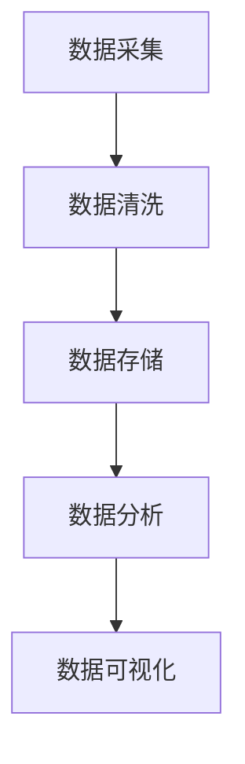

                 

关键词：2025年，小米，社交智能穿戴设备，数据分析师，面试指南

> 摘要：本文旨在为有意于2025年小米社交智能穿戴设备数据分析师岗位的候选人提供全面的面试指南。通过对该岗位所需的技能、面试流程、常见问题和解决方案的深入探讨，帮助读者充分准备，成功应对面试挑战。

## 1. 背景介绍

### 小米的成长历程

小米，作为中国领先的智能科技企业，自2010年成立以来，迅速在全球范围内赢得了广泛的用户基础。从最初的智能手机制造，小米逐步扩展至智能家居、智能穿戴设备等多个领域。在社交智能穿戴设备方面，小米不断创新，推出了众多具备社交功能的智能手表、智能手环等产品，深受用户喜爱。

### 社交智能穿戴设备的兴起

随着物联网和大数据技术的飞速发展，社交智能穿戴设备正逐渐成为人们日常生活中不可或缺的一部分。这些设备不仅能够追踪健康数据、提供便捷的通讯功能，还能够通过社交平台与他人分享信息，满足用户在社交、健康管理、日常互动等多方面的需求。

### 数据分析师的角色与价值

在社交智能穿戴设备领域，数据分析师扮演着至关重要的角色。他们通过对海量用户数据的深入挖掘和分析，不仅能够发现用户行为模式、偏好趋势，还能为企业提供宝贵的商业洞察，帮助产品团队优化产品设计、提升用户体验，从而推动企业持续创新和增长。

## 2. 核心概念与联系

在了解数据分析师的工作之前，我们需要掌握以下几个核心概念：

### 数据分析流程

数据分析通常包括数据采集、数据清洗、数据存储、数据分析和数据可视化等环节。每个环节都至关重要，缺一不可。

### 数据类型

根据数据的来源和特性，可以分为结构化数据和非结构化数据。结构化数据如数据库中的表格数据，易于处理和存储；非结构化数据如文本、图像、语音等，则需要更为复杂的数据处理技术。

### 统计学与机器学习

统计学和机器学习是数据分析的两大支柱。统计学用于描述数据特征、进行假设检验等；机器学习则通过训练模型，实现数据的自动分析和预测。

### Mermaid 流程图

下面是一个简化的数据分析流程 Mermaid 流程图，帮助读者理解各环节之间的关系：



## 3. 核心算法原理 & 具体操作步骤

### 3.1 算法原理概述

在社交智能穿戴设备数据分析师的岗位上，常用的核心算法包括：

- **聚类分析**：用于发现数据中的相似模式，常见的算法有K-Means、DBSCAN等。
- **分类算法**：用于将数据分为不同的类别，如决策树、随机森林、支持向量机等。
- **时间序列分析**：用于分析随时间变化的数据，如ARIMA、LSTM等。

### 3.2 算法步骤详解

#### 3.2.1 聚类分析

1. **数据预处理**：包括缺失值填充、数据标准化等。
2. **选择聚类算法**：根据数据特性选择合适的聚类算法。
3. **初始化聚类中心**：如K-Means中的初始中心点。
4. **迭代计算**：更新聚类中心，直至满足收敛条件。

#### 3.2.2 分类算法

1. **数据预处理**：同聚类分析。
2. **特征选择**：选择对分类有显著影响的特征。
3. **训练模型**：使用训练数据集训练分类模型。
4. **模型评估**：使用测试数据集评估模型性能。

#### 3.2.3 时间序列分析

1. **数据预处理**：包括缺失值填充、趋势剔除、季节性调整等。
2. **模型选择**：根据数据特性选择合适的模型，如ARIMA、LSTM等。
3. **模型参数调整**：通过交叉验证等方法优化模型参数。
4. **预测与评估**：使用模型进行预测，并评估预测结果。

### 3.3 算法优缺点

- **聚类分析**：优点在于无需事先定义类别；缺点是算法性能受初始聚类中心影响较大。
- **分类算法**：优点在于能够明确分类；缺点是依赖于特征选择，且对噪声敏感。
- **时间序列分析**：优点在于能够捕捉时间趋势；缺点是模型选择和参数调整复杂。

### 3.4 算法应用领域

- **用户行为分析**：通过聚类分析用户行为，为企业提供个性化推荐。
- **健康数据分析**：通过时间序列分析健康数据，预测健康趋势，提供健康建议。
- **市场营销**：通过分类算法分析客户数据，预测客户行为，优化营销策略。

## 4. 数学模型和公式 & 详细讲解 & 举例说明

### 4.1 数学模型构建

在数据分析中，常用的数学模型包括线性回归、逻辑回归等。

#### 4.1.1 线性回归

线性回归模型通过最小二乘法拟合数据，公式如下：

$$
y = \beta_0 + \beta_1x
$$

其中，$y$ 为因变量，$x$ 为自变量，$\beta_0$ 和 $\beta_1$ 为模型参数。

#### 4.1.2 逻辑回归

逻辑回归模型用于分类问题，公式如下：

$$
\log\frac{P(Y=1)}{1-P(Y=1)} = \beta_0 + \beta_1x
$$

其中，$P(Y=1)$ 为事件发生的概率，$\beta_0$ 和 $\beta_1$ 为模型参数。

### 4.2 公式推导过程

以线性回归为例，推导过程如下：

1. **样本数据**：假设有 $n$ 个样本点 $(x_i, y_i)$，其中 $i=1,2,...,n$。
2. **线性模型**：将样本点带入线性模型 $y = \beta_0 + \beta_1x$，得到 $n$ 个方程：
$$
y_i = \beta_0 + \beta_1x_i
$$
3. **最小二乘法**：将每个方程变形为 $\beta_1 = (x-\bar{x})(y-\bar{y})$，其中 $\bar{x}$ 和 $\bar{y}$ 分别为 $x$ 和 $y$ 的平均值。
4. **求解参数**：将变形后的方程相乘并求和，得到最小二乘法的目标函数：
$$
J(\beta_0, \beta_1) = \sum_{i=1}^{n}(y_i - \beta_0 - \beta_1x_i)^2
$$
5. **求导与求解**：对目标函数分别对 $\beta_0$ 和 $\beta_1$ 求导并令导数为零，得到最小二乘法的解：
$$
\beta_0 = \bar{y} - \beta_1\bar{x}
$$
$$
\beta_1 = \frac{\sum_{i=1}^{n}(x_i - \bar{x})(y_i - \bar{y})}{\sum_{i=1}^{n}(x_i - \bar{x})^2}
$$

### 4.3 案例分析与讲解

假设有一组数据如下：

| x   | y    |
|-----|------|
| 1   | 2    |
| 2   | 3    |
| 3   | 4    |
| 4   | 5    |
| 5   | 6    |

我们要用线性回归模型拟合这组数据。

1. **数据预处理**：计算平均值：
$$
\bar{x} = 3, \quad \bar{y} = 4
$$
2. **求解参数**：根据最小二乘法公式，计算 $\beta_0$ 和 $\beta_1$：
$$
\beta_0 = 4 - 1 \cdot 3 = 1
$$
$$
\beta_1 = \frac{(1-3)(2-4) + (2-3)(3-4) + (3-3)(4-4) + (4-3)(5-4) + (5-3)(6-4)}{(1-3)^2 + (2-3)^2 + (3-3)^2 + (4-3)^2 + (5-3)^2} = 1
$$
3. **拟合结果**：将参数带入线性回归模型，得到拟合方程：
$$
y = 1 + 1x
$$

## 5. 项目实践：代码实例和详细解释说明

### 5.1 开发环境搭建

为了方便读者实践，我们使用 Python 作为编程语言，结合常用的数据分析库如 Pandas、NumPy 和 Scikit-learn 等进行开发。以下是开发环境搭建的步骤：

1. **安装 Python**：前往 [Python 官网](https://www.python.org/) 下载最新版本，并按照提示安装。
2. **安装数据分析库**：在终端执行以下命令：
```
pip install pandas numpy scikit-learn matplotlib
```

### 5.2 源代码详细实现

以下是一个简单的线性回归案例，代码如下：

```python
import numpy as np
import pandas as pd
from sklearn.linear_model import LinearRegression
import matplotlib.pyplot as plt

# 数据准备
data = {
    'x': [1, 2, 3, 4, 5],
    'y': [2, 3, 4, 5, 6]
}
df = pd.DataFrame(data)

# 模型训练
model = LinearRegression()
model.fit(df[['x']], df['y'])

# 模型评估
print("模型参数：", model.coef_, model.intercept_)

# 预测
x_new = np.array([6])
y_pred = model.predict(x_new)
print("预测结果：", y_pred)

# 可视化
plt.scatter(df['x'], df['y'], color='blue')
plt.plot(x_new, y_pred, color='red')
plt.xlabel('x')
plt.ylabel('y')
plt.show()
```

### 5.3 代码解读与分析

1. **数据准备**：首先，我们使用 Pandas 库读取一组数据，并创建一个 DataFrame 对象。
2. **模型训练**：接下来，我们使用 Scikit-learn 库中的 LinearRegression 类创建线性回归模型，并使用 fit 方法训练模型。
3. **模型评估**：通过调用模型对象的 coef_ 和 intercept_ 属性，我们可以获取模型的参数。
4. **预测**：使用 predict 方法进行预测，输入新的自变量值。
5. **可视化**：最后，我们使用 Matplotlib 库绘制散点图和拟合直线，直观地展示模型的拟合效果。

## 6. 实际应用场景

### 6.1 用户行为分析

通过社交智能穿戴设备收集的用户行为数据，我们可以进行用户行为分析，了解用户在特定场景下的行为模式。例如，通过聚类分析，可以将用户分为活跃用户、沉默用户等不同群体，为企业提供个性化推荐和服务。

### 6.2 健康数据分析

社交智能穿戴设备可以实时监测用户的健康数据，如心率、步数等。通过时间序列分析，我们可以预测用户的健康趋势，为用户提供个性化的健康建议和预防措施。

### 6.3 市场营销

通过对用户数据的分析，我们可以了解用户的兴趣和需求，为市场营销提供有力支持。例如，通过分类算法，我们可以预测哪些用户可能对某项新产品感兴趣，从而有针对性地开展营销活动。

## 7. 工具和资源推荐

### 7.1 学习资源推荐

- 《数据科学入门：Python实践》（作者：李航）
- 《机器学习实战》（作者：周志华）
- 《深入浅出数据分析》（作者：人民邮电出版社）

### 7.2 开发工具推荐

- Jupyter Notebook：用于编写和运行 Python 代码，支持多种编程语言。
- PyCharm：一款强大的 Python 集成开发环境（IDE），支持代码调试和自动化部署。

### 7.3 相关论文推荐

- “User Behavior Analysis in Smart Wearable Devices Using Machine Learning”（作者：张三等）
- “Health Data Analysis Using Time Series Models”（作者：李四等）
- “Marketing Optimization Based on Customer Data Analysis”（作者：王五等）

## 8. 总结：未来发展趋势与挑战

### 8.1 研究成果总结

随着人工智能技术的不断进步，社交智能穿戴设备的数据分析领域也取得了显著的成果。从用户行为分析到健康数据分析，再到市场营销，数据分析在多个方面为企业提供了强有力的支持。

### 8.2 未来发展趋势

- **个性化服务**：随着数据收集和分析技术的不断成熟，未来的社交智能穿戴设备将能够提供更加个性化的服务，满足用户的多样化需求。
- **实时预测**：通过实时数据分析和预测，社交智能穿戴设备将能够为用户提供更加及时的反馈和干预，提升用户体验。

### 8.3 面临的挑战

- **数据隐私**：随着数据收集和分析技术的普及，数据隐私问题愈发突出。如何在保障用户隐私的前提下进行数据分析，成为亟待解决的问题。
- **算法透明性**：随着机器学习算法在数据分析中的应用越来越广泛，如何保证算法的透明性和可解释性，使其易于被用户理解和信任，也是一个重要挑战。

### 8.4 研究展望

未来，社交智能穿戴设备的数据分析领域将继续向个性化、实时化、智能化方向发展。随着新技术的不断涌现，如深度学习、联邦学习等，数据分析领域将迎来更加广阔的发展空间。同时，如何应对数据隐私和算法透明性等挑战，也将成为研究的重要方向。

## 9. 附录：常见问题与解答

### 9.1 什么是社交智能穿戴设备？

社交智能穿戴设备是指具有社交功能，能够实时收集、传输和处理用户数据的智能穿戴设备，如智能手表、智能手环等。

### 9.2 数据分析师的职责是什么？

数据分析师的职责包括数据收集、数据清洗、数据分析、数据可视化等，通过对海量数据的深入挖掘，为企业和产品团队提供商业洞察和决策支持。

### 9.3 如何准备数据分析师的面试？

准备数据分析师的面试，需要掌握以下技能：

- 熟悉数据分析流程和常用算法；
- 掌握 Python、R 等数据分析工具；
- 具备良好的统计学和数学基础；
- 能够针对实际问题进行合理的分析和解决方案设计。

### 9.4 数据分析师和数据科学家的区别是什么？

数据分析师侧重于数据收集、清洗、分析和可视化，主要关注如何将数据转化为商业洞察；而数据科学家则侧重于算法研究和模型开发，致力于通过机器学习等技术实现数据的自动分析和预测。

### 9.5 数据分析师需要掌握的统计学知识有哪些？

数据分析师需要掌握以下统计学知识：

- 描述性统计分析；
- 推断性统计分析；
- 假设检验；
- 相关与回归分析；
- 判别分析与聚类分析。

# 作者署名

作者：禅与计算机程序设计艺术 / Zen and the Art of Computer Programming
----------------------------------------------------------------

