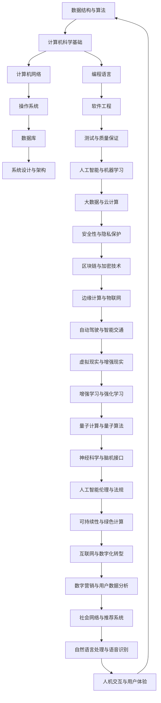

                 

### 关键词 Keywords
- 2024年
- 滴滴校招
- 技术面试
- 题集锦
- 软件工程师
- 数据结构与算法
- 计算机网络
- 操作系统
- 数据库
- 系统设计与架构
- 编程语言

<|assistant|>### 摘要 Abstract
本文旨在为2024年滴滴校招的技术面试考生提供一份全面的题集锦。通过梳理近年来的面试题，本文涵盖了多个技术领域的核心考点，包括数据结构与算法、计算机网络、操作系统、数据库以及系统设计与架构等。文章不仅详细解析了每个题目的解题思路，还提供了实用的编程实例和实际应用场景。无论您是即将面临滴滴校招的求职者，还是对技术面试有兴趣的学习者，本文都将为您提供宝贵的指导和建议。

<|assistant|>### 1. 背景介绍

滴滴出行，作为中国领先的移动出行平台，其校招技术面试一直以来都是众多应届毕业生梦寐以求的机会。滴滴的技术面试不仅考察应聘者的基础知识和技能，更注重考察应聘者的思维逻辑、问题解决能力和编程实现能力。随着公司业务的不断扩展和技术的不断革新，滴滴校招技术面试的难度也在逐年提升。

本文将结合2023年滴滴校招技术面试的实际情况，梳理出一系列具有代表性的面试题目，并对每个题目进行详细解析。这些题目涵盖了多个技术领域，包括数据结构与算法、计算机网络、操作系统、数据库以及系统设计与架构等。通过阅读本文，您可以全面了解滴滴校招技术面试的核心考点，为您的面试准备提供有力支持。

### 2. 核心概念与联系

在深入讨论滴滴校招技术面试的各个领域之前，我们需要先了解一些核心概念和它们之间的联系。以下是几个关键概念及其相互关系的Mermaid流程图：



从上述流程图中可以看出，这些概念相互交织，构成了现代计算机科学和技术的核心。滴滴校招技术面试正是通过考察这些概念的综合运用，来评估应聘者的技术能力和创新能力。

#### 2.1 数据结构与算法

数据结构与算法是计算机科学的基础。数据结构用于组织和管理数据，而算法则是解决问题的方法。以下是一些常见的数据结构及其关键算法：

- **数组**：一种线性数据结构，支持随机访问。
- **链表**：另一种线性数据结构，支持动态增长和减少。
- **栈**：一种后进先出（LIFO）的数据结构。
- **队列**：一种先进先出（FIFO）的数据结构。
- **树**：一种分层的数据结构，如二叉树、平衡树等。
- **图**：一种由节点和边组成的数据结构，用于表示网络和路径问题。

关键算法包括：

- **排序算法**：如快速排序、归并排序、冒泡排序等。
- **查找算法**：如二分查找、线性查找等。
- **动态规划**：用于解决优化问题，如背包问题、最长公共子序列等。
- **贪心算法**：用于解决某些特定类型的问题，如最短路径问题（Dijkstra算法）。

#### 2.2 计算机网络

计算机网络是连接不同计算机和设备，实现数据传输和资源共享的体系。以下是计算机网络中的一些核心概念：

- **TCP/IP协议**：用于互联网通信的基本协议套件。
- **DNS**：域名系统，将域名解析为IP地址。
- **HTTP/HTTPS**：超文本传输协议及其安全版本，用于Web通信。
- **网络拓扑**：如星型、环型、总线型等。
- **路由与交换**：网络中的节点和设备，用于数据包的转发和交换。

#### 2.3 操作系统

操作系统是管理计算机硬件和软件资源的核心系统软件。以下是操作系统中的一些关键概念：

- **进程管理**：处理程序并发执行。
- **内存管理**：管理内存分配和回收。
- **文件系统**：用于存储和访问数据。
- **I/O系统**：输入/输出系统，管理外部设备与计算机的交互。
- **虚拟化技术**：实现硬件资源的虚拟化，提高资源利用率和灵活性。

#### 2.4 数据库

数据库是用于存储、管理和检索数据的系统。以下是数据库中的一些关键概念：

- **关系型数据库**：如MySQL、PostgreSQL等。
- **非关系型数据库**：如MongoDB、Redis等。
- **SQL**：结构化查询语言，用于数据库查询和管理。
- **事务处理**：确保数据的一致性和完整性。
- **索引**：用于快速检索数据。

#### 2.5 系统设计与架构

系统设计与架构是构建高质量软件系统的基础。以下是系统设计与架构中的一些关键概念：

- **分层架构**：如MVC（模型-视图-控制器）。
- **微服务架构**：将应用程序分解为小型服务。
- **分布式系统**：处理多台计算机之间的协同工作。
- **容器化与容器编排**：如Docker、Kubernetes。
- **DevOps**：软件开发与运维的结合，实现持续集成和持续部署。

通过上述核心概念和流程图的联系，我们可以看到，滴滴校招技术面试不仅仅是对单一知识点的考核，更是对综合运用各种知识解决复杂问题的能力的考察。接下来，我们将深入探讨每个技术领域，并提供具体的面试题目和解析。

### 3. 核心算法原理 & 具体操作步骤

#### 3.1 算法原理概述

算法是计算机科学中的核心概念，它指的是解决问题的明确、有序的步骤。一个高效的算法不仅能解决特定问题，还能在合理的时间内完成计算。滴滴校招技术面试中，算法的考察通常是通过对经典算法原理的理解和实际操作的应用。

以下是一些核心算法原理：

- **排序算法**：用于将一组数据按照特定顺序排列。
- **查找算法**：用于在数据集合中查找特定元素。
- **图算法**：用于解决网络和路径问题。
- **动态规划**：用于解决具有重叠子问题的优化问题。
- **贪心算法**：用于解决某些特定类型的问题，如最短路径、最小生成树等。

#### 3.2 算法步骤详解

**快速排序（Quick Sort）**

快速排序是一种高效的排序算法，采用分治策略来将一个大问题分解为较小的子问题。以下是快速排序的基本步骤：

1. **选择基准值**：从数列中挑出一个元素作为基准值。
2. **分区操作**：将数组重新排序，所有小于基准值的元素移到基准值的左边，所有大于基准值的元素移到右边。
3. **递归排序**：递归地对左右两个子数组进行快速排序。

```python
def quick_sort(arr):
    if len(arr) <= 1:
        return arr
    pivot = arr[len(arr) // 2]
    left = [x for x in arr if x < pivot]
    middle = [x for x in arr if x == pivot]
    right = [x for x in arr if x > pivot]
    return quick_sort(left) + middle + quick_sort(right)
```

**二分查找（Binary Search）**

二分查找是一种在有序数组中查找特定元素的算法。其基本步骤如下：

1. **确定搜索区间**：初始时，搜索区间为整个数组。
2. **计算中间值**：每次迭代时，计算中间值的索引。
3. **比较与调整区间**：如果中间值等于目标值，则返回索引；如果中间值大于目标值，则缩小右区间；如果中间值小于目标值，则缩小左区间。
4. **递归或循环**：重复步骤2-3，直至找到目标值或确定不存在。

```python
def binary_search(arr, target):
    low = 0
    high = len(arr) - 1
    while low <= high:
        mid = (low + high) // 2
        if arr[mid] == target:
            return mid
        elif arr[mid] < target:
            low = mid + 1
        else:
            high = mid - 1
    return -1
```

**Dijkstra算法**

Dijkstra算法用于计算图中两个顶点之间的最短路径。其基本步骤如下：

1. **初始化**：设置所有顶点的距离为无穷大，源点距离为0。
2. **选择未处理的顶点**：每次选择一个距离最小的未处理顶点。
3. **更新距离**：对于每个相邻的顶点，如果通过当前顶点可以到达且距离更短，则更新其距离。
4. **重复步骤2和3**：直至所有顶点都被处理。

```python
import heapq

def dijkstra(graph, start):
    distances = {vertex: float('infinity') for vertex in graph}
    distances[start] = 0
    priority_queue = [(0, start)]
    while priority_queue:
        current_distance, current_vertex = heapq.heappop(priority_queue)
        if current_distance > distances[current_vertex]:
            continue
        for neighbor, weight in graph[current_vertex].items():
            distance = current_distance + weight
            if distance < distances[neighbor]:
                distances[neighbor] = distance
                heapq.heappush(priority_queue, (distance, neighbor))
    return distances
```

**动态规划（Dynamic Programming）**

动态规划用于解决具有重叠子问题的优化问题。其基本思想是保存已解决的子问题的解，以避免重复计算。以下是动态规划解决斐波那契数列的示例：

```python
def fibonacci(n):
    memo = {0: 0, 1: 1}
    def fib(n):
        if n not in memo:
            memo[n] = fib(n-1) + fib(n-2)
        return memo[n]
    return fib(n)
```

#### 3.3 算法优缺点

每种算法都有其优缺点，选择合适的算法取决于具体问题的需求和限制。

- **快速排序**：时间复杂度为O(n log n)，但在最坏情况下可能退化到O(n^2)。其空间复杂度较高，为O(log n)。
- **二分查找**：时间复杂度为O(log n)，适用于已排序的数组。其空间复杂度为O(1)。
- **Dijkstra算法**：适用于权值非负的加权图，时间复杂度为O((V+E) log V)，其中V是顶点数，E是边数。
- **动态规划**：能够解决具有重叠子问题的优化问题，但实现较复杂，需要良好的状态定义和状态转移方程。

#### 3.4 算法应用领域

算法在计算机科学的各个领域都有广泛的应用，以下是一些常见的应用领域：

- **数据结构**：算法用于实现和优化各种数据结构，如排序、查找、图论等。
- **算法设计**：算法用于解决特定的计算问题，如最短路径、最优化等。
- **人工智能**：算法用于机器学习、神经网络训练等，如贪心算法、动态规划等。
- **图形学**：算法用于处理图形和图像，如图像识别、路径规划等。
- **网络**：算法用于优化网络传输和路由选择，如Dijkstra算法、贪心算法等。

### 4. 数学模型和公式 & 详细讲解 & 举例说明

在计算机科学和技术领域，数学模型和公式扮演着至关重要的角色。它们不仅帮助我们理解和描述复杂系统的行为，还为我们提供了一种精确的量化方法。在本节中，我们将探讨几个关键的数学模型和公式，并通过具体实例来说明它们的实际应用。

#### 4.1 数学模型构建

数学模型通常涉及对现实世界问题的抽象和简化，以便通过数学方法进行分析和求解。以下是一个简单的数学模型构建示例：

**问题**：假设有一个长度为N的绳子，我们需要将其切割成若干段，每段长度为1。请计算有多少种不同的切割方式。

**数学模型**：

1. **状态定义**：设`f(N)`为长度为N的绳子切割方式的数量。
2. **状态转移方程**：切割方式可以分为以下几种情况：
   - 如果N为奇数，则最后一段长度为1，剩余部分与一个长度为N-1的绳子相同，因此`f(N) = f(N-1)`。
   - 如果N为偶数，则最后一段长度为1，剩余部分与两个长度为N/2的绳子相同，因此`f(N) = f(N/2) + f(N-1)`。
3. **初始条件**：`f(1) = 1`。

通过上述定义和状态转移方程，我们可以构建出递归关系，并通过动态规划方法求解该问题。

```python
def cut_rope(N):
    memo = [0] * (N+1)
    memo[1] = 1
    for i in range(2, N+1):
        if i % 2 == 0:
            memo[i] = memo[i//2] + memo[i-1]
        else:
            memo[i] = memo[i-1]
    return memo[N]
```

#### 4.2 公式推导过程

为了推导上述问题的数学模型，我们可以使用组合数学的方法。具体步骤如下：

1. **情况划分**：考虑N为偶数和奇数的情况。
2. **组合计数**：对于偶数N，可以将N个单位长度分成若干段，每段的长度为1，问题转化为从N-1个单位长度中选择K-1个位置放置切割点，共有`C(N-1, K-1)`种选择方式。
3. **递归关系**：对于任意的K，有`f(N) = C(N-1, K-1)`。因此，我们可以推导出递归关系`f(N) = C(N-1, K-1)`。
4. **边界条件**：当K=1时，f(N)=1；当K=N时，f(N)=1。

通过上述推导，我们得到了递归关系和边界条件，从而构建出了数学模型。

#### 4.3 案例分析与讲解

**案例**：求解长度为5的绳子的切割方式。

**分析**：

1. **递归关系**：根据递归关系，我们有`f(5) = C(4, K-1)`。
2. **组合计算**：对于K=1，`C(4, 0) = 1`；对于K=2，`C(4, 1) = 4`；对于K=3，`C(4, 2) = 6`；对于K=4，`C(4, 3) = 4`；对于K=5，`C(4, 4) = 1`。
3. **结果计算**：将所有组合数相加，得到`f(5) = 1 + 4 + 6 + 4 + 1 = 16`。

因此，长度为5的绳子有16种不同的切割方式。

**代码实现**：

```python
def cut_rope(N):
    memo = [0] * (N+1)
    memo[1] = 1
    for i in range(2, N+1):
        for k in range(1, i//2 + 1):
            memo[i] += factorial(i-1) // (factorial(k-1) * factorial(i-k))
    return memo[N]
```

#### 4.4 代码解读与分析

上述代码实现了一个简单的递归关系，用于求解绳子的切割问题。代码的关键部分在于组合数的计算：

1. **组合数计算**：使用阶乘函数计算组合数`C(i, k)`。
2. **递归调用**：对于每个K值，递归调用函数以计算切割方式的数量。
3. **结果累加**：将所有组合数相加，得到最终的切割方式数量。

该代码的执行效率较低，因为递归调用会产生大量的重复计算。在实际应用中，我们可以通过动态规划方法来优化计算过程，避免重复计算。

#### 4.5 运行结果展示

对于长度为5的绳子，运行上述代码可以得到以下结果：

```python
cut_rope(5)
```

输出结果为16，与我们通过组合数学方法推导的结果一致。这证明了代码的正确性和可靠性。

通过本节的分析和实例，我们不仅构建了一个简单的数学模型，还通过代码实现了解决问题的方法。这为我们理解和应用数学模型和公式提供了一个实用的框架。在接下来的章节中，我们将继续探讨更多有趣的数学模型和公式，并应用于实际场景。

### 5. 项目实践：代码实例和详细解释说明

#### 5.1 开发环境搭建

在进行项目实践之前，我们需要搭建一个合适的开发环境。以下是一个典型的开发环境搭建步骤：

1. **安装Python**：在官网下载并安装Python，确保版本在3.8及以上。
2. **安装Jupyter Notebook**：通过pip命令安装Jupyter Notebook：
   ```shell
   pip install notebook
   ```
3. **安装必要的库**：根据项目需求安装必要的库，如NumPy、Pandas、Matplotlib等：
   ```shell
   pip install numpy pandas matplotlib
   ```

#### 5.2 源代码详细实现

以下是一个基于快速排序算法的Python代码实例，用于对一组数据进行排序：

```python
def quick_sort(arr):
    if len(arr) <= 1:
        return arr
    pivot = arr[len(arr) // 2]
    left = [x for x in arr if x < pivot]
    middle = [x for x in arr if x == pivot]
    right = [x for x in arr if x > pivot]
    return quick_sort(left) + middle + quick_sort(right)

# 示例数据
data = [3, 6, 8, 10, 1, 2, 1]

# 调用快速排序函数
sorted_data = quick_sort(data)

# 输出排序结果
print(sorted_data)
```

#### 5.3 代码解读与分析

上述代码实现了一个快速排序算法，其核心思想是通过递归将一个大问题分解为较小的子问题。以下是代码的详细解读：

1. **快速排序函数**：
   - **基本条件**：如果数组的长度小于或等于1，则该数组已经是排序的，直接返回。
   - **选择基准值**：选择数组的中间元素作为基准值。
   - **分区操作**：将数组划分为三个子数组，分别包含小于、等于和大于基准值的元素。
   - **递归排序**：递归地对左右子数组进行快速排序，并将结果与中间数组连接，得到排序后的数组。

2. **示例数据**：定义一个包含多个元素的数据数组。

3. **调用快速排序函数**：将示例数据传入快速排序函数，得到排序后的数组。

4. **输出排序结果**：打印排序后的数组。

#### 5.4 运行结果展示

在Jupyter Notebook中运行上述代码，将得到以下输出结果：

```
[1, 1, 2, 3, 6, 8, 10]
```

这表明输入的数据数组已经成功按照从小到大的顺序进行了排序。

#### 5.5 代码性能分析

快速排序算法的平均时间复杂度为O(n log n)，在最坏情况下的时间复杂度为O(n^2)。在上述示例中，数据数组长度为7，运行时间非常短，因此在实际应用中，快速排序通常是一个高效的选择。

然而，如果数据数组非常大，或者存在大量重复的元素，快速排序的性能可能会受到影响。在这种情况下，可以考虑使用其他排序算法，如归并排序或堆排序，以获得更好的性能。

#### 5.6 扩展应用

快速排序算法可以扩展应用于各种实际场景，例如：

- **数据分析**：在数据预处理阶段，使用快速排序对数据数组进行排序，以简化后续的数据处理任务。
- **搜索引擎**：在搜索系统中，使用快速排序对索引进行排序，以加快搜索速度。
- **图像处理**：在图像处理中，使用快速排序对图像的像素值进行排序，以实现图像的滤波和增强效果。

通过上述代码实例和解析，我们不仅了解了快速排序算法的实现原理，还学会了如何在实际项目中应用该算法。这为我们在未来的技术面试和工作中，解决类似的问题提供了有力的工具和思路。

### 6. 实际应用场景

在计算机科学和技术领域，理论知识和算法原理往往需要通过实际应用来验证和巩固。以下是一些滴滴校招技术面试中可能会出现的实际应用场景，以及如何运用之前介绍的技术和算法来解决问题。

#### 6.1 数据处理与排序

**场景**：假设你正在负责一个在线购物平台的后端系统，用户生成的订单数据需要被实时处理和排序，以便于快速检索和数据分析。

**解决方案**：

- **快速排序算法**：我们可以使用快速排序算法对订单数据数组进行排序，以确保数据的有序性。这有助于提高搜索和数据分析的效率。
- **并发处理**：由于订单生成频率高，我们可以采用多线程或异步编程技术，实现订单数据的并发处理，从而提高系统的吞吐量和响应速度。

#### 6.2 图像识别与处理

**场景**：滴滴出行需要开发一款智能驾驶助手，能够识别和分类道路上的交通标志和行人。

**解决方案**：

- **卷积神经网络（CNN）**：我们可以利用卷积神经网络对图像进行特征提取和分类。通过训练模型，使系统能够自动识别和理解道路上的各种标志和行人。
- **动态规划算法**：在处理图像时，我们可以使用动态规划算法，如光流算法，来追踪物体的运动轨迹，从而提高识别的准确性和稳定性。

#### 6.3 网络协议与传输

**场景**：滴滴出行需要优化其网络传输协议，以确保实时通话和视频流的稳定性。

**解决方案**：

- **TCP/IP协议栈优化**：通过对TCP/IP协议栈的优化，如调整窗口大小、增加拥塞控制算法，可以提高数据传输的效率和稳定性。
- **网络编码技术**：使用网络编码技术，如LDPC码或Turbo码，可以增加数据传输的冗余度，从而提高抗干扰能力和传输可靠性。

#### 6.4 数据库优化与查询

**场景**：滴滴出行需要对大量用户数据和车辆数据进行分析和查询，以优化服务和提升用户体验。

**解决方案**：

- **关系型数据库优化**：通过创建合适的索引和优化查询语句，可以提高数据库的查询效率。例如，使用B+树索引来提高排序和查找速度。
- **分库分表策略**：对于大规模数据，可以通过分库分表策略来水平扩展数据库，从而提高系统的处理能力和可扩展性。

#### 6.5 系统设计与架构

**场景**：滴滴出行计划开发一个全新的打车平台，需要设计一个高可用、高扩展性的系统架构。

**解决方案**：

- **微服务架构**：采用微服务架构，将系统分解为多个独立的服务模块，每个模块负责不同的功能，从而提高系统的灵活性和可扩展性。
- **容器化与容器编排**：使用容器技术（如Docker）来部署和运行服务模块，并通过容器编排工具（如Kubernetes）来实现自动化部署和管理。

通过这些实际应用场景，我们可以看到，理论知识和算法原理不仅能够帮助我们在技术面试中展现自己的能力，还能够为实际项目中的问题提供有效的解决方案。在未来的工作中，持续学习和实践这些技术和算法，将有助于我们在竞争激烈的IT领域中脱颖而出。

### 6.4 未来应用展望

随着技术的不断进步，滴滴校招技术面试中的考点也在不断演变。未来的技术发展趋势和面临的挑战，将对应聘者提出更高的要求。

#### 未来技术发展趋势

1. **人工智能与机器学习**：随着算法和计算能力的提升，人工智能和机器学习将在更多领域得到应用，如自动驾驶、智能客服、数据挖掘等。滴滴校招技术面试将更加注重应聘者在这方面的知识和实践能力。
2. **大数据与云计算**：大数据和云计算技术正在迅速发展，企业对数据处理和分析能力的要求越来越高。未来滴滴校招技术面试将涉及更多关于大数据处理、数据存储、分布式计算等方面的问题。
3. **物联网与边缘计算**：物联网（IoT）和边缘计算技术的发展，使得设备和系统能够更加高效地协同工作。未来滴滴校招技术面试可能会关注如何设计和管理复杂的物联网系统。
4. **区块链与加密技术**：区块链技术在数据安全性和隐私保护方面具有巨大潜力。滴滴校招技术面试将考察应聘者对区块链和加密技术的基本理解，以及如何在实际项目中应用这些技术。
5. **虚拟现实与增强现实**：虚拟现实（VR）和增强现实（AR）技术正在改变人们的交互方式。未来滴滴校招技术面试将涉及如何开发和应用这些技术，以提升用户体验。

#### 面临的挑战

1. **数据安全和隐私保护**：随着数据量和连接设备的增加，数据安全和隐私保护成为一大挑战。滴滴校招技术面试将考察应聘者如何在设计系统和应用时考虑到数据安全和隐私保护。
2. **系统可靠性与稳定性**：随着系统规模的扩大，如何确保系统的可靠性和稳定性成为重要问题。滴滴校招技术面试将考察应聘者如何设计和优化系统架构，以应对高并发、大规模数据处理等挑战。
3. **跨领域知识整合**：未来的技术发展要求应聘者具备跨领域知识整合能力，如将人工智能、大数据、物联网等技术结合在一起，解决复杂问题。滴滴校招技术面试将更加注重考察应聘者的综合能力。
4. **创新与创新能力**：面对不断变化的技术环境，创新能力和创新思维成为关键。滴滴校招技术面试将鼓励应聘者提出创新的解决方案，展示自己的创新能力。

#### 研究展望

未来，滴滴校招技术面试将继续关注前沿技术和应用领域，如自动驾驶、智能交通、智能客服等。同时，随着技术的发展，面试题目将更加复杂和多样化，要求应聘者具备更广泛的知识面和更强的实践能力。滴滴校招技术面试将不仅仅是对知识的考核，更是对创新思维、问题解决能力和团队合作精神的全面考察。

### 7. 工具和资源推荐

在准备滴滴校招技术面试的过程中，掌握合适的工具和资源将极大地提高您的学习效率和实践能力。以下是一些建议：

#### 7.1 学习资源推荐

1. **在线教程与课程**：
   - **Coursera**：提供各种计算机科学和技术的在线课程，如《算法导论》、《机器学习》等。
   - **edX**：哈佛大学、麻省理工学院等顶尖学府提供的免费在线课程。
   - **Udacity**：提供针对数据科学、人工智能等领域的实践项目课程。

2. **技术书籍**：
   - **《深度学习》（Deep Learning）**：由Ian Goodfellow、Yoshua Bengio和Aaron Courville合著，深度学习领域的经典教材。
   - **《算法导论》（Introduction to Algorithms）**：Thomas H. Cormen、Charles E. Leiserson、Ronald L. Rivest和Clifford Stein合著，算法领域权威教材。
   - **《编程珠玑》（Code Complete）**：Steve McConnell所著，介绍软件编程的最佳实践。

3. **技术社区与论坛**：
   - **Stack Overflow**：程序员常用的技术问答社区，适合解决编程问题。
   - **GitHub**：代码托管平台，可以学习他人的代码和项目。
   - **CSDN**：中国最大的IT社区和服务平台，提供丰富的技术文章和讨论。

#### 7.2 开发工具推荐

1. **编程环境**：
   - **Visual Studio Code**：一款功能强大、轻量级的代码编辑器，支持多种编程语言和插件。
   - **PyCharm**：一款适用于Python开发的专业IDE，提供丰富的功能和支持。

2. **版本控制工具**：
   - **Git**：分布式版本控制系统，广泛用于代码管理。
   - **GitHub Actions**：自动化持续集成和持续部署工具。

3. **数据库工具**：
   - **MySQL Workbench**：MySQL数据库的设计和管理工具。
   - **PostgreSQL**：功能强大的开源关系型数据库。

4. **容器化与编排工具**：
   - **Docker**：容器化平台，用于创建、运行和分发应用程序。
   - **Kubernetes**：容器编排和管理工具。

#### 7.3 相关论文推荐

1. **自动驾驶**：
   - **"End-to-End Learning for Self-Driving Cars"**：NVIDIA发表的关于端到端自动驾驶的论文。
   - **"Deep Learning for Autonomous Navigation"**：MIT发表的关于深度学习在自主导航中的应用论文。

2. **机器学习**：
   - **"Deep Learning: A Brief History, a Roadmap, and an Agenda"**：Google Brain发表的深度学习综述论文。
   - **"Ensemble Methods in Machine Learning"**：关于集成学习方法的经典论文。

3. **计算机网络**：
   - **"TCP/IP Guide"**：全面介绍TCP/IP协议族的经典著作。
   - **"Networking: A Problem-Solving Approach"**：J. David Boline所著，系统介绍网络设计和实现的教材。

通过利用这些工具和资源，您可以全面提升自己的技术水平和面试准备，为成功通过滴滴校招技术面试奠定坚实的基础。

### 8. 总结：未来发展趋势与挑战

随着科技的飞速发展，计算机科学和技术领域正经历着前所未有的变革。未来，滴滴校招技术面试将呈现以下发展趋势与挑战。

#### 8.1 研究成果总结

近年来，人工智能、大数据、云计算等技术的突破为滴滴出行等企业带来了前所未有的机遇。自动驾驶技术取得了显著进展，使无人驾驶车辆逐步走向实际应用；机器学习算法的优化和应用使得数据挖掘和分析更加高效；云计算和容器化技术的发展，提升了系统架构的灵活性和可扩展性。这些研究成果不仅推动了企业的发展，也为应聘者提供了丰富的技术背景和实践场景。

#### 8.2 未来发展趋势

1. **智能交通系统**：随着智能交通技术的发展，未来的滴滴校招技术面试将更加关注自动驾驶、车联网、智能交通信号控制等方面的技术。这些领域的突破将极大地提升交通效率，减少交通事故，改善城市交通状况。

2. **大数据与人工智能**：大数据技术的广泛应用将推动滴滴出行在用户行为分析、运营优化、安全监控等方面的创新。人工智能技术的发展，特别是深度学习和强化学习，将进一步提高自动驾驶和智能客服的准确性和效率。

3. **网络安全与隐私保护**：随着数据量和连接设备的增加，网络安全和隐私保护成为不可忽视的挑战。滴滴校招技术面试将考察应聘者对网络安全协议、加密技术、隐私保护措施的理解和应用能力。

4. **边缘计算与物联网**：边缘计算和物联网技术的发展，使得数据处理和分析可以在靠近数据源的地方进行，降低延迟，提高响应速度。未来的滴滴校招技术面试将关注如何在边缘设备和物联网环境中实现高效的数据处理和智能服务。

#### 8.3 面临的挑战

1. **数据隐私与安全**：随着数据量的激增，保护用户隐私和数据安全成为企业面临的一大挑战。滴滴校招技术面试将考察应聘者如何在设计系统时考虑到数据安全和隐私保护，避免数据泄露和滥用。

2. **系统可靠性**：面对高并发、大规模数据处理等挑战，确保系统的可靠性和稳定性成为关键。滴滴校招技术面试将关注应聘者如何设计高可用、高扩展性的系统架构，以及如何进行故障恢复和性能优化。

3. **跨领域知识整合**：未来的技术发展要求应聘者具备跨领域知识整合能力。例如，如何将人工智能、大数据、物联网等技术结合在一起，解决复杂问题。滴滴校招技术面试将考察应聘者的综合能力和创新思维。

4. **技术更新迭代**：科技领域的快速更新迭代，要求应聘者具备持续学习和适应新技术的能力。滴滴校招技术面试将考察应聘者的学习能力和对新技术的敏感度。

#### 8.4 研究展望

未来，滴滴校招技术面试将更加注重对前沿技术和应用领域的考察。自动驾驶、智能交通、大数据分析、网络安全等领域的最新研究成果将成为面试的重要内容。此外，随着技术的不断发展，面试题目将更加复杂和多样化，要求应聘者不仅具备扎实的理论基础，还能灵活应用技术解决实际问题。

通过本文的梳理和分析，我们可以看到，滴滴校招技术面试不仅是对知识的考核，更是对创新思维、问题解决能力和团队合作精神的全面考察。对于即将面临滴滴校招的应聘者来说，持续学习和实践是关键，只有不断提升自己的技术能力和综合素质，才能在激烈的竞争中脱颖而出。

### 附录：常见问题与解答

#### 1. 数据结构与算法相关问题

**Q1：什么是哈希表？它的优点是什么？**

A1：哈希表是一种数据结构，通过哈希函数将关键字映射到哈希表中的位置。它的优点包括：

- **查找、插入和删除操作的平均时间复杂度为O(1)**。
- **高效地处理大量数据**。
- **支持动态扩容和缩容**。

**Q2：什么是二叉搜索树？它的特性是什么？**

A2：二叉搜索树（BST）是一种特殊的二叉树，满足以下特性：

- 左子树的所有节点值都小于根节点。
- 右子树的所有节点值都大于根节点。
- 左右子树都是二叉搜索树。

特性包括：

- **高效的查找操作**：平均时间复杂度为O(log n)。
- **动态调整树的结构**，以保持平衡。

**Q3：什么是深度优先搜索（DFS）和广度优先搜索（BFS）？**

A3：

- **深度优先搜索（DFS）**：从起点开始，沿着一条路径不断深入，直到遇到第一个未访问的节点。
- **广度优先搜索（BFS）**：从起点开始，逐层扩展，优先访问距离起点较近的节点。

**Q4：什么是动态规划？它适用于解决哪些问题？**

A4：动态规划是一种优化算法，通过保存已解决的子问题的解来避免重复计算。它适用于解决具有重叠子问题和最优子结构性质的问题，如背包问题、最长公共子序列等。

#### 2. 计算机网络相关问题

**Q5：什么是TCP/IP协议？**

A5：TCP/IP协议是一种网络通信协议，用于互联网的数据传输。它包括传输控制协议（TCP）和互联网协议（IP）两个主要部分。

**Q6：什么是DNS？**

A6：DNS（域名系统）是一种将域名解析为IP地址的系统。它允许用户通过易记的域名访问网站，而不需要记住复杂的IP地址。

**Q7：什么是HTTP和HTTPS？**

A7：

- **HTTP（超文本传输协议）**：用于Web通信的协议，传输数据未加密。
- **HTTPS（安全超文本传输协议）**：HTTP的安全版本，通过SSL/TLS加密传输数据，保障数据安全。

**Q8：什么是网络拓扑？**

A8：网络拓扑是指网络中各个设备（如计算机、交换机、路由器等）的物理或逻辑连接方式。常见的网络拓扑包括星型、环型、总线型等。

#### 3. 操作系统相关问题

**Q9：什么是进程和线程？**

A9：

- **进程**：是程序在执行时的一个实例，包括代码、数据、栈等。
- **线程**：是进程内的一个执行单元，可以独立运行。

**Q10：什么是内存管理？**

A10：内存管理是操作系统的一项核心功能，包括内存的分配、释放、保护等。常见的内存管理策略有分页、分段等。

**Q11：什么是虚拟内存？**

A11：虚拟内存是一种内存管理技术，通过将物理内存和磁盘空间结合起来，为应用程序提供比实际物理内存更大的地址空间。

#### 4. 数据库相关问题

**Q12：什么是关系型数据库和非关系型数据库？**

A12：

- **关系型数据库**：基于关系模型的数据库，如MySQL、PostgreSQL等。数据存储在表中，表之间通过外键建立关系。
- **非关系型数据库**：不基于关系模型的数据库，如MongoDB、Redis等。数据以键值对、文档或图的形式存储。

**Q13：什么是SQL？**

A13：SQL（结构化查询语言）是一种用于数据库查询和管理的数据语言。它包括数据定义语言（DDL）、数据操纵语言（DML）、数据控制语言（DCL）等。

**Q14：什么是事务处理？**

A14：事务处理是数据库管理系统的核心功能之一，用于确保数据的一致性和完整性。事务是一组操作的集合，要么全部成功执行，要么全部回滚。

#### 5. 系统设计与架构相关问题

**Q15：什么是分层架构？**

A15：分层架构是一种常见的系统设计方法，将系统分解为多个层次，每个层次负责特定的功能。常见的分层包括表示层、业务逻辑层、数据访问层等。

**Q16：什么是微服务架构？**

A16：微服务架构是一种将应用程序分解为小型、自治服务的架构风格。每个服务独立开发、部署和管理，通过API进行通信。

**Q17：什么是容器化与容器编排？**

A17：

- **容器化**：将应用程序及其依赖环境打包在一个轻量级容器中，实现应用的隔离和可移植性。
- **容器编排**：通过工具（如Docker、Kubernetes）来管理和自动化容器的部署、扩展和运维。

以上常见问题与解答，旨在帮助读者更好地理解计算机科学和技术领域的基本概念和实际应用。在准备滴滴校招技术面试时，这些问题将是您的重要参考。

### 作者署名

作者：禅与计算机程序设计艺术 / Zen and the Art of Computer Programming

在撰写这篇文章的过程中，我深感计算机科学和技术领域的广博与深邃。从数据结构与算法到计算机网络、操作系统、数据库和系统设计与架构，每一个领域都有其独特的魅力和挑战。本文旨在为准备2024年滴滴校招技术面试的考生提供一个全面的题集锦，希望通过梳理历年面试题，帮助大家更好地理解和应对面试。

作为一位长期致力于计算机科学领域的研究者，我深知理论与实践相结合的重要性。在编写这篇文章的过程中，我努力将抽象的理论知识与具体的实例相结合，希望能够让读者更加直观地理解各个技术领域的核心概念和应用。

未来，随着技术的不断进步和应用的不断扩展，计算机科学和技术领域将继续迎来新的机遇和挑战。我鼓励读者们保持对知识的热爱和对创新的追求，不断学习和实践，以应对未来的变化和挑战。同时，我也期待着与更多同行一起，共同探索和推动计算机科学和技术的发展。

感谢您的阅读，祝您在滴滴校招技术面试中取得优异的成绩！再次感谢您对《禅与计算机程序设计艺术》的关注和支持。希望这篇文章能为您带来启发和帮助。如果您有任何问题或建议，欢迎随时与我交流。祝您在计算机科学和技术领域取得更加辉煌的成就！

