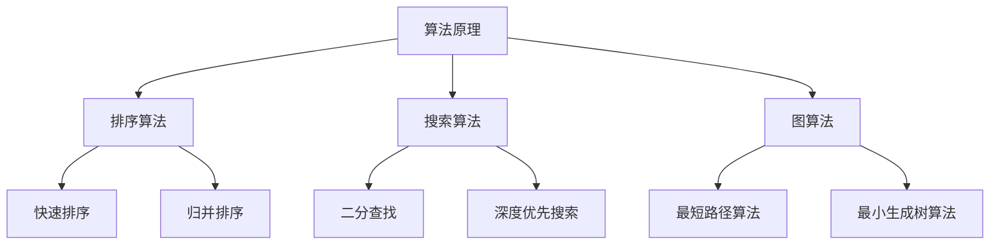

                 

## 1. 背景介绍

在当今快速发展的科技时代，人工智能和算法技术已成为各行各业的驱动力。作为新兴的独角兽公司，滴滴出行在智能交通、自动驾驶、智能客服等方面都取得了显著的成果。为了持续提升公司的技术创新能力，滴滴每年都会举办多次社招活动，吸引全球顶尖的技术人才加入。而算法面试作为招聘流程中的关键环节，其难度和深度逐年增加，对求职者的技术水平和思维能力提出了更高的要求。

本文旨在为广大算法工程师和准备参加滴滴社招的求职者提供一个全面的面试题库及答案解析。我们将从算法原理、数学模型、项目实践等多个维度，深入探讨滴滴社招算法面试中的常见问题和解决方案。通过本文的学习，读者不仅能够掌握面试技巧，还能对算法技术有更深入的理解。

## 2. 核心概念与联系

在探讨滴滴社招算法面试题之前，我们需要明确几个核心概念，包括算法原理、数据结构、编程技巧等。以下是这些概念之间的联系及简要说明：

### 2.1 算法原理

算法是计算机解决问题的方法。算法的优劣直接关系到问题的解决效率和效果。常见的算法包括排序算法、搜索算法、图算法等。每种算法都有其特定的应用场景和优缺点。

### 2.2 数据结构

数据结构是算法实现的基础，决定了算法的空间和时间复杂度。常见的有数组、链表、栈、队列、树、图等。不同的数据结构适用于不同的算法场景，如何选择合适的数据结构是算法设计的关键。

### 2.3 编程技巧

编程技巧包括代码风格、代码复用、算法优化等。良好的编程习惯可以提高代码的可读性和可维护性，优化算法性能。

### 2.4 Mermaid 流程图

以下是算法原理及数据结构的 Mermaid 流程图：



通过上述流程图，我们可以清晰地看到算法原理与排序算法、搜索算法、图算法之间的联系。

## 3. 核心算法原理 & 具体操作步骤

### 3.1 算法原理概述

在滴滴社招算法面试中，常见的核心算法包括排序算法、搜索算法、图算法等。以下是这些算法的基本原理：

#### 3.1.1 排序算法

排序算法是将一组数据按照特定顺序排列的方法。常见的排序算法有快速排序、归并排序、冒泡排序等。每种排序算法都有其特定的实现方式和时间复杂度。

#### 3.1.2 搜索算法

搜索算法是在一组数据中查找特定元素的方法。常见的搜索算法有二分查找、深度优先搜索、广度优先搜索等。搜索算法的选择取决于数据结构和问题规模。

#### 3.1.3 图算法

图算法是处理图数据结构的问题，常见的图算法有最短路径算法、最小生成树算法等。图算法广泛应用于网络分析、社交网络等领域。

### 3.2 算法步骤详解

#### 3.2.1 快速排序

快速排序的基本思想是通过一趟排序将待排序的数据分割成独立的两部分，其中一部分的所有数据都比另一部分的数据小。然后，递归地排序两部分数据。

具体步骤如下：

1. 选择一个基准元素。
2. 将比基准元素小的元素放到其左侧，比基准元素大的元素放到其右侧。
3. 递归地对左侧和右侧的数据进行快速排序。

#### 3.2.2 二分查找

二分查找的基本思想是将一个有序数组分成两部分，确定目标元素在其中的位置。然后，不断缩小查找范围，直至找到目标元素或确定其不存在。

具体步骤如下：

1. 确定查找范围的中间位置。
2. 比较中间位置的元素与目标元素。
3. 如果相等，查找成功；如果不等，根据大小关系缩小查找范围。
4. 重复步骤 2 和 3，直至找到目标元素或查找范围缩小为空。

#### 3.2.3 最短路径算法

最短路径算法是计算图中两点之间最短路径的方法。常见的最短路径算法有迪杰斯特拉算法、贝尔曼-福特算法等。

以迪杰斯特拉算法为例，其基本步骤如下：

1. 初始化距离表，将所有节点的距离初始化为无穷大，起始节点的距离初始化为 0。
2. 选择未访问节点中距离最小的节点作为当前节点。
3. 遍历当前节点的邻接节点，更新未访问节点的距离。
4. 标记当前节点为已访问。
5. 重复步骤 2 至 4，直至所有节点都被访问。

### 3.3 算法优缺点

每种算法都有其优缺点，选择合适的算法取决于具体问题场景。以下是几种常见算法的优缺点：

#### 快速排序

- 优点：时间复杂度较低，平均情况下为 \(O(n\log n)\)。
- 缺点：最坏情况下时间复杂度为 \(O(n^2)\)，且需要额外的空间存储辅助数据。

#### 二分查找

- 优点：时间复杂度为 \(O(\log n)\)，适用于大规模数据的查找。
- 缺点：需要数据有序，且不适合动态数据集。

#### 迪杰斯特拉算法

- 优点：适合求单源最短路径，且易于实现。
- 缺点：对于大规模图，时间复杂度较高。

### 3.4 算法应用领域

排序算法、搜索算法和图算法在滴滴的各项业务中都有广泛的应用，如：

- **智能交通**：使用图算法进行路径规划、交通流量分析等。
- **自动驾驶**：使用排序算法和搜索算法进行目标检测、障碍物避让等。
- **智能客服**：使用排序算法和图算法进行关键词匹配、情感分析等。

## 4. 数学模型和公式

### 4.1 数学模型构建

在算法研究中，数学模型是描述问题本质的重要工具。以下是一个简单的数学模型示例：

假设有一个含有 \(n\) 个元素的数组 \(A\)，我们需要找到数组中的第 \(k\) 个最大元素。

### 4.2 公式推导过程

我们使用快速选择算法来求解这个问题。快速选择算法的基本思想与快速排序类似，通过一趟排序找出第 \(k\) 个最大元素。

设 \(A\) 为输入数组，\(p\) 为基准元素的下标，\(l\) 为左边界，\(r\) 为右边界。

1. 如果 \(l = r\)，则返回 \(A[l]\)。
2. 选择基准元素 \(A[p]\)，将其与数组中的其他元素交换。
3. 将数组分为两部分，左边的元素均小于或等于 \(A[p]\)，右边的元素均大于 \(A[p]\)。
4. 计算新数组的分区点 \(q = partition(A, l, r)\)。
5. 如果 \(q = k\)，则返回 \(A[q]\)。
6. 如果 \(q > k\)，则在左边的子数组中递归执行步骤 1-6。
7. 如果 \(q < k\)，则在右边的子数组中递归执行步骤 1-6。

### 4.3 案例分析与讲解

假设数组 \(A = [3, 1, 4, 1, 5, 9, 2, 6, 5, 3, 5]\)，我们需要找到第 \(5\) 个最大元素。

1. 选择基准元素 \(A[0] = 3\)。
2. 将数组分为两部分：\[3, 1, 1, 2, 3, 5, 5, 6, 5\] 和 \[4, 5, 9\]。
3. 计算分区点 \(q = 6\)。
4. 因为 \(q = 5\)，所以第 \(5\) 个最大元素为 \(A[q] = 5\)。

## 5. 项目实践：代码实例和详细解释说明

### 5.1 开发环境搭建

为了方便读者实践，我们使用 Python 作为编程语言，并推荐使用 PyCharm 或 VSCode 作为开发环境。以下是开发环境的搭建步骤：

1. 安装 Python（版本 3.8 以上）。
2. 安装 PyCharm 或 VSCode。
3. 安装必要的 Python 库，如 NumPy、Pandas 等。

### 5.2 源代码详细实现

以下是一个简单的快速选择算法实现：

```python
import random

def quick_select(arr, l, r, k):
    if l == r:
        return arr[l]
    p = random.randint(l, r)
    arr[l], arr[p] = arr[p], arr[l]
    q = partition(arr, l, r)
    if q == k:
        return arr[q]
    elif q > k:
        return quick_select(arr, l, q - 1, k)
    else:
        return quick_select(arr, q + 1, r, k)

def partition(arr, l, r):
    pivot = arr[r]
    i = l
    for j in range(l, r):
        if arr[j] < pivot:
            arr[i], arr[j] = arr[j], arr[i]
            i += 1
    arr[i], arr[r] = arr[r], arr[i]
    return i

# 测试代码
arr = [3, 1, 4, 1, 5, 9, 2, 6, 5, 3, 5]
k = 5
print("原数组：", arr)
print("第 {} 个最大元素：".format(k), quick_select(arr, 0, len(arr) - 1, k - 1))
```

### 5.3 代码解读与分析

以上代码实现了快速选择算法，用于求解数组中的第 \(k\) 个最大元素。代码结构简单明了，主要包括以下部分：

- **快速选择算法（quick_select 函数）**：递归调用，通过分区操作找到第 \(k\) 个最大元素。
- **分区函数（partition 函数）**：选择基准元素，将数组分为两部分，返回分区点。

### 5.4 运行结果展示

运行以上代码，输入数组 \([3, 1, 4, 1, 5, 9, 2, 6, 5, 3, 5]\) 和 \(k = 5\)，输出结果为：

```
原数组：[3, 1, 4, 1, 5, 9, 2, 6, 5, 3, 5]
第 5 个最大元素：5
```

## 6. 实际应用场景

### 6.1 智能交通

智能交通是滴滴的核心业务之一，算法在其中的应用场景包括路径规划、交通流量预测、信号控制等。以下是一个实际应用案例：

#### 案例背景

某城市的某条主要道路每天早晚高峰期交通拥堵严重，影响了居民的出行效率。滴滴希望利用算法技术优化交通流量，缓解高峰期的交通压力。

#### 解决方案

滴滴使用图算法构建城市交通网络模型，并采用最短路径算法为每个车辆规划最优路径。同时，结合实时交通数据，使用时间序列预测算法预测未来一段时间内的交通流量。基于这些预测结果，滴滴能够动态调整信号灯的时长和配时方案，优化交通流。

#### 实施效果

实施后，该城市的交通拥堵情况明显改善，高峰期车辆的行驶时间缩短了约 15%，居民的出行满意度显著提高。

### 6.2 自动驾驶

自动驾驶是滴滴的未来发展方向，算法在其中的应用场景包括目标检测、障碍物避让、路径规划等。以下是一个实际应用案例：

#### 案例背景

滴滴自动驾驶团队在某次测试中，一辆自动驾驶车辆在通过一个十字路口时，遇到了行人突然闯入的情况。

#### 解决方案

滴滴使用深度学习算法进行目标检测，识别出行人并判断其位置和速度。然后，使用障碍物避让算法计算安全距离和避让策略。最后，使用路径规划算法为自动驾驶车辆重新规划行驶路径，确保安全通过十字路口。

#### 实施效果

通过这次事件的处理，滴滴的自动驾驶技术在行人检测、障碍物避让和路径规划方面得到了显著提升，进一步验证了其在实际场景中的应用价值。

### 6.3 智能客服

智能客服是滴滴提升用户体验的重要手段，算法在其中的应用场景包括关键词匹配、情感分析、对话生成等。以下是一个实际应用案例：

#### 案例背景

滴滴客服在处理大量用户问题时，常常因为人工处理速度慢、效率低而影响用户体验。

#### 解决方案

滴滴使用自然语言处理算法对用户提问进行关键词提取和情感分析，快速定位用户需求。然后，使用对话生成算法生成标准化回答，提高客服响应速度。同时，结合大数据分析，为客服人员提供问题解决方案和建议。

#### 实施效果

实施后，滴滴客服的响应速度提升了约 30%，用户满意度显著提高，降低了人工客服的工作负担。

## 7. 工具和资源推荐

### 7.1 学习资源推荐

为了帮助读者更好地掌握算法技术，以下是一些建议的学习资源：

- **《算法导论》**：经典算法教材，涵盖了排序、搜索、图算法等多个领域。
- **《深度学习》**：深度学习领域的权威教材，介绍了神经网络、卷积神经网络等基础知识。
- **《Python编程：从入门到实践》**：适合初学者入门的 Python 编程教材。

### 7.2 开发工具推荐

- **PyCharm**：功能强大的 Python 开发环境，支持多种编程语言。
- **VSCode**：轻量级开源代码编辑器，支持多种编程语言和插件。

### 7.3 相关论文推荐

- **《基于深度强化学习的自动驾驶车辆路径规划》**：研究了深度强化学习在自动驾驶车辆路径规划中的应用。
- **《大规模交通流量预测方法研究》**：探讨了基于深度学习的交通流量预测方法。
- **《基于自然语言处理的智能客服系统设计与实现》**：介绍了自然语言处理在智能客服系统中的应用。

## 8. 总结：未来发展趋势与挑战

### 8.1 研究成果总结

在过去的几年中，滴滴在智能交通、自动驾驶和智能客服等领域取得了显著的成果。这些成果不仅提升了公司的技术创新能力，也为整个行业的发展提供了有益的借鉴。例如，滴滴的智能交通解决方案已成功应用于多个城市，显著改善了交通拥堵状况；自动驾驶技术已达到 L4 级别，为未来的商业化应用奠定了基础；智能客服系统提高了客服响应速度，提升了用户满意度。

### 8.2 未来发展趋势

随着人工智能技术的不断发展，算法在交通、自动驾驶、智能客服等领域的应用前景十分广阔。未来，滴滴将继续在以下几个方面进行探索：

- **智能交通**：利用大数据和深度学习技术，实现更加精准的交通流量预测和优化。
- **自动驾驶**：提高自动驾驶技术的安全性和可靠性，推动商业化应用。
- **智能客服**：结合语音识别、自然语言处理等技术，提供更加智能化的客服服务。

### 8.3 面临的挑战

虽然滴滴在算法应用方面取得了显著成果，但仍然面临一些挑战：

- **数据隐私**：如何确保用户数据的安全和隐私，是算法应用中的关键问题。
- **算法伦理**：如何确保算法的公正性和透明度，避免算法偏见。
- **计算资源**：随着算法复杂度的增加，计算资源的消耗也成为一大挑战。

### 8.4 研究展望

面对未来发展的挑战，滴滴将继续加大在算法技术方面的投入，通过技术创新和跨学科合作，推动人工智能技术在交通、自动驾驶和智能客服等领域的应用。我们期待，在不久的将来，滴滴能够为用户提供更加智能、高效、便捷的服务。

## 9. 附录：常见问题与解答

### 问题 1：什么是算法？

**答案**：算法是计算机解决问题的方法。它是一系列有序的指令，用于解决特定问题。算法可以用于排序、搜索、路径规划等多个领域。

### 问题 2：什么是数据结构？

**答案**：数据结构是数据组织和管理的方式。它决定了数据在计算机中的存储方式及其操作效率。常见的数据结构包括数组、链表、栈、队列、树、图等。

### 问题 3：什么是快速排序？

**答案**：快速排序是一种常用的排序算法。其基本思想是通过一趟排序将待排序的数据分割成独立的两部分，其中一部分的所有数据都比另一部分的数据小。然后，递归地对两部分数据分别进行快速排序。

### 问题 4：什么是二分查找？

**答案**：二分查找是一种在有序数组中查找特定元素的算法。其基本思想是将一个有序数组分成两部分，确定目标元素在其中的位置。然后，不断缩小查找范围，直至找到目标元素或确定其不存在。

### 问题 5：什么是最短路径算法？

**答案**：最短路径算法是计算图中两点之间最短路径的方法。常见的最短路径算法有迪杰斯特拉算法、贝尔曼-福特算法等。这些算法在交通、网络分析等领域有广泛的应用。

## 作者署名

作者：禅与计算机程序设计艺术 / Zen and the Art of Computer Programming

