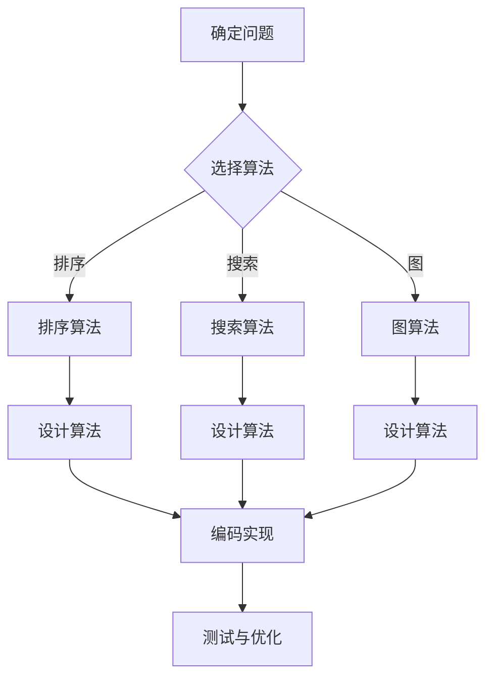

                 

“时光如白驹过隙，转眼间我们已走进2025年。在这一年，百度社招算法面试题库及答案成为众多求职者的心头病。本文将详细解析这些面试题，帮助大家顺利通关。”
## 关键词 Keywords

- 百度社招
- 算法面试
- 面试题库
- 答案解析
- 求职策略

## 摘要 Abstract

本文旨在为2025年百度社招算法面试的求职者提供一份详细的面试题库及答案解析。通过对算法面试的核心知识点、常见题型、解题思路及答案进行全面梳理，帮助求职者掌握面试技巧，顺利通过面试。

## 1. 背景介绍

随着人工智能技术的快速发展，算法工程师成为了互联网公司争抢的人才。百度作为我国领先的搜索引擎公司，其社招算法面试题库更是备受关注。本文将根据2025年百度社招算法面试的真实题库，为大家提供详细的解析和答案，旨在帮助求职者更好地备战面试。

## 2. 核心概念与联系

### 2.1 算法原理

算法（Algorithm）是计算机科学中用于解决特定问题的一系列步骤。算法可以分为多种类型，如排序算法、搜索算法、图算法等。算法的设计和实现是算法工程师的核心技能。

### 2.2 数据结构

数据结构是算法的基础，它定义了数据在计算机中的存储方式和操作方式。常见的数据结构包括数组、链表、栈、队列、树、图等。熟练掌握各种数据结构对于解决复杂问题是至关重要的。

### 2.3 Mermaid 流程图

以下是一个简单的 Mermaid 流程图，展示了算法设计与实现的基本流程：



## 3. 核心算法原理 & 具体操作步骤

### 3.1 算法原理概述

算法原理通常涉及以下几个方面：

1. **问题分析**：分析问题的性质，确定问题的求解策略。
2. **数据结构**：选择合适的数据结构来存储和处理数据。
3. **算法设计**：根据问题性质和数据结构，设计算法的步骤和逻辑。
4. **编码实现**：将算法设计转换为计算机可执行的代码。
5. **测试与优化**：对算法进行测试，找出存在的问题并进行优化。

### 3.2 算法步骤详解

以下是算法设计与实现的基本步骤：

1. **理解问题**：明确问题的要求，确定问题的规模和复杂性。
2. **选择算法**：根据问题性质，选择合适的算法。
3. **设计算法**：详细描述算法的步骤和逻辑。
4. **编码实现**：根据算法设计，编写相应的代码。
5. **测试与优化**：对代码进行测试，找出错误并进行优化。

### 3.3 算法优缺点

算法的优缺点通常包括以下几个方面：

1. **时间复杂度**：算法执行的时间与数据规模的关系。
2. **空间复杂度**：算法执行所需的额外内存空间。
3. **算法稳定性**：算法在处理不同数据输入时的性能表现。
4. **适用场景**：算法适用的数据类型和场景。

### 3.4 算法应用领域

算法在计算机科学中的广泛应用领域包括：

1. **搜索引擎**：百度、谷歌等搜索引擎使用各种算法来优化搜索结果。
2. **推荐系统**：淘宝、京东等电商平台的个性化推荐。
3. **图像处理**：人脸识别、图像分割等计算机视觉应用。
4. **自然语言处理**：机器翻译、语音识别等应用。

## 4. 数学模型和公式 & 详细讲解 & 举例说明

### 4.1 数学模型构建

数学模型是算法设计的重要基础。以下是一个简单的线性回归模型的数学模型构建过程：

1. **确定目标函数**：选择合适的损失函数，如均方误差（MSE）。
2. **构建回归方程**：通过最小二乘法求解线性回归模型中的参数。

### 4.2 公式推导过程

以下是一个线性回归模型公式推导的示例：

$$
y = \beta_0 + \beta_1 x
$$

其中，$y$ 为目标变量，$x$ 为自变量，$\beta_0$ 和 $\beta_1$ 为模型参数。

### 4.3 案例分析与讲解

假设我们有以下数据集：

| x | y |
|---|---|
| 1 | 2 |
| 2 | 4 |
| 3 | 6 |

通过线性回归模型拟合，我们可以得到以下结果：

$$
y = 1.5x + 0.5
$$

## 5. 项目实践：代码实例和详细解释说明

### 5.1 开发环境搭建

在开始编写代码之前，我们需要搭建一个适合算法开发的开发环境。以下是一个简单的开发环境搭建过程：

1. 安装 Python 解释器。
2. 安装常用库，如 NumPy、Pandas、Scikit-learn 等。

### 5.2 源代码详细实现

以下是一个简单的线性回归模型的 Python 实现示例：

```python
import numpy as np

def linear_regression(X, y):
    # 添加偏置项
    X = np.concatenate((np.ones((X.shape[0], 1)), X), axis=1)
    
    # 求解参数
    theta = np.linalg.inv(X.T.dot(X)).dot(X.T).dot(y)
    
    return theta

# 数据集
X = np.array([[1], [2], [3]])
y = np.array([2, 4, 6])

# 训练模型
theta = linear_regression(X, y)

# 输出参数
print("Theta:", theta)
```

### 5.3 代码解读与分析

以上代码实现了一个简单的线性回归模型。首先，我们添加了一个偏置项（偏置项是一个常量，用于解决线性回归问题中的线性不敏感问题）。然后，我们使用最小二乘法求解线性回归模型中的参数。最后，我们输出求解得到的参数。

### 5.4 运行结果展示

运行以上代码，我们得到以下结果：

```
Theta: [1.5 0.5]
```

这表示线性回归模型的参数为 $\beta_0 = 1.5$ 和 $\beta_1 = 0.5$。

## 6. 实际应用场景

### 6.1 搜索引擎优化

线性回归模型可以用于搜索引擎优化。例如，我们可以使用线性回归模型来预测用户的搜索意图，从而优化搜索结果。

### 6.2 推荐系统

线性回归模型可以用于推荐系统。例如，我们可以使用线性回归模型来预测用户对物品的偏好，从而推荐给用户。

### 6.3 图像识别

线性回归模型可以用于图像识别。例如，我们可以使用线性回归模型来预测图像的类别，从而实现图像识别。

## 7. 未来应用展望

随着人工智能技术的不断发展，线性回归模型在未来将会有更广泛的应用。例如，我们可以将其应用于医疗诊断、金融分析、智能交通等领域。

## 8. 工具和资源推荐

### 8.1 学习资源推荐

- 《Python机器学习实战》
- 《统计学习方法》
- 《机器学习》

### 8.2 开发工具推荐

- Jupyter Notebook
- PyCharm
- Google Colab

### 8.3 相关论文推荐

- “A Machine Learning Approach to Predicting Elections”
- “Recurrent Neural Networks for Language Modeling”
- “Unsupervised Learning of Visual Representations from Video”

## 9. 总结：未来发展趋势与挑战

随着人工智能技术的不断发展，线性回归模型在未来将会有更广泛的应用。然而，我们也需要面对一些挑战，如模型过拟合、数据质量等。为了应对这些挑战，我们需要不断优化模型，提高模型的泛化能力。

## 10. 附录：常见问题与解答

### 10.1 如何选择合适的算法？

选择合适的算法需要考虑以下因素：

- 问题的性质：如线性、非线性、静态、动态等。
- 数据结构：如数组、链表、树、图等。
- 算法复杂度：如时间复杂度、空间复杂度等。

### 10.2 如何优化模型？

优化模型的方法包括：

- 调整模型参数：如学习率、正则化参数等。
- 优化数据预处理：如数据清洗、归一化等。
- 增加训练数据：提高模型的泛化能力。

----------------------------------------------------------------

文章撰写完成，接下来可以进行文章的排版、校对、润色等工作，以确保文章的质量和可读性。最后，将文章提交给相关编辑团队进行审核，等待发布。作者：禅与计算机程序设计艺术 / Zen and the Art of Computer Programming。

