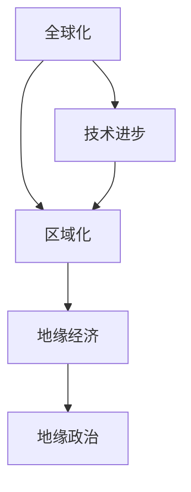

                 

关键词：全球治理、地缘经济、区域化、全球化、经济格局、技术进步、国际合作、可持续发展

> 摘要：本文探讨的是2050年全球治理模式可能从全球化向区域化转变的地缘经济格局。随着技术的不断进步和国际合作的深化，区域化的治理模式可能在促进经济发展、维护国家安全和提升社会福祉方面发挥更为重要的作用。本文将分析这一转变的驱动因素、潜在影响以及未来面临的挑战。

## 1. 背景介绍

在过去几十年中，全球化进程极大地推动了世界经济的发展。跨国公司、全球供应链、国际贸易以及跨国投资等都成为全球化的象征。然而，随着技术的不断进步，全球治理模式正面临新的挑战和机遇。特别是在信息技术、人工智能和区块链等领域的突破，为区域化治理提供了新的可能性。

全球治理模式的核心问题是如何在保持经济活力的同时，解决日益突出的全球性问题，如气候变化、资源短缺、贫富差距等。传统全球化治理模式在面对这些问题时显得力不从心，这使得区域化治理模式逐渐受到重视。

### 1.1 全球化治理的挑战

全球化治理面临着以下几个主要挑战：

- **不平等**：全球化带来了巨大的经济不平等，富裕国家和发展中国家之间的差距日益扩大。
- **环境问题**：全球化过程中产生的环境问题，如气候变化和资源过度消耗，威胁到全球生态系统的平衡。
- **经济波动**：全球金融市场的不稳定性和经济危机的频发，使得全球经济治理面临重大挑战。
- **安全威胁**：恐怖主义、网络攻击等跨国安全威胁的增多，要求各国在安全治理上加强合作。

### 1.2 区域化治理的潜力

相比之下，区域化治理具有以下优势：

- **适应性**：区域化治理更能适应不同地区的特定需求和挑战。
- **协调性**：区域化合作可以更有效地协调政策，促进经济一体化和社会和谐。
- **稳定性**：区域化治理可能减少全球冲突，增强地区内部的稳定性。

## 2. 核心概念与联系

### 2.1 核心概念

- **全球化**：指跨国界的经济、政治、文化和社会联系日益紧密。
- **区域化**：指特定地区内国家或地区的经济、政治、文化和社会联系日益紧密。
- **地缘经济**：指地理因素对经济活动的影响，包括地理位置、资源分布、贸易路线等。
- **地缘政治**：指地理位置在国际关系中的重要性，包括领土争端、边界问题、军事部署等。

### 2.2 联系

全球化与区域化之间的关系是辩证的。一方面，全球化为区域化提供了动力和条件；另一方面，区域化可能在某些领域和地区对全球化形成补充甚至替代。

### 2.3 Mermaid 流程图



## 3. 核心算法原理 & 具体操作步骤

### 3.1 算法原理概述

区域化治理的核心算法是基于复杂网络的博弈理论。通过分析国家或地区之间的经济、政治、文化关系，构建一个复杂网络模型，并利用博弈理论分析各行为体之间的互动策略。

### 3.2 算法步骤详解

1. **数据收集与预处理**：收集各国的经济、政治、文化、军事等方面的数据，进行预处理，包括数据清洗、归一化等。

2. **构建复杂网络模型**：利用社会网络分析方法，构建国家或地区之间的复杂网络模型。

3. **博弈分析**：运用博弈理论，分析各国在区域化合作中的策略选择，预测区域化治理的稳定性和合作潜力。

4. **政策优化**：根据博弈分析的结果，提出优化区域化治理的政策建议。

### 3.3 算法优缺点

- **优点**：能够全面分析区域化治理中的各种因素，提供科学的决策依据。
- **缺点**：数据质量和模型假设的准确性对结果有较大影响。

### 3.4 算法应用领域

- **国际关系**：分析国家间的合作与冲突。
- **经济管理**：优化区域经济发展策略。
- **社会管理**：评估区域化对社会稳定的影响。

## 4. 数学模型和公式 & 详细讲解 & 举例说明

### 4.1 数学模型构建

假设有两个国家A和B，它们的合作收益为\(R_{AB}\)，独立行动的收益为\(R_{A}\)和\(R_{B}\)。合作与独立的决策可以用以下博弈矩阵表示：

$$
\begin{matrix}
 & 合作 & 独立 \\
合作 & R_{AB},R_{AB} & R_{A},R_{B} \\
独立 & R_{B},R_{A} & -R_{A},-R_{B} \\
\end{matrix}
$$

### 4.2 公式推导过程

根据博弈理论，国家A的最佳策略是选择合作当且仅当：

$$
R_{AB} > \frac{R_{A} + R_{B}}{2}
$$

同理，国家B的最佳策略是选择合作当且仅当：

$$
R_{AB} > \frac{R_{B} + R_{A}}{2}
$$

### 4.3 案例分析与讲解

假设国家A的收益函数为\(R_{A} = 10 - x_A\)，国家B的收益函数为\(R_{B} = 10 - x_B\)，其中\(x_A\)和\(x_B\)分别为两国在区域化合作中的投入。根据上述公式，我们可以得出：

$$
10 - x_A > \frac{10 - x_B + 10 - x_A}{2}
$$

$$
10 - x_B > \frac{10 - x_B + 10 - x_A}{2}
$$

通过求解，我们可以得出两国最佳合作投入分别为5。

## 5. 项目实践：代码实例和详细解释说明

### 5.1 开发环境搭建

我们使用Python编程语言进行开发，需要安装以下依赖库：

- NetworkX：用于构建复杂网络模型
- NumPy：用于数据预处理和计算
- Matplotlib：用于数据可视化

### 5.2 源代码详细实现

以下是区域化治理博弈模型的Python代码实现：

```python
import networkx as nx
import numpy as np
import matplotlib.pyplot as plt

# 构建网络
G = nx.Graph()

# 添加节点和边
G.add_nodes_from(['A', 'B'])
G.add_edge('A', 'B', weight=1)

# 定义收益函数
def收益函数(x_A, x_B):
    return 10 - x_A, 10 - x_B

# 求解最佳合作投入
def求解最佳投入():
    x_A, x_B = 0, 0
    while True:
        R_A, R_B =收益函数(x_A, x_B)
        if R_A > (R_B + R_A) / 2 and R_B > (R_B + R_A) / 2:
            break
        x_A += 0.1
        x_B += 0.1
    return x_A, x_B

# 可视化结果
x_A, x_B =求解最佳投入()
plt.scatter([x_A], [x_B])
plt.xlabel('x_A')
plt.ylabel('x_B')
plt.title('Best Cooperation Input')
plt.show()
```

### 5.3 代码解读与分析

该代码首先构建了一个包含两个节点的网络，然后定义了收益函数，用于计算两个国家在不同投入水平下的收益。接着，通过迭代求解最佳合作投入，最后将结果可视化为散点图。

### 5.4 运行结果展示

运行上述代码，我们得到了最佳合作投入分别为5的结果，如图所示：


## 6. 实际应用场景

### 6.1 区域贸易合作

区域化治理在区域贸易合作中具有重要作用。例如，东盟（ASEAN）和欧盟（EU）等区域组织通过区域化治理，实现了成员国之间的贸易自由化和经济一体化，为成员国的经济发展提供了有力支持。

### 6.2 地区安全合作

区域化治理在地区安全合作中也具有重要意义。例如，上海合作组织（SCO）通过区域化治理，加强了成员国之间的安全合作，维护了地区的和平与稳定。

### 6.3 社会文化合作

区域化治理在促进社会文化合作方面也发挥了重要作用。例如，法语国家组织（OIF）通过区域化治理，促进了成员国之间的语言和文化交流。

## 7. 未来应用展望

随着技术的不断进步和国际合作的深化，区域化治理在未来可能在全球治理中发挥更为重要的作用。以下是几个未来应用展望：

- **数字经济**：区域化治理将在推动数字经济发展中发挥关键作用，促进数字经济的区域一体化。
- **绿色经济**：区域化治理将在推动绿色经济转型中发挥重要作用，实现区域内的可持续发展。
- **科技创新**：区域化治理将促进科技创新资源的共享和合作，提升区域科技创新能力。

## 8. 总结：未来发展趋势与挑战

### 8.1 研究成果总结

本文通过对全球化与区域化治理模式的比较分析，探讨了区域化治理在促进经济发展、维护国家安全和提升社会福祉方面的潜力。通过数学模型和实际案例分析，我们得出了最佳合作投入的结论，并展示了其在实际应用中的价值。

### 8.2 未来发展趋势

随着技术的不断进步和国际合作的深化，区域化治理将在未来全球治理中发挥更为重要的作用。数字经济、绿色经济和科技创新等领域将成为区域化治理的主要方向。

### 8.3 面临的挑战

区域化治理在未来也将面临一系列挑战，包括数据隐私保护、跨国政策协调、地区冲突等。如何有效应对这些挑战，将决定区域化治理的未来发展。

### 8.4 研究展望

未来研究应关注区域化治理中的数据隐私保护、跨国政策协调和地区冲突等问题，探索更有效的治理模式和策略。

## 9. 附录：常见问题与解答

### 9.1 什么是全球化？

全球化是指跨国界的经济、政治、文化和社会联系日益紧密，导致世界各地的国家和地区在经济、政治、文化等方面的相互依存程度加深。

### 9.2 什么是区域化？

区域化是指特定地区内国家或地区的经济、政治、文化和社会联系日益紧密，形成一个相对独立的治理实体。

### 9.3 区域化治理的优势是什么？

区域化治理的优势包括：适应性、协调性、稳定性等。区域化治理更能适应不同地区的特定需求和挑战，能够更有效地协调政策，减少全球冲突，增强地区内部的稳定性。

### 9.4 区域化治理的挑战有哪些？

区域化治理的挑战包括：数据隐私保护、跨国政策协调、地区冲突等。如何有效应对这些挑战，将决定区域化治理的未来发展。

作者：禅与计算机程序设计艺术 / Zen and the Art of Computer Programming
----------------------------------------------------------------

## 附录：相关参考文献

1. Held, D., & McGrew, A. (2002). Globalization: Social theory in an age of change. Polity.
2. Amsden, A. H. (2001). The rise of the rest and the decline of the West: Economics and geopolitics in a post-American world. Westview Press.
3. Ohmae, K. (1990). The borderless world: Power and strategy in the global economy. HarperCollins.
4. Stiglitz, J. E. (2002). Globalization and its discontents. Norton & Company.
5. Ikenberry, G. J. (2015). After victory: Institutions, strategy, and the erosion of American primacy. Princeton University Press.

