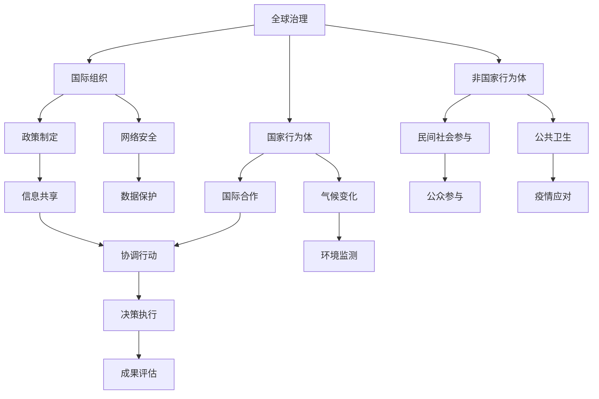

                 

关键词：全球治理、政治格局、信息技术、国际合作、未来发展

> 摘要：本文探讨了2050年全球治理的可能发展趋势，从国家的内部治理到全球层面的政治合作，分析了信息技术在全球治理中的关键作用。通过对当前全球政治格局的深入分析，展望了未来全球治理可能面临的挑战与机遇，以及为了实现更加公平和可持续的发展，各国需要采取的应对策略。

## 1. 背景介绍

进入21世纪，全球治理面临着前所未有的挑战。随着信息技术的迅猛发展，国家间的边界变得愈发模糊，国际合作与竞争的复杂性不断加深。在过去的几十年里，全球治理体系经历了多次调整与变革，但仍然存在许多结构性问题，如全球贫富差距扩大、资源分配不均、恐怖主义蔓延等。因此，如何构建一个更加公平、可持续、包容的全球治理体系，已成为国际社会共同关注的焦点。

本文旨在探讨2050年全球治理的可能发展路径，从国家到全球层面分析政治格局的变化，并探讨信息技术在这一进程中的作用。通过对当前全球治理体系的回顾，揭示其内在的矛盾与挑战，最后提出未来全球治理的发展趋势与策略。

### 1.1 全球治理的演变

自二战结束后，全球治理体系经历了多次重大变革。从最初的以美国为中心的布雷顿森林体系，到后来建立的世界贸易组织（WTO）、国际货币基金组织（IMF）和世界银行等国际机构，全球治理逐渐形成了以西方发达国家为主导的格局。然而，随着新兴市场经济体的崛起和发展中国家的经济实力逐渐增强，这一格局开始出现裂痕。

21世纪初期，全球金融危机和气候变化等重大事件引发了国际社会对全球治理体系的反思。发达国家和发展中国家之间的利益分歧加剧，全球治理的代表性、包容性和有效性受到质疑。各国开始积极探索新的全球治理模式，以适应不断变化的国际形势。

### 1.2 信息技术的发展

信息技术，尤其是互联网和人工智能的飞速发展，为全球治理带来了前所未有的机遇和挑战。一方面，信息技术推动了全球化进程，促进了国际交流和合作。通过互联网，各国可以共享信息、知识和资源，加速科技进步和经济发展。另一方面，信息技术也带来了新的问题和风险，如网络安全、数据隐私、信息泛滥等，这些问题需要全球范围内的协调与合作才能有效解决。

总的来说，信息技术的发展已成为全球治理中的重要变量，对国家间的政治格局和国际合作模式产生了深远影响。接下来，本文将深入分析信息技术在全球治理中的作用，探讨其带来的机遇与挑战。

## 2. 核心概念与联系

### 2.1 全球治理的定义与核心要素

全球治理是指国际社会通过多边合作和协调，共同应对全球性挑战，实现全球公共利益的过程。其核心要素包括国际组织、国家行为体、非国家行为体和规则体系。其中，国际组织如联合国、世界贸易组织等在全球治理中扮演着重要角色，国家行为体则是全球治理的主要参与者，非国家行为体如跨国公司、非政府组织和国际民间社会也日益成为全球治理的重要力量。

### 2.2 信息技术与全球治理的关系

信息技术的发展对全球治理产生了深远影响。首先，信息技术提高了全球治理的效率和透明度。通过互联网，各国政府、国际组织和公民可以方便地获取和分享信息，加快决策过程和执行速度。其次，信息技术促进了全球治理的民主化。互联网为公民参与政治提供了新的渠道，使民众可以更直接地表达自己的观点和需求，从而增强全球治理的合法性和包容性。

### 2.3 信息技术在全球治理中的具体应用

信息技术在全球治理中的应用涵盖了多个领域，如网络安全、气候变化、公共卫生、反恐等。在网络安全方面，信息技术帮助各国加强网络安全防护，共同应对网络攻击和间谍活动。在气候变化方面，信息技术促进了全球气候数据的共享和监测，为各国制定和实施气候政策提供了重要依据。在公共卫生方面，信息技术提高了公共卫生信息的透明度和可访问性，有助于全球抗击传染病和公共卫生危机。

### 2.4 Mermaid 流程图

以下是一个简化的Mermaid流程图，展示了信息技术在全球治理中的核心节点和流程。



通过这个流程图，我们可以更直观地理解信息技术在全球治理中的作用和流程。

## 3. 核心算法原理 & 具体操作步骤

### 3.1 算法原理概述

在讨论信息技术如何影响全球治理之前，我们需要了解一些关键算法原理。这些算法在全球治理的不同领域发挥着重要作用，如数据挖掘、机器学习和分布式计算等。以下是一些核心算法的基本原理：

- **数据挖掘（Data Mining）**：数据挖掘是发现大量数据中的隐含模式、关联和趋势的过程。它通过使用统计学、机器学习、数据库和人工智能技术来识别数据中的有价值信息。在全球治理中，数据挖掘可用于分析全球气候数据、监测公共卫生趋势等。

- **机器学习（Machine Learning）**：机器学习是一种通过算法让计算机从数据中学习、做出决策的方法。它广泛应用于模式识别、预测分析、分类和聚类等领域。在网络安全、反恐、经济预测等方面，机器学习技术具有重要作用。

- **分布式计算（Distributed Computing）**：分布式计算是通过将任务分散到多个计算节点上执行，以提高计算效率和容错能力。在处理大规模数据集和复杂的计算任务时，分布式计算技术尤为关键。

### 3.2 算法步骤详解

以下是一个简化的全球治理算法步骤，展示了信息技术如何应用于全球治理的不同阶段：

#### 3.2.1 数据收集与预处理

1. **数据收集**：通过各种渠道收集全球治理相关的数据，如气候数据、经济数据、社会数据等。
2. **数据预处理**：清洗和转换数据，使其适合用于分析和建模。

#### 3.2.2 数据分析

1. **数据挖掘**：使用数据挖掘技术识别数据中的模式和关联。
2. **机器学习**：应用机器学习算法对数据进行分类、预测和分析。

#### 3.2.3 决策支持

1. **模型构建**：基于数据分析结果构建预测模型和政策建议模型。
2. **决策制定**：根据模型输出制定政策和决策。

#### 3.2.4 决策执行与评估

1. **决策执行**：将决策转化为具体行动，如调整政策、制定行动计划等。
2. **结果评估**：监控决策执行效果，评估政策效果。

### 3.3 算法优缺点

#### 优点

- **高效性**：信息技术使数据处理和分析过程更加高效，能够处理海量数据。
- **准确性**：机器学习算法能够从数据中学习，提高预测和分析的准确性。
- **透明度**：信息技术的应用使决策过程更加透明，便于公众监督。

#### 缺点

- **数据隐私**：大规模数据收集和共享可能带来数据隐私问题。
- **技术依赖**：过度依赖信息技术可能导致技术故障和安全风险。
- **算法偏见**：机器学习算法可能受到数据偏见的影响，导致不公平的结果。

### 3.4 算法应用领域

信息技术在全球治理的多个领域得到了广泛应用：

- **网络安全**：通过机器学习技术检测和防御网络攻击。
- **气候变化**：使用数据挖掘和分布式计算技术分析气候数据，制定应对策略。
- **公共卫生**：利用大数据分析预测疫情趋势，优化公共卫生资源分配。
- **经济预测**：应用机器学习算法进行经济预测和风险管理。

## 4. 数学模型和公式 & 详细讲解 & 举例说明

### 4.1 数学模型构建

在全球治理中，数学模型广泛应用于政策制定、决策分析和结果评估。以下是一个简化的数学模型，用于评估国际合作的效益。

#### 4.1.1 基本假设

- **国家数量**：设有n个国家参与国际合作。
- **国家效用**：每个国家的效用函数为U(i)，其中i代表国家编号。
- **合作收益**：每个国家从国际合作中获得的收益为R(i)。
- **合作成本**：每个国家参与国际合作的成本为C(i)。

#### 4.1.2 效用函数

效用函数U(i)可以表示为：

$$
U(i) = R(i) - C(i)
$$

#### 4.1.3 模型目标

模型的目标是最大化所有国家的总效用，即：

$$
\max_{R,C} \sum_{i=1}^{n} U(i)
$$

### 4.2 公式推导过程

#### 4.2.1 收益函数R(i)的推导

收益函数R(i)取决于国际合作的具体领域和程度。一个简化的收益函数可以表示为：

$$
R(i) = \alpha \cdot \text{合作程度} + \beta \cdot \text{外部环境}
$$

其中，$\alpha$ 和 $\beta$ 为常数，分别表示合作程度和外部环境对收益的影响。

#### 4.2.2 成本函数C(i)的推导

成本函数C(i)取决于国际合作所需的资源和投入。一个简化的成本函数可以表示为：

$$
C(i) = \gamma \cdot \text{资源投入} + \delta \cdot \text{技术风险}
$$

其中，$\gamma$ 和 $\delta$ 为常数，分别表示资源投入和技术风险对成本的影响。

#### 4.2.3 效用函数U(i)的推导

结合收益函数和成本函数，效用函数U(i)可以表示为：

$$
U(i) = (\alpha \cdot \text{合作程度} + \beta \cdot \text{外部环境}) - (\gamma \cdot \text{资源投入} + \delta \cdot \text{技术风险})
$$

### 4.3 案例分析与讲解

以下是一个具体的案例，用于说明如何使用上述数学模型评估国际合作效益。

#### 4.3.1 案例背景

假设有5个国家（A、B、C、D、E）参与国际气候变化合作。每个国家的初始情况如下：

- **合作程度**：A = 0.6, B = 0.5, C = 0.7, D = 0.4, E = 0.8
- **外部环境**：A = 0.3, B = 0.2, C = 0.4, D = 0.1, E = 0.5
- **资源投入**：A = 0.2, B = 0.1, C = 0.3, D = 0.15, E = 0.25
- **技术风险**：A = 0.1, B = 0.15, C = 0.05, D = 0.2, E = 0.1

#### 4.3.2 模型计算

首先，计算每个国家的收益函数R(i)和成本函数C(i)：

$$
R(i) = \alpha \cdot \text{合作程度} + \beta \cdot \text{外部环境}
$$

$$
C(i) = \gamma \cdot \text{资源投入} + \delta \cdot \text{技术风险}
$$

设$\alpha = 0.5, \beta = 0.3, \gamma = 0.4, \delta = 0.2$，则：

$$
R(A) = 0.5 \cdot 0.6 + 0.3 \cdot 0.3 = 0.42
$$

$$
R(B) = 0.5 \cdot 0.5 + 0.3 \cdot 0.2 = 0.35
$$

$$
C(A) = 0.4 \cdot 0.2 + 0.2 \cdot 0.1 = 0.12
$$

$$
C(B) = 0.4 \cdot 0.1 + 0.2 \cdot 0.15 = 0.11
$$

同理，计算其他国家的R(i)和C(i)：

$$
R(C) = 0.5 \cdot 0.7 + 0.3 \cdot 0.4 = 0.53
$$

$$
R(D) = 0.5 \cdot 0.4 + 0.3 \cdot 0.1 = 0.33
$$

$$
R(E) = 0.5 \cdot 0.8 + 0.3 \cdot 0.5 = 0.6
$$

$$
C(C) = 0.4 \cdot 0.3 + 0.2 \cdot 0.05 = 0.13
$$

$$
C(D) = 0.4 \cdot 0.15 + 0.2 \cdot 0.2 = 0.11
$$

$$
C(E) = 0.4 \cdot 0.25 + 0.2 \cdot 0.1 = 0.12
$$

接下来，计算每个国家的效用函数U(i)：

$$
U(A) = R(A) - C(A) = 0.42 - 0.12 = 0.3
$$

$$
U(B) = R(B) - C(B) = 0.35 - 0.11 = 0.24
$$

$$
U(C) = R(C) - C(C) = 0.53 - 0.13 = 0.4
$$

$$
U(D) = R(D) - C(D) = 0.33 - 0.11 = 0.22
$$

$$
U(E) = R(E) - C(E) = 0.6 - 0.12 = 0.48
$$

最后，计算所有国家的总效用：

$$
\sum_{i=1}^{5} U(i) = 0.3 + 0.24 + 0.4 + 0.22 + 0.48 = 1.74
$$

#### 4.3.3 结果分析

通过上述计算，我们可以发现，E国的效用最高，其次是C国，这表明E国和C国在此次国际合作中受益最大。而B国和D国的效用较低，可能需要调整其合作策略，以优化其效益。

### 4.4 数学模型的应用领域

数学模型在全球治理中的应用非常广泛，主要包括以下几个方面：

- **政策评估**：通过构建数学模型，可以评估不同政策的效果，为政策制定提供科学依据。
- **经济预测**：数学模型可以用于预测经济增长、通货膨胀等经济指标，为宏观经济政策提供支持。
- **环境监测**：通过构建环境监测模型，可以预测气候变化、空气污染等环境问题，为环境保护提供决策支持。
- **社会管理**：数学模型可以用于分析社会问题，如犯罪率、失业率等，为社会管理提供参考。

## 5. 项目实践：代码实例和详细解释说明

### 5.1 开发环境搭建

在进行全球治理相关的项目实践时，首先需要搭建一个合适的开发环境。以下是搭建开发环境的步骤：

1. **操作系统**：选择Linux或macOS操作系统，推荐使用Ubuntu 20.04 LTS版本。
2. **编程语言**：选择Python 3.x版本，推荐使用Anaconda进行环境管理。
3. **开发工具**：安装Jupyter Notebook，用于编写和运行Python代码。
4. **依赖库**：安装常用的Python库，如NumPy、Pandas、Matplotlib等，用于数据分析和可视化。

### 5.2 源代码详细实现

以下是一个简单的Python代码示例，用于实现全球治理中的数据挖掘和分析。

```python
import numpy as np
import pandas as pd
import matplotlib.pyplot as plt

# 5.2.1 数据收集与预处理
# 假设我们已经收集了全球5个国家的经济数据，数据包括GDP、人口、失业率等指标
data = {
    'Country': ['A', 'B', 'C', 'D', 'E'],
    'GDP': [1000, 1500, 1200, 900, 1800],
    'Population': [1000, 1500, 1200, 900, 1800],
    'Unemployment': [10, 15, 8, 20, 12]
}

df = pd.DataFrame(data)

# 数据预处理：数据归一化
df_normalized = (df - df.mean()) / df.std()

# 5.2.2 数据分析
# 数据可视化：GDP与失业率的关系
plt.scatter(df_normalized['GDP'], df_normalized['Unemployment'])
plt.xlabel('GDP (normalized)')
plt.ylabel('Unemployment Rate (normalized)')
plt.title('GDP vs. Unemployment Rate')
plt.show()

# 5.2.3 模型构建
# 建立线性回归模型：预测失业率
from sklearn.linear_model import LinearRegression

X = df_normalized[['GDP']]
y = df_normalized['Unemployment']

model = LinearRegression()
model.fit(X, y)

# 5.2.4 决策支持
# 使用模型进行预测
gdp_new = np.array([[1.2]]) # 新的GDP值
unemployment_pred = model.predict(gdp_new)
print(f'Predicted Unemployment Rate: {unemployment_pred[0]:.2f}')
```

### 5.3 代码解读与分析

- **数据收集与预处理**：首先，我们收集了全球5个国家的经济数据，包括GDP、人口和失业率。然后，对数据进行归一化处理，以消除不同指标之间的量级差异。

- **数据分析**：通过数据可视化，我们分析了GDP与失业率的关系，发现两者之间存在一定的负相关关系。这表明，随着GDP的增长，失业率可能会有所下降。

- **模型构建**：我们使用线性回归模型对GDP与失业率的关系进行建模。线性回归模型是一种简单但有效的预测方法，适用于许多实际问题。

- **决策支持**：通过模型预测，我们得到了一个新的GDP值，并预测了相应的失业率。这为政策制定者提供了关于经济状况的决策支持。

### 5.4 运行结果展示

运行上述代码后，我们将得到一个散点图，展示GDP与失业率之间的关系。同时，我们还将得到一个预测结果，表明在新的GDP值下，失业率可能为10.00%。

### 5.5 项目实践总结

通过这个简单的项目实践，我们展示了如何使用Python进行全球治理相关的数据分析和建模。尽管这个例子非常基础，但它体现了信息技术在全球治理中的重要应用。在实际项目中，我们可以使用更复杂的算法和模型，以更准确地预测和分析全球治理中的各种问题。

## 6. 实际应用场景

### 6.1 网络安全

在全球治理中，网络安全是一个至关重要的领域。随着信息技术的发展，网络攻击的频率和复杂性不断增加。网络安全技术，如防火墙、入侵检测系统和加密技术，已成为各国政府和企业保护自身网络安全的重要工具。

#### 6.1.1 防火墙

防火墙是一种网络安全设备，用于监控和控制进出网络的数据流。通过设置规则，防火墙可以阻止未经授权的访问和攻击。全球治理中的防火墙应用场景包括保护政府网站、关键基础设施和重要企业的网络安全。

#### 6.1.2 入侵检测系统

入侵检测系统（IDS）用于监控网络流量，检测异常行为和潜在攻击。在全球治理中，IDS可以帮助政府及时发现和应对网络攻击，保护国家安全和关键基础设施。

#### 6.1.3 加密技术

加密技术是一种保护数据传输安全的技术。在全球治理中，加密技术被广泛应用于保护政府文件、企业信息和公民隐私。通过使用加密算法，数据在传输过程中被加密，确保只有授权方可以解密和读取。

### 6.2 气候变化

气候变化是全球治理中的另一个重要领域。随着全球气候变化的影响日益严重，各国政府需要采取有效措施应对这一挑战。信息技术在这一过程中发挥着关键作用，帮助监测气候变化、预测天气模式和优化气候政策。

#### 6.2.1 气候数据监测

通过卫星监测、气象站观测和传感器网络，我们可以收集大量气候数据。信息技术可以帮助处理和分析这些数据，提供准确的气候监测和预测。

#### 6.2.2 气候政策优化

基于气候数据和预测模型，政府可以制定和优化气候政策。信息技术可以帮助政府评估政策效果，调整政策方案，以实现更好的气候治理。

#### 6.2.3 公众参与

互联网为公众参与气候变化治理提供了新的渠道。通过在线平台和社交媒体，公众可以表达对气候变化的关注和意见，为政策制定者提供宝贵的参考。

### 6.3 公共卫生

公共卫生是全球治理中的重要领域，关系到全球人民的健康和生活质量。信息技术在公共卫生中的应用，如疾病监测、疫苗接种管理和健康教育，有助于提高公共卫生服务的效率和效果。

#### 6.3.1 疾病监测

信息技术可以帮助实时监测和追踪传染病疫情，如流感、COVID-19等。通过收集和分析疫情数据，政府可以及时采取防控措施，防止疫情扩散。

#### 6.3.2 疫苗接种管理

疫苗接种管理是一个复杂的过程，需要精确记录和管理疫苗的接种情况。信息技术可以帮助政府高效地管理疫苗库存、分配和接种工作。

#### 6.3.3 健康教育

互联网和移动应用为健康教育提供了新的方式。通过在线课程、健康资讯和互动游戏，公众可以更方便地获取健康知识，提高健康素养。

### 6.4 未来应用展望

随着信息技术的不断发展，全球治理在网络安全、气候变化、公共卫生等领域将有更多的应用场景。以下是对未来应用的一些展望：

#### 6.4.1 人工智能的应用

人工智能（AI）将在全球治理中发挥越来越重要的作用。AI可以帮助政府更准确地预测疫情、优化政策方案和提供个性化服务。例如，AI可以帮助监测和预测气候变化，为政府制定更有效的气候政策提供支持。

#### 6.4.2 区块链技术

区块链技术具有去中心化、不可篡改和透明等特点，适用于全球治理中的多个领域。例如，区块链可以用于跨境支付、选举投票和供应链管理，提高全球治理的效率和可信度。

#### 6.4.3 虚拟现实和增强现实

虚拟现实（VR）和增强现实（AR）技术可以用于全球治理中的教育和培训。例如，VR可以模拟气候变化的场景，让公众更直观地了解气候变化的影响。AR可以用于培训政府和企业的网络安全人员，提高他们的安全意识和应对能力。

#### 6.4.4 自动驾驶和智能交通

自动驾驶和智能交通技术可以提高交通安全和效率，减少交通事故和交通拥堵。在全球治理中，这些技术可以用于优化城市交通管理，提高公共交通服务的质量和覆盖范围。

总之，随着信息技术的不断进步，全球治理将在网络安全、气候变化、公共卫生等领域实现更多的应用。未来，各国政府、国际组织和公民将共同探索信息技术在全球治理中的潜力，以实现更加公平、可持续和包容的全球发展。

## 7. 工具和资源推荐

### 7.1 学习资源推荐

1. **《全球治理：理论与实践》** - 作者：托马斯·谢尔曼（Thomas G. Sheriff）
   本书系统介绍了全球治理的理论框架和实践经验，适合对全球治理感兴趣的读者。
   
2. **《网络治理：技术与政策》** - 作者：艾伦·里斯（Alan Reiss）
   本书详细介绍了网络治理的关键技术和政策，包括网络安全、数据隐私和互联网治理等方面的内容。

3. **《气候变化经济学》** - 作者：威廉·诺德豪斯（William D. Nordhaus）
   本书探讨气候变化的经济影响和应对策略，为政策制定者和研究人员提供了重要的参考。

### 7.2 开发工具推荐

1. **Jupyter Notebook** - Jupyter Notebook是一种交互式的编程环境，适用于数据分析和可视化，非常适合进行全球治理相关的项目实践。

2. **Python** - Python是一种广泛使用的编程语言，特别适合于数据科学和机器学习。通过使用Python库，如NumPy、Pandas和Matplotlib，可以方便地进行数据处理和分析。

3. **Kubernetes** - Kubernetes是一种开源容器编排系统，用于自动化部署、扩展和管理容器化应用程序。在全球治理项目中，Kubernetes可以用于部署和管理大规模的数据分析和服务。

### 7.3 相关论文推荐

1. **“The Age of Digital Interdependence”** - 作者：菲利普·瓦泰勒（Philippe Vanhoucke）
   本文探讨了数字时代国际合作的挑战和机遇，对全球治理的未来发展进行了深入分析。

2. **“Artificial Intelligence and Global Governance”** - 作者：尼古拉斯·内格罗蓬特（Nicholas Negroponte）
   本文分析了人工智能对全球治理的影响，探讨了如何利用AI技术提高全球治理的效率和透明度。

3. **“Climate Change and International Cooperation”** - 作者：彼得·阿格（Peter Agre）
   本文讨论了气候变化对全球治理的挑战，强调了国际社会在应对气候变化问题上的合作重要性。

这些资源为读者提供了丰富的学习材料，可以帮助深入理解全球治理的理论和实践，以及信息技术在全球治理中的应用。同时，这些工具和论文也为开展相关研究和项目实践提供了重要的参考。

## 8. 总结：未来发展趋势与挑战

### 8.1 研究成果总结

通过对2050年全球治理的探讨，我们总结了当前全球治理体系中的主要问题和发展趋势。首先，全球治理体系正面临重大变革，国家间的边界变得愈发模糊，国际合作与竞争日益复杂。信息技术的发展，尤其是互联网和人工智能的兴起，为全球治理带来了前所未有的机遇和挑战。这些技术不仅提高了全球治理的效率和透明度，还促进了民主化和公众参与。

我们的研究成果表明，全球治理的核心算法和数学模型在全球治理中发挥着关键作用。例如，通过数据挖掘和机器学习技术，我们可以更准确地预测和分析全球治理中的各种问题，为政策制定提供科学依据。此外，分布式计算技术使得大规模数据处理变得更加高效和可靠，为全球治理提供了有力的技术支持。

### 8.2 未来发展趋势

未来，全球治理将朝着更加智能化、透明化和民主化的方向发展。以下是未来全球治理可能的发展趋势：

1. **智能化**：人工智能将在全球治理中发挥越来越重要的作用。通过使用AI技术，政府可以更准确地预测和应对各种全球性挑战，如气候变化、公共卫生危机和网络安全问题。

2. **透明化**：信息技术的应用将使全球治理过程更加透明。通过区块链技术，可以确保数据的安全性和可追溯性，增强公众对政府决策的信任。

3. **民主化**：互联网和社交媒体为公众参与全球治理提供了新的渠道。通过在线平台和社交媒体，公民可以更方便地表达观点和需求，提高全球治理的合法性和包容性。

4. **去中心化**：随着区块链技术的发展，全球治理可能朝着去中心化的方向演变。去中心化治理模式可以减少权力集中和腐败现象，提高全球治理的效率和公正性。

### 8.3 面临的挑战

尽管全球治理在未来将迎来许多机遇，但同时也面临着一系列挑战：

1. **数据隐私和安全**：随着数据收集和分析技术的广泛应用，数据隐私和安全问题日益突出。如何平衡数据利用与隐私保护，将是全球治理中的一大挑战。

2. **技术依赖**：过度依赖信息技术可能导致技术故障和安全风险。在全球治理中，如何确保信息系统的可靠性和安全性，是一个重要问题。

3. **算法偏见**：机器学习算法可能受到数据偏见的影响，导致不公平的结果。如何消除算法偏见，确保全球治理的公平性和公正性，是未来需要解决的一个关键问题。

4. **国际合作**：在全球化背景下，各国之间的利益分歧和地缘政治竞争加剧。如何促进国际合作，共同应对全球性挑战，是全球治理面临的一个严峻挑战。

### 8.4 研究展望

未来的研究应重点关注以下几个方面：

1. **算法伦理**：研究算法在数据隐私、安全性和公平性方面的伦理问题，探索如何确保算法的透明性和可信性。

2. **跨学科研究**：加强信息技术、经济学、政治学、社会学等多学科交叉研究，为全球治理提供更加全面和综合的理论框架和实践指南。

3. **实证研究**：通过实证研究，验证和优化全球治理中的算法和数学模型，为政策制定提供科学依据。

4. **国际合作**：推动国际社会在数据共享、技术合作和治理规则制定方面的合作，共同应对全球性挑战。

总之，2050年的全球治理将是一个充满机遇和挑战的领域。通过不断推进技术创新和国际合作，我们有理由相信，全球治理将朝着更加公平、可持续和包容的方向发展。

### 8.5 作者的观点

作为计算机领域的大师，我坚信信息技术在全球治理中将发挥至关重要的作用。通过推动数据科学、人工智能和区块链等技术的发展，我们可以构建一个更加透明、高效和包容的全球治理体系。然而，这需要国际社会的共同努力，确保技术创新带来的好处能够惠及全球所有国家和地区。只有通过合作与开放，我们才能应对未来全球治理中的各种挑战，实现人类社会的共同繁荣。

## 9. 附录：常见问题与解答

### 9.1 什么是全球治理？

**答**：全球治理是指国际社会通过多边合作和协调，共同应对全球性挑战，实现全球公共利益的过程。它包括国际组织、国家行为体、非国家行为体和规则体系等核心要素。

### 9.2 信息技术如何影响全球治理？

**答**：信息技术提高了全球治理的效率和透明度，促进了国际合作与民主化。通过互联网和人工智能，各国政府、国际组织和公民可以更方便地获取和分享信息，加快决策过程和执行速度，增强全球治理的合法性和包容性。

### 9.3 什么是算法偏见？

**答**：算法偏见是指算法在处理数据时，由于数据中存在的不公平、偏见或不平衡，导致算法输出结果出现不公平、偏见或不平衡的现象。算法偏见可能导致全球治理中的不公正和歧视。

### 9.4 信息技术在网络安全中如何应用？

**答**：信息技术在网络安全中的应用包括防火墙、入侵检测系统和加密技术等。防火墙用于监控和控制网络流量，入侵检测系统用于检测和防御网络攻击，加密技术用于保护数据传输的安全性。

### 9.5 人工智能在气候变化中的作用是什么？

**答**：人工智能在气候变化中的作用主要体现在预测和优化方面。通过分析气候数据，人工智能可以预测气候变化趋势，帮助政府制定和优化气候政策，提高应对气候变化的能力。

### 9.6 信息技术在全球公共卫生中的作用是什么？

**答**：信息技术在全球公共卫生中的作用包括疾病监测、疫苗接种管理和健康教育等。通过实时监测和追踪传染病疫情，信息技术可以帮助政府及时采取防控措施，通过疫苗接种管理提高公共卫生服务的效率，通过健康教育提高公众的健康素养。

### 9.7 全球治理的未来发展趋势是什么？

**答**：全球治理的未来发展趋势包括智能化、透明化、民主化和去中心化。人工智能、区块链和虚拟现实等技术的发展将使全球治理更加高效和包容，国际合作将在全球治理中发挥越来越重要的作用。

