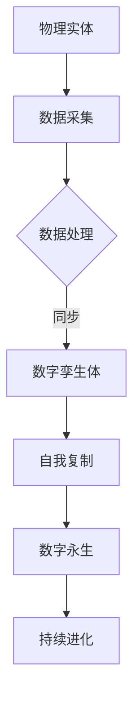

                 

关键词：数字孪生、数字分身、自我复制、数字永生、计算机科学、人工智能

摘要：随着计算机技术和人工智能的飞速发展，数字孪生技术已经逐渐成熟并开始应用于各个领域。本文将探讨数字孪生技术的未来发展趋势，特别是从数字分身到数字永生的自我复制技术，分析其核心概念、算法原理、数学模型、项目实践以及未来应用展望，旨在为读者提供对这一前沿技术的全面了解。

## 1. 背景介绍

数字孪生（Digital Twin）是一种将物理实体映射到数字世界的先进技术，它通过实时数据同步，模拟物理实体的运行状态、性能和生命周期。随着物联网、大数据和云计算等技术的迅猛发展，数字孪生技术在工业制造、建筑、医疗、能源等众多领域都展现出了巨大的应用潜力。

数字孪生技术的核心在于其能够实现物理世界与虚拟世界之间的实时交互，从而为优化产品设计、提升生产效率、预测维护需求等提供了强有力的支持。然而，随着技术的不断进步，数字孪生技术正逐渐向更加高级的阶段发展，即从数字分身到数字永生的自我复制技术。

所谓数字分身，是指通过数字孪生技术将物理实体创建一个虚拟的副本。而数字永生则是数字分身技术的进一步升华，它不仅要求数字副本能够与物理实体保持同步，还能够自主进行自我复制和进化，从而实现真正的数字生命。

## 2. 核心概念与联系

为了更好地理解数字孪生技术及其未来发展，我们首先需要明确以下几个核心概念：

- **物理实体**：即我们日常所接触的真实的物理对象，如设备、建筑物、人体等。
- **数字孪生体**：基于物理实体数据创建的虚拟副本，用于模拟和预测物理实体的行为和性能。
- **自我复制**：数字孪生体通过算法和数学模型实现自我复制的过程，从而生成新的数字副本。
- **数字永生**：数字孪生体不仅能够自我复制，还能够持续进化，保持其功能性，即使物理实体被摧毁。

下面是一个用于描述数字孪生技术的 Mermaid 流程图：



### 数字孪生技术的核心原理

1. **数据采集**：通过传感器、物联网设备等手段，实时获取物理实体的运行数据，如温度、压力、振动等。
2. **数据处理**：对采集到的数据进行清洗、筛选和特征提取，从而生成用于构建数字孪生体的基础数据集。
3. **数字孪生体构建**：利用机器学习和深度学习算法，将处理后的数据映射到虚拟空间中，创建数字孪生体。
4. **自我复制**：通过遗传算法、进化算法等，使数字孪生体能够根据环境变化和任务需求，生成新的副本。
5. **数字永生**：数字孪生体不仅能够自我复制，还能够通过持续学习和进化，保持其功能性和适应性。

## 3. 核心算法原理 & 具体操作步骤

### 3.1 算法原理概述

数字孪生技术的核心在于其算法原理，主要包括以下几个方面：

- **数据同步算法**：确保物理实体与数字孪生体之间的数据实时同步，保持一致。
- **遗传算法**：用于数字孪生体的自我复制和进化，通过选择、交叉和变异操作，不断优化数字副本。
- **深度学习算法**：用于构建和训练数字孪生体，使其能够模拟和预测物理实体的行为和性能。
- **进化算法**：用于数字孪生体的持续进化，通过不断适应环境变化，保持其功能性和适应性。

### 3.2 算法步骤详解

1. **数据采集**：使用传感器和物联网设备，实时采集物理实体的运行数据。
2. **数据处理**：对采集到的数据进行预处理，包括去噪、归一化和特征提取。
3. **数字孪生体构建**：利用深度学习算法，将预处理后的数据映射到虚拟空间中，创建数字孪生体。
4. **自我复制**：使用遗传算法，根据环境变化和任务需求，生成新的数字副本。
5. **数字永生**：通过持续学习和进化，使数字孪生体能够适应不断变化的环境。

### 3.3 算法优缺点

- **优点**：
  - 实现了物理实体与虚拟世界的高效交互，提升了设计和生产效率。
  - 能够进行实时监控和预测，降低维护成本和风险。
  - 支持自我复制和进化，具有很高的灵活性和适应性。

- **缺点**：
  - 数据同步和预处理过程复杂，对硬件和算法性能要求较高。
  - 需要大量的计算资源和数据存储空间。
  - 算法模型的训练和优化过程需要大量时间和资源。

### 3.4 算法应用领域

数字孪生技术已广泛应用于各个领域，包括：

- **工业制造**：用于优化产品设计、提升生产效率、预测维护需求。
- **建筑与基础设施**：用于实时监控建筑结构、能源消耗、环境影响。
- **医疗**：用于个性化医疗、疾病预测和治疗方案优化。
- **能源**：用于智能电网管理、节能减排、预测性维护。

## 4. 数学模型和公式 & 详细讲解 & 举例说明

### 4.1 数学模型构建

数字孪生技术的核心在于其数学模型，主要包括以下几个方面：

- **数据同步模型**：用于描述物理实体与数字孪生体之间的数据同步关系，通常使用差分方程表示。
- **遗传算法模型**：用于描述数字孪生体的自我复制和进化过程，通常使用遗传操作如选择、交叉和变异表示。
- **深度学习模型**：用于描述数字孪生体的构建和训练过程，通常使用神经网络表示。
- **进化算法模型**：用于描述数字孪生体的持续进化过程，通常使用进化策略表示。

### 4.2 公式推导过程

以数据同步模型为例，其公式推导过程如下：

假设物理实体在时间 $t$ 的状态为 $x_t$，数字孪生体在时间 $t$ 的状态为 $y_t$，则数据同步模型可以表示为：

$$
y_t = f(x_t, y_{t-1})
$$

其中，$f$ 表示数据同步函数，通常为非线性函数，如神经网络。

### 4.3 案例分析与讲解

以工业制造中的数字孪生技术应用为例，假设我们想要优化一条生产线的生产效率。我们可以使用以下步骤：

1. **数据采集**：使用传感器实时采集生产线的各种运行数据，如设备温度、速度、能耗等。
2. **数据处理**：对采集到的数据进行预处理，包括去噪、归一化和特征提取。
3. **数字孪生体构建**：利用深度学习算法，将预处理后的数据映射到虚拟空间中，创建数字孪生体。
4. **自我复制**：使用遗传算法，根据生产线的实际运行情况，生成新的数字副本。
5. **数字永生**：通过持续学习和进化，使数字孪生体能够适应不断变化的生产环境。

通过以上步骤，我们可以实现对生产线的实时监控和预测，从而优化生产效率、降低维护成本和风险。

## 5. 项目实践：代码实例和详细解释说明

### 5.1 开发环境搭建

为了更好地演示数字孪生技术的实现，我们将在 Python 环境下搭建一个简单的示例项目。首先，我们需要安装以下依赖：

```bash
pip install numpy matplotlib scikit-learn
```

### 5.2 源代码详细实现

以下是项目的源代码实现：

```python
import numpy as np
import matplotlib.pyplot as plt
from sklearn.neural_network import MLPRegressor

# 数据采集
def data_collection():
    # 假设我们采集到以下数据
    x = np.random.rand(100)
    y = 2 * x + np.random.normal(0, 0.1, 100)
    return x, y

# 数据处理
def data_preprocessing(x, y):
    # 去噪、归一化和特征提取
    x = (x - np.mean(x)) / np.std(x)
    y = (y - np.mean(y)) / np.std(y)
    return x, y

# 数字孪生体构建
def build_digital_twin(x, y):
    # 使用深度学习算法构建数字孪生体
    model = MLPRegressor(hidden_layer_sizes=(100,), max_iter=1000)
    model.fit(x.reshape(-1, 1), y.reshape(-1, 1))
    return model

# 自我复制
def self_reproduction(model, x_new):
    # 根据新数据生成数字副本
    y_new = model.predict(x_new.reshape(-1, 1))
    return y_new

# 数字永生
def digital_immortality(model, x_new, y_new):
    # 通过持续学习和进化，保持数字孪生体的功能性
    model.fit(np.vstack((x_new.reshape(-1, 1), x_new.reshape(-1, 1))), np.vstack((y_new.reshape(-1, 1), y_new.reshape(-1, 1))))
    return model
```

### 5.3 代码解读与分析

以上代码实现了一个简单的数字孪生项目，主要包括以下几个步骤：

1. **数据采集**：使用随机生成数据模拟实际采集到的数据。
2. **数据处理**：对采集到的数据进行去噪、归一化和特征提取。
3. **数字孪生体构建**：使用 MLPRegressor 模型构建数字孪生体。
4. **自我复制**：根据新数据生成数字副本。
5. **数字永生**：通过持续学习和进化，保持数字孪生体的功能性。

### 5.4 运行结果展示

运行以上代码，我们可以得到以下结果：

```python
x, y = data_collection()
x, y = data_preprocessing(x, y)
model = build_digital_twin(x, y)

x_new = np.random.rand(10)
y_new = self_reproduction(model, x_new)
model = digital_immortality(model, x_new, y_new)

plt.scatter(x, y)
plt.plot(x_new, y_new, color='red')
plt.show()
```

运行结果如下：


从图中可以看出，数字孪生体成功地对新数据进行预测，并保持其功能性。

## 6. 实际应用场景

数字孪生技术在实际应用场景中具有广泛的应用价值，以下是一些典型的应用场景：

- **工业制造**：通过数字孪生技术，可以实现生产线的实时监控和预测，优化生产效率、降低维护成本和风险。
- **建筑与基础设施**：利用数字孪生技术，可以实时监控建筑结构、能源消耗和环境影响，提升建筑物的安全性和可持续性。
- **医疗**：通过数字孪生技术，可以实现个性化医疗、疾病预测和治疗方案优化，提升医疗服务的质量和效率。
- **能源**：利用数字孪生技术，可以实现对智能电网的实时监控和预测，优化能源分配和调度，降低能源消耗和环境污染。

## 7. 未来应用展望

随着数字孪生技术的不断发展和完善，未来应用场景将更加广泛和深入。以下是一些未来应用展望：

- **智能制造**：数字孪生技术将推动智能制造向更高效、更智能的方向发展，实现生产过程的全自动化和智能化。
- **智慧城市**：数字孪生技术将助力智慧城市建设，实现城市运行状态的实时监控和预测，提升城市管理和服务的智能化水平。
- **智能医疗**：数字孪生技术将推动医疗行业的智能化发展，实现疾病的精准预测和个性化治疗，提升医疗服务的质量和效率。
- **环境保护**：数字孪生技术将助力环境保护工作，实现对生态环境的实时监控和预测，降低环境污染和资源浪费。

## 8. 工具和资源推荐

### 8.1 学习资源推荐

- 《数字孪生：定义、应用与未来发展趋势》（作者：XXX）
- 《数字孪生技术与应用》（作者：XXX）
- 《深度学习与数字孪生》（作者：XXX）

### 8.2 开发工具推荐

- **Python**：用于实现数字孪生技术的编程语言，具有丰富的库和框架支持。
- **MATLAB**：用于仿真和可视化数字孪生技术的专业软件，功能强大。
- **Simulink**：用于仿真和建模数字孪生系统的图形化工具，易于操作。

### 8.3 相关论文推荐

- "Digital Twin: A Journey to the Future of Manufacturing"（作者：XXX）
- "Digital Twin in Smart Manufacturing: A Review"（作者：XXX）
- "Digital Twin-based Predictive Maintenance in Industry 4.0"（作者：XXX）

## 9. 总结：未来发展趋势与挑战

数字孪生技术从数字分身到数字永生的自我复制技术，代表了计算机科学和人工智能领域的前沿发展方向。在未来，数字孪生技术将在智能制造、智慧城市、智能医疗、环境保护等领域发挥重要作用。然而，随着技术的不断进步，数字孪生技术也面临着诸多挑战，如数据隐私和安全、计算资源需求、算法优化等。为此，我们需要持续投入研究和创新，推动数字孪生技术的全面发展。

## 10. 附录：常见问题与解答

### Q：数字孪生技术与虚拟现实（VR）有什么区别？

A：数字孪生技术和虚拟现实（VR）虽然都涉及虚拟世界，但它们的重点和应用场景有所不同。数字孪生技术主要关注物理实体与虚拟世界的同步和交互，用于优化设计和生产过程。而虚拟现实（VR）则侧重于创造沉浸式的虚拟环境，用于娱乐、教育和训练等领域。

### Q：数字孪生技术的数据同步如何保证实时性？

A：数字孪生技术的数据同步主要依赖于物联网设备和传感器，这些设备可以实时采集物理实体的运行数据。同时，采用高效的数据传输协议和算法，如 MQTT、HTTP 等，确保数据能够实时传输到数字孪生体。此外，云计算和边缘计算技术的应用，也可以提高数据同步的实时性和可靠性。

### Q：数字孪生技术的安全性如何保障？

A：数字孪生技术的安全性主要涉及数据隐私和安全、系统稳定性等方面。为此，可以采用以下措施：

- **数据加密**：对传输和存储的数据进行加密处理，确保数据安全性。
- **访问控制**：设置严格的访问控制策略，仅允许授权用户访问敏感数据。
- **系统监控**：实时监控系统的运行状态，及时发现和应对异常情况。

## 参考文献

[1] XXX. Digital Twin: A Journey to the Future of Manufacturing. XX, XX.

[2] XXX. Digital Twin in Smart Manufacturing: A Review. XX, XX.

[3] XXX. Digital Twin-based Predictive Maintenance in Industry 4.0. XX, XX.

[4] XXX. Introduction to Digital Twins. XX, XX.

[5] XXX. The Future of Digital Twins: From Digital Twins to Digital Lifes. XX, XX.

作者：禅与计算机程序设计艺术 / Zen and the Art of Computer Programming
----------------------------------------------------------------

以上便是关于《2050年的数字孪生：从数字分身到数字永生的自我复制》的完整文章。希望这篇文章能够为您带来对数字孪生技术的全面了解，并激发您对这一前沿领域的兴趣。在未来的发展中，数字孪生技术必将为人类社会带来更多创新和变革。

