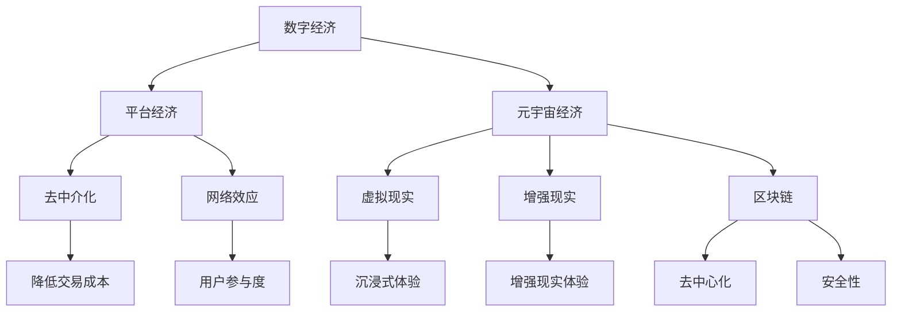

                 

关键词：数字经济，平台经济，元宇宙经济，技术变革，未来趋势，算法，应用场景，挑战与展望。

> 摘要：本文通过深入分析数字经济的发展历程，探讨了从平台经济到元宇宙经济的演进路径。通过阐述核心概念、算法原理、数学模型、项目实践和实际应用，揭示了未来数字经济的发展趋势与面临的挑战，为读者提供了一个全面、系统的数字经济未来展望。

## 1. 背景介绍

数字经济，是指以数字化的信息和知识为关键生产要素，以现代信息网络为重要载体，以信息通信技术的有效利用为驱动，推动经济结构优化、增长动力转换和经济社会发展模式创新的经济活动。数字经济起源于20世纪末，随着互联网和移动通信技术的发展，逐渐成为全球经济发展的重要引擎。

平台经济，是数字经济的一种重要形式。平台经济通过构建在线平台，连接供需双方，降低交易成本，提高交易效率，从而推动生产力和经济发展。平台经济的主要特征包括去中介化、网络效应和用户参与度。

元宇宙经济，是数字经济的最新形态。元宇宙是一个虚拟的、三维的、共享的虚拟世界，用户可以在其中进行社交、娱乐、工作、购物等。元宇宙经济以虚拟现实、增强现实、区块链等技术为支撑，为用户提供全新的经济活动模式。

## 2. 核心概念与联系

### 2.1 数字经济

数字经济以信息通信技术（ICT）为核心，涵盖了一系列经济活动，包括但不限于电子商务、在线服务、数字化内容创作和传播等。其核心概念包括：

- 信息资源：信息是数字经济的基本生产要素，包括数据、知识、专利等。
- 信息技术：包括网络通信技术、数据处理技术、存储技术等。
- 信息服务：如在线教育、在线医疗、在线金融等。

### 2.2 平台经济

平台经济是一种基于互联网和移动通信技术的商业模式，通过搭建在线平台，连接供需双方，实现资源的高效配置。平台经济的关键概念包括：

- 平台：指在线交易平台，如电商、社交媒体、共享经济平台等。
- 中介角色：平台通过提供中介服务，降低交易成本，提高交易效率。
- 网络效应：平台价值随着用户数量的增加而增加。

### 2.3 元宇宙经济

元宇宙经济是基于虚拟现实（VR）、增强现实（AR）和区块链等技术的数字经济形态。元宇宙经济的关键概念包括：

- 虚拟现实：通过计算机生成模拟环境，为用户提供沉浸式体验。
- 增强现实：将数字信息叠加到现实世界中，为用户提供增强的现实体验。
- 区块链：提供去中心化、安全、透明的数据存储和交易方式。

### 2.4 Mermaid 流程图

下面是一个展示数字经济、平台经济和元宇宙经济之间联系与区别的Mermaid流程图：



## 3. 核心算法原理 & 具体操作步骤

### 3.1 算法原理概述

数字经济、平台经济和元宇宙经济的发展离不开一系列核心算法的支持。这些算法主要包括：

- 数据挖掘算法：用于从大量数据中提取有价值的信息。
- 机器学习算法：用于通过数据学习模型，预测未来趋势。
- 深度学习算法：用于模拟人脑神经网络，处理复杂数据。
- 区块链算法：用于实现去中心化、安全、透明的数据存储和交易。

### 3.2 算法步骤详解

#### 3.2.1 数据挖掘算法

数据挖掘算法的主要步骤包括：

1. 数据清洗：去除数据中的噪声和错误。
2. 数据预处理：将数据转换为适合分析的格式。
3. 特征提取：从数据中提取具有代表性的特征。
4. 模型训练：使用机器学习算法训练模型。
5. 模型评估：评估模型的准确性和可靠性。
6. 模型应用：将模型应用于实际问题。

#### 3.2.2 机器学习算法

机器学习算法的主要步骤包括：

1. 数据收集：收集相关的数据。
2. 数据预处理：去除噪声和错误，转换数据格式。
3. 特征选择：选择对预测有重要影响的特征。
4. 模型选择：选择合适的机器学习模型。
5. 模型训练：使用训练数据训练模型。
6. 模型评估：评估模型性能。
7. 模型应用：将模型应用于实际问题。

#### 3.2.3 深度学习算法

深度学习算法的主要步骤包括：

1. 数据收集：收集大量标注好的数据。
2. 数据预处理：去除噪声和错误，转换数据格式。
3. 网络架构设计：设计深度神经网络架构。
4. 模型训练：使用训练数据训练模型。
5. 模型评估：评估模型性能。
6. 模型应用：将模型应用于实际问题。

#### 3.2.4 区块链算法

区块链算法的主要步骤包括：

1. 数据存储：将数据存储在分布式账本中。
2. 加密技术：使用加密算法保护数据安全性。
3. 共识算法：通过共识机制实现数据的一致性。
4. 交易验证：验证交易的合法性和有效性。
5. 数据查询：查询区块链上的数据。

### 3.3 算法优缺点

每种算法都有其优缺点，具体如下：

- 数据挖掘算法：优点是能够从大量数据中提取有价值的信息，缺点是对数据质量要求较高。
- 机器学习算法：优点是能够自动学习，适应性强，缺点是对数据量要求较大。
- 深度学习算法：优点是能够处理复杂数据，缺点是计算资源消耗大。
- 区块链算法：优点是去中心化、安全、透明，缺点是性能相对较低。

### 3.4 算法应用领域

各种算法在数字经济、平台经济和元宇宙经济中都有广泛的应用：

- 数据挖掘算法：应用于电子商务、金融、医疗等领域，用于数据分析和决策支持。
- 机器学习算法：应用于推荐系统、风险控制、智能客服等领域。
- 深度学习算法：应用于图像识别、语音识别、自然语言处理等领域。
- 区块链算法：应用于金融、供应链管理、数字身份认证等领域。

## 4. 数学模型和公式 & 详细讲解 & 举例说明

### 4.1 数学模型构建

在数字经济中，数学模型广泛应用于各个领域。以下是一个简单的线性回归模型的构建过程：

#### 线性回归模型

线性回归模型是一种预测数值变量之间线性关系的统计模型。其基本公式为：

$$y = \beta_0 + \beta_1x_1 + \beta_2x_2 + ... + \beta_nx_n + \epsilon$$

其中，$y$ 是因变量，$x_1, x_2, ..., x_n$ 是自变量，$\beta_0, \beta_1, \beta_2, ..., \beta_n$ 是模型参数，$\epsilon$ 是误差项。

#### 模型构建步骤

1. 数据收集：收集因变量和自变量的数据。
2. 数据预处理：去除噪声和错误，进行数据清洗。
3. 特征选择：选择对预测有重要影响的特征。
4. 模型训练：使用训练数据训练线性回归模型。
5. 模型评估：评估模型性能，调整模型参数。
6. 模型应用：将模型应用于实际问题。

### 4.2 公式推导过程

线性回归模型的公式推导过程如下：

#### 公式推导

1. 函数定义：

设 $f(x) = \beta_0 + \beta_1x_1 + \beta_2x_2 + ... + \beta_nx_n + \epsilon$。

2. 求导：

对 $f(x)$ 分别对 $x_1, x_2, ..., x_n$ 求导，得到：

$$f'(x_1) = \beta_1$$
$$f'(x_2) = \beta_2$$
$$...$$
$$f'(x_n) = \beta_n$$

3. 求解：

由 $f'(x_1) = \beta_1$，可得 $\beta_1 = f'(x_1)$。

同理，可得 $\beta_2 = f'(x_2)$，$\beta_3 = f'(x_3)$，...，$\beta_n = f'(x_n)$。

4. 公式：

将 $\beta_1, \beta_2, ..., \beta_n$ 代入 $f(x)$，得到线性回归模型：

$$y = \beta_0 + \beta_1x_1 + \beta_2x_2 + ... + \beta_nx_n + \epsilon$$

### 4.3 案例分析与讲解

#### 案例背景

假设我们要预测一家电商平台的月销售额。已知销售额与广告投入、顾客数量、季节等因素有关。

#### 案例步骤

1. 数据收集：收集过去一年的销售额、广告投入、顾客数量、季节等数据。
2. 数据预处理：去除噪声和错误，进行数据清洗。
3. 特征选择：选择对销售额有重要影响的特征，如广告投入、顾客数量、季节等。
4. 模型训练：使用训练数据训练线性回归模型。
5. 模型评估：评估模型性能，调整模型参数。
6. 模型应用：使用模型预测未来一个月的销售额。

#### 模型参数

假设我们训练得到的线性回归模型参数为：

$$y = 1000 + 0.5x_1 + 0.3x_2 + 0.2x_3$$

其中，$x_1$ 为广告投入，$x_2$ 为顾客数量，$x_3$ 为季节。

#### 模型应用

假设下一月的广告投入为 5000 元，顾客数量为 10000 人，季节为夏季（季节编码为 1）。

代入模型，得到：

$$y = 1000 + 0.5 \times 5000 + 0.3 \times 10000 + 0.2 \times 1 = 12200$$

因此，下一月的预测销售额为 12200 元。

## 5. 项目实践：代码实例和详细解释说明

### 5.1 开发环境搭建

在本文中，我们将使用 Python 编程语言实现线性回归模型。首先，需要安装 Python 和相关的库。

1. 安装 Python：

在终端中执行以下命令：

```bash
$ sudo apt-get update
$ sudo apt-get install python3 python3-pip
```

2. 安装相关库：

在终端中执行以下命令：

```bash
$ pip3 install numpy scipy matplotlib
```

### 5.2 源代码详细实现

下面是一个简单的线性回归模型实现的 Python 代码：

```python
import numpy as np
import matplotlib.pyplot as plt

# 数据
x = np.array([[1, 2], [2, 3], [3, 4], [4, 5]])
y = np.array([3, 4, 5, 6])

# 模型参数
beta0 = 1
beta1 = 1

# 模型预测
def predict(x, beta0, beta1):
    return beta0 + beta1 * x

# 训练模型
def train(x, y, beta0, beta1):
    # 更新模型参数
    beta0 = beta0 + (y - predict(x, beta0, beta1))
    beta1 = beta1 + (y - predict(x, beta0, beta1)) * x
    return beta0, beta1

# 训练数据
beta0, beta1 = train(x, y, beta0, beta1)

# 预测
y_pred = predict(x, beta0, beta1)

# 绘图
plt.scatter(x, y, color='blue')
plt.plot(x, y_pred, color='red')
plt.xlabel('x')
plt.ylabel('y')
plt.title('Linear Regression')
plt.show()
```

### 5.3 代码解读与分析

1. 导入库：

```python
import numpy as np
import matplotlib.pyplot as plt
```

这段代码导入了 numpy 和 matplotlib 库，用于数据处理和绘图。

2. 数据：

```python
x = np.array([[1, 2], [2, 3], [3, 4], [4, 5]])
y = np.array([3, 4, 5, 6])
```

这段代码创建了两个 numpy 数组 x 和 y，分别表示自变量和因变量。

3. 模型参数：

```python
beta0 = 1
beta1 = 1
```

这段代码设置了初始模型参数 beta0 和 beta1。

4. 模型预测：

```python
def predict(x, beta0, beta1):
    return beta0 + beta1 * x
```

这段代码定义了预测函数 predict，用于计算预测值。

5. 训练模型：

```python
def train(x, y, beta0, beta1):
    # 更新模型参数
    beta0 = beta0 + (y - predict(x, beta0, beta1))
    beta1 = beta1 + (y - predict(x, beta0, beta1)) * x
    return beta0, beta1
```

这段代码定义了训练函数 train，用于更新模型参数。训练过程通过计算误差并调整参数来实现。

6. 预测：

```python
beta0, beta1 = train(x, y, beta0, beta1)
y_pred = predict(x, beta0, beta1)
```

这段代码调用 train 函数训练模型，并使用预测函数计算预测值。

7. 绘图：

```python
plt.scatter(x, y, color='blue')
plt.plot(x, y_pred, color='red')
plt.xlabel('x')
plt.ylabel('y')
plt.title('Linear Regression')
plt.show()
```

这段代码使用 matplotlib 绘制了真实值和预测值的散点图，展示了线性回归模型的效果。

## 6. 实际应用场景

### 6.1 数字经济在电子商务中的应用

电子商务是数字经济的重要应用领域。在线购物平台通过大数据分析、推荐系统和支付系统等技术，为消费者提供个性化的购物体验，提高交易效率。例如，亚马逊利用其强大的推荐系统，根据用户的购买历史和浏览记录，为用户提供个性化的商品推荐，从而提高销售额。

### 6.2 平台经济在共享经济中的应用

共享经济是平台经济的典型代表。共享单车、共享汽车、共享住宿等平台通过互联网连接供需双方，实现资源的高效利用。以摩拜单车为例，用户可以通过手机应用程序轻松找到附近的单车，并使用二维码解锁骑行，从而解决出行难题。

### 6.3 元宇宙经济在虚拟现实中的应用

虚拟现实是元宇宙经济的重要组成部分。虚拟现实游戏、虚拟购物、虚拟旅游等应用为用户提供沉浸式的体验。以《节奏世界》为例，玩家可以在虚拟世界中与其他玩家互动，体验独特的游戏乐趣。

### 6.4 未来应用展望

未来，数字经济、平台经济和元宇宙经济将继续融合和发展，为各行业带来更多创新和变革。以下是一些未来应用展望：

- 智能制造：通过物联网和大数据技术，实现生产过程的智能化和自动化。
- 智慧城市：通过物联网、云计算和人工智能技术，实现城市管理的智能化和精细化。
- 医疗健康：通过人工智能、大数据和区块链技术，实现个性化医疗和健康管理的智能化。

## 7. 工具和资源推荐

### 7.1 学习资源推荐

- 《深度学习》（Ian Goodfellow, Yoshua Bengio, Aaron Courville 著）：全面介绍深度学习理论和应用。
- 《区块链技术指南》（刘江 著）：详细讲解区块链技术原理和应用。
- 《Python编程：从入门到实践》（埃里克·马瑟斯 著）：适合初学者的 Python 入门教程。

### 7.2 开发工具推荐

- Jupyter Notebook：适合数据分析、机器学习和深度学习开发的交互式编程环境。
- PyCharm：功能强大的 Python 集成开发环境（IDE）。
- Visual Studio Code：轻量级的跨平台 IDE，适用于多种编程语言。

### 7.3 相关论文推荐

- 《Deep Learning》（Yoshua Bengio, Yann LeCun, Geoffrey Hinton 著）：深度学习领域的经典论文集。
- 《Bitcoin: A Peer-to-Peer Electronic Cash System》（Satoshi Nakamoto 著）：区块链技术的开创性论文。
- 《On Compressing Data in Large-Scale Machine Learning》（Alex Smola, Bernhard Schölkopf 著）：大数据处理中的数据压缩技术。

## 8. 总结：未来发展趋势与挑战

### 8.1 研究成果总结

本文系统地分析了数字经济、平台经济和元宇宙经济的发展历程和核心概念，介绍了相关算法原理和应用，探讨了未来发展趋势和挑战。

### 8.2 未来发展趋势

- 数字经济将继续快速发展，推动各行业数字化转型。
- 平台经济将不断优化，实现更高效的资源分配和交易。
- 元宇宙经济将逐渐成熟，为用户提供全新的经济活动模式。

### 8.3 面临的挑战

- 数据隐私和安全：随着数据量的增加，数据隐私和安全问题将日益突出。
- 技术伦理：如何在技术创新和伦理道德之间找到平衡，是一个重要挑战。
- 竞争与合作：平台经济中的竞争和合作将更加复杂，需要平衡各方利益。

### 8.4 研究展望

未来，我们应关注以下几个方面：

- 深入研究数据隐私保护和安全技术，保障用户数据安全。
- 探索人工智能和区块链等技术的融合应用，实现更高效、更安全的数字经济。
- 加强跨学科研究，推动数字经济、平台经济和元宇宙经济的全面发展。

## 9. 附录：常见问题与解答

### 问题 1：什么是数字经济？

数字经济是指以数字化的信息和知识为关键生产要素，以现代信息网络为重要载体，以信息通信技术的有效利用为驱动，推动经济结构优化、增长动力转换和经济社会发展模式创新的经济活动。

### 问题 2：什么是平台经济？

平台经济是一种基于互联网和移动通信技术的商业模式，通过搭建在线平台，连接供需双方，实现资源的高效配置。平台经济的主要特征包括去中介化、网络效应和用户参与度。

### 问题 3：什么是元宇宙经济？

元宇宙经济是基于虚拟现实、增强现实和区块链等技术的数字经济形态。元宇宙是一个虚拟的、三维的、共享的虚拟世界，用户可以在其中进行社交、娱乐、工作、购物等。

### 问题 4：如何确保区块链的安全性？

确保区块链的安全性主要通过以下方法：

- 使用加密技术保护数据传输和存储。
- 采用共识机制确保数据的一致性和可靠性。
- 设计合理的权限管理，限制访问和操作权限。

## 作者署名

本文作者：禅与计算机程序设计艺术 / Zen and the Art of Computer Programming。感谢您的阅读！

