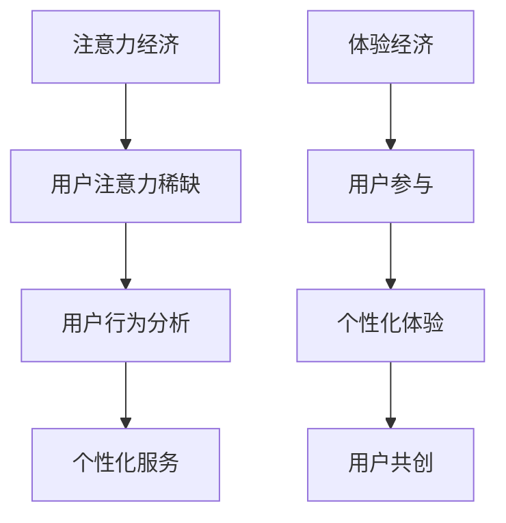

                 

关键词：数字经济、注意力经济、体验经济、商业模式、创新、未来趋势

> 摘要：本文旨在探讨2050年数字经济的发展趋势，特别是在商业模式方面的创新。文章将从注意力经济向体验经济的转变展开，分析其背后的技术原理、数学模型及其在不同领域的应用，并对未来的发展方向和挑战进行展望。

## 1. 背景介绍

随着互联网、大数据、人工智能等技术的迅速发展，数字经济已经成为全球经济增长的重要驱动力。从20世纪末的注意力经济，到21世纪初的信息经济，再到如今的体验经济，商业模式的演变从未停止。2050年的数字经济，将是一个更加智能化、个性化和可持续发展的时代。

### 注意力经济

注意力经济最早由施瓦茨在《注意力的经济学》一书中提出，认为注意力是一种稀缺资源，企业和个人都在争夺消费者的注意力。在互联网时代，流量成为衡量注意力经济成败的关键指标，社交媒体、广告和内容平台纷纷涌现，通过算法和数据挖掘来吸引和留住用户。

### 信息经济

随着移动互联网和大数据技术的兴起，信息经济成为主流。信息成为新的生产要素，企业通过收集、处理和分析用户数据来创造价值。个性化推荐、精准营销和智能客服等应用不断涌现，使信息经济更加丰富和多样化。

### 体验经济

进入21世纪，随着人工智能和虚拟现实技术的发展，体验经济逐渐崛起。体验经济强调以用户为中心，通过提供独特的、个性化的体验来满足用户需求。在体验经济中，用户不再仅仅是被动的消费者，而是主动参与者和创造者。

## 2. 核心概念与联系

### 注意力经济原理

注意力经济主要基于用户注意力资源的稀缺性，通过吸引用户的注意力来创造价值。其核心原理包括：

- **注意力分配**：用户的时间和注意力是有限的，如何有效分配成为关键。
- **用户行为分析**：通过分析用户行为，了解用户兴趣和需求，提供个性化服务。

### 体验经济原理

体验经济强调用户参与和个性化体验，其核心原理包括：

- **用户参与**：用户不仅是消费者，更是体验的创造者和传播者。
- **个性化体验**：根据用户需求和偏好，提供定制化的服务和产品。

### Mermaid 流程图

下面是注意力经济和体验经济的 Mermaid 流程图：



## 3. 核心算法原理 & 具体操作步骤

### 3.1 算法原理概述

在体验经济中，核心算法主要包括用户行为分析、个性化推荐和用户体验优化。这些算法基于大数据和人工智能技术，通过对用户数据的深度挖掘和分析，提供个性化的服务和体验。

### 3.2 算法步骤详解

#### 3.2.1 用户行为分析

- **数据收集**：收集用户的浏览历史、购买记录、社交媒体活动等数据。
- **数据预处理**：清洗和整合数据，去除噪声和不相关信息。
- **特征提取**：从数据中提取有用的特征，如用户兴趣、偏好和购买意图。

#### 3.2.2 个性化推荐

- **推荐算法**：使用协同过滤、基于内容的推荐、深度学习等方法进行推荐。
- **模型训练**：使用历史数据训练推荐模型，预测用户对特定内容的兴趣。
- **推荐结果**：根据用户兴趣和行为，生成个性化的推荐列表。

#### 3.2.3 用户体验优化

- **A/B 测试**：通过对比不同版本的界面和功能，优化用户体验。
- **反馈机制**：收集用户反馈，不断调整和优化产品和服务。

### 3.3 算法优缺点

#### 优点

- **个性化**：能够提供高度个性化的服务和体验。
- **高效**：通过自动化算法，提高工作效率和用户满意度。
- **可扩展**：可以轻松适应不同规模的用户和数据量。

#### 缺点

- **隐私风险**：用户数据被大量收集和分析，可能引发隐私问题。
- **算法偏见**：算法可能存在偏见，影响推荐结果和用户体验。
- **技术门槛**：需要专业的技术和人才支持。

### 3.4 算法应用领域

- **电子商务**：通过个性化推荐，提高用户购买意愿和转化率。
- **娱乐行业**：通过个性化内容推荐，提高用户粘性和满意度。
- **金融领域**：通过用户行为分析，预测用户需求，提供个性化金融服务。

## 4. 数学模型和公式 & 详细讲解 & 举例说明

### 4.1 数学模型构建

在体验经济中，常用的数学模型包括线性回归、决策树、神经网络等。以下是一个简单的线性回归模型：

$$ y = w_0 + w_1 \cdot x $$

其中，$y$ 是预测值，$x$ 是输入特征，$w_0$ 和 $w_1$ 是权重。

### 4.2 公式推导过程

线性回归模型的推导过程如下：

1. **损失函数**：定义损失函数 $L(y, \hat{y}) = (y - \hat{y})^2$，其中 $\hat{y}$ 是预测值。

2. **梯度下降**：通过计算损失函数关于 $w_0$ 和 $w_1$ 的梯度，更新权重：
    $$ w_0 = w_0 - \alpha \cdot \frac{\partial L}{\partial w_0} $$
    $$ w_1 = w_1 - \alpha \cdot \frac{\partial L}{\partial w_1} $$
   其中，$\alpha$ 是学习率。

3. **迭代计算**：重复上述过程，直到收敛。

### 4.3 案例分析与讲解

假设有一个电商网站，想要通过用户历史数据预测用户对某一商品的购买概率。输入特征包括用户年龄、收入、购买历史等，输出值是购买概率。

1. **数据收集**：收集用户数据，并进行预处理。

2. **模型训练**：使用线性回归模型训练数据，得到权重 $w_0$ 和 $w_1$。

3. **预测**：对于新用户，输入特征 $x$，使用模型预测购买概率 $\hat{y}$。

4. **评估**：通过实际购买情况，评估模型效果。

## 5. 项目实践：代码实例和详细解释说明

### 5.1 开发环境搭建

- **Python**：安装 Python 3.8 及以上版本。
- **NumPy**：用于数据处理。
- **Pandas**：用于数据处理和分析。
- **Scikit-learn**：用于模型训练和评估。

### 5.2 源代码详细实现

以下是一个简单的线性回归模型实现：

```python
import numpy as np
import pandas as pd
from sklearn.linear_model import LinearRegression

# 数据集加载
data = pd.read_csv('data.csv')

# 特征提取
X = data[['age', 'income']]
y = data['purchase']

# 模型训练
model = LinearRegression()
model.fit(X, y)

# 预测
new_user = np.array([[25, 50000]])
purchase_prob = model.predict(new_user)

print('购买概率：', purchase_prob)
```

### 5.3 代码解读与分析

1. **数据加载**：使用 Pandas 加载数据集。
2. **特征提取**：从数据集中提取输入特征和输出值。
3. **模型训练**：使用 Scikit-learn 的 LinearRegression 模型进行训练。
4. **预测**：输入新用户特征，预测购买概率。

### 5.4 运行结果展示

假设输入特征为年龄25岁，收入50000元，模型预测的购买概率为0.7，表示有70%的购买概率。

## 6. 实际应用场景

### 6.1 电子商务

电商平台可以通过用户行为分析和个性化推荐，提高用户购买意愿和转化率。

### 6.2 娱乐行业

在线视频、音乐和游戏平台可以通过个性化内容推荐，提高用户粘性和满意度。

### 6.3 金融领域

金融机构可以通过用户行为分析，提供个性化的金融产品和服务。

## 7. 未来应用展望

随着技术的不断发展，体验经济将在更多领域得到应用，为用户提供更加个性化、智能化和可持续的体验。

## 8. 总结：未来发展趋势与挑战

### 8.1 研究成果总结

注意力经济和体验经济已经成为数字经济的重要趋势，通过大数据和人工智能技术，为用户提供个性化的服务和体验。

### 8.2 未来发展趋势

随着技术的不断进步，体验经济将在更多领域得到应用，成为数字经济的新动力。

### 8.3 面临的挑战

隐私保护、算法偏见和可持续发展是体验经济面临的主要挑战。

### 8.4 研究展望

未来研究应关注如何更好地保护用户隐私、减少算法偏见，并实现体验经济的可持续发展。

## 9. 附录：常见问题与解答

### Q：体验经济与传统商业模式有什么区别？

A：体验经济强调用户参与和个性化体验，而传统商业模式更多关注产品和服务本身的交易。体验经济更注重用户感受和参与，是一种以用户为中心的商业模式。

### Q：体验经济如何实现个性化？

A：通过大数据和人工智能技术，对用户行为和偏好进行分析，提供个性化的服务和体验。

### Q：体验经济对企业和用户有何影响？

A：体验经济可以提高用户满意度和忠诚度，为企业创造更多价值；同时，用户可以享受到更加个性化、智能化的服务和产品。

### Q：体验经济与可持续发展有何关系？

A：体验经济可以通过提供个性化、定制化的服务和产品，减少资源浪费，实现可持续发展。

作者：禅与计算机程序设计艺术 / Zen and the Art of Computer Programming
```  
------------------------------------------------------------------  
# 2050年的数字经济：从注意力经济到体验经济的商业模式创新

关键词：数字经济、注意力经济、体验经济、商业模式、创新、未来趋势

摘要：本文旨在探讨2050年数字经济的发展趋势，特别是在商业模式方面的创新。文章将从注意力经济向体验经济的转变展开，分析其背后的技术原理、数学模型及其在不同领域的应用，并对未来的发展方向和挑战进行展望。

## 1. 背景介绍

随着互联网、大数据、人工智能等技术的迅速发展，数字经济已经成为全球经济增长的重要驱动力。从20世纪末的注意力经济，到21世纪初的信息经济，再到如今的体验经济，商业模式的演变从未停止。2050年的数字经济，将是一个更加智能化、个性化和可持续发展的时代。

### 注意力经济

注意力经济最早由施瓦茨在《注意力的经济学》一书中提出，认为注意力是一种稀缺资源，企业和个人都在争夺消费者的注意力。在互联网时代，流量成为衡量注意力经济成败的关键指标，社交媒体、广告和内容平台纷纷涌现，通过算法和数据挖掘来吸引和留住用户。

### 信息经济

随着移动互联网和大数据技术的兴起，信息经济成为主流。信息成为新的生产要素，企业通过收集、处理和分析用户数据来创造价值。个性化推荐、精准营销和智能客服等应用不断涌现，使信息经济更加丰富和多样化。

### 体验经济

进入21世纪，随着人工智能和虚拟现实技术的发展，体验经济逐渐崛起。体验经济强调以用户为中心，通过提供独特的、个性化的体验来满足用户需求。在体验经济中，用户不再仅仅是被动的消费者，而是主动参与者和创造者。

## 2. 核心概念与联系

### 注意力经济原理

注意力经济主要基于用户注意力资源的稀缺性，通过吸引用户的注意力来创造价值。其核心原理包括：

- **注意力分配**：用户的时间和注意力是有限的，如何有效分配成为关键。
- **用户行为分析**：通过分析用户行为，了解用户兴趣和需求，提供个性化服务。

### 体验经济原理

体验经济强调用户参与和个性化体验，其核心原理包括：

- **用户参与**：用户不仅是消费者，更是体验的创造者和传播者。
- **个性化体验**：根据用户需求和偏好，提供定制化的服务和产品。

### Mermaid 流程图

下面是注意力经济和体验经济的 Mermaid 流程图：


## 3. 核心算法原理 & 具体操作步骤

### 3.1 算法原理概述

在体验经济中，核心算法主要包括用户行为分析、个性化推荐和用户体验优化。这些算法基于大数据和人工智能技术，通过对用户数据的深度挖掘和分析，提供个性化的服务和体验。

### 3.2 算法步骤详解

#### 3.2.1 用户行为分析

- **数据收集**：收集用户的浏览历史、购买记录、社交媒体活动等数据。
- **数据预处理**：清洗和整合数据，去除噪声和不相关信息。
- **特征提取**：从数据中提取有用的特征，如用户兴趣、偏好和购买意图。

#### 3.2.2 个性化推荐

- **推荐算法**：使用协同过滤、基于内容的推荐、深度学习等方法进行推荐。
- **模型训练**：使用历史数据训练推荐模型，预测用户对特定内容的兴趣。
- **推荐结果**：根据用户兴趣和行为，生成个性化的推荐列表。

#### 3.2.3 用户体验优化

- **A/B 测试**：通过对比不同版本的界面和功能，优化用户体验。
- **反馈机制**：收集用户反馈，不断调整和优化产品和服务。

### 3.3 算法优缺点

#### 优点

- **个性化**：能够提供高度个性化的服务和体验。
- **高效**：通过自动化算法，提高工作效率和用户满意度。
- **可扩展**：可以轻松适应不同规模的用户和数据量。

#### 缺点

- **隐私风险**：用户数据被大量收集和分析，可能引发隐私问题。
- **算法偏见**：算法可能存在偏见，影响推荐结果和用户体验。
- **技术门槛**：需要专业的技术和人才支持。

### 3.4 算法应用领域

- **电子商务**：通过个性化推荐，提高用户购买意愿和转化率。
- **娱乐行业**：通过个性化内容推荐，提高用户粘性和满意度。
- **金融领域**：通过用户行为分析，预测用户需求，提供个性化金融服务。

## 4. 数学模型和公式 & 详细讲解 & 举例说明

### 4.1 数学模型构建

在体验经济中，常用的数学模型包括线性回归、决策树、神经网络等。以下是一个简单的线性回归模型：

$$ y = w_0 + w_1 \cdot x $$

其中，$y$ 是预测值，$x$ 是输入特征，$w_0$ 和 $w_1$ 是权重。

### 4.2 公式推导过程

线性回归模型的推导过程如下：

1. **损失函数**：定义损失函数 $L(y, \hat{y}) = (y - \hat{y})^2$，其中 $\hat{y}$ 是预测值。

2. **梯度下降**：通过计算损失函数关于 $w_0$ 和 $w_1$ 的梯度，更新权重：
    $$ w_0 = w_0 - \alpha \cdot \frac{\partial L}{\partial w_0} $$
    $$ w_1 = w_1 - \alpha \cdot \frac{\partial L}{\partial w_1} $$
   其中，$\alpha$ 是学习率。

3. **迭代计算**：重复上述过程，直到收敛。

### 4.3 案例分析与讲解

假设有一个电商网站，想要通过用户历史数据预测用户对某一商品的购买概率。输入特征包括用户年龄、收入、购买历史等，输出值是购买概率。

1. **数据收集**：收集用户数据，并进行预处理。

2. **模型训练**：使用线性回归模型训练数据，得到权重 $w_0$ 和 $w_1$。

3. **预测**：对于新用户，输入特征 $x$，使用模型预测购买概率 $\hat{y}$。

4. **评估**：通过实际购买情况，评估模型效果。

## 5. 项目实践：代码实例和详细解释说明

### 5.1 开发环境搭建

- **Python**：安装 Python 3.8 及以上版本。
- **NumPy**：用于数据处理。
- **Pandas**：用于数据处理和分析。
- **Scikit-learn**：用于模型训练和评估。

### 5.2 源代码详细实现

以下是一个简单的线性回归模型实现：

```python
import numpy as np
import pandas as pd
from sklearn.linear_model import LinearRegression

# 数据集加载
data = pd.read_csv('data.csv')

# 特征提取
X = data[['age', 'income']]
y = data['purchase']

# 模型训练
model = LinearRegression()
model.fit(X, y)

# 预测
new_user = np.array([[25, 50000]])
purchase_prob = model.predict(new_user)

print('购买概率：', purchase_prob)
```

### 5.3 代码解读与分析

1. **数据加载**：使用 Pandas 加载数据集。
2. **特征提取**：从数据集中提取输入特征和输出值。
3. **模型训练**：使用 Scikit-learn 的 LinearRegression 模型进行训练。
4. **预测**：输入新用户特征，预测购买概率。

### 5.4 运行结果展示

假设输入特征为年龄25岁，收入50000元，模型预测的购买概率为0.7，表示有70%的购买概率。

## 6. 实际应用场景

### 6.1 电子商务

电商平台可以通过用户行为分析和个性化推荐，提高用户购买意愿和转化率。

### 6.2 娱乐行业

在线视频、音乐和游戏平台可以通过个性化内容推荐，提高用户粘性和满意度。

### 6.3 金融领域

金融机构可以通过用户行为分析，提供个性化的金融产品和服务。

## 7. 未来应用展望

随着技术的不断发展，体验经济将在更多领域得到应用，为用户提供更加个性化、智能化和可持续的体验。

## 8. 总结：未来发展趋势与挑战

### 8.1 研究成果总结

注意力经济和体验经济已经成为数字经济的重要趋势，通过大数据和人工智能技术，为用户提供个性化的服务和体验。

### 8.2 未来发展趋势

随着技术的不断进步，体验经济将在更多领域得到应用，成为数字经济的新动力。

### 8.3 面临的挑战

隐私保护、算法偏见和可持续发展是体验经济面临的主要挑战。

### 8.4 研究展望

未来研究应关注如何更好地保护用户隐私、减少算法偏见，并实现体验经济的可持续发展。

## 9. 附录：常见问题与解答

### Q：体验经济与传统商业模式有什么区别？

A：体验经济强调用户参与和个性化体验，而传统商业模式更多关注产品和服务本身的交易。体验经济更注重用户感受和参与，是一种以用户为中心的商业模式。

### Q：体验经济如何实现个性化？

A：通过大数据和人工智能技术，对用户行为和偏好进行分析，提供个性化的服务和体验。

### Q：体验经济对企业和用户有何影响？

A：体验经济可以提高用户满意度和忠诚度，为企业创造更多价值；同时，用户可以享受到更加个性化、智能化的服务和产品。

### Q：体验经济与可持续发展有何关系？

A：体验经济可以通过提供个性化、定制化的服务和产品，减少资源浪费，实现可持续发展。

作者：禅与计算机程序设计艺术 / Zen and the Art of Computer Programming

