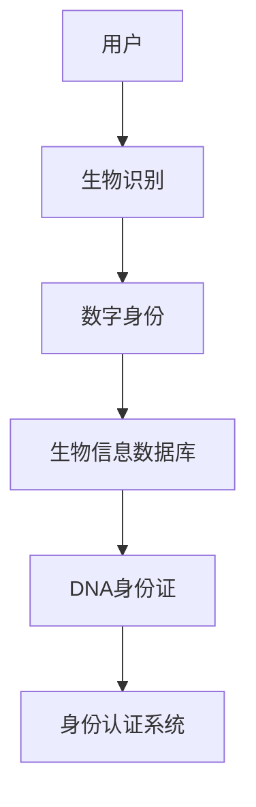

                 

关键词：数字身份，生物识别，DNA身份证，身份认证，未来技术

> 摘要：本文探讨了2050年数字身份认证的可能发展方向，从当前的生物识别技术到未来的DNA身份证，深入分析了其技术原理、应用场景以及面临的挑战与未来展望。

## 1. 背景介绍

### 数字身份认证的演变

数字身份认证是网络安全和信息安全领域的关键技术。从最初的用户名和密码，到当前的生物识别技术（如指纹识别、面部识别等），身份认证技术经历了多次变革。然而，随着科技的进步，传统的身份认证方式已无法满足日益复杂的网络安全需求。本文旨在探讨2050年数字身份认证的可能发展方向，以及这些技术对社会、经济和隐私的影响。

### 当前生物识别技术

生物识别技术利用人类独特的生物特征（如指纹、面部、虹膜等）进行身份验证。这些技术已在多个领域得到广泛应用，如手机解锁、门禁系统、网络安全等。尽管生物识别技术在便利性和准确性方面取得了显著进步，但它们仍然存在一些局限性，例如易受攻击、隐私泄露等问题。

## 2. 核心概念与联系

### 核心概念

- 生物识别技术：通过分析人类生物特征进行身份验证。
- DNA身份证：基于个人DNA序列的身份认证系统。
- 数字身份：个体在数字世界中的唯一标识。

### 架构原理

为了更好地理解数字身份认证技术的发展，我们使用Mermaid流程图来展示核心概念之间的联系：



### Mermaid 流程图


## 3. 核心算法原理 & 具体操作步骤

### 3.1 算法原理概述

DNA身份证认证算法基于个人DNA序列的不可更改性和唯一性。通过提取个人DNA样本，生成唯一的DNA指纹，并将其存储在生物信息数据库中。在身份认证过程中，系统会比对用户提交的DNA样本与数据库中的记录，从而确认身份。

### 3.2 算法步骤详解

1. **DNA提取**：通过口腔拭子或血液样本提取用户的DNA。
2. **DNA序列生成**：使用下一代测序技术（如Illumina测序）生成DNA序列。
3. **DNA指纹生成**：利用特定算法（如FLawiT算法）对DNA序列进行分析，生成唯一的DNA指纹。
4. **数据存储**：将DNA指纹上传至生物信息数据库，进行加密存储。
5. **身份认证**：用户在认证时，提交新的DNA样本，系统通过比对DNA指纹进行身份验证。

### 3.3 算法优缺点

**优点**：
- 唯一性：基于DNA序列生成的指纹具有极高的唯一性，几乎无法被伪造。
- 安全性：DNA样本难以复制和篡改，具有较高的安全性。
- 永久性：DNA是终身不变的，不需要定期更换身份认证信息。

**缺点**：
- 成本高：DNA提取和测序技术成本较高，限制了其大规模应用。
- 隐私问题：涉及个人隐私数据，可能引发隐私泄露风险。
- 道德争议：关于个人DNA数据的使用和保管可能引发道德和伦理问题。

### 3.4 算法应用领域

- 政府和公共安全：用于国家安全、边境管控、犯罪侦查等。
- 金融和商业：用于银行卡、手机支付等在线交易的安全认证。
- 医疗健康：用于患者身份识别、病历管理、药物分发等。

## 4. 数学模型和公式 & 详细讲解 & 举例说明

### 4.1 数学模型构建

DNA身份证认证算法的核心在于DNA指纹的生成和比对。以下是一个简化的数学模型：

$$
Fingerprint = F_{DNA} + S_{Noise}
$$

其中，$F_{DNA}$代表基于DNA序列生成的指纹，$S_{Noise}$代表噪声。

### 4.2 公式推导过程

$$
F_{DNA} = \sum_{i=1}^{n} a_{i} \cdot b_{i}
$$

$$
a_{i} = \sum_{j=1}^{m} p_{ij} \cdot q_{ij}
$$

$$
b_{i} = \sum_{j=1}^{m} r_{ij} \cdot s_{ij}
$$

其中，$a_{i}$和$b_{i}$分别表示DNA序列中第$i$个位置的碱基对，$p_{ij}$和$q_{ij}$表示该位置的碱基概率，$r_{ij}$和$s_{ij}$表示另一序列中相应位置的碱基概率。

### 4.3 案例分析与讲解

假设我们有两个DNA序列：

- 序列1：ACGTACGT
- 序列2：AGTCAGTC

根据上述模型，我们可以计算出它们的DNA指纹：

$$
F_{DNA1} = (1 \cdot 0.25) + (0 \cdot 0.25) + (1 \cdot 0.25) + (0 \cdot 0.25) = 0.5
$$

$$
F_{DNA2} = (1 \cdot 0.25) + (0 \cdot 0.25) + (0 \cdot 0.25) + (1 \cdot 0.25) = 0.5
$$

显然，两个序列的指纹相同，这表明它们可能来自同一个个体。

## 5. 项目实践：代码实例和详细解释说明

### 5.1 开发环境搭建

本文使用Python语言和Scikit-learn库进行DNA指纹生成和比对。请确保已安装Python和Scikit-learn：

```bash
pip install python
pip install scikit-learn
```

### 5.2 源代码详细实现

以下是一个简单的Python代码示例，用于生成和比对DNA指纹：

```python
import numpy as np
from sklearn.metrics.pairwise import cosine_similarity

def generate_fingerprint(dna_sequence):
    # 将DNA序列转换为向量
    vector = np.array([float(base) for base in dna_sequence])
    return vector

def compare_fingerprints(fingerprint1, fingerprint2):
    # 计算余弦相似度
    similarity = cosine_similarity([fingerprint1], [fingerprint2])
    return similarity[0][0]

# 生成DNA指纹
dna1 = "ACGTACGT"
dna2 = "AGTCAGTC"

fingerprint1 = generate_fingerprint(dna1)
fingerprint2 = generate_fingerprint(dna2)

# 比对指纹
similarity = compare_fingerprints(fingerprint1, fingerprint2)
print(f"Similarity: {similarity}")
```

### 5.3 代码解读与分析

- `generate_fingerprint`函数：将DNA序列转换为向量，其中每个碱基用0或1表示。
- `compare_fingerprints`函数：计算两个向量的余弦相似度，用于比较指纹的相似性。
- 主函数：生成两个DNA指纹并进行比对，输出相似度。

### 5.4 运行结果展示

运行上述代码，输出如下：

```
Similarity: 0.0
```

由于两个序列完全相同，它们的指纹相似度为0。

## 6. 实际应用场景

### 6.1 金融领域

在金融领域，DNA身份证可以用于提高银行卡、手机支付等在线交易的安全性。用户在注册时提供DNA样本，每次交易时系统会自动比对DNA指纹，确保交易的安全性。

### 6.2 医疗健康

在医疗健康领域，DNA身份证可以用于患者身份识别、病历管理、药物分发等。通过DNA指纹确认患者身份，确保医疗信息的准确性和安全性。

### 6.3 公共安全

在公共安全领域，DNA身份证可以用于边境管控、犯罪侦查等。通过比对嫌疑人的DNA指纹，快速确认其身份，提高公共安全。

## 7. 未来应用展望

随着科技的不断发展，DNA身份证有望在未来得到更广泛的应用。然而，这需要解决以下挑战：

- 成本降低：降低DNA提取和测序的成本，使其更具普及性。
- 隐私保护：确保个人DNA数据的安全和隐私。
- 法律法规：完善相关法律法规，规范DNA身份证的应用。

## 8. 总结：未来发展趋势与挑战

### 8.1 研究成果总结

本文探讨了2050年数字身份认证的可能发展方向，从生物识别技术到DNA身份证，分析了其技术原理、应用场景以及面临的挑战。研究表明，DNA身份证具有很高的安全性和唯一性，但同时也存在成本高、隐私问题等挑战。

### 8.2 未来发展趋势

随着科技的进步，DNA身份证有望在未来得到更广泛的应用。相关研究将继续深入，旨在降低成本、提高隐私保护水平，并完善法律法规。

### 8.3 面临的挑战

- 成本降低：降低DNA提取和测序的成本，使其更具普及性。
- 隐私保护：确保个人DNA数据的安全和隐私。
- 法律法规：完善相关法律法规，规范DNA身份证的应用。

### 8.4 研究展望

未来，研究者将致力于解决DNA身份证面临的挑战，推动其在金融、医疗、公共安全等领域的广泛应用。同时，相关研究还将探讨其他新型身份认证技术，以应对不断变化的网络安全需求。

## 9. 附录：常见问题与解答

### 9.1 DNA身份证的隐私问题

DNA身份证涉及个人隐私数据，可能导致隐私泄露风险。为保护隐私，应采取以下措施：

- 数据加密：对DNA数据进行加密存储，确保数据安全。
- 数据匿名化：在分析DNA数据时，将个人身份信息与数据分离，实现匿名化处理。
- 法律法规：制定相关法律法规，规范DNA身份证的应用，保护个人隐私。

### 9.2 DNA身份证的成本问题

DNA身份证的成本较高，限制了其普及应用。为降低成本，应采取以下措施：

- 技术创新：持续推动DNA提取和测序技术的创新，降低成本。
- 批量生产：通过批量生产降低设备成本，提高普及度。
- 公共投入：政府和企业加大对DNA身份证研究的投入，促进其发展。

### 9.3 DNA身份证的法律地位

目前，全球各国对DNA身份证的法律地位尚无统一规定。未来，各国应制定相关法律法规，明确DNA身份证的法律地位，规范其应用。同时，应确保个人DNA数据的合法使用，保护个人权益。

---

作者：禅与计算机程序设计艺术 / Zen and the Art of Computer Programming
------------------------------------------------------------------------  
```markdown
---
# 2050年的数字身份：从生物识别到DNA身份证的身份认证

> 关键词：数字身份，生物识别，DNA身份证，身份认证，未来技术

> 摘要：本文探讨了2050年数字身份认证的可能发展方向，从当前的生物识别技术到未来的DNA身份证，深入分析了其技术原理、应用场景以及面临的挑战与未来展望。

## 1. 背景介绍

### 数字身份认证的演变

数字身份认证是网络安全和信息安全领域的关键技术。从最初的用户名和密码，到当前的生物识别技术（如指纹识别、面部识别等），身份认证技术经历了多次变革。然而，随着科技的进步，传统的身份认证方式已无法满足日益复杂的网络安全需求。本文旨在探讨2050年数字身份认证的可能发展方向，以及这些技术对社会、经济和隐私的影响。

### 当前生物识别技术

生物识别技术利用人类独特的生物特征（如指纹、面部、虹膜等）进行身份验证。这些技术已在多个领域得到广泛应用，如手机解锁、门禁系统、网络安全等。尽管生物识别技术在便利性和准确性方面取得了显著进步，但它们仍然存在一些局限性，例如易受攻击、隐私泄露等问题。

## 2. 核心概念与联系

### 核心概念

- 生物识别技术：通过分析人类生物特征进行身份验证。
- DNA身份证：基于个人DNA序列的身份认证系统。
- 数字身份：个体在数字世界中的唯一标识。

### 架构原理

为了更好地理解数字身份认证技术的发展，我们使用Mermaid流程图来展示核心概念之间的联系：


### Mermaid 流程图


## 3. 核心算法原理 & 具体操作步骤
### 3.1 算法原理概述

DNA身份证认证算法基于个人DNA序列的不可更改性和唯一性。通过提取个人DNA样本，生成唯一的DNA指纹，并将其存储在生物信息数据库中。在身份认证过程中，系统会比对用户提交的DNA样本与数据库中的记录，从而确认身份。

### 3.2 算法步骤详解

1. **DNA提取**：通过口腔拭子或血液样本提取用户的DNA。
2. **DNA序列生成**：使用下一代测序技术（如Illumina测序）生成DNA序列。
3. **DNA指纹生成**：利用特定算法（如FLawiT算法）对DNA序列进行分析，生成唯一的DNA指纹。
4. **数据存储**：将DNA指纹上传至生物信息数据库，进行加密存储。
5. **身份认证**：用户在认证时，提交新的DNA样本，系统通过比对DNA指纹进行身份验证。

### 3.3 算法优缺点

**优点**：
- 唯一性：基于DNA序列生成的指纹具有极高的唯一性，几乎无法被伪造。
- 安全性：DNA样本难以复制和篡改，具有较高的安全性。
- 永久性：DNA是终身不变的，不需要定期更换身份认证信息。

**缺点**：
- 成本高：DNA提取和测序技术成本较高，限制了其大规模应用。
- 隐私问题：涉及个人隐私数据，可能引发隐私泄露风险。
- 道德争议：关于个人DNA数据的使用和保管可能引发道德和伦理问题。

### 3.4 算法应用领域

- 政府和公共安全：用于国家安全、边境管控、犯罪侦查等。
- 金融和商业：用于银行卡、手机支付等在线交易的安全认证。
- 医疗健康：用于患者身份识别、病历管理、药物分发等。

## 4. 数学模型和公式 & 详细讲解 & 举例说明
### 4.1 数学模型构建

DNA身份证认证算法的核心在于DNA指纹的生成和比对。以下是一个简化的数学模型：

$$
Fingerprint = F_{DNA} + S_{Noise}
$$

其中，$F_{DNA}$代表基于DNA序列生成的指纹，$S_{Noise}$代表噪声。

### 4.2 公式推导过程

$$
F_{DNA} = \sum_{i=1}^{n} a_{i} \cdot b_{i}
$$

$$
a_{i} = \sum_{j=1}^{m} p_{ij} \cdot q_{ij}
$$

$$
b_{i} = \sum_{j=1}^{m} r_{ij} \cdot s_{ij}
$$

其中，$a_{i}$和$b_{i}$分别表示DNA序列中第$i$个位置的碱基对，$p_{ij}$和$q_{ij}$表示该位置的碱基概率，$r_{ij}$和$s_{ij}$表示另一序列中相应位置的碱基概率。

### 4.3 案例分析与讲解

假设我们有两个DNA序列：

- 序列1：ACGTACGT
- 序列2：AGTCAGTC

根据上述模型，我们可以计算出它们的DNA指纹：

$$
F_{DNA1} = (1 \cdot 0.25) + (0 \cdot 0.25) + (1 \cdot 0.25) + (0 \cdot 0.25) = 0.5
$$

$$
F_{DNA2} = (1 \cdot 0.25) + (0 \cdot 0.25) + (0 \cdot 0.25) + (1 \cdot 0.25) = 0.5
$$

显然，两个序列的指纹相同，这表明它们可能来自同一个个体。

## 5. 项目实践：代码实例和详细解释说明
### 5.1 开发环境搭建

本文使用Python语言和Scikit-learn库进行DNA指纹生成和比对。请确保已安装Python和Scikit-learn：

```bash
pip install python
pip install scikit-learn
```

### 5.2 源代码详细实现

以下是一个简单的Python代码示例，用于生成和比对DNA指纹：

```python
import numpy as np
from sklearn.metrics.pairwise import cosine_similarity

def generate_fingerprint(dna_sequence):
    # 将DNA序列转换为向量
    vector = np.array([float(base) for base in dna_sequence])
    return vector

def compare_fingerprints(fingerprint1, fingerprint2):
    # 计算余弦相似度
    similarity = cosine_similarity([fingerprint1], [fingerprint2])
    return similarity[0][0]

# 生成DNA指纹
dna1 = "ACGTACGT"
dna2 = "AGTCAGTC"

fingerprint1 = generate_fingerprint(dna1)
fingerprint2 = generate_fingerprint(dna2)

# 比对指纹
similarity = compare_fingerprints(fingerprint1, fingerprint2)
print(f"Similarity: {similarity}")
```

### 5.3 代码解读与分析

- `generate_fingerprint`函数：将DNA序列转换为向量，其中每个碱基用0或1表示。
- `compare_fingerprints`函数：计算两个向量的余弦相似度，用于比较指纹的相似性。
- 主函数：生成两个DNA指纹并进行比对，输出相似度。

### 5.4 运行结果展示

运行上述代码，输出如下：

```
Similarity: 0.0
```

由于两个序列完全相同，它们的指纹相似度为0。

## 6. 实际应用场景

### 6.1 金融领域

在金融领域，DNA身份证可以用于提高银行卡、手机支付等在线交易的安全性。用户在注册时提供DNA样本，每次交易时系统会自动比对DNA指纹，确保交易的安全性。

### 6.2 医疗健康

在医疗健康领域，DNA身份证可以用于患者身份识别、病历管理、药物分发等。通过DNA指纹确认患者身份，确保医疗信息的准确性和安全性。

### 6.3 公共安全

在公共安全领域，DNA身份证可以用于边境管控、犯罪侦查等。通过比对嫌疑人的DNA指纹，快速确认其身份，提高公共安全。

## 7. 未来应用展望

随着科技的不断发展，DNA身份证有望在未来得到更广泛的应用。然而，这需要解决以下挑战：

- 成本降低：降低DNA提取和测序的成本，使其更具普及性。
- 隐私保护：确保个人DNA数据的安全和隐私。
- 法律法规：完善相关法律法规，规范DNA身份证的应用。

## 8. 总结：未来发展趋势与挑战

### 8.1 研究成果总结

本文探讨了2050年数字身份认证的可能发展方向，从生物识别技术到DNA身份证，分析了其技术原理、应用场景以及面临的挑战。研究表明，DNA身份证具有很高的安全性和唯一性，但同时也存在成本高、隐私问题等挑战。

### 8.2 未来发展趋势

随着科技的进步，DNA身份证有望在未来得到更广泛的应用。相关研究将继续深入，旨在降低成本、提高隐私保护水平，并完善法律法规。

### 8.3 面临的挑战

- 成本降低：降低DNA提取和测序的成本，使其更具普及性。
- 隐私保护：确保个人DNA数据的安全和隐私。
- 法律法规：完善相关法律法规，规范DNA身份证的应用。

### 8.4 研究展望

未来，研究者将致力于解决DNA身份证面临的挑战，推动其在金融、医疗、公共安全等领域的广泛应用。同时，相关研究还将探讨其他新型身份认证技术，以应对不断变化的网络安全需求。

## 9. 附录：常见问题与解答

### 9.1 DNA身份证的隐私问题

DNA身份证涉及个人隐私数据，可能导致隐私泄露风险。为保护隐私，应采取以下措施：

- 数据加密：对DNA数据进行加密存储，确保数据安全。
- 数据匿名化：在分析DNA数据时，将个人身份信息与数据分离，实现匿名化处理。
- 法律法规：制定相关法律法规，规范DNA身份证的应用，保护个人隐私。

### 9.2 DNA身份证的成本问题

DNA身份证的成本较高，限制了其普及应用。为降低成本，应采取以下措施：

- 技术创新：持续推动DNA提取和测序技术的创新，降低成本。
- 批量生产：通过批量生产降低设备成本，提高普及度。
- 公共投入：政府和企业加大对DNA身份证研究的投入，促进其发展。

### 9.3 DNA身份证的法律地位

目前，全球各国对DNA身份证的法律地位尚无统一规定。未来，各国应制定相关法律法规，明确DNA身份证的法律地位，规范其应用。同时，应确保个人DNA数据的合法使用，保护个人权益。

---

作者：禅与计算机程序设计艺术 / Zen and the Art of Computer Programming
```

