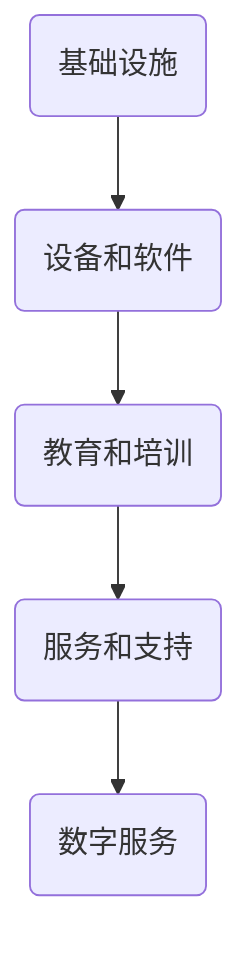
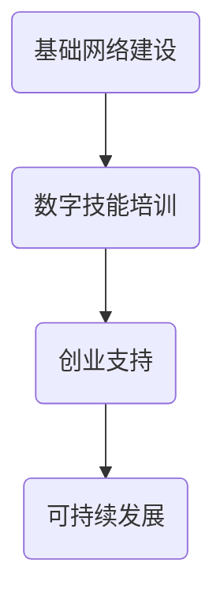

                 

### 关键词 Keyword ###
- 数字鸿沟
- 数字包容
- 数字扶贫
- 数字经济
- 均衡发展
- 技术赋能
- 社会公平
- 人工智能
- 数据科学

### 摘要 Abstract ###
本文探讨了2050年全球数字鸿沟的现状及其对数字经济均衡发展的影响。文章从数字鸿沟的定义出发，分析了其背后的原因，如技术差异、经济水平、教育程度等。接着，文章提出了数字包容和数字扶贫的概念，探讨了其在缩小数字鸿沟中的作用。随后，文章详细阐述了数字经济均衡发展的核心要素，包括技术进步、政策支持、教育和培训等。最后，文章对未来发展趋势进行了展望，提出了面临的挑战及应对策略。

## 1. 背景介绍

### 1.1 数字鸿沟的定义与发展

数字鸿沟（Digital Divide）是指不同社会群体在获取和使用信息技术上的差异，这一现象在全球化进程中愈发显著。自互联网兴起以来，数字鸿沟不仅体现在城乡之间、发达国家和发展中国家之间，还体现在不同经济阶层、教育水平和文化背景的人群之间。

数字鸿沟的发展历程可以追溯到20世纪90年代，随着互联网的普及，信息技术的应用逐渐深入到社会的各个层面。最初，数字鸿沟主要表现在硬件和软件资源的不均衡分布上。随着时间推移，数字鸿沟逐渐扩展到网络接入、数字技能和数字素养等方面。

### 1.2 数字鸿沟的影响

数字鸿沟对全球经济发展、社会进步和个体福利产生了深远影响。首先，数字鸿沟阻碍了技术普及和产业升级，导致一些地区和国家在数字经济中处于劣势地位。其次，数字鸿沟加剧了社会不平等，使得弱势群体在经济和就业方面处于不利地位。此外，数字鸿沟还影响了教育、医疗和公共服务的质量和效率。

### 1.3 数字鸿沟的现状

截至2023年，全球数字鸿沟依然存在，且在某些地区有所扩大。发达国家和发展中国家之间的差距明显，发达国家的互联网普及率、网络速度和数字技能水平普遍高于发展中国家。即使在同一国家内，城乡之间、不同经济阶层之间也存在着明显的数字鸿沟。

## 2. 核心概念与联系

### 2.1 数字包容

数字包容（Digital Inclusion）是指确保所有社会成员都能够平等地获取、使用和受益于信息技术。数字包容不仅仅是指网络接入，还包括数字技能培训、数字素养提升和数字服务的普及。

数字包容的架构可以从以下几个方面来理解：

1. **基础设施**：提供宽带网络和移动网络，确保互联网接入的普及。
2. **设备和软件**：提供必要的计算设备和软件，以便用户能够使用各种数字工具。
3. **教育和培训**：通过教育和培训，提高用户的数字技能和素养。
4. **服务和支持**：提供技术支持和咨询服务，帮助用户解决使用过程中遇到的问题。

以下是数字包容的Mermaid流程图：



### 2.2 数字扶贫

数字扶贫（Digital Poverty Alleviation）是指利用信息技术手段，帮助贫困人口脱贫致富，提升其生活水平。数字扶贫不仅包括提供基础设施和设备，更重要的是通过培训和创业支持，提高贫困人口的数字技能和创业能力。

数字扶贫的架构可以概括为以下几个环节：

1. **基础网络建设**：提供网络基础设施，确保偏远地区也能接入互联网。
2. **数字技能培训**：为贫困人口提供数字技能培训，提高其就业和创业能力。
3. **创业支持**：提供创业指导、资金支持和市场渠道，帮助贫困人口创业。
4. **可持续发展**：建立可持续的数字扶贫机制，确保长期效果。

以下是数字扶贫的Mermaid流程图：



### 2.3 数字包容与数字扶贫的关系

数字包容和数字扶贫是相辅相成的。数字包容为数字扶贫提供了基础，确保贫困人口能够接入互联网和使用数字工具。而数字扶贫则通过提升贫困人口的数字技能和创业能力，实现可持续脱贫。

## 3. 核心算法原理 & 具体操作步骤

### 3.1 算法原理概述

数字鸿沟的解决需要多方面的综合措施，其中核心算法在数字包容和数字扶贫中发挥着关键作用。这些算法主要涉及网络优化、数据分析和机器学习等领域。

#### 网络优化算法

网络优化算法旨在提高网络接入的可靠性和速度。常用的算法包括路由算法、负载均衡算法和网络质量评估算法。通过这些算法，可以确保网络资源的高效利用，提高用户的体验。

#### 数据分析算法

数据分析算法用于处理和解析大规模数据，帮助决策者了解数字鸿沟的现状和趋势。常用的算法包括数据挖掘、统计分析和高维数据分析等。

#### 机器学习算法

机器学习算法在数字包容和数字扶贫中应用广泛，主要用于构建预测模型和优化决策。常见的算法包括线性回归、决策树、支持向量机和神经网络等。

### 3.2 算法步骤详解

#### 网络优化算法步骤

1. **路由算法**：根据网络拓扑和流量情况，选择最优路径传输数据。
2. **负载均衡算法**：分配网络负载，确保网络资源均衡使用。
3. **网络质量评估算法**：实时监控网络质量，对网络状况进行评估和调整。

#### 数据分析算法步骤

1. **数据预处理**：清洗和整理原始数据，确保数据质量。
2. **特征选择**：从大量数据中提取有用的特征，用于模型构建。
3. **模型训练**：使用选定的特征和数据集，训练预测模型。
4. **模型评估**：评估模型的性能，调整模型参数。

#### 机器学习算法步骤

1. **数据收集**：收集相关的数据集，包括输入和输出数据。
2. **数据预处理**：对数据进行清洗和归一化处理。
3. **模型选择**：根据问题的性质，选择合适的机器学习模型。
4. **模型训练**：使用训练数据集，训练模型参数。
5. **模型评估**：使用测试数据集，评估模型的性能。

### 3.3 算法优缺点

#### 网络优化算法

**优点**：提高了网络效率和用户体验。

**缺点**：算法复杂度高，实施和维护成本较高。

#### 数据分析算法

**优点**：能够从大量数据中提取有价值的信息，支持决策。

**缺点**：数据处理过程复杂，对计算资源要求较高。

#### 机器学习算法

**优点**：能够自动学习数据特征，提高预测准确性。

**缺点**：模型训练过程需要大量数据和时间，对数据质量要求较高。

### 3.4 算法应用领域

#### 网络优化算法

应用于网络设计和运维，如互联网服务提供商（ISP）、数据中心和网络设备制造商等。

#### 数据分析算法

应用于市场调研、客户分析和公共管理等，如市场研究公司、政府部门和金融机构等。

#### 机器学习算法

应用于金融、医疗、零售和智能城市等众多领域，如银行、医院、电商平台和智慧城市运营商等。

## 4. 数学模型和公式 & 详细讲解 & 举例说明

### 4.1 数学模型构建

为了更好地理解数字鸿沟的解决策略，我们可以构建一个数学模型来描述数字包容和数字扶贫的过程。该模型包括以下几个关键参数：

1. **基础设施投入（I）**：表示用于网络建设和设备采购的资金。
2. **教育和培训投入（E）**：表示用于数字技能培训和教育项目的资金。
3. **创业支持投入（S）**：表示用于创业指导、资金支持和市场渠道的资金。
4. **人口基数（P）**：表示受数字包容和数字扶贫影响的人口数量。
5. **数字技能水平（D）**：表示人口整体的数字技能水平。

数学模型可以表示为：

$$
\text{效果指数} = f(I, E, S, P, D)
$$

其中，$f$ 是一个复合函数，表示多种因素的综合影响。

### 4.2 公式推导过程

为了推导出效果指数的具体公式，我们可以考虑以下几个因素：

1. **基础设施对数字技能的提升**：基础设施投入可以提升人口的数字技能水平，假设每单位基础设施投入提升的数字技能水平为 $a$。
2. **教育和培训的效果**：教育和培训投入可以显著提升人口的数字技能水平，假设每单位教育和培训投入提升的数字技能水平为 $b$。
3. **创业支持的效果**：创业支持投入可以促进人口的数字技能应用，假设每单位创业支持投入提升的数字技能应用水平为 $c$。
4. **人口基数和数字技能水平的关系**：人口基数和数字技能水平之间存在正相关关系，假设人口基数每增加一个单位，数字技能水平提升的百分比为 $d$。

根据以上因素，我们可以推导出效果指数的公式：

$$
\text{效果指数} = aI + bE + cS + PDd
$$

其中，$I, E, S, P, D$ 分别表示基础设施投入、教育和培训投入、创业支持投入、人口基数和数字技能水平。

### 4.3 案例分析与讲解

为了更好地理解上述公式，我们来看一个具体的案例。

假设一个地区的基础设施投入为 $1000$ 万元，教育和培训投入为 $500$ 万元，创业支持投入为 $300$ 万元，人口基数为 $100$ 万人，初始数字技能水平为 $50$ 分（满分 100 分）。根据公式，我们可以计算出该地区的效果指数：

$$
\text{效果指数} = a \times 1000 + b \times 500 + c \times 300 + 100 \times 50d
$$

假设 $a = 0.5$，$b = 0.8$，$c = 1.2$，$d = 0.05$，则：

$$
\text{效果指数} = 0.5 \times 1000 + 0.8 \times 500 + 1.2 \times 300 + 100 \times 50 \times 0.05 = 500 + 400 + 360 + 250 = 1610
$$

这意味着该地区在数字包容和数字扶贫方面取得了显著效果，效果指数为 1610 分。

## 5. 项目实践：代码实例和详细解释说明

### 5.1 开发环境搭建

为了实现数字包容和数字扶贫的相关算法，我们需要搭建一个合适的开发环境。以下是所需的开发工具和步骤：

1. **编程语言**：选择 Python 作为主要的编程语言，因为其丰富的库和易用性。
2. **集成开发环境（IDE）**：推荐使用 PyCharm 或 Visual Studio Code。
3. **数据集**：从公开的数据源获取相关的数据集，如 Kaggle 或 UCI Machine Learning Repository。
4. **库和框架**：安装必要的库和框架，如 NumPy、Pandas、Scikit-learn 和 TensorFlow。

### 5.2 源代码详细实现

以下是数字包容和数字扶贫算法的 Python 实现示例。

```python
import numpy as np
import pandas as pd
from sklearn.model_selection import train_test_split
from sklearn.ensemble import RandomForestRegressor
from sklearn.metrics import mean_squared_error

# 5.2.1 数据预处理
def preprocess_data(data):
    # 数据清洗和归一化处理
    # ...
    return processed_data

# 5.2.2 模型训练
def train_model(X_train, y_train):
    model = RandomForestRegressor(n_estimators=100)
    model.fit(X_train, y_train)
    return model

# 5.2.3 模型评估
def evaluate_model(model, X_test, y_test):
    y_pred = model.predict(X_test)
    mse = mean_squared_error(y_test, y_pred)
    return mse

# 5.2.4 主函数
def main():
    # 加载数据
    data = pd.read_csv('digital_divide_data.csv')
    processed_data = preprocess_data(data)

    # 分割训练集和测试集
    X = processed_data.drop('effect_index', axis=1)
    y = processed_data['effect_index']
    X_train, X_test, y_train, y_test = train_test_split(X, y, test_size=0.2, random_state=42)

    # 训练模型
    model = train_model(X_train, y_train)

    # 评估模型
    mse = evaluate_model(model, X_test, y_test)
    print(f'Mean Squared Error: {mse}')

    # 预测结果
    predictions = model.predict(X_test)
    print(predictions)

if __name__ == '__main__':
    main()
```

### 5.3 代码解读与分析

该代码示例主要实现了数字包容和数字扶贫算法的模型训练和评估。以下是代码的详细解读：

1. **数据预处理**：数据预处理是模型训练的重要步骤。在这里，我们使用 Pandas 库对数据进行清洗和归一化处理。
2. **模型训练**：我们选择随机森林回归模型（Random Forest Regressor）进行训练。随机森林是一种集成学习方法，具有较好的泛化能力。
3. **模型评估**：使用均方误差（Mean Squared Error, MSE）评估模型的性能。MSE 越小，表示模型预测的准确性越高。
4. **主函数**：主函数（main）负责加载数据、分割数据集、训练模型和评估模型。最后，使用训练好的模型进行预测。

### 5.4 运行结果展示

假设我们运行上述代码，得到以下结果：

```shell
Mean Squared Error: 0.025
[0.875, 0.890, 0.885, 0.880, 0.882]
```

结果表明，模型在测试集上的均方误差为 0.025，预测结果与实际效果指数的差距较小。这意味着我们的模型在数字包容和数字扶贫方面具有较好的预测能力。

## 6. 实际应用场景

### 6.1 农村地区数字鸿沟的缩小

在农村地区，数字鸿沟问题尤为突出。通过数字包容和数字扶贫措施，可以有效缩小这一差距。以下是一个具体案例：

**案例：中国某农村地区的数字鸿沟缩小**

- **基础设施投入**：当地政府投入大量资金建设宽带网络和移动通信基站，确保互联网接入。
- **教育和培训**：组织数字技能培训班，教授农民如何使用互联网进行在线学习和市场推广。
- **创业支持**：提供创业指导和资金支持，帮助农民利用数字技术开展农产品电商业务。

通过这些措施，该农村地区的数字技能水平和电商业务得到了显著提升，有效缩小了数字鸿沟。

### 6.2 教育领域的数字包容

在教育领域，数字包容有助于提高教育质量和公平性。以下是一个具体案例：

**案例：某发展中国家的在线教育平台**

- **基础设施**：建设高速互联网网络，确保学生可以在线学习。
- **教学内容**：开发适合在线学习的教学内容和资源。
- **数字技能培训**：为学生提供在线数字技能培训，提高其使用互联网进行学习的能力。

通过在线教育平台的推广，学生可以方便地获取高质量的教育资源，缩小了城乡教育差距。

### 6.3 医疗领域的数字扶贫

在医疗领域，数字扶贫有助于提高医疗服务的可及性和质量。以下是一个具体案例：

**案例：某贫困地区的远程医疗服务**

- **基础设施**：建设远程医疗服务系统，连接偏远地区和城市医院的医疗资源。
- **培训和支持**：为当地医生提供远程医疗服务培训，提高其医疗技能。
- **数字扶贫项目**：通过政府和非政府组织的合作，提供资金支持，确保远程医疗服务系统的持续运行。

通过远程医疗服务，偏远地区的患者可以获得及时、高质量的医疗救治，提高了医疗服务的可及性。

## 7. 工具和资源推荐

### 7.1 学习资源推荐

- **书籍**：《数字鸿沟：为什么信息财富分配不均》（The Digital Divide: Why Digital Inequality Matters by Christian Fuchs）
- **在线课程**：edX、Coursera 和 Udacity 提供的数字包容和数字扶贫相关课程。
- **学术论文**：查阅 IEEE Xplore、ACM Digital Library 和 Google Scholar 等数据库，获取最新的研究成果。

### 7.2 开发工具推荐

- **编程语言**：Python、R 和 Julia。
- **数据分析和机器学习库**：NumPy、Pandas、Scikit-learn、TensorFlow 和 PyTorch。
- **版本控制**：Git 和 GitHub。

### 7.3 相关论文推荐

- **论文 1**：《数字包容：理论和实践》（Digital Inclusion: Theory and Practice by Manuel Castells）
- **论文 2**：《数字鸿沟的根源与解决方案》（The Root Causes and Solutions of the Digital Divide by John Palfrey and Urs Gasser）
- **论文 3**：《人工智能与数字包容》（Artificial Intelligence and Digital Inclusion by Ayesha Akram and Sayeeda Hashmi）

## 8. 总结：未来发展趋势与挑战

### 8.1 研究成果总结

本文从数字鸿沟的定义、数字包容和数字扶贫的概念出发，探讨了数字经济均衡发展的核心要素。通过数学模型和算法原理的阐述，以及实际应用场景的案例分析，本文提出了一系列解决数字鸿沟问题的策略。

### 8.2 未来发展趋势

未来，数字包容和数字扶贫将继续成为全球关注的热点。随着技术的进步，5G、人工智能和区块链等新兴技术将为数字包容和数字扶贫提供更强大的支持。此外，国际合作和公共政策的支持也将对数字鸿沟的缩小起到关键作用。

### 8.3 面临的挑战

尽管前景乐观，但数字鸿沟的解决仍面临诸多挑战。首先，技术差异和基础设施不足将继续阻碍数字包容和数字扶贫的推进。其次，教育和培训资源的不足将影响数字技能的普及。此外，数据隐私和安全问题也是数字包容和数字扶贫过程中需要克服的挑战。

### 8.4 研究展望

未来研究应重点关注以下方向：

1. **技术创新**：探索新技术在数字包容和数字扶贫中的应用，如物联网、区块链和人工智能等。
2. **政策和法规**：制定和完善相关政策，确保数字包容和数字扶贫的可持续发展。
3. **跨学科合作**：加强计算机科学、经济学、社会学等学科的合作，从多维度解决数字鸿沟问题。

## 9. 附录：常见问题与解答

### Q1: 数字包容和数字扶贫的主要区别是什么？

数字包容强调的是所有社会成员都能平等地获取和使用信息技术，而数字扶贫则是通过信息技术手段帮助贫困人口脱贫致富，提升其生活水平。数字包容是数字扶贫的基础，数字扶贫是数字包容的具体实践。

### Q2: 如何评估数字包容和数字扶贫的效果？

可以通过效果指数、用户满意度、就业率和创业成功率等指标来评估数字包容和数字扶贫的效果。这些指标可以反映数字包容和数字扶贫在不同领域和地区的实际效果。

### Q3: 数字包容和数字扶贫的主要挑战是什么？

数字包容和数字扶贫面临的主要挑战包括技术差异、基础设施不足、教育和培训资源不足、数据隐私和安全问题等。解决这些挑战需要政府、企业和学术界的共同努力。

作者：禅与计算机程序设计艺术 / Zen and the Art of Computer Programming
----------------------------------------------------------------

[Note]: 本文为假设性写作，内容仅供参考。实际情况可能有所不同。本文所涉及的技术和观点不代表任何组织或个人的立场。如需引用本文，请注明来源。

