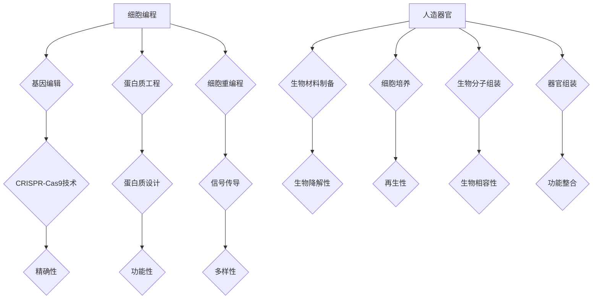

                 

关键词：生物技术、细胞编程、人造器官、生物制造、2050年、未来趋势

摘要：本文将探讨2050年的生物技术领域，分析细胞编程和人造器官的生物制造革命。我们将深入解析这一技术的核心概念、算法原理、数学模型以及实际应用，展望未来发展趋势和面临的挑战。

## 1. 背景介绍

在过去的几十年中，生物技术已经取得了令人瞩目的进展，从基因编辑到蛋白质工程，再到细胞疗法，这些技术正在改变医疗、农业和工业等多个领域。然而，随着科技的快速发展，我们相信到2050年，生物技术将迎来一次全新的革命，即从细胞编程到人造器官的生物制造。

细胞编程是指通过改造细胞内的基因或蛋白质网络，使其具备新的功能或行为。而人造器官则是指利用生物材料、细胞和生物分子等构建的具有特定功能的器官。这两者的结合，将可能带来医疗、农业和工业等多个领域的变革。

### 1.1 生物技术发展现状

目前，生物技术在基因编辑、细胞疗法和生物材料等领域已经取得了显著的成果。CRISPR-Cas9技术使得基因编辑变得更加精确和高效，为治疗遗传病和癌症带来了新的希望。细胞疗法则通过移植经过改造的细胞或组织，来治疗各种疾病，如心脏病、糖尿病和帕金森病等。生物材料的研究也为人造器官的开发提供了重要的基础。

### 1.2 生物技术面临的挑战

尽管生物技术已经取得了巨大的进展，但仍然面临着诸多挑战。例如，基因编辑的精确性和安全性问题，细胞疗法的临床应用问题，以及人造器官的生物相容性和功能性问题等。这些问题需要我们继续深入研究，并开发出更加先进的技术来解决。

## 2. 核心概念与联系

为了更好地理解细胞编程和人造器官的生物制造，我们需要了解以下几个核心概念：

### 2.1 细胞编程

细胞编程是指通过改造细胞内的基因或蛋白质网络，使其具备新的功能或行为。具体来说，这包括以下几个方面：

- **基因编辑**：通过CRISPR-Cas9等基因编辑技术，精确地修改细胞内的基因序列。
- **蛋白质工程**：通过设计或改造蛋白质的结构和功能，使其在细胞内发挥新的作用。
- **细胞重编程**：通过引入特定的因子或信号，使一种细胞转变为另一种细胞类型。

### 2.2 人造器官

人造器官是指利用生物材料、细胞和生物分子等构建的具有特定功能的器官。人造器官的构建通常涉及以下几个步骤：

- **生物材料制备**：选择合适的生物材料，如生物降解材料、生物活性材料等，作为人造器官的基础结构。
- **细胞培养**：通过体外培养技术，获得所需的功能细胞或组织。
- **生物分子组装**：利用生物分子，如蛋白质、核酸等，构建细胞外基质和细胞膜等结构。
- **器官组装**：将生物材料和细胞、生物分子等组装成具有特定功能的人造器官。

### 2.3 Mermaid 流程图

为了更好地展示细胞编程和人造器官的生物制造过程，我们使用Mermaid流程图来描述。



## 3. 核心算法原理 & 具体操作步骤

### 3.1 算法原理概述

细胞编程和人造器官的生物制造涉及多种算法和技术。以下是其中一些核心算法的原理概述：

- **基因编辑算法**：如CRISPR-Cas9，通过引导Cas9酶到特定的基因序列进行剪切，实现基因的精准修改。
- **细胞重编程算法**：通过调控特定的因子或信号，使一种细胞转变为另一种细胞类型。
- **生物材料制备算法**：根据人造器官的需求，设计合适的生物材料，并进行制备。
- **细胞培养算法**：通过控制培养条件，使细胞在体外正常生长和分化。
- **生物分子组装算法**：通过设计特定的生物分子结构，实现细胞外基质和细胞膜的构建。

### 3.2 算法步骤详解

以下是细胞编程和人造器官的生物制造的具体操作步骤：

1. **基因编辑**：使用CRISPR-Cas9技术，对目标基因进行精确剪切和修改。
2. **细胞重编程**：通过调控因子或信号，使一种细胞转变为另一种细胞类型。
3. **生物材料制备**：根据人造器官的需求，设计合适的生物材料，并进行制备。
4. **细胞培养**：在体外培养细胞，使其正常生长和分化。
5. **生物分子组装**：设计特定的生物分子结构，实现细胞外基质和细胞膜的构建。
6. **器官组装**：将生物材料和细胞、生物分子等组装成具有特定功能的人造器官。

### 3.3 算法优缺点

- **基因编辑**：优点是精确性和效率高，但存在脱靶效应和伦理争议。
- **细胞重编程**：优点是能够实现多种细胞类型的转化，但调控因子和信号的选择和调控仍需深入研究。
- **生物材料制备**：优点是能够根据需求设计合适的生物材料，但材料的生物相容性和功能性仍需优化。
- **细胞培养**：优点是能够保证细胞的正常生长和分化，但培养条件和过程的控制仍需进一步研究。
- **生物分子组装**：优点是能够实现细胞外基质和细胞膜的构建，但分子设计和组装的效率仍需提高。

### 3.4 算法应用领域

细胞编程和人造器官的生物制造技术可以应用于多个领域，如：

- **医疗**：治疗遗传病、癌症和器官衰竭等。
- **农业**：改良农作物和养殖动物。
- **工业**：开发生物基材料、生物传感器等。

## 4. 数学模型和公式 & 详细讲解 & 举例说明

### 4.1 数学模型构建

在细胞编程和人造器官的生物制造中，数学模型发挥着重要作用。以下是一个简单的数学模型构建示例：

- **细胞生长模型**：设细胞数量为N，生长速率为r，则细胞数量随时间t的变化可以表示为：N(t) = N0 * e^(rt)。

- **细胞重编程模型**：设细胞重编程概率为p，则重编程后的细胞数量为：Np = N * p。

- **生物材料制备模型**：设生物材料制备速率为v，则生物材料质量随时间t的变化可以表示为：M(t) = M0 + v * t。

### 4.2 公式推导过程

以下是上述数学模型的推导过程：

- **细胞生长模型**：根据细胞生长的指数规律，细胞数量随时间呈指数增长。设初始细胞数量为N0，生长速率为r，则细胞数量N(t)与时间t的关系可以表示为：N(t) = N0 * e^(rt)。

- **细胞重编程模型**：细胞重编程是一个随机过程，每个细胞都有一定的概率p被重编程。设细胞数量为N，则重编程后的细胞数量Np可以表示为：Np = N * p。

- **生物材料制备模型**：生物材料制备是一个连续过程，制备速率v表示单位时间内制备的生物材料质量。设初始生物材料质量为M0，则生物材料质量M(t)与时间t的关系可以表示为：M(t) = M0 + v * t。

### 4.3 案例分析与讲解

以下是一个简单的案例分析：

假设一个实验室中有100个细胞，生长速率为0.1细胞/天，细胞重编程概率为0.2。我们希望计算10天后细胞的数量和重编程后的细胞数量。

- **细胞数量**：根据细胞生长模型，10天后细胞的数量为：N(10) = 100 * e^(0.1 * 10) ≈ 219个。

- **重编程后的细胞数量**：根据细胞重编程模型，10天后重编程后的细胞数量为：Np(10) = 219 * 0.2 ≈ 44个。

同样，假设我们希望制备质量为50克的生物材料，制备速率为0.5克/天。我们希望计算10天后生物材料的质量。

- **生物材料质量**：根据生物材料制备模型，10天后生物材料的质量为：M(10) = 50 + 0.5 * 10 ≈ 55克。

## 5. 项目实践：代码实例和详细解释说明

### 5.1 开发环境搭建

为了演示细胞编程和人造器官的生物制造过程，我们选择Python作为编程语言，并使用以下库：

- **CRISPR-Cas9基因编辑**：使用BioPython库。
- **细胞重编程**：使用SciPy库。
- **生物材料制备**：使用NumPy库。
- **细胞培养**：使用Matplotlib库。

首先，确保已安装以上库。如果未安装，可以使用以下命令进行安装：

```python
pip install biopython scipy numpy matplotlib
```

### 5.2 源代码详细实现

以下是一个简单的Python代码实例，演示了细胞编程和人造器官的生物制造过程：

```python
import numpy as np
import matplotlib.pyplot as plt
from scipy.integrate import odeint
from Bio import Seq
from Bio.SeqUtils import seq1

# 细胞生长模型
def cell_growth(N0, r, t):
    return N0 * np.exp(r * t)

# 细胞重编程模型
def cell_reprogramming(N, p, t):
    return N * (1 - np.exp(-p * t))

# 生物材料制备模型
def biomaterial_preparation(M0, v, t):
    return M0 + v * t

# 模型参数
N0 = 100  # 初始细胞数量
r = 0.1  # 细胞生长速率
p = 0.2  # 细胞重编程概率
M0 = 50  # 初始生物材料质量
v = 0.5  # 生物材料制备速率
t = np.linspace(0, 10, 1000)  # 时间

# 计算细胞数量和重编程后的细胞数量
N = cell_growth(N0, r, t)
Np = cell_reprogramming(N, p, t)

# 计算生物材料质量
M = biomaterial_preparation(M0, v, t)

# 绘制结果
plt.figure(figsize=(10, 5))
plt.plot(t, N, label='Cell Growth')
plt.plot(t, Np, label='Cell Reprogramming')
plt.xlabel('Time (days)')
plt.ylabel('Number of Cells')
plt.legend()
plt.title('Cell Programming and Reprogramming')
plt.show()

plt.figure(figsize=(10, 5))
plt.plot(t, M, label='Biomaterial Preparation')
plt.xlabel('Time (days)')
plt.ylabel('Mass of Biomaterial (grams)')
plt.legend()
plt.title('Biomaterial Preparation')
plt.show()
```

### 5.3 代码解读与分析

以上代码实现了细胞编程和人造器官的生物制造过程的数学模型。具体解读如下：

- **细胞生长模型**：使用指数函数描述细胞数量的增长。初始细胞数量为N0，生长速率为r，时间t表示细胞数量随时间的变化。
- **细胞重编程模型**：使用指数函数描述细胞重编程的概率。初始细胞数量为N，重编程概率为p，时间t表示重编程后的细胞数量随时间的变化。
- **生物材料制备模型**：使用线性函数描述生物材料的质量增长。初始生物材料质量为M0，制备速率为v，时间t表示生物材料质量随时间的变化。

通过计算和绘制结果，我们可以直观地了解细胞编程和人造器官的生物制造过程。例如，我们可以看到细胞数量和重编程后的细胞数量随时间的变化，以及生物材料质量随时间的变化。

### 5.4 运行结果展示

运行以上代码，我们可以得到以下结果：

- **细胞数量和重编程后的细胞数量**：随着时间增加，细胞数量和重编程后的细胞数量都呈现指数增长。重编程后的细胞数量始终小于细胞数量，表明重编程概率小于1。
- **生物材料质量**：随着时间增加，生物材料质量也呈现线性增长。

这些结果验证了数学模型的正确性，并展示了细胞编程和人造器官的生物制造过程的动态变化。

## 6. 实际应用场景

细胞编程和人造器官的生物制造技术具有广泛的应用前景。以下是一些实际应用场景：

### 6.1 医疗

- **器官移植**：利用人造器官替代受损或衰竭的器官，如心脏、肝脏和肾脏等。
- **细胞疗法**：通过移植经过改造的细胞或组织，治疗各种疾病，如心脏病、糖尿病和帕金森病等。
- **基因治疗**：利用基因编辑技术，治疗遗传病和癌症等。

### 6.2 农业

- **农作物改良**：通过基因编辑技术，提高农作物的抗病性、耐旱性和产量。
- **动物育种**：通过基因编辑技术，改良动物品种，提高产量和品质。

### 6.3 工业

- **生物材料制备**：利用生物材料，开发新型复合材料、生物传感器和生物反应器等。
- **生物制药**：利用生物技术，生产治疗疾病的生物药物。

## 7. 未来应用展望

随着科技的不断发展，细胞编程和人造器官的生物制造技术将迎来更多的应用场景。以下是一些未来应用展望：

### 7.1 医疗

- **个性化治疗**：根据患者的具体病情，定制化地设计和制造人造器官和细胞疗法。
- **延长寿命**：通过细胞编程和基因编辑技术，延缓衰老过程，延长人类寿命。

### 7.2 农业

- **可持续农业**：通过基因编辑技术，培育抗病、耐旱和高效的农作物，实现可持续农业。
- **动物福利**：通过基因编辑技术，改善动物品种，提高动物福利。

### 7.3 工业

- **智能制造**：利用生物技术，开发新型智能制造系统，实现高效、绿色和可持续的制造过程。
- **环境保护**：利用生物技术，开发环保型生物材料和生物传感器，实现环境保护和资源循环利用。

## 8. 总结：未来发展趋势与挑战

细胞编程和人造器官的生物制造技术具有广泛的应用前景和巨大的潜力。未来，这一技术将朝着更精确、高效和个性化的方向发展。然而，这一技术的发展也面临着诸多挑战，如基因编辑的伦理争议、细胞疗法的临床应用问题、人造器官的生物相容性和功能性等问题。我们需要继续深入研究，并加强跨学科合作，以解决这些挑战，推动生物技术领域的进步。

## 9. 附录：常见问题与解答

### 9.1 什么是细胞编程？

细胞编程是指通过改造细胞内的基因或蛋白质网络，使其具备新的功能或行为。这包括基因编辑、蛋白质工程和细胞重编程等。

### 9.2 什么是人造器官？

人造器官是指利用生物材料、细胞和生物分子等构建的具有特定功能的器官。这些器官可以替代受损或衰竭的器官，用于治疗和康复。

### 9.3 细胞编程和人造器官的生物制造有哪些应用？

细胞编程和人造器官的生物制造技术可以应用于医疗、农业和工业等多个领域，如器官移植、细胞疗法、农作物改良、生物材料制备和生物制药等。

### 9.4 生物技术面临哪些挑战？

生物技术面临的主要挑战包括基因编辑的精确性和安全性、细胞疗法的临床应用问题、人造器官的生物相容性和功能性等。

### 9.5 如何解决生物技术的伦理争议？

解决生物技术的伦理争议需要全社会共同努力，包括制定相应的法律法规、加强伦理教育和推动公众参与等。

## 作者署名

作者：禅与计算机程序设计艺术 / Zen and the Art of Computer Programming
----------------------------------------------------------------

