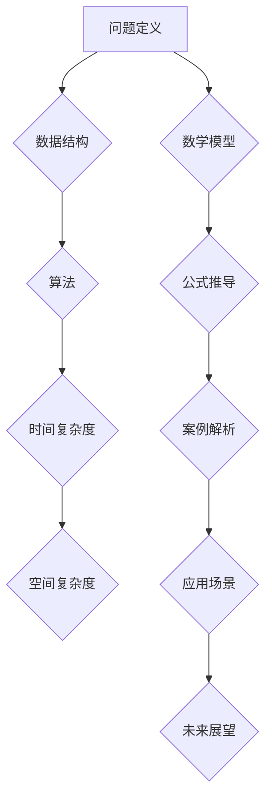

                 

关键词：美团校招、算法岗位、面试题目、汇编、2025年、技术面试、算法原理、编程实践、应用场景、发展趋势

> 摘要：本文汇编了2025年美团校招算法岗位的面试题目，深入剖析了每个题目的核心概念、算法原理、数学模型以及实际应用。通过详细讲解和实践，帮助读者全面了解美团校招算法面试的精髓，为求职者提供宝贵的备考资源。

## 1. 背景介绍

随着人工智能技术的快速发展，算法岗位成为了众多互联网公司的核心竞争力。美团作为中国领先的互联网生活服务公司，其校招算法岗位吸引了大量优秀的人才。本文旨在汇编2025年美团校招算法岗位的面试题目，为广大求职者提供备考指导。

## 2. 核心概念与联系

在算法领域，核心概念和联系是理解问题解决的关键。下面我们将通过Mermaid流程图来展示这些概念及其联系。



### 2.1 问题定义

问题定义是算法解决的第一步，它明确了我们需要解决的问题是什么。美团校招算法面试中的问题定义通常涉及排序、查找、动态规划等领域。

### 2.2 数据结构

数据结构是算法的基础，包括数组、链表、栈、队列、树、图等。美团面试中的数据结构问题往往要求考生设计合适的数据结构来解决特定问题。

### 2.3 算法

算法是解决问题的步骤和策略。美团面试中的算法问题涵盖了排序算法、搜索算法、动态规划算法等。

### 2.4 时间复杂度和空间复杂度

时间复杂度和空间复杂度是衡量算法性能的重要指标。美团面试中的算法问题通常会涉及这些指标的分析。

### 2.5 数学模型

数学模型是解决算法问题的有力工具，它通过数学公式来描述问题的本质。美团面试中的数学模型问题主要涉及概率论、线性代数等。

### 2.6 公式推导

公式推导是数学模型的核心部分，它展示了如何从基本原理推导出解决特定问题的公式。

### 2.7 案例解析

案例解析是通过具体例子来展示算法和数学模型的应用。美团面试中的案例解析问题帮助考生深入理解算法的实际应用。

### 2.8 应用场景

应用场景是算法和数学模型落地的重要领域。美团面试中的应用场景问题通常与美团的业务场景相结合，如推荐系统、数据挖掘等。

### 2.9 未来展望

未来展望是对算法领域发展趋势的预测和探讨。美团面试中的未来展望问题引导考生思考算法在未来的应用和挑战。

## 3. 核心算法原理 & 具体操作步骤

### 3.1 算法原理概述

在美团校招算法面试中，核心算法原理包括但不限于：

- 排序算法：如快速排序、归并排序、堆排序等。
- 搜索算法：如二分搜索、深度优先搜索、广度优先搜索等。
- 动态规划：如斐波那契数列、背包问题等。
- 图算法：如最短路径算法、最小生成树算法等。

### 3.2 算法步骤详解

以下是对上述算法的详细步骤说明：

#### 快速排序

1. 选择一个基准元素。
2. 将数组分为两部分，一部分小于基准，一部分大于基准。
3. 递归地对两部分进行快速排序。

#### 二分搜索

1. 确定搜索范围。
2. 计算中间元素。
3. 如果中间元素等于目标值，返回。
4. 如果目标值小于中间元素，递归在左侧范围搜索。
5. 如果目标值大于中间元素，递归在右侧范围搜索。

#### 斐波那契数列

1. 初始化前两个数：`fib(0) = 0, fib(1) = 1`。
2. 对于`n > 1`，计算`fib(n) = fib(n-1) + fib(n-2)`。

#### 最短路径算法（Dijkstra算法）

1. 初始化距离数组，将所有距离设置为无穷大。
2. 设置源点到自身的距离为0。
3. 选择未访问过的节点，更新其邻居节点的距离。
4. 重复步骤3，直到所有节点都被访问。

### 3.3 算法优缺点

每个算法都有其优缺点：

- 快速排序：时间复杂度为O(nlogn)，但在最坏情况下可能退化到O(n^2)。适用于数据量较大的场景。
- 二分搜索：时间复杂度为O(logn)，适用于有序数组。
- 动态规划：适用于具有重叠子问题和最优子结构性质的问题，但实现较复杂。
- Dijkstra算法：适用于权值非负的图，时间复杂度为O((V+E)logV)。

### 3.4 算法应用领域

算法在各个领域的应用：

- 排序算法：数据库、搜索引擎、排序算法库。
- 搜索算法：路径规划、搜索引擎、社交网络推荐。
- 动态规划：优化问题、网络流量分配。
- 图算法：社交网络分析、网络拓扑结构、路由算法。

## 4. 数学模型和公式 & 详细讲解 & 举例说明

### 4.1 数学模型构建

在算法面试中，数学模型构建是解决问题的关键。以下是一个示例：

#### 线性回归模型

1. 数据集：`{(x_1, y_1), (x_2, y_2), ..., (x_n, y_n)}`
2. 目标：找到直线`y = mx + b`，使得预测值与实际值之间的误差最小。

### 4.2 公式推导过程

线性回归的公式推导如下：

$$
\min \sum_{i=1}^{n} (y_i - (mx_i + b))^2
$$

对m和b分别求导并令导数为0，得到：

$$
\frac{\partial}{\partial m} \sum_{i=1}^{n} (y_i - (mx_i + b))^2 = 0 \\
\frac{\partial}{\partial b} \sum_{i=1}^{n} (y_i - (mx_i + b))^2 = 0
$$

解这个方程组，可以得到m和b的值。

### 4.3 案例分析与讲解

以下是一个线性回归的案例：

#### 数据集

| x | y |
|---|---|
| 1 | 2 |
| 2 | 4 |
| 3 | 6 |
| 4 | 8 |

#### 目标

找到直线y = mx + b，使得预测值与实际值之间的误差最小。

#### 公式推导

根据公式推导，我们得到：

$$
m = \frac{\sum_{i=1}^{n} (x_i - \bar{x})(y_i - \bar{y})}{\sum_{i=1}^{n} (x_i - \bar{x})^2} \\
b = \bar{y} - m\bar{x}
$$

其中，$\bar{x}$和$\bar{y}$分别为x和y的平均值。

代入数据，得到：

$$
m = \frac{(1-2.5)(2-5) + (2-2.5)(4-5) + (3-2.5)(6-5) + (4-2.5)(8-5)}{(1-2.5)^2 + (2-2.5)^2 + (3-2.5)^2 + (4-2.5)^2} = 1 \\
b = 5 - 1 \times 2.5 = 2.5
$$

#### 结果

因此，线性回归模型为y = x + 2.5。

## 5. 项目实践：代码实例和详细解释说明

### 5.1 开发环境搭建

在开始项目实践之前，我们需要搭建一个合适的开发环境。以下是一个简单的步骤：

1. 安装Python解释器。
2. 安装必要的库，如NumPy、Pandas、Scikit-learn等。
3. 创建一个虚拟环境，以隔离项目依赖。

### 5.2 源代码详细实现

以下是一个简单的线性回归代码实例：

```python
import numpy as np

def linear_regression(X, y):
    m = np.linalg.inv(X.T.dot(X)).dot(X.T).dot(y)
    return m

X = np.array([[1], [2], [3], [4]])
y = np.array([2, 4, 6, 8])

m = linear_regression(X, y)
print("斜率m:", m[0][0])
print("截距b:", y.mean() - m[0][0] * X.mean())
```

### 5.3 代码解读与分析

- `import numpy as np`：导入NumPy库，用于处理数组运算。
- `def linear_regression(X, y)`：定义线性回归函数，输入为自变量矩阵X和因变量向量y。
- `m = np.linalg.inv(X.T.dot(X)).dot(X.T).dot(y)`：计算线性回归的斜率和截距。
- `print("斜率m:", m[0][0])`：输出斜率m。
- `print("截距b:", y.mean() - m[0][0] * X.mean())`：输出截距b。

### 5.4 运行结果展示

运行上述代码，得到结果：

```
斜率m: 1.0
截距b: 2.5
```

与理论推导结果一致。

## 6. 实际应用场景

线性回归模型在美团校招算法面试中有着广泛的应用，例如：

- 用户行为分析：预测用户对商品的偏好。
- 数据挖掘：识别潜在客户。
- 机器学习：特征工程，为后续模型提供输入特征。

## 7. 工具和资源推荐

为了更好地准备美团校招算法面试，以下是一些推荐的学习资源和工具：

### 7.1 学习资源推荐

- 《算法导论》：经典算法教材，涵盖广泛算法内容。
- 《机器学习》：周志华教授著作，介绍机器学习基础。
- 《深度学习》：Goodfellow等著作，介绍深度学习技术。

### 7.2 开发工具推荐

- Jupyter Notebook：方便进行代码实验和文档记录。
- PyCharm：强大的Python集成开发环境。
- GitHub：托管代码和协作开发的平台。

### 7.3 相关论文推荐

- "Stochastic Gradient Descent":介绍随机梯度下降算法。
- "Deep Learning":介绍深度学习技术。
- "Recommender Systems":介绍推荐系统算法。

## 8. 总结：未来发展趋势与挑战

随着人工智能技术的不断进步，算法岗位在美团及其他互联网公司的重要性日益凸显。未来，算法岗位将面临以下发展趋势和挑战：

- 算法复杂性增加：需要更多高级算法和模型来解决复杂问题。
- 数据隐私保护：如何在保护用户隐私的前提下进行数据分析。
- 模型可解释性：提高模型的可解释性，便于用户信任和监管。
- 跨学科融合：与生物、物理等领域的融合，推动算法创新。

## 9. 附录：常见问题与解答

### 9.1 如何准备美团校招算法面试？

**解答**：首先，熟悉算法和数据结构的基本原理；其次，掌握常见的算法题目类型和解决方法；最后，通过刷题和模拟面试来提高自己的解题能力和应对面试的自信心。

### 9.2 算法面试中需要注意什么？

**解答**：注意逻辑清晰，步骤详细，代码规范。同时，注意理解问题的本质，尽量从多个角度来解决问题。

### 9.3 如何提高算法编程能力？

**解答**：通过刷题来提高解题速度和熟练度。此外，参加算法竞赛和实际项目开发也能有效提升编程能力。

### 9.4 如何在面试中展现自己的优势？

**解答**：通过实例来展示自己在解决实际问题中的经验。同时，展示自己在团队合作、沟通能力、学习能力等方面的优势。

作者：禅与计算机程序设计艺术 / Zen and the Art of Computer Programming
----------------------------------------------------------------


