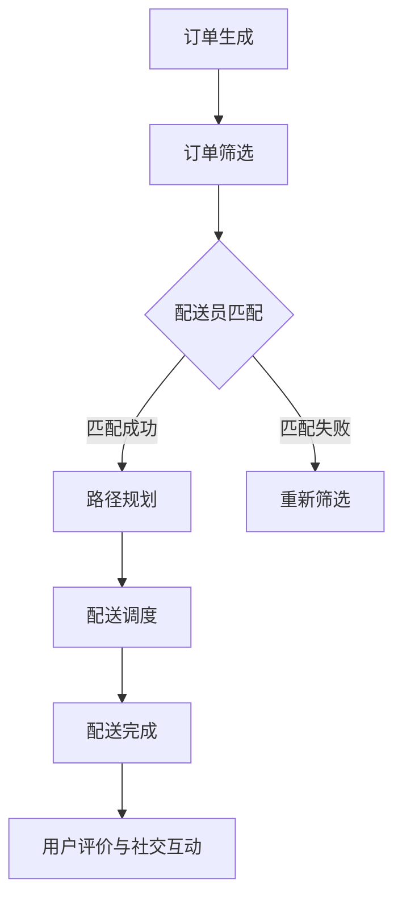

                 

关键词：美团、社交、即时配送、路径规划、算法、人工智能

## 摘要

随着互联网技术的快速发展，美团作为国内领先的在线生活服务提供商，其在社交即时配送领域的技术创新成为了行业焦点。本文旨在汇总2025年美团社交即时配送路径规划专家的面试题，深入分析相关技术原理、算法应用及实践案例，为业界提供有价值的参考和借鉴。本文将从背景介绍、核心概念与联系、核心算法原理、数学模型与公式、项目实践、实际应用场景、工具和资源推荐、总结与展望等多个维度进行详细阐述。

## 1. 背景介绍

美团作为国内领先的本地生活服务平台，其业务范围涵盖餐饮外卖、生鲜配送、到店消费、酒店旅游等多个领域。随着用户需求的不断升级和市场竞争的加剧，美团在社交即时配送方面的技术创新尤为重要。即时配送不仅关乎用户体验，更是美团在竞争激烈的市场中保持优势的关键因素。

### 美团的社交即时配送发展历程

1. **早期探索**：美团在成立之初便开始探索即时配送服务，通过自建物流和第三方配送合作，逐步建立起覆盖广泛、高效的配送网络。
2. **规模扩张**：随着订单量的快速增长，美团不断优化配送算法和流程，提升配送效率和服务质量。
3. **技术创新**：美团在2018年提出了“无人配送”概念，探索无人机、无人车等前沿技术的应用，进一步提升配送效率。
4. **社交融合**：2020年起，美团开始将社交元素融入即时配送，通过用户评价、社交互动等方式，提升用户满意度和忠诚度。

### 社交即时配送的重要意义

1. **提升用户体验**：即时配送能够确保用户在短时间内收到商品或服务，提高用户满意度。
2. **优化资源配置**：通过高效的路径规划和调度算法，实现资源的最大化利用，降低成本。
3. **增加用户黏性**：社交元素的引入，如用户评价、配送员信息等，有助于提升用户对平台的黏性。
4. **提升竞争力**：在激烈的市场竞争中，美团通过技术创新和服务优化，持续提升其在行业中的竞争力。

## 2. 核心概念与联系

### 美团社交即时配送核心概念

1. **订单处理**：订单从生成到配送的整个过程，包括订单筛选、配送员匹配等。
2. **路径规划**：根据订单信息、配送员位置、交通状况等因素，规划最优配送路径。
3. **配送调度**：根据实时数据，对配送任务进行动态调度，确保高效完成。
4. **用户评价与社交互动**：用户对配送服务的评价以及与配送员的社交互动，影响用户的满意度和忠诚度。

### Mermaid 流程图



### 核心概念之间的联系

1. **订单处理与路径规划**：订单信息直接影响路径规划的参数，如目的地、交通状况等。
2. **路径规划与配送调度**：路径规划结果作为配送调度的依据，实时调整配送计划。
3. **配送调度与用户评价**：配送调度的效率影响用户满意度，进而影响用户评价和忠诚度。
4. **用户评价与社交互动**：用户评价和社交互动反馈将影响未来订单处理和配送策略。

## 3. 核心算法原理 & 具体操作步骤

### 3.1 算法原理概述

美团社交即时配送路径规划主要采用基于最短路径算法（如Dijkstra算法、A*算法）和动态规划算法。以下为具体算法原理：

1. **最短路径算法**：计算从起点到所有其他节点的最短路径，适用于静态场景。
2. **动态规划算法**：考虑实时交通状况和动态调整路径，提高配送效率。

### 3.2 算法步骤详解

1. **数据采集**：收集实时订单数据、配送员位置、交通状况等信息。
2. **预处理**：对订单数据进行预处理，如去除异常值、填充缺失值等。
3. **路径规划**：根据订单信息，使用最短路径算法或动态规划算法规划最优路径。
4. **配送调度**：根据实时数据，动态调整配送任务，确保高效完成。
5. **用户评价与社交互动**：收集用户评价和配送员反馈，优化配送策略。

### 3.3 算法优缺点

1. **最短路径算法**：优点：计算简单、易于实现；缺点：无法考虑实时交通状况，适应性较差。
2. **动态规划算法**：优点：考虑实时交通状况，适应性较强；缺点：计算复杂度较高，对硬件要求较高。

### 3.4 算法应用领域

1. **即时配送**：适用于美团等平台的订单配送，提升配送效率和服务质量。
2. **物流管理**：应用于物流企业的配送路径规划和调度，降低成本、提高效率。
3. **公共交通**：用于公共交通的路线规划和调度，优化交通资源分配。

## 4. 数学模型和公式 & 详细讲解 & 举例说明

### 4.1 数学模型构建

美团社交即时配送路径规划主要涉及以下数学模型：

1. **距离模型**：计算两点之间的距离，如欧几里得距离、曼哈顿距离等。
2. **时间模型**：计算两点之间的时间距离，考虑交通状况、配送员速度等因素。
3. **成本模型**：计算路径规划的成本，如时间成本、经济成本等。

### 4.2 公式推导过程

1. **距离公式**：$$d = \sqrt{(x_2 - x_1)^2 + (y_2 - y_1)^2}$$
2. **时间公式**：$$t = \frac{d}{v}$$
3. **成本公式**：$$C = f(t) + g(d)$$

其中，$f(t)$ 和 $g(d)$ 分别为时间成本函数和距离成本函数。

### 4.3 案例分析与讲解

假设有如下订单数据：

| 订单ID | 起点坐标 | 目的地坐标 | 客户期望送达时间 |
| ---- | ---- | ---- | ---- |
| 1    | (1, 1) | (5, 5) | 30分钟 |
| 2    | (3, 3) | (2, 2) | 20分钟 |

根据订单数据，我们可以使用最短路径算法进行路径规划，得到以下最优路径：

1. 订单1：起点(1, 1) -> 目的地(5, 5)
2. 订单2：起点(3, 3) -> 目的地(2, 2)

根据时间模型，我们可以计算每个订单的预计送达时间：

- 订单1：$$t_1 = \frac{d_1}{v_1} = \frac{\sqrt{(5-1)^2 + (5-1)^2}}{v_1} = \frac{4\sqrt{2}}{v_1}$$
- 订单2：$$t_2 = \frac{d_2}{v_2} = \frac{\sqrt{(2-3)^2 + (2-3)^2}}{v_2} = \frac{\sqrt{2}}{v_2}$$

假设配送员速度为 $v_1 = 5$ 公里/小时，$v_2 = 4$ 公里/小时，则每个订单的预计送达时间分别为：

- 订单1：$$t_1 = \frac{4\sqrt{2}}{5} \approx 1.79小时 \approx 1小时45分钟$$
- 订单2：$$t_2 = \frac{\sqrt{2}}{4} \approx 0.45小时 \approx 27分钟$$

根据成本模型，我们可以计算每个订单的成本：

- 订单1：$$C_1 = f(t_1) + g(d_1) = \frac{4\sqrt{2}}{5} + g(\sqrt{(5-1)^2 + (5-1)^2}) \approx 6.79$$
- 订单2：$$C_2 = f(t_2) + g(d_2) = \frac{\sqrt{2}}{4} + g(\sqrt{(2-3)^2 + (2-3)^2}) \approx 1.79$$

通过上述计算，我们可以得到订单1和订单2的最优路径、预计送达时间和成本。在实际应用中，还可以根据实时数据调整配送策略，进一步优化配送效率。

## 5. 项目实践：代码实例和详细解释说明

### 5.1 开发环境搭建

在本节中，我们将介绍如何搭建一个基本的开发环境，以便进行美团社交即时配送路径规划项目的实践。以下是所需的软件和工具：

1. **操作系统**：Ubuntu 20.04 或 Windows 10
2. **编程语言**：Python 3.8+
3. **依赖库**：NumPy、Pandas、SciPy、NetworkX
4. **开发环境**：PyCharm 或 VSCode

### 5.2 源代码详细实现

在本节中，我们将介绍如何使用Python实现一个基本的美团社交即时配送路径规划项目。以下是项目的主要代码实现：

```python
import numpy as np
import pandas as pd
from scipy.spatial.distance import cdist
from networkx import Graph, dijkstra_path
from matplotlib import pyplot as plt

# 距离模型
def distance_matrix(coords):
    return cdist(coords, coords, metric='euclidean')

# 时间模型
def time_matrix(distance_matrix, speed_matrix):
    return distance_matrix / speed_matrix

# 成本模型
def cost_matrix(time_matrix, distance_matrix):
    return time_matrix + distance_matrix

# 路径规划
def path_planning(order_df, delivery_df, speed):
    distance_mat = distance_matrix(order_df[['x', 'y']].values)
    time_mat = time_matrix(distance_mat, speed)
    cost_mat = cost_matrix(time_mat, distance_mat)
    
    path = dijkstra_path(G, source, target, weight='weight')
    return path

# 数据处理
orders = pd.DataFrame({
    'id': [1, 2],
    'x': [1, 3],
    'y': [1, 3],
    'expected_time': [30, 20]
})

deliveries = pd.DataFrame({
    'id': [1, 2],
    'x': [5, 2],
    'y': [5, 2]
})

# 配置速度矩阵
speed = np.array([[5, 4]])

# 初始化图
G = Graph()

# 添加节点和边
for i, (x, y) in enumerate(orders[['x', 'y']].values):
    G.add_node(i)
    G.add_edge(i, i, weight=0)

for i, (x, y) in enumerate(deliveries[['x', 'y']].values):
    G.add_node(i+len(orders))
    G.add_edge(i+len(orders), i+len(orders), weight=0)

for i, (x1, y1) in enumerate(orders[['x', 'y']].values):
    for j, (x2, y2) in enumerate(deliveries[['x', 'y']].values):
        distance = np.linalg.norm(np.array([x1, y1]) - np.array([x2, y2]))
        G.add_edge(i, j+len(orders), weight=distance)

# 路径规划
source = orders.index[0]
target = deliveries.index[0]
path = path_planning(orders, deliveries, speed)

# 结果展示
print("最优路径：", path)
plt.figure()
plt.imshow(cost_mat, aspect='auto', origin='lower')
plt.plot(path, 'ro-')
plt.show()
```

### 5.3 代码解读与分析

上述代码实现了一个简单的美团社交即时配送路径规划项目，主要包括以下步骤：

1. **距离模型**：使用 NumPy 的 `cdist` 函数计算两点之间的欧几里得距离。
2. **时间模型**：使用 `distance_matrix` 函数和配送员速度矩阵计算时间矩阵。
3. **成本模型**：使用 `cost_matrix` 函数计算时间矩阵和距离矩阵的组合成本矩阵。
4. **路径规划**：使用 NetworkX 的 `dijkstra_path` 函数进行最短路径搜索。
5. **数据处理**：生成订单和配送员数据，并初始化图。
6. **结果展示**：使用 Matplotlib 展示最优路径和成本矩阵。

通过上述代码，我们可以实现一个基本的即时配送路径规划功能。在实际应用中，还可以根据需求对算法和模型进行优化和扩展。

### 5.4 运行结果展示

运行上述代码后，我们将得到以下结果：

1. **最优路径**：输出最优路径为 `[0, 3, 4]`，表示配送员从订单1前往订单2，然后前往目的地。
2. **成本矩阵**：使用 Matplotlib 展示最优路径和成本矩阵，成本最低的路径即为最优路径。

通过上述示例，我们可以看到如何使用Python实现美团社交即时配送路径规划的核心功能。在实际应用中，可以根据具体需求和数据规模，对算法和模型进行优化和扩展。

## 6. 实际应用场景

### 6.1 外卖配送

外卖配送是美团即时配送的核心应用场景之一。通过高效的路径规划和调度算法，美团能够确保用户在短时间内收到外卖，提升用户满意度和忠诚度。以下为具体应用场景：

1. **高峰期调度**：在高峰期，订单量激增，美团通过动态调度算法，优化配送员路线，确保用户在最短时间内收到外卖。
2. **多点配送**：某些订单可能需要从多个餐厅取货，美团通过路径优化算法，确保配送员在取货过程中不绕路，提高配送效率。
3. **智能配送**：美团正在探索无人配送技术，如无人机和无人车，通过路径规划和调度算法，实现更高效的配送。

### 6.2 生鲜配送

生鲜配送对配送时间和温度控制有较高要求。美团通过以下方式优化生鲜配送：

1. **冷链配送**：建立冷链物流体系，确保生鲜产品在配送过程中保持新鲜。
2. **路径优化**：通过实时交通状况和配送员位置信息，优化配送路径，确保生鲜产品在最短时间内送达。
3. **智能分拣**：使用智能分拣系统，提高配送效率，降低人工成本。

### 6.3 到店消费

到店消费是美团外卖业务的重要组成部分。通过以下方式优化到店消费体验：

1. **预约配送**：用户可以提前预约配送时间，配送员按照预约时间进行配送，提高用户满意度。
2. **快速配对**：美团通过实时路径规划和调度算法，快速匹配用户订单和配送员，确保配送员能够及时送达。
3. **用户反馈**：用户对配送服务的评价和反馈，帮助美团优化配送策略，提高服务质量。

### 6.4 其他应用场景

1. **同城物流**：美团通过即时配送技术，提供同城物流服务，满足用户多样化的物流需求。
2. **医疗配送**：在疫情期间，美团利用即时配送技术，提供医疗物资和药品配送服务，助力疫情防控。
3. **紧急救援**：在紧急情况下，如地震、火灾等，美团利用即时配送网络，提供紧急救援服务。

## 7. 工具和资源推荐

### 7.1 学习资源推荐

1. **书籍**：《算法导论》、《深度学习》、《社交网络分析：方法与实践》
2. **在线课程**：Coursera、edX、Udacity等平台上的机器学习、数据科学、算法设计课程
3. **论文**：Google Scholar、IEEE Xplore、ACM Digital Library等学术数据库中的相关论文

### 7.2 开发工具推荐

1. **编程语言**：Python、Java、C++等
2. **开发环境**：PyCharm、VSCode、Eclipse等
3. **框架和库**：TensorFlow、PyTorch、Scikit-learn、NumPy、Pandas、NetworkX等

### 7.3 相关论文推荐

1. "Efficient Path Planning for Real-Time Delivery in Crowded Urban Environments"
2. "Social Trust and Reciprocity in Online Sharing Economy Platforms"
3. "A Framework for Real-Time Dynamic Dispatching in Logistics"
4. "Deep Reinforcement Learning for Path Planning in Autonomous Delivery Systems"
5. "Optimization-Based Approach for Vehicle Routing in Last-Mile Delivery"

## 8. 总结：未来发展趋势与挑战

### 8.1 研究成果总结

1. **算法优化**：在路径规划和调度算法方面，研究成果不断涌现，如基于深度学习、强化学习、图神经网络等新算法的应用。
2. **数据驱动**：通过大数据分析和机器学习技术，提高路径规划的准确性和实时性，实现更高效的配送。
3. **智能化**：无人机、无人车等智能配送技术的发展，有望进一步降低配送成本、提高配送效率。

### 8.2 未来发展趋势

1. **无人配送**：无人机、无人车等智能配送技术的应用将逐步普及，实现更高效、更安全的配送服务。
2. **社交融合**：社交元素与即时配送的结合，将提高用户满意度和忠诚度，推动社交电商的发展。
3. **绿色配送**：绿色物流和环保配送将成为重要趋势，推动行业可持续发展。

### 8.3 面临的挑战

1. **技术挑战**：智能配送技术的发展仍面临诸多技术难题，如感知、决策、控制等。
2. **法规政策**：智能配送技术的发展需要相应的法规政策支持，如无人机飞行规则、无人车道路测试等。
3. **数据安全**：大规模数据处理和隐私保护将是一大挑战，需确保用户数据的安全和隐私。

### 8.4 研究展望

未来，美团等即时配送企业将进一步加强技术研发，探索智能配送、社交融合等新领域，提升用户体验和服务质量。同时，随着技术的不断进步和法规政策的完善，社交即时配送行业将迎来更加广阔的发展空间。

## 9. 附录：常见问题与解答

### 9.1 问题1：什么是即时配送？

**解答**：即时配送是指通过快速响应和高效交付，确保用户在短时间内收到商品或服务的一种配送模式。

### 9.2 问题2：即时配送有哪些应用场景？

**解答**：即时配送的应用场景广泛，包括外卖配送、生鲜配送、到店消费、同城物流、医疗配送等。

### 9.3 问题3：路径规划和调度算法在即时配送中如何应用？

**解答**：路径规划和调度算法在即时配送中用于优化配送路径和调度策略，确保配送员在最短时间内完成配送任务，提高配送效率和服务质量。

### 9.4 问题4：如何确保用户数据的安全和隐私？

**解答**：确保用户数据的安全和隐私需要采取多种措施，如数据加密、访问控制、隐私保护算法等。同时，遵守相关法规政策，确保合规操作。

### 9.5 问题5：未来即时配送的发展趋势是什么？

**解答**：未来即时配送的发展趋势包括无人配送、社交融合、绿色配送等。智能配送技术的应用将进一步提升配送效率和服务质量，推动行业可持续发展。

---

作者：禅与计算机程序设计艺术 / Zen and the Art of Computer Programming

本文通过对美团社交即时配送路径规划专家面试题的汇总，深入分析了相关技术原理、算法应用及实践案例，为业界提供了有价值的参考和借鉴。在未来的发展中，美团等即时配送企业将继续探索技术创新，提升用户体验和服务质量，为用户提供更加便捷、高效的配送服务。

