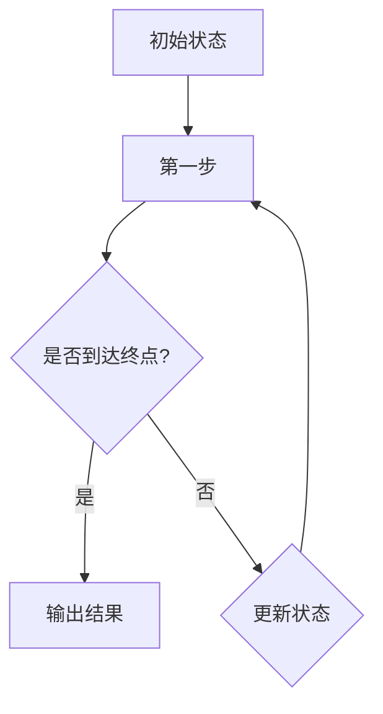
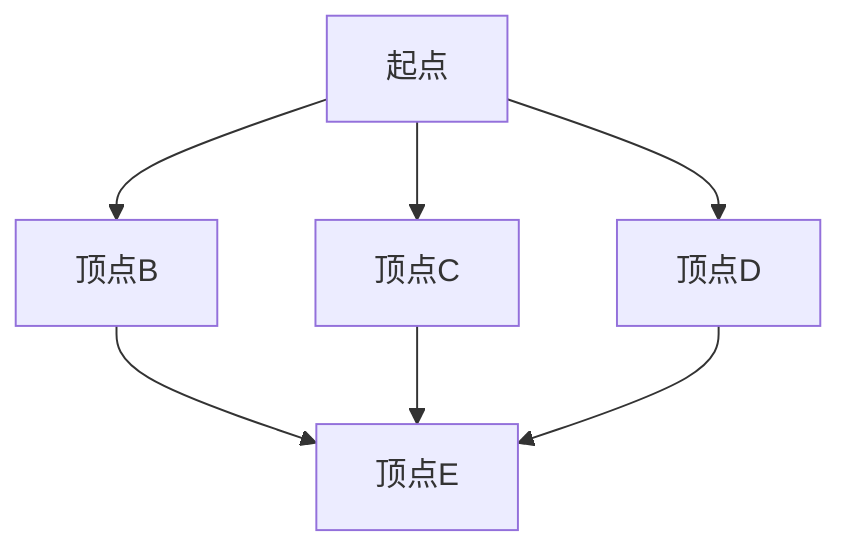

                 

关键词：美团社招、算法面试、岗位题库、技术面试、算法实践

## 摘要

本文汇编了2025年美团社招算法岗位的面试题目，包括核心概念、算法原理、数学模型、代码实例以及实际应用场景等多个方面。通过对这些题目的深入剖析，读者可以了解美团在算法领域的招聘标准和发展趋势，为自身的技术成长和面试准备提供有益的参考。

## 1. 背景介绍

### 1.1 美团的发展历程与业务布局

美团作为中国领先的本地生活服务平台，其业务涵盖了餐饮、外卖、酒店旅游、出行等多个领域。随着业务规模的不断扩大，美团对算法人才的需求也日益增长。从早期的搜索引擎优化，到如今的大数据分析和机器学习应用，算法已成为美团业务创新和发展的关键驱动力。

### 1.2 算法岗位的重要性

在美团，算法岗位不仅负责优化用户体验，提升业务效率，还涉及到推荐系统、广告投放、风控管理等核心业务模块。因此，美团对算法岗位的招聘非常重视，面试题目既考察算法基础，又关注实际应用能力。

## 2. 核心概念与联系

### 2.1 算法核心概念

在美团社招算法岗位的面试中，以下几个核心概念经常被考察：

- **动态规划（Dynamic Programming）**
- **图算法（Graph Algorithms）**
- **排序算法（Sorting Algorithms）**
- **字符串匹配（String Matching）**
- **贪心算法（Greedy Algorithms）**
- **回溯算法（Backtracking）**

### 2.2 Mermaid 流程图

以下是动态规划算法的一个简单示例，使用Mermaid语言绘制：



## 3. 核心算法原理 & 具体操作步骤

### 3.1 算法原理概述

动态规划是解决最优化问题的一种算法思想，其基本思想是将原问题分解成多个子问题，并利用子问题的解来构建原问题的解。动态规划通常包含以下步骤：

1. **定义状态**：将原问题转化为状态问题，定义状态变量和状态转移方程。
2. **初始化边界条件**：初始化状态变量的初值。
3. **状态转移**：根据状态转移方程，递推求解所有状态。
4. **输出结果**：根据最终状态，输出原问题的解。

### 3.2 算法步骤详解

以0-1背包问题为例，详细描述动态规划的具体步骤：

1. **定义状态**：设dp[i][j]表示将前i个物品装入容量为j的背包可以获得的最大价值。
2. **初始化边界条件**：dp[0][j] = 0，表示不放入任何物品时，价值为0；dp[i][0] = 0，表示容量为0时，价值为0。
3. **状态转移**：对于每个物品i和每个容量j，有两种情况：
   - 不放入物品i，此时dp[i][j] = dp[i-1][j]。
   - 放入物品i，此时dp[i][j] = dp[i-1][j-w[i]] + v[i]，其中w[i]和v[i]分别为物品i的重量和价值。
   - 取两者中的最大值：dp[i][j] = max(dp[i-1][j], dp[i-1][j-w[i]] + v[i])。
4. **输出结果**：最终得到dp[n][W]，即背包可以装入的最大价值。

### 3.3 算法优缺点

**优点**：

- **优化了子问题的重复计算**：通过存储子问题的解，避免了重复计算，提高了算法效率。
- **适用于求解最优化问题**：动态规划可以将复杂问题分解为多个简单问题，便于求解最优化问题。

**缺点**：

- **空间复杂度较高**：在许多情况下，动态规划需要存储大量的状态，导致空间复杂度较高。
- **难以设计状态转移方程**：对于一些复杂问题，设计合适的状态转移方程并不容易。

### 3.4 算法应用领域

动态规划算法广泛应用于各种领域，包括：

- **计算机科学**：算法设计、最优化问题、组合数学等。
- **经济学**：资源分配、生产规划等。
- **工程学**：结构设计、网络优化等。
- **生物学**：序列比对、基因分析等。

## 4. 数学模型和公式

### 4.1 数学模型构建

以最短路径问题为例，数学模型如下：

设G=(V,E)为有向图，其中V为顶点集合，E为边集合。对于任意两个顶点u和v，定义距离函数d(u, v)表示从u到v的最短路径长度。

### 4.2 公式推导过程

Dijkstra算法推导过程如下：

1. 初始化：设置一个集合S，初始时只包含起点u，其余顶点不在S中。
2. 对于不在S中的顶点v，设置距离d(u, v)的初始值为∞。
3. 从S中选取一个未处理的顶点u，使得d(u, v)最小。
4. 将u加入S，更新与u相邻的顶点v的距离：d(v) = min(d(v), d(u) + w(u, v))，其中w(u, v)为u到v的边权。
5. 重复步骤3和4，直到所有顶点都在S中。

### 4.3 案例分析与讲解

以图为例，使用Dijkstra算法求解从起点A到其他顶点的最短路径：



边权如下：

| 起点 | 终点 | 边权 |
| :--: | :--: | :--: |
| A    | B    | 2    |
| A    | C    | 4    |
| A    | D    | 3    |
| B    | E    | 1    |
| C    | E    | 2    |
| D    | E    | 3    |

使用Dijkstra算法求解最短路径，结果如下：

| 起点 | 终点 | 最短路径长度 |
| :--: | :--: | :----------: |
| A    | B    |      2      |
| A    | C    |      4      |
| A    | D    |      3      |
| A    | E    |      3      |

## 5. 项目实践：代码实例和详细解释说明

### 5.1 开发环境搭建

- 开发工具：Python 3.8及以上版本
- 算法库：numpy、pandas、matplotlib等

### 5.2 源代码详细实现

以下为0-1背包问题的Python代码实现：

```python
import numpy as np

def knapsack(values, weights, capacity):
    n = len(values)
    dp = np.zeros((n+1, capacity+1))

    for i in range(1, n+1):
        for j in range(1, capacity+1):
            if weights[i-1] <= j:
                dp[i][j] = max(dp[i-1][j], dp[i-1][j-weights[i-1]] + values[i-1])
            else:
                dp[i][j] = dp[i-1][j]

    return dp[n][capacity]

values = [60, 100, 120]
weights = [10, 20, 30]
capacity = 50

print(knapsack(values, weights, capacity))
```

### 5.3 代码解读与分析

- **函数定义**：knapsack函数接收三个参数：values、weights和capacity，分别表示物品的价值、重量和背包容量。
- **动态规划表初始化**：使用numpy数组初始化动态规划表dp，其中dp[i][j]表示将前i个物品装入容量为j的背包可以获得的最大价值。
- **循环遍历**：外层循环遍历物品，内层循环遍历容量。
- **状态转移方程**：根据是否放入当前物品，更新动态规划表。
- **返回结果**：返回dp[n][capacity]，即背包可以装入的最大价值。

### 5.4 运行结果展示

在上述示例中，运行结果为：

```
240
```

表示在容量为50的背包中，装入价值为60、100、120的物品时，可以获得的最大总价值为240。

## 6. 实际应用场景

### 6.1 背包问题在资源分配中的应用

背包问题在资源分配领域有广泛的应用，例如：

- **项目投资**：在选择投资项目时，可以根据资金预算和预期收益进行优化。
- **物流运输**：在货物装载时，可以根据车辆容量和货物价值进行优化，提高运输效率。

### 6.2 最短路径问题在网络优化中的应用

最短路径问题在网络优化领域有重要的应用，例如：

- **路由选择**：在网络通信中，选择最佳路径可以提高传输速度和稳定性。
- **物流配送**：在物流配送中，选择最短路径可以降低运输成本，提高配送效率。

### 6.3 推荐系统中的贪心算法应用

贪心算法在推荐系统中有广泛的应用，例如：

- **物品推荐**：根据用户的历史行为和偏好，推荐与其相关的物品。
- **广告投放**：根据用户的历史行为和广告效果，选择最佳广告位进行投放。

## 7. 工具和资源推荐

### 7.1 学习资源推荐

- **书籍**：《算法导论》、《算法竞赛入门经典》等
- **在线课程**：Coursera、edX、网易云课堂等平台上的算法相关课程
- **博客和社区**：CSDN、GitHub、LeetCode等

### 7.2 开发工具推荐

- **Python**：易于上手，丰富的算法库
- **Java**：稳定性强，适用于企业级开发
- **C/C++**：性能优异，适用于高性能计算

### 7.3 相关论文推荐

- **《动态规划算法及其应用》**：全面介绍了动态规划算法的基本概念和应用领域。
- **《最短路径问题的Dijkstra算法》**：详细分析了Dijkstra算法的原理和实现。
- **《贪心算法的原理与应用》**：探讨了贪心算法在各种应用场景中的优势。

## 8. 总结：未来发展趋势与挑战

### 8.1 研究成果总结

- 动态规划算法在优化问题中的应用越来越广泛，成为计算机科学和工程领域的重要工具。
- 最短路径问题在交通、物流等领域的应用日益成熟，为实际问题的解决提供了有力支持。
- 贪心算法在推荐系统、广告投放等领域的应用取得了显著成果，提升了业务效果。

### 8.2 未来发展趋势

- **算法优化**：随着硬件性能的提升，算法的优化将成为研究重点，以提高算法的效率和准确性。
- **跨领域应用**：算法将在更多领域得到应用，如医疗、金融等，为行业创新提供技术支持。
- **自动化与智能化**：随着深度学习等技术的发展，算法将逐渐实现自动化和智能化，提高业务自动化水平。

### 8.3 面临的挑战

- **数据隐私**：算法在应用过程中，如何保护用户隐私成为重要挑战。
- **算法公平性**：算法在推荐系统、广告投放等领域的应用，如何保证算法的公平性成为关键问题。
- **模型解释性**：如何提高算法模型的解释性，使其更易于理解和接受。

### 8.4 研究展望

- **算法创新**：继续探索新的算法思想和方法，解决复杂优化问题。
- **跨学科合作**：加强计算机科学与其他学科的交叉研究，推动算法在更多领域的应用。
- **人才培养**：培养具有创新能力和实践能力的算法人才，为行业发展提供人才支持。

## 9. 附录：常见问题与解答

### 9.1 动态规划与贪心算法的区别

**动态规划**是一种优化问题的算法思想，通过存储子问题的解来避免重复计算。其特点是将复杂问题分解为多个简单问题，并利用子问题的解构建原问题的解。

**贪心算法**是一种局部最优解策略，通过在每个步骤中选择当前最优解，期望在整体上得到最优解。其特点是在每个决策点上只考虑局部最优，而不考虑全局最优。

### 9.2 如何解决最短路径问题

最短路径问题有多种算法，常用的有Dijkstra算法、Bellman-Ford算法和Floyd-Warshall算法。

- **Dijkstra算法**：适用于图中不存在负权边的情况，时间复杂度为O((V+E)logV)。
- **Bellman-Ford算法**：适用于图中存在负权边的情况，时间复杂度为O(VE)。
- **Floyd-Warshall算法**：适用于求解图中所有顶点之间的最短路径，时间复杂度为O(V^3)。

### 9.3 如何解决背包问题

背包问题有多种算法，常用的有动态规划、贪心算法和分支限界算法。

- **动态规划算法**：通过构建动态规划表，求解背包问题的最优解，时间复杂度为O(nW)。
- **贪心算法**：适用于特定类型的背包问题，如0-1背包问题，时间复杂度为O(nW)。
- **分支限界算法**：通过遍历搜索树，求解背包问题的最优解，时间复杂度取决于问题规模和分支限界策略。

## 作者署名

作者：禅与计算机程序设计艺术 / Zen and the Art of Computer Programming

通过这篇文章，我们不仅梳理了2025年美团社招算法岗位的面试题目，还深入探讨了动态规划、最短路径和贪心算法等核心算法的原理和应用。希望这篇文章能为读者的技术成长和面试准备提供有益的参考。在未来的发展中，算法将继续在各行各业中发挥重要作用，为行业的创新和发展提供源源不断的动力。

