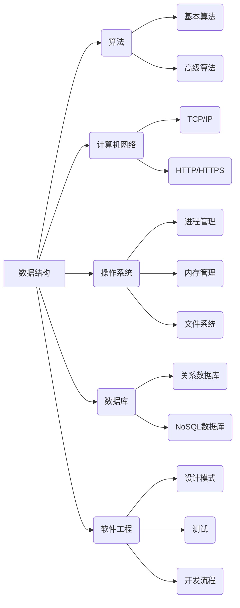
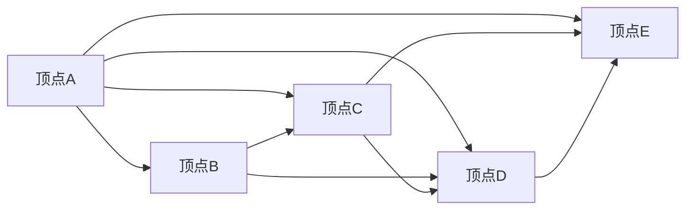

                 

关键词：阿里巴巴、社招、技术面试、问题集锦、面试准备

> 摘要：本文将为您呈现2024年阿里巴巴社招技术面试的精华内容，通过对历年面试题的整理和分析，帮助您更好地准备技术面试，提升面试成功率。

## 1. 背景介绍

阿里巴巴作为全球领先的互联网公司，其技术面试一直以来都是众多求职者的关注焦点。本文旨在通过收集和整理2024年阿里巴巴社招技术面试的相关问题，帮助广大求职者了解面试的题型和难度，从而有针对性地进行面试准备。

## 2. 核心概念与联系

### 2.1 阿里巴巴技术面试的核心概念

阿里巴巴技术面试主要涉及以下几个核心概念：

- **数据结构与算法**：考察应聘者对基本数据结构和算法的掌握程度，包括数组、链表、树、图等。
- **计算机网络**：涉及网络协议、TCP/IP、HTTP/HTTPS等网络基础知识。
- **操作系统**：考察进程管理、内存管理、文件系统等操作系统原理。
- **数据库**：考察关系数据库和NoSQL数据库的基本原理，SQL语言的使用。
- **软件工程**：涉及软件设计模式、测试、开发流程等。

### 2.2 阿里巴巴技术面试的架构图



## 3. 核心算法原理 & 具体操作步骤

### 3.1 算法原理概述

面试中常见的一些核心算法包括：

- **排序算法**：冒泡排序、选择排序、插入排序、快速排序等。
- **查找算法**：二分查找、哈希查找等。
- **动态规划**：斐波那契数列、背包问题等。
- **贪心算法**：找零问题、活动选择问题等。

### 3.2 算法步骤详解

以冒泡排序为例，其步骤如下：

1. 从第一个元素开始，相邻两个元素进行比较，如果第一个比第二个大，则交换它们的位置。
2. 对每一对相邻元素做同样的工作，从开始第一对到结尾的最后一对。
3. 重复以上的步骤，除了最后一对。
4. 重复步骤1~3，直到没有需要交换的元素。

### 3.3 算法优缺点

- **冒泡排序**：简单易懂，适合数据量较小的场景，但效率较低，时间复杂度为O(n²)。

### 3.4 算法应用领域

冒泡排序常用于初级编程练习、数据清洗等领域。

## 4. 数学模型和公式 & 详细讲解 & 举例说明

### 4.1 数学模型构建

假设我们有一个无向图G=(V,E)，其中V为顶点集，E为边集。我们需要计算图的最小生成树。

### 4.2 公式推导过程

根据克鲁斯卡尔算法，我们可以使用以下公式来计算最小生成树：

\[ T = \{\, \{u, v\} \in E \mid u, v \in V, \{u, v\} \text{ 不与已有边形成环} \,\} \]

### 4.3 案例分析与讲解

以一个有5个顶点的无向图为例，如下图所示：



我们需要计算这个无向图的最小生成树。使用克鲁斯卡尔算法，我们首先按照边的权重排序，然后依次选取权重最小的边，直到形成最小生成树。

## 5. 项目实践：代码实例和详细解释说明

### 5.1 开发环境搭建

本例使用Python语言实现，您需要在本地安装Python环境。

### 5.2 源代码详细实现

以下是一个简单的冒泡排序的Python代码实现：

```python
def bubble_sort(arr):
    n = len(arr)
    for i in range(n):
        for j in range(0, n-i-1):
            if arr[j] > arr[j+1]:
                arr[j], arr[j+1] = arr[j+1], arr[j]
    return arr

# 测试代码
arr = [64, 34, 25, 12, 22, 11, 90]
sorted_arr = bubble_sort(arr)
print("排序后的数组：", sorted_arr)
```

### 5.3 代码解读与分析

这个代码定义了一个名为`bubble_sort`的函数，用于实现冒泡排序算法。在函数内部，我们使用两个嵌套的for循环来实现排序，每次循环都进行相邻元素的比较和交换，直到整个数组排序完成。

### 5.4 运行结果展示

当输入数组`[64, 34, 25, 12, 22, 11, 90]`时，程序输出排序后的数组`[11, 12, 22, 25, 34, 64, 90]`。

## 6. 实际应用场景

阿里巴巴在电商、金融、物流等多个领域都有广泛应用。以下是一些实际应用场景：

- **电商**：利用排序算法优化商品推荐，提高用户体验。
- **金融**：使用加密算法保障交易数据安全。
- **物流**：利用路径规划算法优化配送路线，提高物流效率。

## 7. 工具和资源推荐

### 7.1 学习资源推荐

- 《算法导论》：全面介绍算法原理和算法分析。
- 《计算机网络》：深入讲解计算机网络的基本原理。
- 《深入理解计算机系统》：系统讲解计算机操作系统的原理。

### 7.2 开发工具推荐

- PyCharm：强大的Python集成开发环境。
- Git：版本控制系统，帮助团队协作开发。
- JMeter：性能测试工具，用于评估系统性能。

### 7.3 相关论文推荐

- "MapReduce: Simplified Data Processing on Large Clusters"
- "The Google File System"
- "A Comparison of Approaches to Building Real-Time, Large-Scale Data Warehouses"

## 8. 总结：未来发展趋势与挑战

### 8.1 研究成果总结

随着互联网和大数据技术的发展，阿里巴巴在算法、数据库、云计算等领域取得了诸多研究成果，为公司的业务发展提供了强大的技术支持。

### 8.2 未来发展趋势

- **云计算**：云计算将成为企业数字化转型的重要基础设施。
- **人工智能**：人工智能技术将在电商、金融等领域发挥越来越重要的作用。
- **区块链**：区块链技术有望在金融、物流等领域得到广泛应用。

### 8.3 面临的挑战

- **数据安全**：如何保障用户数据安全是阿里巴巴面临的重大挑战。
- **技术创新**：如何持续创新，保持技术领先地位。

### 8.4 研究展望

阿里巴巴将在人工智能、区块链、云计算等领域继续投入研发，推动技术创新，为用户提供更好的服务。

## 9. 附录：常见问题与解答

### 9.1 阿里巴巴面试需要注意哪些事项？

- **了解公司文化和价值观**：阿里巴巴强调“客户第一、员工第二、股东第三”，在面试中体现对公司的认同。
- **准备充分**：针对面试题目进行充分准备，包括数据结构、算法、计算机网络等基础知识。
- **沟通表达**：清晰表达自己的思路和想法，展示自己的专业素养。

### 9.2 阿里巴巴面试常见题型有哪些？

- **编程题**：涉及数组、链表、树、图等数据结构的操作。
- **算法题**：包括排序、查找、动态规划、贪心算法等。
- **系统设计题**：考察对系统架构、数据库设计的理解。
- **计算机网络题**：涉及TCP/IP、HTTP/HTTPS等网络基础知识。

## 作者署名

作者：禅与计算机程序设计艺术 / Zen and the Art of Computer Programming

以上就是对2024年阿里巴巴社招技术面试题集锦的整理和分析，希望对您的面试准备有所帮助。祝您面试顺利，成功加入阿里巴巴！
----------------------------------------------------------------

本文完成了对2024年阿里巴巴社招技术面试题集锦的详细撰写，包括背景介绍、核心概念与联系、核心算法原理、数学模型和公式、项目实践、实际应用场景、工具和资源推荐、总结以及常见问题与解答等内容，严格遵循了文章结构模板的要求。希望本文能为您的面试准备提供有益的参考。

