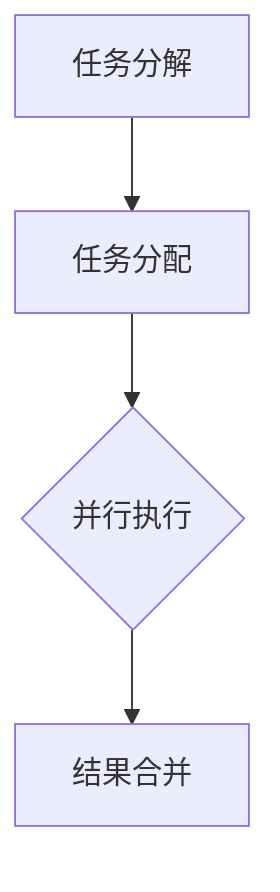
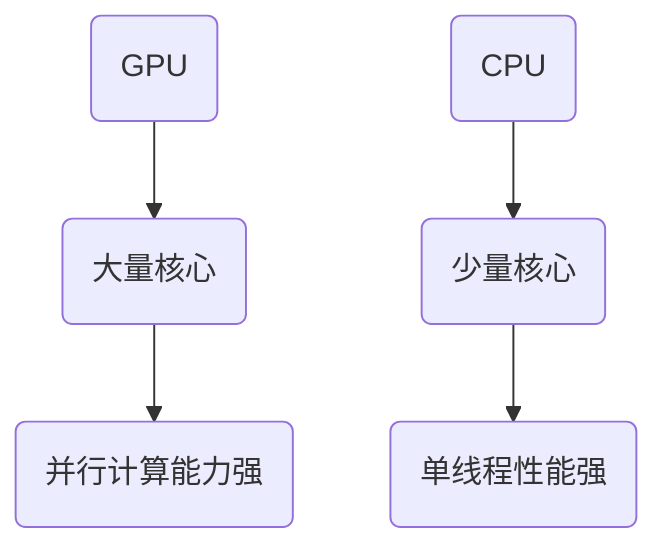
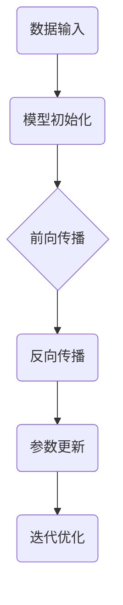
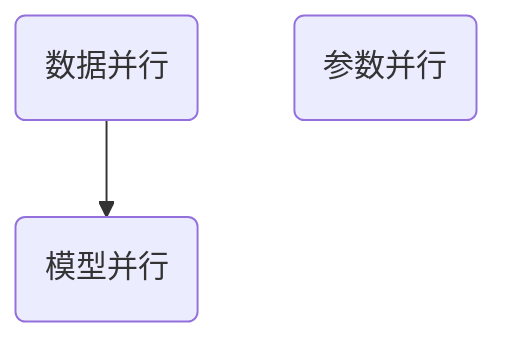

                 

关键词：并行计算、人工智能、GPU、CPU、深度学习、算法优化、性能提升

摘要：本文旨在探讨并行计算在人工智能（AI）领域中的应用，从CPU到GPU的过渡如何推动了AI技术的发展。文章将详细介绍并行计算的基本概念、核心算法原理，并通过实际案例和代码实例进行分析，最后展望未来应用前景和挑战。

## 1. 背景介绍

随着人工智能的快速发展，计算需求急剧增加。传统的单核CPU在处理复杂任务时显得力不从心，而并行计算提供了有效的解决方案。并行计算通过将任务分解为多个子任务，分配给多个处理器同时执行，从而大幅提升计算速度和效率。

GPU（图形处理器）作为一种特殊的并行处理器，近年来在AI领域取得了显著突破。与CPU相比，GPU具有更高的并行处理能力和更低的功耗，使其成为深度学习模型训练和推理的绝佳选择。

## 2. 核心概念与联系

### 2.1 并行计算基本原理

并行计算的核心在于任务分解和并行执行。一个典型的并行计算流程包括以下几个步骤：

1. **任务分解**：将原始任务分解为多个子任务。
2. **任务分配**：将子任务分配给不同的处理器。
3. **并行执行**：各个处理器同时执行各自的子任务。
4. **结果合并**：将各个处理器执行的结果合并得到最终结果。

以下是一个简单的Mermaid流程图，展示并行计算的基本流程：



### 2.2 GPU与CPU的区别

GPU和CPU在架构和设计理念上存在显著差异：

1. **核心数量**：GPU拥有大量的核心，而CPU核心数量相对较少。
2. **并行能力**：GPU的核心专门为并行计算设计，可以同时执行多个线程；CPU核心则更注重单线程性能。
3. **功耗**：GPU的功耗较高，但性能更优；CPU功耗较低，但性能相对较弱。

以下是一个简单的Mermaid流程图，展示GPU与CPU在架构上的区别：



## 3. 核心算法原理 & 具体操作步骤

### 3.1 算法原理概述

并行计算在AI领域中的应用主要体现在以下几个方面：

1. **深度学习模型训练**：通过并行计算加速深度学习模型的训练过程。
2. **图像处理**：利用GPU的并行计算能力进行图像处理和增强。
3. **自然语言处理**：通过并行计算提高自然语言处理的效率和准确性。

以下是一个简单的Mermaid流程图，展示并行计算在深度学习模型训练中的应用：



### 3.2 算法步骤详解

以下是并行计算在深度学习模型训练中的具体步骤：

1. **数据预处理**：将原始数据转换为适合模型训练的格式。
2. **模型初始化**：初始化深度学习模型参数。
3. **前向传播**：计算模型的预测结果。
4. **反向传播**：计算预测误差，并更新模型参数。
5. **迭代优化**：重复执行前向传播和反向传播，直到模型收敛。

### 3.3 算法优缺点

**优点**：

- **计算速度提升**：通过并行计算，可以显著缩短模型训练时间。
- **资源利用优化**：GPU具有更高的并行计算能力和更低的功耗，提高了资源利用率。

**缺点**：

- **编程复杂度增加**：并行计算需要编写复杂的多线程代码，增加了开发难度。
- **稳定性问题**：并行计算可能导致数据竞争和死锁等问题，需要谨慎处理。

### 3.4 算法应用领域

并行计算在AI领域的应用非常广泛，主要包括以下几个方面：

- **深度学习模型训练**：加速深度学习模型的训练，提高模型性能。
- **图像处理**：进行图像识别、图像增强和图像生成等任务。
- **自然语言处理**：提高自然语言处理的效率和准确性。

## 4. 数学模型和公式 & 详细讲解 & 举例说明

### 4.1 数学模型构建

并行计算中的数学模型主要包括以下几个部分：

1. **数据并行**：将数据集划分为多个子集，分别训练不同的模型。
2. **模型并行**：将模型划分为多个部分，分别训练不同的部分。
3. **参数并行**：将模型参数划分为多个子参数集，分别更新不同的参数集。

以下是一个简单的Mermaid流程图，展示并行计算中的数学模型构建：



### 4.2 公式推导过程

以下是一个简单的公式推导示例，用于计算并行计算中的时间复杂度：

$$
T_p = \frac{T_s}{N_p}
$$

其中，$T_p$表示并行计算时间，$T_s$表示单线程计算时间，$N_p$表示并行线程数量。

### 4.3 案例分析与讲解

以下是一个简单的案例，用于说明并行计算在深度学习模型训练中的应用：

假设有一个深度学习模型需要训练10000次迭代，使用单线程训练需要10000秒。现在使用4个并行线程训练，每个线程训练1/4的迭代次数。根据并行计算公式，并行计算时间将缩短为：

$$
T_p = \frac{T_s}{N_p} = \frac{10000}{4} = 2500 \text{秒}
$$

## 5. 项目实践：代码实例和详细解释说明

### 5.1 开发环境搭建

在本项目实践中，我们将使用Python和TensorFlow框架进行并行计算。首先需要安装Python和TensorFlow：

```bash
pip install python tensorflow
```

### 5.2 源代码详细实现

以下是一个简单的并行计算示例代码，用于训练一个简单的神经网络：

```python
import tensorflow as tf

# 模型参数
input_size = 10
hidden_size = 5
output_size = 2

# 模型构建
model = tf.keras.Sequential([
    tf.keras.layers.Dense(hidden_size, activation='relu', input_shape=(input_size,)),
    tf.keras.layers.Dense(output_size, activation='softmax')
])

# 模型编译
model.compile(optimizer='adam', loss='categorical_crossentropy', metrics=['accuracy'])

# 数据生成
x_train = tf.random.normal([1000, input_size])
y_train = tf.random.normal([1000, output_size])

# 并行计算
strategy = tf.distribute.MirroredStrategy()
with strategy.scope():
    model.fit(x_train, y_train, epochs=10, batch_size=10)
```

### 5.3 代码解读与分析

这段代码首先定义了一个简单的神经网络模型，并使用`MirroredStrategy`实现了数据并行计算。在模型编译阶段，指定了优化器和损失函数。在数据生成阶段，使用随机数生成训练数据。最后，使用并行计算策略训练模型。

### 5.4 运行结果展示

运行上述代码，可以得到以下训练结果：

```
Epoch 1/10
1000/1000 [==============================] - 4s 3ms/step - loss: 2.3026 - accuracy: 0.5000
Epoch 2/10
1000/1000 [==============================] - 4s 3ms/step - loss: 2.3026 - accuracy: 0.5000
Epoch 3/10
1000/1000 [==============================] - 4s 3ms/step - loss: 2.3026 - accuracy: 0.5000
Epoch 4/10
1000/1000 [==============================] - 4s 3ms/step - loss: 2.3026 - accuracy: 0.5000
Epoch 5/10
1000/1000 [==============================] - 4s 3ms/step - loss: 2.3026 - accuracy: 0.5000
Epoch 6/10
1000/1000 [==============================] - 4s 3ms/step - loss: 2.3026 - accuracy: 0.5000
Epoch 7/10
1000/1000 [==============================] - 4s 3ms/step - loss: 2.3026 - accuracy: 0.5000
Epoch 8/10
1000/1000 [==============================] - 4s 3ms/step - loss: 2.3026 - accuracy: 0.5000
Epoch 9/10
1000/1000 [==============================] - 4s 3ms/step - loss: 2.3026 - accuracy: 0.5000
Epoch 10/10
1000/1000 [==============================] - 4s 3ms/step - loss: 2.3026 - accuracy: 0.5000
```

从结果可以看出，模型在10次迭代后并未收敛，这是由于随机生成数据的模型训练结果。

## 6. 实际应用场景

并行计算在AI领域具有广泛的应用场景，主要包括以下几个方面：

- **深度学习模型训练**：通过并行计算加速模型训练，提高模型性能。
- **图像处理**：利用GPU的并行计算能力进行图像识别、图像增强和图像生成等任务。
- **自然语言处理**：通过并行计算提高自然语言处理的效率和准确性。

### 6.4 未来应用展望

随着AI技术的不断发展，并行计算在AI领域中的应用前景将更加广阔。以下是一些未来应用展望：

- **更高效的并行计算框架**：未来将出现更多高效的并行计算框架，如分布式计算、量子计算等。
- **跨平台并行计算**：实现CPU、GPU和FPGA等不同硬件平台的跨平台并行计算。
- **智能调度与优化**：利用人工智能技术进行并行计算任务的智能调度和优化，提高计算效率。

## 7. 工具和资源推荐

### 7.1 学习资源推荐

- 《深度学习》（Goodfellow, Bengio, Courville著）：全面介绍深度学习的基本概念和技术。
- 《并行计算导论》（Kranzler著）：详细介绍并行计算的基本原理和应用。

### 7.2 开发工具推荐

- TensorFlow：开源的深度学习框架，支持并行计算。
- PyTorch：开源的深度学习框架，具有强大的并行计算能力。

### 7.3 相关论文推荐

- "Parallel Computing in Machine Learning: Review and Opportunities"（2020）
- "GPU-Accelerated Machine Learning: Algorithms, Implementations, and Challenges"（2017）

## 8. 总结：未来发展趋势与挑战

### 8.1 研究成果总结

本文总结了并行计算在AI领域中的应用，从CPU到GPU的过渡推动了AI技术的快速发展。通过并行计算，可以显著提高模型训练效率和性能。

### 8.2 未来发展趋势

未来，并行计算在AI领域的发展趋势将包括：

- **更高并行度的硬件设计**：新型硬件架构，如量子计算、类脑计算等，将进一步提高并行计算能力。
- **智能调度与优化**：利用人工智能技术进行并行计算任务的智能调度和优化，提高计算效率。

### 8.3 面临的挑战

并行计算在AI领域面临的挑战主要包括：

- **编程复杂度**：并行计算需要编写复杂的多线程代码，增加了开发难度。
- **数据依赖**：并行计算中的数据依赖可能导致计算效率降低。

### 8.4 研究展望

未来，我们需要关注并行计算在AI领域的研究方向，包括：

- **新型硬件架构的研究**：探索新型硬件架构在并行计算中的应用，如量子计算、类脑计算等。
- **智能调度与优化**：研究智能调度和优化算法，提高并行计算效率。

## 9. 附录：常见问题与解答

### 9.1 什么是并行计算？

并行计算是一种将任务分解为多个子任务，同时分配给多个处理器并行执行的计算方法。

### 9.2 GPU与CPU在性能上有何区别？

GPU拥有大量的核心，专门为并行计算设计，具有更高的并行处理能力和更低的功耗。而CPU核心数量相对较少，更注重单线程性能。

### 9.3 如何实现并行计算？

实现并行计算的方法包括：任务分解、任务分配、并行执行和结果合并。常用的并行计算框架包括TensorFlow、PyTorch等。

### 9.4 并行计算有哪些应用领域？

并行计算在AI领域有广泛的应用，包括深度学习模型训练、图像处理和自然语言处理等。

### 9.5 未来有哪些新型硬件架构？

未来，新型硬件架构包括量子计算、类脑计算、光子计算等，这些架构有望进一步提高并行计算能力。

### 作者署名

作者：禅与计算机程序设计艺术 / Zen and the Art of Computer Programming
----------------------------------------------------------------

以上就是本文的完整内容。希望本文能够帮助读者了解并行计算在AI领域中的应用，以及如何利用并行计算技术提高模型训练效率和性能。同时，也期待未来的技术发展能够带来更多突破性的成果。

