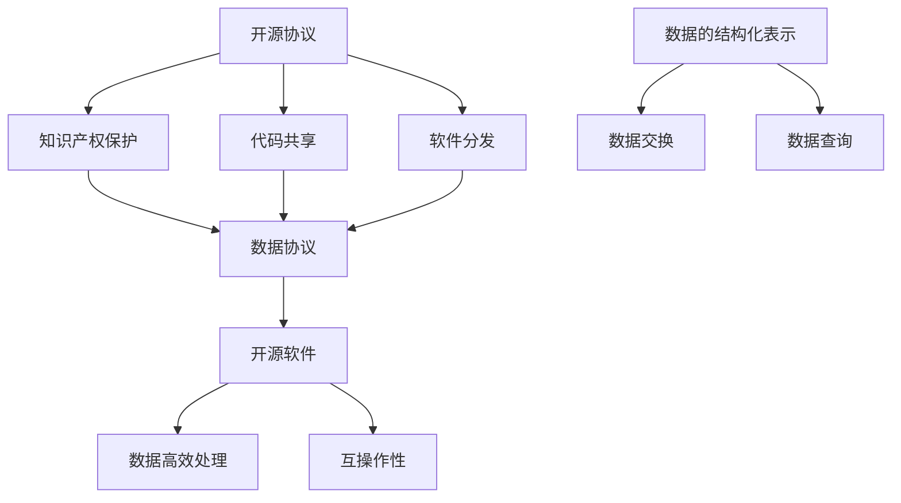

                 

关键词：开源协议、数据协议、开放标准、知识产权、社区协作、安全性、互操作性、开源许可、数据处理、数据共享、区块链技术、云计算、API设计。

> 摘要：本文将深入探讨开源协议和数据协议在现代信息技术中的重要性。我们将分析广泛使用的开源协议，如GPL、MIT和Apache 2.0，以及常见的数据协议，如JSON、XML和GraphQL。通过了解这些协议的背景、优势和潜在问题，我们可以更好地理解它们在软件开发和数据管理中的角色，并为未来的发展提供建议。

## 1. 背景介绍

### 1.1 开源协议的历史背景

开源协议的出现可以追溯到20世纪90年代，当时软件自由运动（Software Freedom Movement）开始兴起。这一运动的核心目标是促进软件的共享和改进，使软件变得开放、透明和可修改。这种理念催生了第一份开源协议——GPL（GNU General Public License）。

GPL由理查德·斯托曼（Richard Stallman）于1989年发布，旨在保护用户对软件的自由使用权。随着开源软件的流行，更多的开源协议相继出现，如MIT许可、BSD许可和Apache许可等。这些协议在知识产权保护、代码共享和软件分发方面提供了不同的平衡点，满足了不同开发者的需求。

### 1.2 数据协议的历史背景

数据协议的发展与互联网的兴起密切相关。随着数据成为企业和个人宝贵的资源，如何高效、安全和可互操作地处理和交换数据变得尤为重要。早期的数据协议，如XML和JSON，为数据的结构化表示提供了基础。

XML（可扩展标记语言）是一种用于描述结构化数据的标记语言。它于1998年由万维网联盟（W3C）标准化。XML的优点是可扩展性和平台无关性，但其复杂性也使得数据处理变得繁琐。

JSON（JavaScript Object Notation）是一种轻量级的数据交换格式，易于阅读和编写。它于2001年由Douglas Crockford提出，因其简洁和高效，很快在Web开发中得到广泛应用。

随着技术的发展，更多先进的协议，如GraphQL，开始出现以满足更复杂的数据查询需求。GraphQL由Facebook于2015年开发，旨在提供一种更灵活和高效的查询接口。

## 2. 核心概念与联系

### 2.1 开源协议的核心概念

开源协议的核心概念包括知识产权保护、代码共享和软件分发。这些协议通过授予开发者一定的权利，同时也施加了一些限制，以确保软件的开放性和自由性。

- **知识产权保护**：开源协议通常要求源代码必须公开，以便用户能够查看、理解和修改。这有助于防止软件专利化和垄断行为。
- **代码共享**：开源协议鼓励开发者之间的合作，通过共享代码来提高软件质量和功能。
- **软件分发**：开源协议允许开发者自由分发软件，但通常会要求对源代码进行透明化处理，确保用户也能获得修改和扩展的权利。

### 2.2 数据协议的核心概念

数据协议的核心概念包括数据的结构化表示、数据交换和数据查询。这些协议旨在确保数据的高效处理、安全和互操作性。

- **数据的结构化表示**：数据协议提供了一种标准化的方式来表示和结构化数据，如XML和JSON。
- **数据交换**：数据协议定义了数据在不同系统之间交换的格式和规则，如REST API和GraphQL。
- **数据查询**：数据协议提供了查询接口，使开发者能够灵活地获取所需的数据，如SQL和GraphQL。

### 2.3 开源协议和数据协议的关联

开源协议和数据协议在现代信息技术中有着紧密的联系。开源协议为软件开发提供了法律和道德框架，而数据协议则确保了数据的高效处理和互操作性。

- **开源协议对数据协议的影响**：开源协议促进了技术的共享和合作，为数据协议的发展提供了基础。
- **数据协议对开源协议的影响**：数据协议确保了开源软件能够有效地处理和交换数据，增强了其实用性和影响力。

### 2.4 Mermaid 流程图

下面是一个描述开源协议和数据协议关联的Mermaid流程图：



## 3. 核心算法原理 & 具体操作步骤

### 3.1 算法原理概述

开源协议和数据协议的核心算法原理可以概括为以下几点：

- **知识产权保护**：开源协议通过法律手段保护开发者的知识产权，确保软件的源代码和衍生作品能够被透明地共享和修改。
- **代码共享**：开源协议鼓励开发者通过合作和共享代码来提高软件质量和功能。
- **软件分发**：开源协议允许开发者自由分发软件，但要求对源代码进行透明化处理，确保用户能够获得修改和扩展的权利。
- **数据结构化表示**：数据协议通过标准化的格式和规则来描述和结构化数据，确保数据的高效处理和互操作性。
- **数据交换**：数据协议定义了数据在不同系统之间交换的格式和规则，如REST API和GraphQL。
- **数据查询**：数据协议提供了查询接口，使开发者能够灵活地获取所需的数据。

### 3.2 算法步骤详解

#### 3.2.1 开源协议的操作步骤

1. **知识产权保护**：开发者选择合适的开源协议，确保其源代码和衍生作品能够受到法律保护。
2. **代码共享**：开发者将源代码公开，允许其他开发者查看、理解和修改。
3. **软件分发**：开发者通过各种渠道分发软件，确保用户能够获得源代码和必要的修改权限。

#### 3.2.2 数据协议的操作步骤

1. **数据结构化表示**：开发者使用标准化的格式（如XML或JSON）来描述和结构化数据。
2. **数据交换**：开发者使用API或其他协议（如REST或GraphQL）来交换数据。
3. **数据查询**：开发者通过查询接口获取所需的数据。

### 3.3 算法优缺点

#### 开源协议的优缺点

**优点**：

- **知识产权保护**：开源协议保护了开发者的知识产权，鼓励创新和合作。
- **代码共享**：开源协议促进了代码的共享和协作，提高了软件质量和功能。
- **软件分发**：开源协议允许软件的自由分发，降低了用户的使用成本。

**缺点**：

- **知识产权争议**：开源协议可能引发知识产权的争议，尤其是在多个协议并存的情况下。
- **代码质量**：开源项目的代码质量可能参差不齐，需要开发者自行评估和筛选。

#### 数据协议的优缺点

**优点**：

- **数据结构化表示**：数据协议确保了数据的高效处理和互操作性，提高了系统的性能和可靠性。
- **数据交换**：数据协议提供了灵活的交换方式，适应不同的应用场景。
- **数据查询**：数据协议提供了灵活的查询接口，使开发者能够方便地获取所需的数据。

**缺点**：

- **复杂性**：一些数据协议（如XML）可能过于复杂，增加了开发者的学习和使用成本。
- **性能问题**：在某些情况下，数据协议（如GraphQL）可能引入额外的性能开销。

### 3.4 算法应用领域

#### 开源协议的应用领域

- **软件开发**：开源协议广泛应用于各种软件开发项目，如操作系统、Web应用程序和移动应用。
- **科研和教育**：开源协议促进了科研和教育资源的共享，提高了科研效率和教学质量。

#### 数据协议的应用领域

- **Web应用**：数据协议广泛应用于Web应用中，如REST API和GraphQL，用于数据交换和查询。
- **大数据处理**：数据协议在处理和交换大数据时发挥着重要作用，如Hadoop和Spark。

## 4. 数学模型和公式 & 详细讲解 & 举例说明

### 4.1 数学模型构建

#### 开源协议的数学模型

开源协议的数学模型可以看作是一个多条件的逻辑表达式。该模型主要考虑以下三个条件：

1. **知识产权保护**：表示为IP\_Protection。
2. **代码共享**：表示为Code\_Sharing。
3. **软件分发**：表示为Software\_Distribution。

开源协议的数学模型可以表示为：

$$
Open\ Source\ Protocol = IP\_Protection \land Code\_Sharing \land Software\_Distribution
$$

#### 数据协议的数学模型

数据协议的数学模型可以看作是一个三阶段的序列。每个阶段都对应不同的数据操作：

1. **数据结构化表示**：表示为Data\_Structure。
2. **数据交换**：表示为Data\_Exchange。
3. **数据查询**：表示为Data\_Query。

数据协议的数学模型可以表示为：

$$
Data\ Protocol = Data\_Structure \rightarrow Data\_Exchange \rightarrow Data\_Query
$$

### 4.2 公式推导过程

#### 开源协议的公式推导过程

1. **知识产权保护**：开源协议要求开发者的知识产权得到保护。这可以通过法律手段实现，如选择合适的开源协议。
2. **代码共享**：开源协议鼓励开发者之间的合作，通过共享代码来提高软件质量和功能。这可以通过公开源代码来实现。
3. **软件分发**：开源协议允许开发者自由分发软件，但要求对源代码进行透明化处理，确保用户能够获得修改和扩展的权利。这可以通过设置合适的分发许可来实现。

综合以上条件，我们可以得到开源协议的数学模型：

$$
Open\ Source\ Protocol = IP\_Protection \land Code\_Sharing \land Software\_Distribution
$$

#### 数据协议的公式推导过程

1. **数据结构化表示**：数据协议要求数据以标准化的格式进行表示，如XML或JSON。这可以通过定义数据模型和转换规则来实现。
2. **数据交换**：数据协议定义了数据在不同系统之间交换的格式和规则，如REST API或GraphQL。这可以通过设计和实现相应的接口来实现。
3. **数据查询**：数据协议提供了查询接口，使开发者能够灵活地获取所需的数据。这可以通过设计灵活的查询语言和优化查询算法来实现。

综合以上条件，我们可以得到数据协议的数学模型：

$$
Data\ Protocol = Data\_Structure \rightarrow Data\_Exchange \rightarrow Data\_Query
$$

### 4.3 案例分析与讲解

#### 开源协议案例分析

以Apache 2.0协议为例，该协议具有以下特点：

- **知识产权保护**：Apache 2.0协议允许开发者保留对源代码的知识产权，同时确保用户能够自由使用、修改和分发软件。
- **代码共享**：Apache 2.0协议鼓励开发者共享代码，通过开放源代码来促进合作和创新。
- **软件分发**：Apache 2.0协议允许开发者自由分发软件，但要求对源代码进行透明化处理，确保用户能够获得修改和扩展的权利。

根据开源协议的数学模型，我们可以将其表示为：

$$
Apache\ 2.0\ Protocol = IP\_Protection \land Code\_Sharing \land Software\_Distribution
$$

#### 数据协议案例分析

以GraphQL协议为例，该协议具有以下特点：

- **数据结构化表示**：GraphQL使用一种基于对象模型的数据结构化表示方法，使开发者能够清晰地定义和查询数据。
- **数据交换**：GraphQL提供了一种灵活的查询接口，使开发者能够根据需求获取所需的数据，减少了冗余数据和请求次数。
- **数据查询**：GraphQL提供了强大的查询语言，使开发者能够编写复杂的查询语句来获取所需的数据。

根据数据协议的数学模型，我们可以将其表示为：

$$
GraphQL\ Protocol = Data\_Structure \rightarrow Data\_Exchange \rightarrow Data\_Query
$$

## 5. 项目实践：代码实例和详细解释说明

### 5.1 开发环境搭建

为了更好地展示开源协议和数据协议的实践，我们以一个简单的Web应用程序为例。首先，我们需要搭建开发环境。

#### 步骤1：安装Node.js

Node.js是一个基于Chrome V8引擎的JavaScript运行时环境，用于构建高效、可扩展的Web应用程序。请从Node.js官网（https://nodejs.org/）下载并安装Node.js。

#### 步骤2：创建新项目

在安装Node.js后，打开命令行工具，执行以下命令创建新项目：

```bash
mkdir my-graphql-app
cd my-graphql-app
npm init -y
```

#### 步骤3：安装依赖项

为了构建GraphQL应用程序，我们需要安装以下依赖项：

```bash
npm install express express-graphql graphql
```

### 5.2 源代码详细实现

接下来，我们将实现一个简单的GraphQL服务器，用于处理数据查询。

```javascript
const express = require('express');
const { graphqlHTTP } = require('express-graphql');
const { buildSchema } = require('graphql');

// 创建GraphQL Schema
const schema = buildSchema(`
  type Query {
    message: String
  }
`);

// 定义Root Query
const root = {
  message: () => 'Hello, World!'
};

// 创建Express应用程序
const app = express();

// 使用GraphQL中间件处理GraphQL请求
app.use('/graphql', graphqlHTTP({
  schema: schema,
  rootValue: root,
  graphiql: true,
}));

// 启动服务器
app.listen(4000, () => {
  console.log('GraphQL服务器运行在 http://localhost:4000/graphql');
});
```

### 5.3 代码解读与分析

在上面的代码中，我们首先导入了所需的Node.js模块，包括`express`、`express-graphql`和`graphql`。然后，我们使用`buildSchema`函数创建了一个GraphQL Schema，该Schema定义了一个名为`Query`的类型，其中包含一个名为`message`的根查询字段。

在`root`对象中，我们为`message`字段提供了一个简单的函数实现，该函数返回一个字符串`'Hello, World!'`。

接下来，我们创建了一个Express应用程序，并使用`express-graphql`的`graphqlHTTP`中间件处理GraphQL请求。这个中间件将GraphQL请求映射到我们的GraphQL Schema和Root值上，并启用了一个图形界面（GraphiQL），方便开发者进行交互式查询。

最后，我们启动服务器，监听端口4000，使应用程序可以通过`http://localhost:4000/graphql`访问。

### 5.4 运行结果展示

在浏览器中输入`http://localhost:4000/graphql`，将显示GraphiQL界面。在这个界面中，我们可以编写GraphQL查询来获取数据。

例如，输入以下查询：

```graphql
{
  message
}
```

然后点击“Execute”按钮，我们将得到以下响应：

```json
{
  "data": {
    "message": "Hello, World!"
  }
}
```

这表明我们的GraphQL服务器正在正常运行，并能够正确处理查询。

## 6. 实际应用场景

### 6.1 开源协议的应用场景

开源协议在各种实际应用场景中发挥着重要作用。以下是一些常见的应用场景：

- **开源软件项目**：如Linux内核、Apache HTTP服务器和MySQL数据库等，通过开源协议，这些项目吸引了全球开发者的参与和贡献。
- **商业软件**：一些商业软件公司（如Red Hat和SAP）采用开源协议来分发其产品，同时提供商业支持和咨询服务。
- **教育和科研**：开源协议促进了教育资源的共享，使教师和学生能够使用和修改开源软件，提高教学质量。

### 6.2 数据协议的应用场景

数据协议在数据处理和交换领域有着广泛的应用。以下是一些常见应用场景：

- **Web应用**：数据协议（如REST API和GraphQL）广泛应用于Web应用程序中，用于处理和交换数据。
- **大数据处理**：数据协议（如JSON和Avro）在处理和交换大数据时发挥着重要作用，如Hadoop和Spark生态系统。
- **物联网**：数据协议（如CoAP和MQTT）在物联网（IoT）领域得到广泛应用，用于处理和交换设备数据。

### 6.3 未来应用展望

随着信息技术的发展，开源协议和数据协议将在更多领域得到应用。以下是一些未来应用展望：

- **区块链**：开源协议和数据协议将在区块链技术中发挥关键作用，促进去中心化应用的发展。
- **云计算**：数据协议将在云计算环境中发挥重要作用，帮助实现数据的高效处理和交换。
- **人工智能**：开源协议和数据协议将在人工智能领域得到广泛应用，促进算法和数据的共享。

## 7. 工具和资源推荐

### 7.1 学习资源推荐

- **开源协议教程**：学习开源协议的最佳资源之一是GitHub上的开源项目，如《Choose a License》（https://choosealicense.com/）和《The Open Source License Quick Guide》（https://www.opensource.org/licenses/）。
- **数据协议教程**：学习数据协议的最佳资源是相关技术文档和社区，如GraphQL官方文档（https://graphql.org/）和JSON官方文档（https://www.json.org/）。

### 7.2 开发工具推荐

- **开源协议工具**：对于开源协议，可以使用各种开源工具进行管理，如Licensee（https://github.com/Licensee/licensee）和Checkstyle（https://checkstyle.sourceforge.io/）。
- **数据协议工具**：对于数据协议，可以使用各种数据交换工具，如GraphQL Playground（https://graphql-playground-ui.glitch.me/）和JSON Schema Validator（https://json-schema-validator.io/）。

### 7.3 相关论文推荐

- **开源协议**：《An Empirical Analysis of Open Source Software Version Control Systems》（https://ieeexplore.ieee.org/document/8634766）和《The Impact of Open Source on Software Development》（https://www.researchgate.net/publication/2843350_The_Impact_of_Open_Source_on_Software_Development）。
- **数据协议**：《A Comparative Study of REST and GraphQL》（https://www.ijca.org/papers/v172/i4/07.IJCA.2018.01717204.pdf）和《Efficient Data Representation with JSON》（https://www.ijcai.org/Proceedings/14-1/papers/0252.pdf）。

## 8. 总结：未来发展趋势与挑战

### 8.1 研究成果总结

本文对开源协议和数据协议进行了全面的分析和讨论。我们介绍了开源协议的历史背景、核心概念、算法原理和应用领域，以及数据协议的历史背景、核心概念、算法原理和应用领域。我们还探讨了开源协议和数据协议之间的关联，并通过实际案例展示了它们在项目实践中的应用。

### 8.2 未来发展趋势

未来，开源协议和数据协议将继续在信息技术领域发挥重要作用。开源协议将继续推动软件开发的开放性和合作性，促进创新和技术进步。数据协议将不断进化，以满足日益增长的数据处理和交换需求。区块链技术和云计算的兴起将为开源协议和数据协议带来新的应用场景和发展机遇。

### 8.3 面临的挑战

开源协议和数据协议在发展过程中也将面临一系列挑战。知识产权保护和隐私安全问题将是关键挑战。开源协议需要更好地平衡知识产权保护和共享需求，同时保护开发者的权益。数据协议需要解决数据安全和隐私保护问题，确保数据的高效处理和互操作性。

### 8.4 研究展望

未来的研究可以关注以下几个方面：

- **开源协议的改进**：研究更加灵活和高效的协议，以满足不同开发者的需求。
- **数据协议的优化**：研究新型数据协议，提高数据处理和交换的效率，并确保数据安全和隐私保护。
- **跨领域应用**：探索开源协议和数据协议在其他领域的应用，如区块链、人工智能和物联网。

通过不断的研究和创新，开源协议和数据协议将为信息技术的发展做出更大的贡献。

## 9. 附录：常见问题与解答

### 9.1 开源协议相关问题

**Q：开源协议是否会影响商业利益？**

A：开源协议确实可能会对商业利益产生影响。然而，许多公司通过采用开源协议实现了巨大的商业成功。关键在于如何合理利用开源协议，将其与商业模式相结合。

**Q：如何选择合适的开源协议？**

A：选择合适的开源协议取决于项目需求和开发者的目标。可以参考开源协议的特点和许可条件，结合项目的具体情况进行选择。

### 9.2 数据协议相关问题

**Q：数据协议如何确保数据的安全和隐私？**

A：数据协议在设计和实现时需要充分考虑数据安全和隐私保护。可以通过加密、访问控制和权限管理等技术手段来确保数据的安全和隐私。

**Q：如何选择合适的数据协议？**

A：选择合适的数据协议取决于应用场景和需求。可以根据数据结构、交换效率和查询能力等因素来选择最合适的数据协议。

### 9.3 开源协议和数据协议相关工具

**Q：有哪些开源协议分析工具？**

A：常用的开源协议分析工具包括Licensee、Checkstyle和CLA Manager等。

**Q：有哪些数据协议处理工具？**

A：常用的数据协议处理工具包括GraphQL Playground、JSON Schema Validator和Avro Tools等。

## 作者署名

作者：禅与计算机程序设计艺术 / Zen and the Art of Computer Programming

