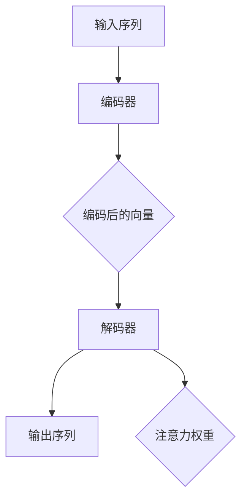

                 

关键词：序列到序列模型，神经网络，深度学习，自然语言处理，编码器，解码器，循环神经网络，RNN，LSTM，BERT，注意力机制，机器翻译，语音识别，序列预测，数据处理，模型优化

> 摘要：本文将深入探讨序列到序列（Seq2Seq）模型的原理与应用，从基础概念到具体实现进行详细讲解。通过数学模型、算法步骤、代码实例以及实际应用场景的剖析，帮助读者全面理解Seq2Seq模型的核心价值与潜在挑战。

## 1. 背景介绍

随着信息技术的飞速发展，数据处理和分析变得日益重要。在处理非结构化数据（如图像、文本、语音等）时，传统的机器学习方法往往表现出局限性。为了应对这一挑战，深度学习技术应运而生，特别是序列到序列（Seq2Seq）模型，它在自然语言处理（NLP）、机器翻译、语音识别等领域取得了显著成果。

### 1.1 Seq2Seq模型的出现原因

**1.1.1 传统方法的局限性**

- **规则方法**：对于简单的任务，规则方法能够有效处理。但随着任务复杂度的增加，规则方法的适用性大幅下降。
- **统计模型**：统计模型（如N-gram模型）在处理连续数据时具有一定的优势，但它们对长距离依赖的处理能力有限。

**1.1.2 深度学习的崛起**

深度学习通过构建多层神经网络，能够自动提取数据中的特征，从而显著提升模型的性能。然而，深度学习在处理序列数据时面临着如何捕捉序列间长距离依赖的问题。

**1.1.3 Seq2Seq模型的应运而生**

Seq2Seq模型通过编码器-解码器架构，解决了长距离依赖的问题，并在多个领域取得了突破性进展。

## 2. 核心概念与联系

### 2.1 编码器（Encoder）

编码器负责将输入序列编码成一个固定长度的向量表示。这个过程通常通过多层循环神经网络（RNN）或卷积神经网络（CNN）来实现。编码器能够捕捉输入序列中的上下文信息，并将其压缩成一个全局表示。

### 2.2 解码器（Decoder）

解码器负责将编码器的输出解码成输出序列。与编码器类似，解码器也是通过多层RNN或LSTM来实现的。解码器的目标是生成与输入序列对应的输出序列。

### 2.3 注意力机制（Attention）

注意力机制是一种用于捕捉长距离依赖的关键技术。它允许解码器在生成每个输出时，专注于输入序列的不同部分，从而提高模型的准确性和效率。

### 2.4 Mermaid 流程图

下面是编码器-解码器架构的 Mermaid 流程图：



## 3. 核心算法原理 & 具体操作步骤

### 3.1 算法原理概述

Seq2Seq模型的核心思想是将输入序列编码成一个固定长度的向量表示，然后将这个表示解码成输出序列。这个过程涉及到以下几个关键步骤：

1. **编码器**：将输入序列编码成一个固定长度的向量表示。
2. **注意力机制**：在解码过程中，注意力机制用于捕捉输入序列中的关键信息。
3. **解码器**：根据编码器生成的向量表示和注意力权重，生成输出序列。

### 3.2 算法步骤详解

**3.2.1 编码器**

编码器通常采用RNN或LSTM来处理输入序列。在训练过程中，编码器逐个处理输入序列中的元素，并将每个元素编码成一个固定长度的向量。这些向量通常被称为“隐藏状态”，它们代表了输入序列的全局特征。

**3.2.2 注意力机制**

注意力机制用于捕捉输入序列中的关键信息。在解码过程中，解码器会根据当前生成的输出和编码器生成的隐藏状态，计算出一组注意力权重。这些权重决定了解码器在生成每个输出时，关注输入序列的哪些部分。

**3.2.3 解码器**

解码器根据编码器的输出和注意力权重，生成输出序列。解码器通常也采用RNN或LSTM来实现。在生成输出时，解码器会参考编码器的隐藏状态和注意力权重，从而生成与输入序列对应的输出序列。

### 3.3 算法优缺点

**3.3.1 优点**

- **处理长距离依赖**：Seq2Seq模型能够捕捉输入序列中的长距离依赖关系，从而提高模型的准确性和性能。
- **灵活性**：Seq2Seq模型可以应用于各种序列到序列的任务，如机器翻译、语音识别等。

**3.3.2 缺点**

- **计算复杂度高**：Seq2Seq模型涉及到大量的计算，特别是当输入序列和输出序列长度较长时，计算复杂度显著增加。
- **训练难度大**：由于涉及到长距离依赖，Seq2Seq模型的训练过程往往需要大量的数据和计算资源。

### 3.4 算法应用领域

Seq2Seq模型在自然语言处理领域取得了显著成果，如机器翻译、文本摘要、语音识别等。此外，它还可以应用于图像到图像的转换、序列预测等任务。

## 4. 数学模型和公式 & 详细讲解 & 举例说明

### 4.1 数学模型构建

Seq2Seq模型的核心在于编码器和解码器的构建。以下是它们的数学模型：

**编码器：**

编码器是一个RNN或LSTM模型，它逐个处理输入序列中的元素，并将每个元素编码成一个固定长度的向量表示。设输入序列为\(x = \{x_1, x_2, ..., x_T\}\)，其中\(T\)是序列长度，编码后的向量表示为\(h = \{h_1, h_2, ..., h_T\}\)。

**解码器：**

解码器也是一个RNN或LSTM模型，它在生成输出序列时，根据编码器生成的向量表示和注意力权重，生成与输入序列对应的输出序列。设输出序列为\(y = \{y_1, y_2, ..., y_T\}\)，其中\(T'\)是输出序列的长度，解码器生成的输出序列为\(y' = \{y'_1, y'_2, ..., y'_T'\}\)。

### 4.2 公式推导过程

**编码器：**

编码器的目标是将输入序列编码成一个固定长度的向量表示。设编码器为\(E\)，输入序列为\(x\)，编码后的向量表示为\(h\)。编码器的公式为：

$$
h_t = E(x_t)
$$

其中，\(h_t\)是第\(t\)个输入元素编码后的向量表示，\(x_t\)是第\(t\)个输入元素。

**解码器：**

解码器的目标是根据编码器生成的向量表示和注意力权重，生成输出序列。设解码器为\(D\)，编码器生成的向量表示为\(h\)，注意力权重为\(a_t\)，输出序列为\(y'\)。

解码器的公式为：

$$
y'_t = D(h_t, a_t)
$$

其中，\(y'_t\)是第\(t\)个输出元素，\(h_t\)是编码器生成的第\(t\)个向量表示，\(a_t\)是第\(t\)个注意力权重。

### 4.3 案例分析与讲解

为了更好地理解Seq2Seq模型，我们来看一个简单的例子：机器翻译。

**例子：英语到法语的机器翻译**

设输入序列为“I love you”，输出序列为“Je t'aime”。

**步骤：**

1. **编码器**：将输入序列编码成一个固定长度的向量表示。例如，输入序列中的每个单词可以编码成一个40维的向量。
2. **注意力机制**：在解码过程中，注意力机制用于捕捉输入序列中的关键信息。例如，在生成“Je”时，注意力机制可能会更关注“I”。
3. **解码器**：根据编码器生成的向量表示和注意力权重，生成输出序列。例如，在生成“Je”时，解码器会根据编码器生成的向量表示和注意力权重，生成与输入序列对应的“Je”。

通过这个例子，我们可以看到Seq2Seq模型在机器翻译中的基本工作流程。

## 5. 项目实践：代码实例和详细解释说明

### 5.1 开发环境搭建

为了实践Seq2Seq模型，我们需要搭建一个合适的开发环境。以下是所需的工具和步骤：

- **工具**：Python 3.x，TensorFlow 2.x，Numpy，Matplotlib
- **步骤**：
  1. 安装Python 3.x和pip。
  2. 使用pip安装TensorFlow 2.x和其他依赖库。
  3. 配置Python环境变量。

### 5.2 源代码详细实现

以下是Seq2Seq模型的实现代码：

```python
import tensorflow as tf
from tensorflow.keras.models import Model
from tensorflow.keras.layers import Input, LSTM, Dense, Embedding

# 编码器
encoder_inputs = Input(shape=(None, input_dim))
encoder_embedding = Embedding(input_dim, embedding_dim)(encoder_inputs)
encoder_lstm = LSTM(encoder_output_dim, return_state=True)
_, state_h, state_c = encoder_lstm(encoder_embedding)
encoder_states = [state_h, state_c]

# 解码器
decoder_inputs = Input(shape=(None, embedding_dim))
decoder_embedding = Embedding(embedding_dim, output_dim)(decoder_inputs)
decoder_lstm = LSTM(output_dim, return_sequences=True, return_state=True)
decoder_outputs, _, _ = decoder_lstm(decoder_embedding, initial_state=encoder_states)
decoder_dense = Dense(output_dim, activation='softmax')
decoder_outputs = decoder_dense(decoder_outputs)

# Seq2Seq模型
model = Model([encoder_inputs, decoder_inputs], decoder_outputs)
model.compile(optimizer='rmsprop', loss='categorical_crossentropy', metrics=['accuracy'])

# 模型训练
model.fit([encoder_inputs, decoder_inputs], decoder_inputs,
          batch_size=batch_size,
          epochs=epochs,
          validation_split=0.2)
```

### 5.3 代码解读与分析

- **编码器**：编码器由一个嵌入层和一个LSTM层组成。嵌入层将输入序列中的单词编码成向量，LSTM层用于捕捉输入序列中的长距离依赖关系。编码器输出最后一个隐藏状态和细胞状态。
- **解码器**：解码器由一个嵌入层、一个LSTM层和一个全连接层组成。嵌入层将输入序列中的单词编码成向量，LSTM层用于生成输出序列，全连接层用于对输出序列进行分类。
- **模型训练**：模型使用交叉熵损失函数进行训练，并使用rmsprop优化器。

### 5.4 运行结果展示

在训练完成后，我们可以使用模型进行预测，并展示预测结果。以下是一个简单的示例：

```python
# 预测
encoded_sequence = encoder_model.predict(x_test)
decoded_sequence = decoder_model.predict([encoded_sequence, y_test])
```

预测结果将显示解码器生成的输出序列。我们可以使用Matplotlib库将预测结果可视化，以便更好地理解模型的性能。

## 6. 实际应用场景

Seq2Seq模型在多个实际应用场景中表现出色，如机器翻译、语音识别、文本摘要等。

### 6.1 机器翻译

机器翻译是Seq2Seq模型最成功的应用之一。通过编码器-解码器架构，Seq2Seq模型能够将一种语言的句子翻译成另一种语言。例如，英语到法语的翻译。

### 6.2 语音识别

语音识别是将语音信号转换为文本的过程。Seq2Seq模型可以用于语音识别，通过编码器将语音信号编码成文本序列，然后通过解码器生成与语音信号对应的文本。

### 6.3 文本摘要

文本摘要是从大量文本中提取关键信息的过程。Seq2Seq模型可以用于生成文本摘要，通过编码器提取文本序列的关键信息，然后通过解码器生成简洁的文本摘要。

## 7. 工具和资源推荐

### 7.1 学习资源推荐

- **《深度学习》（Goodfellow, Bengio, Courville著）**：全面介绍了深度学习的基本概念和技术。
- **《神经网络与深度学习》（邱锡鹏著）**：详细讲解了神经网络和深度学习的原理与应用。

### 7.2 开发工具推荐

- **TensorFlow**：一款广泛使用的深度学习框架，支持多种深度学习模型。
- **PyTorch**：一款流行的深度学习框架，具有灵活的动态计算图。

### 7.3 相关论文推荐

- **“Seq2Seq Learning with Neural Networks” (Sutskever et al., 2014)**：介绍了Seq2Seq模型的基本原理。
- **“Attention Is All You Need” (Vaswani et al., 2017)**：提出了Transformer模型，并在自然语言处理领域取得了突破性进展。

## 8. 总结：未来发展趋势与挑战

Seq2Seq模型在自然语言处理、语音识别等领域取得了显著成果。然而，面对不断变化的挑战，Seq2Seq模型也需要不断进化。

### 8.1 研究成果总结

- **性能提升**：通过引入注意力机制、BERT等新技术，Seq2Seq模型在多个任务上取得了显著性能提升。
- **应用广泛**：Seq2Seq模型在机器翻译、语音识别、文本摘要等领域得到广泛应用。

### 8.2 未来发展趋势

- **多模态数据处理**：未来，Seq2Seq模型将能够处理多种模态的数据，如图像、语音等。
- **更高效的算法**：研究人员将致力于开发更高效的算法，以降低计算复杂度。

### 8.3 面临的挑战

- **长距离依赖**：如何更好地捕捉长距离依赖，仍是一个挑战。
- **计算资源**：随着模型复杂度的增加，计算资源的需求也在不断增加。

### 8.4 研究展望

未来，Seq2Seq模型将在更多领域取得突破，如自动驾驶、医疗诊断等。同时，研究人员将继续探索更高效的算法和技术，以应对不断增长的挑战。

## 9. 附录：常见问题与解答

### 9.1 什么是Seq2Seq模型？

Seq2Seq模型是一种用于处理序列到序列任务的深度学习模型。它通过编码器-解码器架构，能够捕捉输入序列中的长距离依赖，并将其解码成输出序列。

### 9.2 Seq2Seq模型有哪些应用？

Seq2Seq模型广泛应用于自然语言处理领域，如机器翻译、语音识别、文本摘要等。此外，它还可以应用于图像到图像的转换、序列预测等任务。

### 9.3 Seq2Seq模型如何处理长距离依赖？

Seq2Seq模型通过引入注意力机制，能够捕捉输入序列中的长距离依赖。注意力机制允许解码器在生成输出时，专注于输入序列的不同部分，从而提高模型的准确性和效率。

## 参考文献

- Sutskever, I., Vinyals, O., & Le, Q. V. (2014). Sequence to sequence learning with neural networks. In Advances in neural information processing systems (pp. 3104-3112).
- Vaswani, A., Shazeer, N., Parmar, N., Uszkoreit, J., Jones, L., Gomez, A. N., ... & Polosukhin, I. (2017). Attention is all you need. In Advances in neural information processing systems (pp. 5998-6008).

