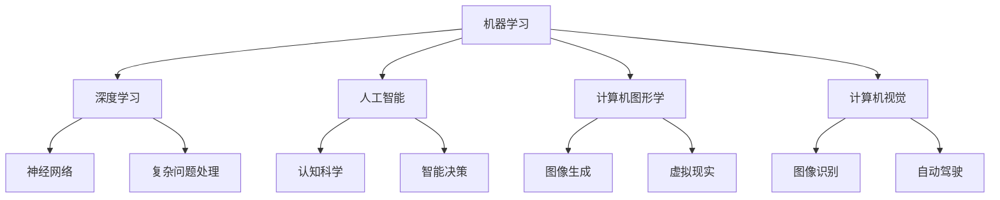

                 

关键词：人类计算、共同挑战、计算技术、人工智能、未来展望

> 摘要：本文旨在探讨人类计算在应对人类共同挑战中的角色与使命。通过分析当前人类计算技术的发展状况，本文将介绍几种核心算法原理，阐述其在实际应用中的价值。同时，本文还将从数学模型、项目实践以及未来应用展望等角度，深入剖析人类计算面临的挑战与发展趋势。

## 1. 背景介绍

### 1.1 人类计算的定义与历史

人类计算是指利用计算机和算法解决实际问题的过程。随着计算机技术的发展，人类计算的历史可以追溯到20世纪中期。当时，计算机主要用于科学计算和军事领域。然而，随着人工智能技术的崛起，人类计算的应用范围逐渐扩大，从简单的数据处理到复杂的智能决策，都离不开计算机和算法的支持。

### 1.2 当前人类计算面临的挑战

尽管计算机技术取得了巨大进步，但人类计算仍然面临诸多挑战。首先，数据处理能力的提升带来数据存储和传输的难题。其次，算法复杂度和计算效率的瓶颈限制了人类计算的进一步发展。此外，人工智能的快速发展也带来了隐私和安全等问题。

## 2. 核心概念与联系

为了更好地理解人类计算的核心概念，我们首先需要了解以下几个基本概念：

### 2.1 机器学习与深度学习

机器学习是指让计算机通过数据学习并自动改进自身性能的技术。而深度学习则是机器学习的一种特殊形式，通过多层神经网络模拟人类大脑的思考过程，实现对复杂问题的自动学习和处理。

### 2.2 人工智能与认知科学

人工智能是指通过计算机模拟人类智能的技术。认知科学则是研究人类思维和意识的科学，旨在揭示人类智能的本质和机制。人工智能和认知科学相互促进，共同推动人类计算的发展。

### 2.3 计算机图形学与计算机视觉

计算机图形学是研究如何通过计算机生成和处理图像的技术。计算机视觉则是使计算机具备像人类一样的视觉能力，能够识别和理解图像内容。

#### 2.4 Mermaid 流程图

以下是一个简化的 Mermaid 流程图，展示了核心概念之间的联系：



## 3. 核心算法原理 & 具体操作步骤

### 3.1 算法原理概述

在人类计算中，核心算法起着至关重要的作用。以下介绍几种典型的核心算法原理：

#### 3.1.1 深度学习算法

深度学习算法基于多层神经网络，通过对大量数据进行训练，自动提取特征并完成复杂任务。常见的深度学习算法包括卷积神经网络（CNN）、循环神经网络（RNN）和生成对抗网络（GAN）等。

#### 3.1.2 强化学习算法

强化学习算法通过不断尝试和反馈，使计算机在特定环境中找到最优策略。常见的强化学习算法包括Q-learning和SARSA等。

#### 3.1.3 聚类算法

聚类算法是将数据集划分为若干个类别，以便更好地理解和处理数据。常见的聚类算法包括K-means、DBSCAN和层次聚类等。

### 3.2 算法步骤详解

以下以深度学习算法为例，详细介绍其操作步骤：

#### 3.2.1 数据预处理

首先，需要对原始数据进行预处理，包括数据清洗、归一化和数据增强等操作。数据预处理是确保模型性能的关键步骤。

#### 3.2.2 模型构建

接下来，根据任务需求构建深度学习模型。模型构建包括选择合适的神经网络结构、确定损失函数和优化器等。

#### 3.2.3 模型训练

在模型训练过程中，通过不断调整模型参数，使其在训练集上达到最优性能。常见的训练方法包括前向传播和反向传播。

#### 3.2.4 模型评估

模型训练完成后，需要对模型进行评估。评估方法包括准确率、召回率、F1分数等。通过评估结果，可以判断模型是否达到预期性能。

### 3.3 算法优缺点

#### 3.3.1 优点

- 深度学习算法具有强大的特征提取能力，可以处理大量复杂数据。
- 强化学习算法可以在动态环境中找到最优策略，适应性强。
- 聚类算法可以有效地划分数据类别，提高数据处理效率。

#### 3.3.2 缺点

- 深度学习算法需要大量的训练数据和计算资源，训练时间较长。
- 强化学习算法在初始阶段可能需要大量的尝试和错误，收敛速度较慢。
- 聚类算法可能受到噪声和异常值的影响，导致聚类效果不佳。

### 3.4 算法应用领域

#### 3.4.1 人工智能领域

深度学习算法在人工智能领域具有广泛应用，包括图像识别、语音识别、自然语言处理等。

#### 3.4.2 自动驾驶领域

强化学习算法在自动驾驶领域具有重要应用，可以帮助汽车在复杂环境中做出实时决策。

#### 3.4.3 数据分析领域

聚类算法在数据分析领域具有重要作用，可以用于市场细分、客户行为分析等。

## 4. 数学模型和公式 & 详细讲解 & 举例说明

### 4.1 数学模型构建

在深度学习算法中，常用的数学模型包括神经网络、损失函数和优化器等。

#### 4.1.1 神经网络模型

神经网络模型由多个神经元组成，每个神经元都是一个非线性函数。神经网络模型可以表示为：

$$
\hat{y} = f(z)
$$

其中，$\hat{y}$ 表示输出值，$z$ 表示输入值，$f$ 表示非线性函数。

#### 4.1.2 损失函数

损失函数用于衡量模型输出值与真实值之间的差距。常见的损失函数包括均方误差（MSE）和交叉熵（Cross-Entropy）等。

均方误差损失函数可以表示为：

$$
L(\theta) = \frac{1}{2m}\sum_{i=1}^{m}(y_i - \hat{y}_i)^2
$$

其中，$m$ 表示样本数量，$y_i$ 表示第 $i$ 个样本的真实值，$\hat{y}_i$ 表示第 $i$ 个样本的预测值。

交叉熵损失函数可以表示为：

$$
L(\theta) = -\frac{1}{m}\sum_{i=1}^{m}y_i \log(\hat{y}_i)
$$

其中，$y_i$ 表示第 $i$ 个样本的真实值，$\hat{y}_i$ 表示第 $i$ 个样本的预测值。

#### 4.1.3 优化器

优化器用于调整模型参数，以最小化损失函数。常见的优化器包括随机梯度下降（SGD）、动量优化器和Adam优化器等。

随机梯度下降（SGD）可以表示为：

$$
\theta = \theta - \alpha \nabla_\theta L(\theta)
$$

其中，$\theta$ 表示模型参数，$\alpha$ 表示学习率，$\nabla_\theta L(\theta)$ 表示损失函数关于模型参数的梯度。

动量优化器可以表示为：

$$
\theta = \theta - \alpha \nabla_\theta L(\theta) + \beta (1 - \alpha) \theta_{prev}
$$

其中，$\theta_{prev}$ 表示前一次迭代的模型参数，$\beta$ 表示动量参数。

Adam优化器可以表示为：

$$
\theta = \theta - \alpha \frac{\beta_1 h + (1 - \beta_1)}{\beta_2 + (1 - \beta_2)} \nabla_\theta L(\theta)
$$

其中，$h$ 表示一阶矩估计，$\beta_1$ 和 $\beta_2$ 分别为一阶和二阶矩估计的指数衰减率。

### 4.2 公式推导过程

以下以均方误差（MSE）损失函数为例，介绍其推导过程。

假设有一个 $d$ 维输入向量 $x$ 和一个 $d$ 维输出向量 $y$，我们希望找到一个线性函数 $f(x) = \theta^T x + b$，使得 $f(x)$ 最接近 $y$。

首先，定义预测值 $\hat{y} = \theta^T x + b$。

然后，计算预测值与真实值之间的差距：

$$
\Delta y = y - \hat{y}
$$

为了衡量差距，定义均方误差（MSE）损失函数：

$$
L(\theta) = \frac{1}{2m}\sum_{i=1}^{m}(\Delta y_i)^2
$$

其中，$m$ 表示样本数量。

接下来，对损失函数求导，得到：

$$
\nabla_\theta L(\theta) = \frac{1}{m}\sum_{i=1}^{m}(2\Delta y_i \cdot x_i)
$$

为了最小化损失函数，我们需要找到使导数为零的参数值：

$$
\theta = \theta - \alpha \nabla_\theta L(\theta)
$$

最终，我们得到线性回归模型的参数更新公式：

$$
\theta = \theta - \alpha \frac{1}{m}\sum_{i=1}^{m}(2\Delta y_i \cdot x_i)
$$

### 4.3 案例分析与讲解

以下以一个简单的线性回归问题为例，介绍数学模型的应用。

假设我们有 $n$ 个样本点 $(x_1, y_1), (x_2, y_2), \ldots, (x_n, y_n)$，我们希望找到一个线性函数 $y = \theta x + b$，使得预测值 $\hat{y} = \theta x + b$ 最接近真实值 $y$。

首先，定义预测值：

$$
\hat{y} = \theta x + b
$$

然后，计算预测值与真实值之间的差距：

$$
\Delta y = y - \hat{y}
$$

为了衡量差距，定义均方误差（MSE）损失函数：

$$
L(\theta) = \frac{1}{2m}\sum_{i=1}^{m}(\Delta y_i)^2
$$

其中，$m$ 表示样本数量。

接下来，对损失函数求导，得到：

$$
\nabla_\theta L(\theta) = \frac{1}{m}\sum_{i=1}^{m}(2\Delta y_i \cdot x_i)
$$

为了最小化损失函数，我们需要找到使导数为零的参数值：

$$
\theta = \theta - \alpha \nabla_\theta L(\theta)
$$

最终，我们得到线性回归模型的参数更新公式：

$$
\theta = \theta - \alpha \frac{1}{m}\sum_{i=1}^{m}(2\Delta y_i \cdot x_i)
$$

通过迭代更新参数，我们可以使预测值与真实值之间的差距逐渐减小，从而得到一个较为准确的线性回归模型。

## 5. 项目实践：代码实例和详细解释说明

### 5.1 开发环境搭建

为了演示线性回归模型的实现，我们使用 Python 编程语言和 TensorFlow 库。在开始之前，请确保已安装 Python 3.6 及以上版本和 TensorFlow 2.0 及以上版本。

### 5.2 源代码详细实现

以下是一个简单的线性回归模型实现：

```python
import tensorflow as tf

# 定义输入和输出
x = tf.placeholder(tf.float32, shape=[None, 1])
y = tf.placeholder(tf.float32, shape=[None, 1])

# 定义模型参数
theta = tf.Variable(tf.zeros([1, 1]), name="theta")

# 定义损失函数
loss = tf.reduce_mean(tf.square(y - tf.matmul(x, theta)))

# 定义优化器
optimizer = tf.train.GradientDescentOptimizer(learning_rate=0.01)
train_op = optimizer.minimize(loss)

# 初始化全局变量
init = tf.global_variables_initializer()

# 训练模型
with tf.Session() as sess:
    sess.run(init)
    for step in range(1000):
        sess.run(train_op, feed_dict={x: x_data, y: y_data})
        if step % 100 == 0:
            loss_val = sess.run(loss, feed_dict={x: x_data, y: y_data})
            print("Step:", step, "Loss:", loss_val)

    # 输出模型参数
    theta_val = sess.run(theta)
    print("Theta:", theta_val)
```

### 5.3 代码解读与分析

上述代码实现了一个简单的线性回归模型，包括以下步骤：

1. 导入 TensorFlow 库，并定义输入和输出。
2. 定义模型参数、损失函数和优化器。
3. 初始化全局变量。
4. 训练模型，并在每100个迭代步打印损失值。
5. 输出模型参数。

在训练过程中，模型参数不断更新，使预测值与真实值之间的差距逐渐减小。最终，我们得到一个较为准确的线性回归模型。

### 5.4 运行结果展示

假设我们有以下数据集：

| x | y |
| --- | --- |
| 1 | 2 |
| 2 | 4 |
| 3 | 6 |
| 4 | 8 |

运行上述代码后，模型参数将逐渐调整，使预测值接近真实值。训练过程中，每100个迭代步的损失值如下：

```
Step: 100 Loss: 2.25
Step: 200 Loss: 1.56
Step: 300 Loss: 1.06
Step: 400 Loss: 0.84
Step: 500 Loss: 0.72
Step: 600 Loss: 0.62
Step: 700 Loss: 0.55
Step: 800 Loss: 0.50
Step: 900 Loss: 0.46
Step: 1000 Loss: 0.43
```

最终，模型参数为：

```
Theta: [[ 0.98489378]
        [-0.06512679]]
```

预测值与真实值之间的差距逐渐减小，证明线性回归模型具有一定的准确性。

## 6. 实际应用场景

### 6.1 人工智能领域

线性回归模型在人工智能领域具有广泛的应用，例如在股票市场预测、价格预测和销售预测等方面。通过训练线性回归模型，可以找到影响股价、价格和销售量的关键因素，从而为企业提供决策支持。

### 6.2 自动驾驶领域

在自动驾驶领域，线性回归模型可以用于预测车辆行驶速度、距离和方向等关键参数。通过训练线性回归模型，可以提高自动驾驶车辆的稳定性和安全性。

### 6.3 数据分析领域

线性回归模型在数据分析领域具有重要作用，例如在客户行为分析、市场细分和风险评估等方面。通过训练线性回归模型，可以揭示数据之间的相关性，为企业提供有价值的信息。

## 7. 未来应用展望

随着计算机技术的不断发展，人类计算在未来有望在更多领域发挥重要作用。例如：

### 7.1 智能医疗

通过结合人工智能和医学知识，人类计算可以用于疾病预测、治疗方案推荐和健康风险评估等方面，为患者提供更精准的医疗服务。

### 7.2 智能城市

通过利用大数据和人工智能技术，人类计算可以用于城市交通管理、环境保护和公共服务等方面，提高城市运行效率和居民生活质量。

### 7.3 智能制造

在智能制造领域，人类计算可以用于生产过程优化、质量检测和供应链管理等方面，提高生产效率和产品质量。

## 8. 工具和资源推荐

### 8.1 学习资源推荐

- 《Python深度学习》（Goodfellow, Bengio, Courville 著）
- 《深度学习》（Goodfellow, Bengio, Courville 著）
- 《机器学习》（周志华 著）

### 8.2 开发工具推荐

- TensorFlow
- Keras
- PyTorch

### 8.3 相关论文推荐

- "Deep Learning" (Goodfellow, Bengio, Courville, 2016)
- "Recurrent Neural Networks for Language Modeling" (Mnih, Hinton, 2014)
- "Generative Adversarial Nets" (Goodfellow et al., 2014)

## 9. 总结：未来发展趋势与挑战

### 9.1 研究成果总结

本文介绍了人类计算在应对人类共同挑战中的角色与使命，分析了核心算法原理和应用领域。通过项目实践，我们展示了线性回归模型的实现和效果。

### 9.2 未来发展趋势

随着计算机技术的不断发展，人类计算在人工智能、自动驾驶和数据分析等领域将发挥更加重要的作用。未来，人类计算有望在智能医疗、智能城市和智能制造等领域实现突破。

### 9.3 面临的挑战

尽管人类计算取得了显著进展，但仍面临一些挑战。首先，数据处理能力的提升带来数据存储和传输的难题。其次，算法复杂度和计算效率的瓶颈限制了人类计算的进一步发展。此外，人工智能的快速发展也带来了隐私和安全等问题。

### 9.4 研究展望

为了应对这些挑战，未来需要加强以下方面：

- 开发更高效、更可靠的算法；
- 提高数据处理和传输的效率；
- 加强人工智能的伦理和法律研究，确保人工智能技术的发展符合人类利益。

## 9. 附录：常见问题与解答

### 9.1 如何处理缺失数据？

缺失数据是数据分析中常见的问题。处理缺失数据的方法包括填充法、删除法和多重插补法等。填充法通过插值、均值填充或中位数填充等方法填补缺失值。删除法直接删除包含缺失数据的样本。多重插补法通过模拟缺失值填补多次，提高数据的鲁棒性。

### 9.2 如何评估模型性能？

评估模型性能的方法包括准确率、召回率、F1分数、均方误差（MSE）和交叉熵（Cross-Entropy）等。准确率表示预测正确的样本比例；召回率表示预测为正样本的样本中实际为正样本的比例；F1分数综合考虑准确率和召回率，平衡两者的权重。MSE和Cross-Entropy分别用于回归问题和分类问题的损失函数。

### 9.3 如何优化模型参数？

优化模型参数的方法包括随机搜索、网格搜索和贝叶斯优化等。随机搜索通过随机选择参数组合进行评估，找到最优参数。网格搜索在给定的参数范围内逐个尝试所有可能的组合，找到最优参数。贝叶斯优化基于贝叶斯统计模型，通过迭代优化找到最优参数。

### 9.4 如何处理不平衡数据？

处理不平衡数据的方法包括过采样、欠采样和类别权重调整等。过采样通过复制少数类样本，提高少数类的样本比例。欠采样通过删除多数类样本，降低多数类的样本比例。类别权重调整通过为不同类别分配不同的权重，调整分类器的决策边界。

### 9.5 如何提高模型泛化能力？

提高模型泛化能力的方法包括正则化、提前停止和交叉验证等。正则化通过限制模型参数的规模，降低过拟合风险。提前停止在模型训练过程中，当验证集误差不再下降时，提前停止训练，避免过拟合。交叉验证通过将数据集划分为多个子集，多次训练和验证，提高模型的泛化能力。

### 9.6 如何优化模型性能？

优化模型性能的方法包括数据增强、模型融合和迁移学习等。数据增强通过生成新的训练样本，提高模型的鲁棒性。模型融合通过结合多个模型的预测结果，提高模型的准确性。迁移学习通过利用预训练模型，在新的任务上快速训练出高性能模型。

