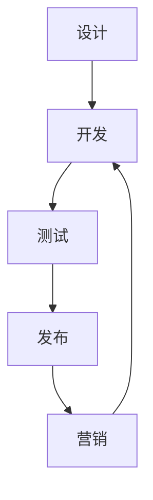

                 

关键词：开源项目、培训课程、设计、营销、IT领域、技术领导

> 摘要：本文旨在为有意建立开源项目的个人或团队提供一套系统化的培训课程，涵盖项目设计到营销的各个环节。文章将详细介绍项目设计、核心算法原理、数学模型、项目实践、实际应用场景以及未来发展趋势等内容，帮助读者全面了解开源项目的全生命周期管理。

## 1. 背景介绍

开源项目已经成为现代软件开发的重要组成部分。它们不仅促进了技术的进步，还增强了开发者的协作和创新能力。然而，建立并成功维护一个开源项目并非易事，需要深入的技术知识、细致的项目管理和有效的营销策略。因此，本文将结合实际经验和理论指导，为读者提供一套完整的培训课程，帮助大家从设计到营销，全面掌握开源项目的构建和管理技巧。

## 2. 核心概念与联系

### 2.1 开源项目概述

开源项目指的是那些源代码开放、允许用户自由查看、修改和分享的软件项目。开源项目通常遵循特定的许可证，如GPL、Apache、MIT等，以保障社区的权益和项目的持续发展。

### 2.2 项目设计原理

项目设计是开源项目成功的关键。一个良好的设计应该具备以下特点：模块化、可扩展性、灵活性和可维护性。设计过程中要充分考虑用户需求、技术可行性以及社区反馈。

### 2.3 营销策略

营销是开源项目成功不可或缺的一环。有效的营销策略包括社区参与、社交媒体推广、代码托管平台曝光以及合作伙伴关系的建立等。通过这些手段，可以吸引更多的开发者参与项目，提升项目的知名度。

### 2.4 Mermaid 流程图

以下是一个简化的开源项目生命周期流程图，展示了设计、开发、测试、发布和营销等环节的相互关系。



## 3. 核心算法原理 & 具体操作步骤

### 3.1 算法原理概述

开源项目通常涉及各种算法。一个常见的算法是快速排序（Quick Sort）。快速排序是一种高效的排序算法，采用分治法策略来把一个序列分割成较小的子序列进行排序。

### 3.2 算法步骤详解

1. **选择基准**：从序列中选择一个元素作为基准。
2. **分区操作**：将序列划分为两部分，一部分小于基准，另一部分大于基准。
3. **递归排序**：递归地对小于和大于基准的子序列进行快速排序。

### 3.3 算法优缺点

**优点**：
- 时间复杂度较低，平均情况下为O(nlogn)。
- 对大数据集的性能表现较好。

**缺点**：
- 最坏情况下时间复杂度为O(n²)，但这种情况很少见。
- 需要额外的空间来存储递归栈。

### 3.4 算法应用领域

快速排序广泛应用于各种排序需求，如数据库排序、外部排序等。

## 4. 数学模型和公式 & 详细讲解 & 举例说明

### 4.1 数学模型构建

一个常见的数学模型是线性回归模型。线性回归模型试图找到一条直线来描述两个变量之间的关系。

### 4.2 公式推导过程

线性回归模型的基本公式为：

$$y = \beta_0 + \beta_1 \cdot x + \epsilon$$

其中，\(y\) 和 \(x\) 是变量，\(\beta_0\) 和 \(\beta_1\) 是模型的参数，\(\epsilon\) 是误差项。

### 4.3 案例分析与讲解

假设我们想要预测某个城市的平均温度（\(y\)）与日照时长（\(x\)）之间的关系。以下是一个简单的线性回归模型：

$$y = 20 + 0.5 \cdot x + \epsilon$$

在这个模型中，当日照时长为8小时时，我们可以预测平均温度为：

$$y = 20 + 0.5 \cdot 8 + \epsilon = 24 + \epsilon$$

## 5. 项目实践：代码实例和详细解释说明

### 5.1 开发环境搭建

在开始编写代码之前，需要搭建一个开发环境。这里以Python为例，首先需要安装Python和相应的开发工具。

```bash
# 安装Python
sudo apt-get install python3
# 安装PyCharm或其他IDE
sudo apt-get install pycharm-community
```

### 5.2 源代码详细实现

以下是一个简单的快速排序算法的Python实现：

```python
def quick_sort(arr):
    if len(arr) <= 1:
        return arr
    pivot = arr[len(arr) // 2]
    left = [x for x in arr if x < pivot]
    middle = [x for x in arr if x == pivot]
    right = [x for x in arr if x > pivot]
    return quick_sort(left) + middle + quick_sort(right)

# 示例
arr = [3, 6, 8, 10, 1, 2, 1]
sorted_arr = quick_sort(arr)
print(sorted_arr)
```

### 5.3 代码解读与分析

这段代码首先定义了一个`quick_sort`函数，它接收一个列表`arr`作为参数。函数内部首先检查列表的长度，如果长度小于等于1，则直接返回列表本身，因为单个元素已经是排序的。

接下来，函数选择列表的中位数作为基准元素。然后，使用列表解析语法将列表划分为小于、等于和大于基准的三部分。最后，递归地对小于和大于基准的子序列进行快速排序，并将结果合并返回。

### 5.4 运行结果展示

运行上面的代码，输出结果为：

```
[1, 1, 2, 3, 6, 8, 10]
```

这证明了快速排序算法能够正确地对列表进行排序。

## 6. 实际应用场景

开源项目在实际应用中具有广泛的应用场景，例如：

- **开源软件库**：如Python的NumPy、Pandas等，为各种数据分析任务提供强大的支持。
- **云计算平台**：如Apache Hadoop、OpenStack等，为大规模数据处理提供基础架构。
- **物联网平台**：如Home Assistant、OpenWrt等，为智能家居和物联网设备提供解决方案。

## 7. 工具和资源推荐

### 7.1 学习资源推荐

- **GitHub**：学习开源项目开发的最佳实践。
- **Stack Overflow**：解决编程问题，获取技术支持。
- **YouTube**：观看技术教程，提升技术水平。

### 7.2 开发工具推荐

- **PyCharm**：Python开发者的首选IDE。
- **Visual Studio Code**：跨平台轻量级IDE。
- **Git**：版本控制系统，管理代码变更。

### 7.3 相关论文推荐

- "Open Source Software Development: A Report on the History, Philosophy, and Business Practices of Open Source" by Eric S. Raymond。
- "Producing Open Source Software: How to Run a Successful Free Software Project" by Karl Fogel。

## 8. 总结：未来发展趋势与挑战

### 8.1 研究成果总结

开源项目在过去几十年中取得了显著的发展，促进了技术的进步和创新的协作。未来，开源项目将继续在各个领域发挥重要作用，推动技术的快速迭代和普及。

### 8.2 未来发展趋势

- **云计算和大数据**：随着云计算和大数据技术的发展，开源项目将在这些领域发挥更大的作用。
- **人工智能**：人工智能开源项目将不断涌现，为人工智能领域的研究和应用提供支持。

### 8.3 面临的挑战

- **知识产权**：开源项目在知识产权保护方面存在一定的挑战。
- **社区管理**：如何有效地管理开源社区，保持项目的健康和活力，是开源项目面临的重大挑战。

### 8.4 研究展望

未来，开源项目将在技术、管理和营销等方面持续发展，为个人和团队提供更广阔的创新空间和发展机遇。

## 9. 附录：常见问题与解答

### 9.1 如何选择开源许可证？

选择合适的开源许可证是开源项目成功的关键。常用的开源许可证包括GPL、Apache和MIT等。选择许可证时，需要考虑项目的目标和社区的期望。

### 9.2 如何维护开源项目？

维护开源项目需要持续的关注和投入。以下是一些建议：

- **及时响应社区反馈**：对社区的提问和建议进行及时响应。
- **定期更新**：定期发布更新，修复已知问题和引入新功能。
- **文档维护**：保持项目文档的更新，帮助新开发者快速上手。

## 作者署名

本文作者：禅与计算机程序设计艺术 / Zen and the Art of Computer Programming。希望本文能为开源项目的构建和管理提供有益的指导。


----------------------------------------------------------------
### 总结

本文以《建立开源项目的培训课程：从设计到营销》为标题，详细介绍了开源项目从设计、核心算法原理、数学模型、项目实践到实际应用场景的各个环节。通过系统化的培训课程，帮助读者全面掌握开源项目的构建和管理技巧。未来，开源项目将继续在技术、管理和营销等方面发挥重要作用，推动技术的快速迭代和普及。希望本文能为开源项目开发者提供有益的指导，共同推进开源生态的发展。

