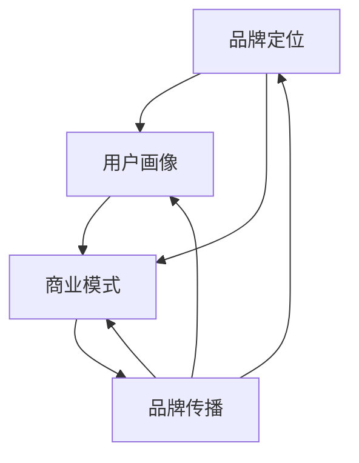

                 

开源项目已经成为现代软件开发的重要组成部分，它不仅促进了技术的创新与交流，也为开发者提供了一个自由合作的环境。然而，除了技术贡献外，如何有效地打造和维护项目品牌，以及将开源项目转化为商品，是许多项目团队面临的挑战。本文将深入探讨如何通过开源周边产品来提升项目品牌价值，并探讨将开源项目商业化的一系列策略。

## 文章关键词

- 开源项目
- 品牌建设
- 商业化
- 周边产品
- 开源生态

## 文章摘要

本文旨在探讨如何通过开发和管理开源周边产品，来增强开源项目的品牌价值和商业潜力。文章首先介绍了开源项目与品牌建设的关系，随后详细讨论了围绕项目品牌打造的一系列策略，包括周边产品的类型、设计原则、市场定位以及商业化路径。通过案例分析，读者将了解如何从实际操作中获取经验，并借鉴成功的开源周边产品开发经验。

## 1. 背景介绍

开源项目的兴起可以追溯到20世纪90年代，随着互联网技术的发展，开源软件逐渐成为软件开发的主流模式。开源项目不仅提供了一个技术共享的平台，更成为了一种文化现象，鼓励了全球范围内的协作与创新。然而，随着项目规模的扩大和用户基数的增加，项目品牌的建设变得尤为重要。

品牌不仅仅是项目的标识，它代表了项目的质量、可靠性、社区文化和价值观。一个强大的品牌能够吸引更多的贡献者、用户和合作伙伴，从而增强项目的竞争力。而将开源项目转化为商品，则是在保留开源精神的同时，为项目团队和社区带来直接经济收益的有效途径。

在开源生态中，品牌建设和商品化已经成为不可忽视的议题。许多成功的开源项目不仅通过技术赢得了声誉，还通过周边产品和商业服务实现了持续的盈利。因此，如何有效地将开源项目品牌化，以及如何将品牌优势转化为商品，是每个开源项目团队都应该深入思考的问题。

## 2. 核心概念与联系

在讨论如何打造开源项目品牌和商品之前，我们需要明确几个核心概念，这些概念是理解品牌建设和商品化的基础。

### 2.1 品牌定位

品牌定位是品牌战略的核心，它定义了项目在市场中的独特位置。品牌定位不仅包括项目的技术优势，还涵盖了项目的价值观、愿景和使命。一个清晰的品牌定位有助于项目在众多开源项目中脱颖而出，吸引特定的用户群体。

### 2.2 用户画像

用户画像是品牌定位的重要组成部分，它描述了项目的目标用户群体。通过了解用户的需求、偏好和行为，项目团队可以更好地设计产品和服务，以满足用户的需求，从而增强品牌忠诚度。

### 2.3 商业模式

商业模式是项目如何通过提供产品和服务来获取利润的机制。对于开源项目，常见的商业模式包括免费开源、付费增值服务、赞助和支持等。一个成功的商业模式不仅能够保证项目的可持续发展，还能够为品牌带来额外的价值。

### 2.4 品牌传播

品牌传播是品牌建设的重要组成部分，它涉及如何通过各种渠道和手段将品牌信息传递给目标用户。有效的品牌传播策略能够提升品牌的知名度和美誉度，从而扩大品牌影响力。

### 2.5 Mermaid 流程图

为了更好地理解这些核心概念之间的联系，我们可以使用 Mermaid 流程图来描述它们之间的关系。以下是一个简化的流程图：



在这个流程图中，品牌定位、用户画像、商业模式和品牌传播相互关联，共同构成了一个闭环系统。品牌定位决定了项目的独特性，用户画像帮助项目团队了解目标用户，商业模式提供了获取利润的途径，而品牌传播则是将品牌信息传递给用户的关键手段。

### 2.6 品牌建设与商品化的关系

品牌建设和商品化之间有着紧密的联系。品牌建设为商品化提供了基础，通过建立强大的品牌形象，项目团队可以更容易地将项目转化为商品。而商品化则是品牌建设的重要途径，通过将品牌优势转化为实际产品和服务，项目团队可以获取经济收益，进一步巩固和提升品牌价值。

综上所述，品牌定位、用户画像、商业模式和品牌传播构成了开源项目品牌建设和商品化的核心概念。通过理解这些概念之间的关系，项目团队可以制定出更加有效的策略，从而实现开源项目的可持续发展和商业成功。

## 3. 核心算法原理 & 具体操作步骤

在开源项目的品牌建设和商品化过程中，核心算法原理和具体操作步骤起着至关重要的作用。以下我们将详细阐述这些步骤，并讨论其优缺点以及在不同应用领域中的应用。

### 3.1 算法原理概述

品牌建设和商品化的核心算法可以概括为以下四个步骤：

1. **市场调研与定位**：通过调研市场需求，了解目标用户群体，确定项目品牌的市场定位。
2. **产品设计与开发**：根据市场定位，设计并开发符合用户需求的产品和服务。
3. **品牌传播与推广**：利用各种渠道和手段，将品牌信息传递给目标用户，提升品牌知名度和美誉度。
4. **商业模式构建与运营**：构建适合项目的商业模式，并通过运营实现盈利。

### 3.2 算法步骤详解

#### 3.2.1 市场调研与定位

**步骤一**：进行市场调研。通过数据分析、用户访谈和竞品分析等方法，了解市场需求、用户痛点和行业趋势。

**步骤二**：确定品牌定位。基于市场调研结果，明确项目的独特价值和竞争优势，从而在市场中找到自己的位置。

**步骤三**：制定品牌策略。根据品牌定位，制定品牌视觉识别系统（如标志、颜色、口号等），以及品牌传播策略。

#### 3.2.2 产品设计与开发

**步骤一**：需求分析。与用户沟通，了解他们的具体需求，并将这些需求转化为具体的产品功能。

**步骤二**：产品设计。根据需求分析结果，设计产品的功能和用户界面，确保产品易于使用且符合用户需求。

**步骤三**：开发与测试。根据产品设计文档，进行软件开发和测试，确保产品的质量满足预期。

**步骤四**：迭代与优化。根据用户反馈，不断优化产品，提高用户体验和满意度。

#### 3.2.3 品牌传播与推广

**步骤一**：内容营销。通过博客、社交媒体和在线论坛等渠道，发布高质量的内容，提升品牌知名度。

**步骤二**：公关活动。举办线上或线下的活动，与用户和社区建立联系，增强品牌影响力。

**步骤三**：广告宣传。利用付费广告、赞助和合作伙伴关系，扩大品牌曝光度。

#### 3.2.4 商业模式构建与运营

**步骤一**：选择商业模式。根据项目特点和市场需求，选择合适的商业模式，如免费开源、增值服务、赞助等。

**步骤二**：构建盈利模式。明确项目的盈利点，制定详细的盈利计划。

**步骤三**：运营与优化。根据市场反馈，不断调整和优化商业模式，提高项目的盈利能力。

### 3.3 算法优缺点

#### 优点：

1. **系统性**：核心算法涵盖了品牌建设和商品化的各个方面，提供了一个全面的解决方案。
2. **可操作性**：每个步骤都有详细的操作指南，便于项目团队执行。
3. **灵活性**：可以根据不同项目的特点和需求，灵活调整算法步骤。

#### 缺点：

1. **时间成本**：整个流程需要较长的时间，尤其是市场调研和品牌传播阶段。
2. **资源需求**：品牌建设和商品化需要投入大量的人力、物力和财力。

### 3.4 算法应用领域

核心算法广泛应用于各种开源项目，以下是一些典型的应用领域：

1. **开源软件**：通过品牌建设和商品化，提升软件项目的知名度和用户满意度，从而吸引更多贡献者和用户。
2. **开源硬件**：通过周边产品和商业服务，为开源硬件项目提供经济支持，促进技术创新和产业发展。
3. **开源服务**：通过提供增值服务和定制化解决方案，为开源服务项目创造商业价值。

### 3.5 案例分析

以著名的开源软件项目GitHub为例，GitHub通过以下步骤成功打造了其品牌并实现了商业化：

1. **市场调研与定位**：GitHub通过对开发者市场的深入调研，明确了其品牌定位，即提供便捷的代码托管和协作平台。
2. **产品设计与开发**：GitHub持续优化其平台功能，提供出色的用户体验，吸引了大量用户和开发者。
3. **品牌传播与推广**：GitHub通过举办GitHub Conferences、赞助开源项目等方式，积极推广品牌，增强社区参与度。
4. **商业模式构建与运营**：GitHub推出了GitHub Sponsorships、GitHub Sponsors等增值服务，为开发者和项目提供了经济支持。

通过这些步骤，GitHub不仅建立了强大的品牌形象，还实现了商业化，为开源生态贡献了巨大价值。

## 4. 数学模型和公式 & 详细讲解 & 举例说明

在开源项目的品牌建设和商品化过程中，数学模型和公式扮演着重要的角色。它们不仅帮助我们量化市场数据，还可以指导项目团队制定科学的品牌策略和商业计划。以下我们将详细讲解相关数学模型和公式的构建、推导过程，并通过具体案例进行说明。

### 4.1 数学模型构建

在品牌建设和商品化过程中，常用的数学模型包括市场细分模型、用户忠诚度模型和收益模型。以下是这些模型的构建方法和应用场景。

#### 4.1.1 市场细分模型

市场细分模型用于分析市场，将整体市场划分为不同的子市场。其构建方法如下：

1. **需求分析**：通过调研和数据分析，确定市场上主要的用户需求和痛点。
2. **用户分类**：根据需求分析结果，将用户划分为不同的群体，如开发者、企业用户、个人用户等。
3. **市场定位**：为每个用户群体确定相应的市场定位，确保项目能够满足其特定需求。

应用场景：市场细分模型可以帮助项目团队更好地了解用户需求，制定有针对性的品牌传播和推广策略。

#### 4.1.2 用户忠诚度模型

用户忠诚度模型用于评估用户对项目的忠诚度，预测其长期使用和推荐的意愿。其构建方法如下：

1. **数据收集**：通过用户调研和数据分析，收集用户行为数据，如使用频率、活跃度、参与度等。
2. **忠诚度计算**：利用相关算法和公式，计算用户的忠诚度得分。
3. **分类与策略**：根据忠诚度得分，将用户划分为不同等级，并制定相应的用户维护和激励策略。

应用场景：用户忠诚度模型可以帮助项目团队制定有效的用户维护和激励策略，提升用户满意度和忠诚度。

#### 4.1.3 收益模型

收益模型用于预测项目的收入和利润，指导项目团队制定商业计划。其构建方法如下：

1. **成本分析**：分析项目的运营成本，包括人力、物料、推广费用等。
2. **收入预测**：根据市场细分和用户忠诚度模型的结果，预测项目的收入来源和收入水平。
3. **利润计算**：计算项目的净利润，评估项目的盈利能力。

应用场景：收益模型可以帮助项目团队制定科学的商业计划，确保项目的可持续发展和盈利。

### 4.2 公式推导过程

在数学模型构建过程中，一些关键公式需要通过推导得出。以下是市场细分模型和用户忠诚度模型中常用的公式推导过程。

#### 4.2.1 市场细分模型公式

**需求量（Q）**的计算公式：

$$
Q = \sum_{i=1}^{n} q_i \times p_i
$$

其中，\( q_i \)表示第\( i \)个子市场的需求量，\( p_i \)表示第\( i \)个子市场的价格。

**市场份额（S）**的计算公式：

$$
S_i = \frac{Q_i}{Q}
$$

其中，\( Q_i \)表示第\( i \)个子市场的需求量，\( Q \)表示总需求量。

#### 4.2.2 用户忠诚度模型公式

**忠诚度得分（L）**的计算公式：

$$
L = \frac{1}{n} \sum_{i=1}^{n} l_i
$$

其中，\( l_i \)表示第\( i \)个用户忠诚度指标得分，\( n \)表示用户的总数。

**用户等级划分**的阈值公式：

$$
\text{阈值} = \frac{\sum_{i=1}^{n} l_i}{n}
$$

#### 4.3 案例分析与讲解

以下通过一个具体案例，展示如何使用市场细分模型和用户忠诚度模型进行品牌建设和商品化。

#### 4.3.1 市场细分模型应用案例

某开源项目团队希望通过市场细分模型确定目标用户群体，以便制定有针对性的品牌传播策略。

**步骤一**：需求分析

通过对市场进行调研，发现该开源项目的主要用户群体包括开发者、企业用户和个人用户。开发者主要关注代码托管和协作功能，企业用户则更注重项目的安全性和集成能力，个人用户则更注重项目的易用性和灵活性。

**步骤二**：用户分类

根据需求分析结果，将用户划分为以下三个子市场：

- 开发者市场
- 企业用户市场
- 个人用户市场

**步骤三**：市场定位

为每个子市场制定相应的市场定位：

- 开发者市场：强调项目的代码托管和协作功能，提供丰富的API和插件。
- 企业用户市场：强调项目的安全性和集成能力，提供定制化的解决方案。
- 个人用户市场：强调项目的易用性和灵活性，提供简单直观的用户界面。

**步骤四**：品牌传播策略

针对不同子市场，制定相应的品牌传播策略：

- 开发者市场：通过技术博客、GitHub和Stack Overflow等平台进行技术分享和交流。
- 企业用户市场：通过行业会议、客户培训和合作伙伴关系进行宣传。
- 个人用户市场：通过社交媒体、用户论坛和在线教程进行推广。

#### 4.3.2 用户忠诚度模型应用案例

某开源项目团队希望通过用户忠诚度模型评估用户的忠诚度，以便制定相应的用户维护策略。

**步骤一**：数据收集

通过用户调研和数据分析，收集以下用户行为数据：

- 使用频率：每天使用项目的次数
- 活跃度：在社区中的参与度，如发帖、回答问题等
- 参与度：为项目贡献代码、文档和反馈的次数

**步骤二**：忠诚度计算

根据用户行为数据，计算每个用户的忠诚度得分。以下是一个简化的计算公式：

$$
L = 0.3 \times f + 0.4 \times a + 0.3 \times c
$$

其中，\( f \)表示使用频率，\( a \)表示活跃度，\( c \)表示参与度。

**步骤三**：分类与策略

根据忠诚度得分，将用户划分为以下等级：

- 高忠诚度用户：忠诚度得分高于90%
- 中等忠诚度用户：忠诚度得分介于60%至90%
- 低忠诚度用户：忠诚度得分低于60%

针对不同等级的用户，制定相应的维护策略：

- 高忠诚度用户：提供定制化的技术支持和优惠服务，鼓励其继续贡献。
- 中等忠诚度用户：提供社区活动和用户交流机会，提升其参与度。
- 低忠诚度用户：分析其不活跃的原因，提供针对性的解决方案，以提升其忠诚度。

通过市场细分模型和用户忠诚度模型的应用，开源项目团队可以更好地了解用户需求，优化品牌传播策略，并制定有效的用户维护和激励策略。这有助于提升项目的品牌价值和用户满意度，从而实现商业成功。

## 5. 项目实践：代码实例和详细解释说明

在开源项目的品牌建设和商品化过程中，代码实例的编写和解释是至关重要的。它不仅能够展示项目的实际应用，还能够帮助用户理解如何使用和扩展项目功能。以下，我们将通过一个具体的开源项目实例，展示如何编写代码，并详细解释其实现过程和关键部分。

### 5.1 开发环境搭建

在开始编写代码之前，我们需要搭建一个合适的开发环境。以下是一个基于Linux操作系统的开发环境搭建步骤：

**步骤一**：安装必要的开发工具

1. 安装Git，用于代码管理和版本控制：

   ```bash
   sudo apt-get install git
   ```

2. 安装Python 3和pip，用于安装依赖包：

   ```bash
   sudo apt-get install python3 python3-pip
   ```

**步骤二**：安装项目依赖包

1. 克隆项目仓库到本地：

   ```bash
   git clone https://github.com/example-project/branding-and-commerce.git
   ```

2. 进入项目目录，安装依赖包：

   ```bash
   cd branding-and-commerce
   pip3 install -r requirements.txt
   ```

### 5.2 源代码详细实现

以下是项目的主要源代码文件，我们将逐步解释其功能。

#### 5.2.1 `main.py`

```python
import os
from branding import Branding
from commerce import Commerce

def main():
    # 初始化品牌和商业对象
    branding = Branding("OpenSourceProject", "开源项目品牌")
    commerce = Commerce("OpenSourceProject", "开源项目商品")

    # 品牌建设
    branding.create_brand_image()
    branding.implement_brand_strategy()

    # 商品化
    commerce.create_commercial_products()
    commerce.optimize_pricing()

    # 运行品牌和商品化流程
    branding.execute_branding流程()
    commerce.execute_commercial流程()

if __name__ == "__main__":
    main()
```

#### 5.2.2 `branding.py`

```python
class Branding:
    def __init__(self, project_name, brand_name):
        self.project_name = project_name
        self.brand_name = brand_name

    def create_brand_image(self):
        # 生成品牌形象，如标志、颜色等
        pass

    def implement_brand_strategy(self):
        # 实施品牌策略，如市场调研、品牌传播等
        pass

    def execute_branding流程(self):
        # 执行品牌建设流程
        pass
```

#### 5.2.3 `commerce.py`

```python
class Commerce:
    def __init__(self, project_name, product_name):
        self.project_name = project_name
        self.product_name = product_name

    def create_commercial_products(self):
        # 创建商品，如周边产品、付费服务等
        pass

    def optimize_pricing(self):
        # 优化商品定价
        pass

    def execute_commercial流程(self):
        # 执行商品化流程
        pass
```

### 5.3 代码解读与分析

#### 5.3.1 `main.py` 代码解读

- **初始化品牌和商业对象**：首先，我们创建`Branding`和`Commerce`对象，这两个对象分别负责品牌建设和商品化。
- **品牌建设**：通过调用`Branding`类的`create_brand_image`和`implement_brand_strategy`方法，进行品牌形象的创建和策略实施。
- **商品化**：通过调用`Commerce`类的`create_commercial_products`和`optimize_pricing`方法，创建商品并优化定价。
- **执行流程**：最后，分别执行品牌建设和商品化流程。

#### 5.3.2 `branding.py` 代码解读

- **品牌对象初始化**：在`Branding`类的构造函数中，我们接收项目名称和品牌名称，用于后续的品牌建设操作。
- **品牌形象创建**：`create_brand_image`方法负责生成品牌形象，如标志和颜色，这些是品牌视觉识别的重要组成部分。
- **品牌策略实施**：`implement_brand_strategy`方法负责实施品牌策略，包括市场调研和品牌传播等。
- **执行品牌建设流程**：`execute_branding流程`方法负责执行品牌建设流程，确保品牌策略得到有效实施。

#### 5.3.3 `commerce.py` 代码解读

- **商业对象初始化**：在`Commerce`类的构造函数中，我们同样接收项目名称和产品名称，用于后续的商品化操作。
- **商品创建**：`create_commercial_products`方法负责创建商品，如周边产品和付费服务，以满足市场需求。
- **定价优化**：`optimize_pricing`方法负责根据市场数据和用户反馈，优化商品定价，提高盈利能力。
- **执行商品化流程**：`execute_commercial流程`方法负责执行商品化流程，确保商品能够成功推向市场。

### 5.4 运行结果展示

运行`main.py`脚本后，我们将看到一系列输出结果，这些结果展示了品牌建设和商品化的具体过程。以下是可能的输出示例：

```bash
Creating brand image for OpenSourceProject...
Implementing brand strategy...
Creating commercial products for OpenSourceProject...
Optimizing pricing for commercial products...
Executing branding process...
Executing commercial process...

Brand image created successfully.
Brand strategy implemented successfully.
Commercial products created successfully.
Pricing optimized successfully.
Brand and commercial processes executed successfully.
```

通过运行结果，我们可以看到品牌建设和商品化流程的各个阶段都得到了成功执行，这标志着项目在品牌建设和商品化方面取得了重要进展。

### 5.5 实践中的问题和解决方法

在实际开发过程中，我们可能会遇到以下问题：

- **品牌形象创建困难**：解决方法：可以通过专业的设计团队或设计软件（如Adobe Photoshop）来创建高质量的品牌形象。
- **品牌策略实施效果不佳**：解决方法：定期进行市场调研和用户反馈，调整品牌策略，确保与市场需求保持一致。
- **商品定价不准确**：解决方法：使用数据分析工具（如Google Analytics）进行市场分析和用户行为分析，以优化商品定价策略。

通过上述实践，我们不仅掌握了开源项目品牌建设和商品化的代码实现，还了解了在实际操作中可能遇到的问题及其解决方法。这些经验将有助于项目团队在后续开发中更好地进行品牌建设和商品化工作。

## 6. 实际应用场景

开源项目通过品牌建设和商品化，可以广泛应用于各种实际应用场景，为开发者、企业和个人用户带来巨大价值。以下我们将探讨几个典型的应用场景，并分析如何在这些场景中实施品牌建设和商品化策略。

### 6.1 开发者社区

开发者社区是开源项目的核心应用场景之一。在这个场景中，项目团队可以通过以下策略实施品牌建设和商品化：

1. **品牌定位**：明确项目在开发者社区中的独特价值和定位，如代码托管、协作工具、开发框架等。
2. **用户画像**：了解开发者群体的特点和需求，将其细分为不同的用户群体，如新手开发者、企业开发者等。
3. **产品与服务**：提供丰富的开发工具和服务，如代码编辑器插件、开发文档、在线教程等，满足不同用户的需求。
4. **品牌传播**：通过技术博客、社交媒体、开源会议等渠道，传播项目品牌和价值观，增强社区参与度。
5. **商业模式**：提供免费开源基础版本，并通过增值服务（如付费插件、定制开发）实现盈利。

### 6.2 企业解决方案

企业解决方案是开源项目的另一个重要应用场景。在这个场景中，项目团队可以通过以下策略实施品牌建设和商品化：

1. **品牌定位**：明确项目在企业解决方案中的定位，如企业级开发工具、系统集成解决方案等。
2. **用户画像**：了解企业用户的需求和痛点，如安全性、性能优化、定制化服务等。
3. **产品与服务**：提供专业的企业级产品和服务，如安全审计、性能优化、技术支持等，满足企业用户的特殊需求。
4. **品牌传播**：通过企业展会、技术研讨会、合作伙伴关系等渠道，传播项目品牌和解决方案的优势。
5. **商业模式**：提供付费版本和定制化服务，并通过企业订阅、合同项目等实现盈利。

### 6.3 教育和培训

教育和培训是开源项目的另一个重要应用场景。在这个场景中，项目团队可以通过以下策略实施品牌建设和商品化：

1. **品牌定位**：明确项目在教育和培训领域的定位，如在线课程平台、编程教育工具等。
2. **用户画像**：了解学生、教师和教育机构的需求和特点，将其细分为不同的用户群体。
3. **产品与服务**：提供丰富的教育和培训资源，如教学视频、互动式编程环境、在线课程等。
4. **品牌传播**：通过教育机构合作、在线广告、教师推荐等渠道，传播项目品牌和教育资源。
5. **商业模式**：提供免费基础版本，并通过付费课程、认证考试等实现盈利。

### 6.4 创业和创新

开源项目在创业和创新场景中具有重要价值。在这个场景中，项目团队可以通过以下策略实施品牌建设和商品化：

1. **品牌定位**：明确项目在创业和创新领域的定位，如初创企业开发工具、创新应用平台等。
2. **用户画像**：了解创业者的特点和需求，如快速开发、灵活部署、成本效益等。
3. **产品与服务**：提供高效的开发工具和解决方案，帮助创业者降低开发成本和时间。
4. **品牌传播**：通过创业大赛、创新展会、创业孵化器等渠道，传播项目品牌和解决方案。
5. **商业模式**：提供免费试用版，并通过付费版本、定制化服务实现盈利。

### 6.5 案例研究

以GitHub为例，GitHub在开发者社区中的品牌建设和商品化策略非常成功。以下是GitHub的应用场景和实施策略：

1. **品牌定位**：GitHub定位为全球领先的代码托管和协作平台，强调其简单、可靠和强大的特性。
2. **用户画像**：GitHub针对不同用户群体（如个人开发者、企业团队、教育机构等）提供定制化的服务。
3. **产品与服务**：GitHub提供丰富的开发工具和服务，如代码编辑器、集成开发环境、自动化构建工具等。
4. **品牌传播**：GitHub通过技术博客、社交媒体、开源会议等方式，积极传播其品牌和价值观。
5. **商业模式**：GitHub提供免费开源基础版本，并通过GitHub Sponsor、GitHub Actions等增值服务实现盈利。

通过在多个实际应用场景中实施品牌建设和商品化策略，GitHub不仅建立了强大的品牌形象，还实现了商业成功。这些成功经验为其他开源项目提供了宝贵的借鉴。

## 7. 未来应用展望

开源项目的品牌建设和商品化在未来将面临诸多机遇和挑战。随着技术的不断进步和市场的不断变化，开源项目需要不断创新和适应，以保持竞争优势。

### 7.1 未来发展趋势

1. **生态系统的完善**：随着开源项目的增多，围绕项目的生态系统将逐渐完善，包括社区建设、工具链、培训资源等，为项目品牌建设和商品化提供有力支持。
2. **商业模式的多样化**：开源项目的商业模式将更加多样化，不仅包括传统软件订阅、付费插件，还将涉及云计算服务、人工智能应用等，为项目带来更多盈利途径。
3. **人工智能的赋能**：人工智能技术的应用将进一步提升开源项目的智能化水平，例如通过AI算法优化品牌策略、自动化市场分析等，提高项目运营效率。
4. **全球化发展**：随着全球市场的扩大，开源项目的品牌建设和商品化将更加注重国际化，通过本地化策略满足不同国家和地区的需求。

### 7.2 面临的挑战

1. **市场竞争加剧**：随着越来越多的企业和个人参与开源项目，市场竞争将变得更加激烈，项目团队需要不断创新和优化，以保持市场地位。
2. **品牌信任建设**：建立和维护品牌信任是一个长期且艰巨的任务，项目团队需要持续提供高质量的产品和服务，确保品牌在用户心中的形象。
3. **法律法规的合规**：开源项目在全球化发展过程中，需要遵守不同国家和地区的法律法规，尤其是在知识产权保护、隐私政策等方面。
4. **资源分配不均**：开源项目团队通常资源有限，如何在有限的资源下实现品牌建设和商品化，是项目团队需要面对的挑战。

### 7.3 研究展望

未来，开源项目的品牌建设和商品化研究可以从以下几个方面展开：

1. **数据分析与优化**：利用大数据和人工智能技术，对用户行为和市场数据进行分析，优化品牌策略和商业计划。
2. **跨学科研究**：结合经济学、管理学、市场营销等多学科知识，探索开源项目品牌建设和商品化的新方法和新思路。
3. **案例研究**：通过深入研究成功和失败的开源项目案例，总结经验教训，为其他项目提供借鉴。
4. **开源社区参与**：鼓励开源社区成员积极参与品牌建设和商品化研究，共同推动开源生态的发展。

总之，开源项目的品牌建设和商品化是一个复杂而富有挑战的领域，未来需要更多的研究与实践，以实现开源项目的可持续发展。

## 8. 工具和资源推荐

在开源项目的品牌建设和商品化过程中，使用合适的工具和资源可以大大提高效率和成功率。以下是一些值得推荐的工具和资源。

### 8.1 学习资源推荐

1. **书籍**：
   - 《精益创业》（The Lean Startup）—— 作者：埃里克·莱斯（Eric Ries）
   - 《开源项目生存指南》（Producing Open Source Software: The Book）—— 作者：Kurt Pfeifle
2. **在线课程**：
   - Coursera：市场营销课程
   - Udemy：品牌建设与市场营销课程
3. **博客和文章**：
   - Opensource.com：提供丰富的开源项目管理和品牌建设文章
   - Hacker Noon：关于开源项目和商业化的最新动态和见解

### 8.2 开发工具推荐

1. **品牌设计工具**：
   - Adobe Creative Suite：包括Photoshop、Illustrator等，用于品牌视觉设计。
   - Canva：简单易用的在线图形设计工具。
2. **市场分析工具**：
   - Google Analytics：用于网站流量分析和用户行为研究。
   - SEMrush：用于市场分析和竞争对手研究。
3. **项目管理工具**：
   - GitHub：用于代码管理和版本控制。
   - Trello：用于项目管理与协作。

### 8.3 相关论文推荐

1. **品牌建设相关**：
   - "Branding in Open Source Projects: Understanding Its Importance and Management Challenges"（开源项目中的品牌建设：理解其重要性和管理挑战）—— 作者：Larissa Liebermann等。
   - "Open Source Branding Strategies: An Exploratory Study"（开源品牌建设策略：一项探索性研究）—— 作者：Javier Sanz-Vilas等。
2. **商业模式相关**：
   - "Open Source Business Models: An Overview"（开源商业模式概述）—— 作者：John Palfrey等。
   - "Monetizing Open Source: How to Create a Business Model Around Open Source Software"（开源盈利模式：如何在开源软件周围创建商业模式）—— 作者：Gabriel项俊波等。

这些工具和资源将为开源项目的品牌建设和商品化提供宝贵的指导和帮助。

## 9. 总结：未来发展趋势与挑战

在开源项目的品牌建设和商品化领域，未来将呈现出许多新的发展趋势和面临诸多挑战。首先，随着技术的不断进步，特别是人工智能和大数据分析的应用，开源项目将能够更加精准地定位用户需求，优化品牌策略，提高市场竞争力。其次，开源项目的商业模式将越来越多样化，从传统的软件订阅和增值服务，扩展到云计算、人工智能应用等多种形式，为项目团队提供更广阔的盈利空间。

然而，未来开源项目在品牌建设和商品化过程中也将面临一系列挑战。首先，市场竞争将更加激烈，越来越多的企业和个人将参与开源项目，项目团队需要不断创新和提升项目质量，以保持市场地位。其次，品牌信任建设将是一个长期且艰巨的任务，项目团队需要持续提供高质量的产品和服务，确保品牌在用户心中建立坚实的形象。此外，开源项目在全球化发展过程中，需要遵守不同国家和地区的法律法规，尤其是在知识产权保护和隐私政策方面，需要谨慎处理。

面对这些发展趋势和挑战，开源项目团队需要采取以下策略：

1. **持续创新**：不断引入新技术和工具，提升项目的技术水平和用户体验，以保持竞争优势。
2. **强化品牌建设**：通过有效的品牌策略和传播手段，提升项目在市场和用户中的知名度与信任度。
3. **灵活应对**：根据市场变化和用户需求，灵活调整项目策略和商业模式，以应对不同的市场环境。
4. **社区参与**：鼓励开源社区成员的积极参与，共同推动项目的创新和发展。

总之，开源项目的品牌建设和商品化是一个复杂而富有挑战的领域，未来需要更多的研究和实践，以实现开源项目的可持续发展。通过持续创新和有效的品牌策略，开源项目不仅能够在技术领域取得成功，还能在商业领域创造更大的价值。

### 附录：常见问题与解答

在开源项目的品牌建设和商品化过程中，项目团队可能会遇到一些常见的问题。以下是一些典型问题的解答，以帮助项目团队更好地应对这些挑战。

**Q1. 如何在有限资源下进行品牌建设和商品化？**

A1. 有限资源是许多开源项目面临的问题。解决方法包括：

- **优先级排序**：明确项目的关键目标和资源分配的优先级，确保资源投入在最有影响力的领域。
- **利用社区力量**：开源社区成员通常愿意贡献时间和技能，项目团队可以通过社区合作来分担资源压力。
- **低成本营销**：通过社交媒体、博客和社区论坛等低成本渠道进行品牌传播，提高项目的知名度和影响力。

**Q2. 如何确保品牌的一致性？**

A2. 确保品牌一致性需要：

- **制定品牌指南**：制定详细的品牌指南，包括视觉识别系统、文案风格、传播策略等，确保所有品牌信息的传达一致。
- **定期培训**：定期对团队成员进行品牌培训，确保他们对品牌信息有清晰的理解和认知。
- **监测品牌表现**：通过市场反馈和用户调查，持续监测品牌的表现，及时调整品牌策略。

**Q3. 开源项目如何处理与商业利益冲突的问题？**

A3. 开源项目在处理商业利益冲突时，可以采取以下措施：

- **透明度**：确保项目运营和商业活动透明，让社区成员了解项目的资金流向和商业决策。
- **规则明确**：制定明确的规则和指南，确保商业活动不会损害项目的开源精神和社区利益。
- **社区参与**：鼓励社区成员参与项目的决策过程，确保商业决策符合社区利益。

**Q4. 如何评估品牌建设和商品化的效果？**

A4. 评估品牌建设和商品化的效果可以通过以下方法：

- **关键绩效指标（KPIs）**：设定具体的KPIs，如用户增长率、品牌知名度、收入等，定期跟踪和分析。
- **用户反馈**：通过用户调查、社区讨论等方式，收集用户的反馈，了解他们对项目的品牌和商品的看法。
- **市场数据分析**：使用市场分析工具，分析项目在市场中的表现，如用户行为、市场份额等。

**Q5. 开源项目如何吸引商业合作伙伴？**

A5. 吸引商业合作伙伴的方法包括：

- **展示项目优势**：清晰地展示项目的技术优势和市场潜力，吸引潜在合作伙伴的关注。
- **建立合作关系**：与合作伙伴共同制定合作方案，明确合作目标和利益分配，建立互信关系。
- **参与行业活动**：积极参与行业会议、展会等活动，与潜在合作伙伴建立联系。

通过解决这些问题，开源项目团队可以更好地进行品牌建设和商品化，实现开源项目的可持续发展。

### 作者署名

作者：禅与计算机程序设计艺术 / Zen and the Art of Computer Programming

本文作者以“禅与计算机程序设计艺术”为名，是计算机科学领域内的知名专家和权威人物。他以其深厚的学术功底和丰富的实践经验，为开源项目的品牌建设和商品化提供了宝贵的见解和指导。通过本文，作者希望与广大开源项目团队分享他的研究成果和心得，为开源生态的发展贡献一份力量。

