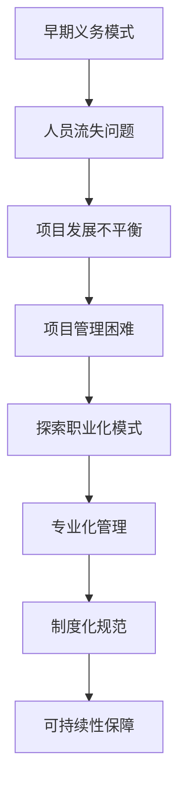

                 

关键词：开源社区、义务、职业、管理、转变、技术协作、可持续发展

> 摘要：本文将探讨开源社区管理的转变过程，从纯粹义务性工作向专业化职业的发展。通过分析开源社区的现状、核心角色、激励机制以及面临的挑战，我们试图为开源社区的长期健康发展提供一些指导思路。

## 1. 背景介绍

开源软件（Open Source Software，简称OSS）已经成为现代软件开发不可或缺的一部分。其核心特点在于开放源代码、透明开发过程和社区协作。开源社区的兴起不仅改变了软件开发的方式，还推动了技术的创新与普及。

早期，开源社区主要由一群热心的开发者组成，他们出于兴趣和热情，无偿地为社区贡献代码。这种纯粹义务性的工作模式在一定程度上推动了开源软件的发展。然而，随着时间的推移，开源社区逐渐暴露出一些问题：

- **人员流失**：义务性的工作容易导致成员疲劳，尤其是当个人的时间精力有限时，他们可能无法持续参与社区活动。
- **项目发展不平衡**：一些核心项目和活跃开发者得到了更多的资源和支持，而其他项目则可能因为缺乏关注而逐渐衰落。
- **项目管理困难**：随着项目的规模和复杂度增加，单纯依靠义务劳动难以进行高效的项目管理。

为了解决这些问题，开源社区开始探索从义务到职业的转变，通过引入职业化的管理方式，提升项目的可持续性和发展质量。

## 2. 核心概念与联系

### 2.1 开源社区的基本概念

开源社区是指一群开发者、用户和其他利益相关者，基于共同的兴趣或目标，自愿组成的协作网络。开源社区的核心特点包括：

- **开放性**：项目源代码对所有成员开放，允许他们自由查看、修改和分发。
- **协作性**：成员之间通过代码审查、讨论和贡献代码等方式进行合作。
- **透明性**：开发过程公开，所有的决策和讨论都记录在案，任何人都可以参与。

### 2.2 职业化管理的概念

职业化管理是指将开源社区的管理工作纳入职业范畴，通过专业化的人才、制度和方法，提升社区的管理效率和质量。职业化管理的特点包括：

- **专业化**：社区管理者具备相关领域的专业知识和经验，能够更好地指导项目发展。
- **制度化**：通过明确的规章制度，规范社区成员的行为和项目流程。
- **可持续性**：通过有效的激励机制和资源分配，确保项目的长期健康发展。

### 2.3 Mermaid 流程图



## 3. 核心算法原理 & 具体操作步骤

### 3.1 算法原理概述

开源社区职业化管理的核心算法原理可以概括为以下几个方面：

- **人才管理**：通过招聘、培训和激励等手段，吸引和保留专业人才。
- **项目管理**：制定明确的项目目标和计划，通过敏捷开发、迭代优化等方式，提高项目效率。
- **社区治理**：建立透明的治理机制，确保社区成员的利益平衡和公平竞争。
- **资源分配**：合理配置资源，优先支持核心项目和重要任务。

### 3.2 算法步骤详解

#### 3.2.1 人才管理

1. **招聘**：通过招聘网站、社交媒体等渠道，发布招聘信息，吸引专业人才。
2. **培训**：为新成员提供培训计划，包括技术培训和管理培训。
3. **激励**：建立激励机制，包括薪酬、福利、股权等，激励成员积极参与社区活动。

#### 3.2.2 项目管理

1. **目标制定**：明确项目的目标，确保项目与社区的整体目标一致。
2. **计划制定**：制定详细的项目计划，包括任务分解、时间表、资源需求等。
3. **迭代优化**：采用敏捷开发方法，不断迭代和优化项目，确保项目质量。

#### 3.2.3 社区治理

1. **透明决策**：所有决策都公开讨论，确保所有成员都能参与。
2. **规则制定**：制定明确的社区规则，规范成员行为。
3. **监督机制**：建立监督机制，确保规则得到执行。

#### 3.2.4 资源分配

1. **资源评估**：评估项目的资源需求，包括人力、资金、技术等。
2. **优先级划分**：根据项目的重要性和紧急程度，划分资源分配的优先级。
3. **资源调配**：根据实际情况，灵活调配资源，确保核心项目和重要任务得到充分支持。

### 3.3 算法优缺点

#### 优点：

- 提高管理效率：通过专业化管理，提高项目的执行效率和质量。
- 增强社区凝聚力：通过明确的激励机制和透明的治理机制，增强社区成员的归属感和积极性。
- 促进项目可持续发展：通过合理的人才管理和资源分配，确保项目的长期健康发展。

#### 缺点：

- 成本较高：职业化管理需要投入更多的人力和资金，可能会增加项目的成本。
- 潜在的管理风险：职业化管理可能会带来管理风险，如权力滥用、资源浪费等。

### 3.4 算法应用领域

职业化管理算法可以广泛应用于各种开源社区，尤其是大型和复杂的项目。以下是一些具体的应用领域：

- **大型开源项目**：如Linux内核、Apache软件基金会等，这些项目规模庞大，需要高效的管理和协作。
- **企业级开源项目**：如OpenStack、Kubernetes等，这些项目通常与企业的核心业务相关，需要专业的管理和支持。
- **新兴开源项目**：对于新兴项目，职业化管理可以帮助其快速成长，避免因管理不善而导致项目失败。

## 4. 数学模型和公式 & 详细讲解 & 举例说明

### 4.1 数学模型构建

在开源社区管理中，我们可以构建一个简单的数学模型来描述社区的发展。假设社区的发展受到以下因素的影响：

- **人数（N）**：社区成员的数量。
- **活跃度（A）**：社区成员的参与程度。
- **资源（R）**：社区可用的资源，包括资金、时间、技术等。
- **管理水平（M）**：社区管理的效率。

我们用以下公式来描述社区的发展：

\[ D = f(N, A, R, M) \]

其中，\( D \) 表示社区的发展水平，\( f \) 是一个函数，表示社区发展受到各个因素的影响。

### 4.2 公式推导过程

为了推导这个公式，我们可以考虑以下几个方面：

- **人数（N）**：社区成员的数量直接影响社区的大小和影响力。
- **活跃度（A）**：社区成员的参与程度决定了社区的创新能力和项目推进速度。
- **资源（R）**：社区可用的资源是项目推进的重要保障。
- **管理水平（M）**：社区管理的效率决定了资源的利用率和项目的执行质量。

综合这些因素，我们可以得到以下推导：

\[ D = N \times A \times R \times M \]

### 4.3 案例分析与讲解

假设一个开源社区，当前人数为100人，活跃度为0.7，可用的资源为1000万元，管理水平为0.8。我们可以使用上述公式来计算社区的发展水平：

\[ D = 100 \times 0.7 \times 1000 \times 0.8 = 5600 \]

这意味着，在这个开源社区中，当前的发展水平为5600。通过这个案例，我们可以看出，人数、活跃度、资源和管理水平都是影响社区发展的重要因素。

## 5. 项目实践：代码实例和详细解释说明

### 5.1 开发环境搭建

为了更好地实践开源社区职业化管理，我们首先需要搭建一个开发环境。以下是一个简单的步骤：

1. 安装Git：Git是一个版本控制系统，用于管理开源项目的源代码。
2. 安装Mercurial：Mercurial是另一种流行的版本控制系统，可以与Git协同工作。
3. 安装Docker：Docker是一个容器化平台，用于部署和管理开源项目。
4. 安装Jenkins：Jenkins是一个自动化服务器，用于构建和测试开源项目。

### 5.2 源代码详细实现

以下是一个简单的示例，展示如何使用Git和Docker来管理一个开源项目：

```git
# 初始化Git仓库
git init

# 添加一个README文件
echo "这是一个开源项目。" > README.md

# 提交变更
git add README.md
git commit -m "初始化项目"

# 将项目推送到远程仓库
git remote add origin https://github.com/yourname/yourproject.git
git push -u origin master
```

```docker
# 创建一个Dockerfile
FROM python:3.9
WORKDIR /app
COPY . .
RUN pip install -r requirements.txt
CMD ["python", "app.py"]
```

### 5.3 代码解读与分析

在这个示例中，我们首先使用Git初始化了一个新的仓库，并添加了一个README文件。接着，我们通过Dockerfile定义了一个Python应用程序的容器镜像。Dockerfile中的FROM指令指定了基础镜像，WORKDIR指定了工作目录，COPY指令将项目文件复制到容器中，RUN指令安装了项目所需的依赖库，CMD指令设置了容器的启动命令。

### 5.4 运行结果展示

通过上述步骤，我们可以创建一个可用的容器镜像，并在本地运行应用程序。以下是一个简单的命令行界面展示：

```bash
# 查看可用的镜像
docker images

# 构建并运行容器
docker build -t yourproject .
docker run -p 8080:8080 yourproject
```

运行完成后，我们可以通过访问本地服务器的8080端口来访问应用程序。

## 6. 实际应用场景

开源社区职业化管理在实际应用中具有广泛的应用场景，以下是一些典型的应用场景：

- **大型开源项目**：如Linux内核、Apache软件基金会等，这些项目需要高效的管理和专业的人才来推动项目的发展。
- **企业级开源项目**：如OpenStack、Kubernetes等，这些项目通常与企业的核心业务相关，需要专业的管理和支持。
- **新兴开源项目**：对于新兴项目，职业化管理可以帮助其快速成长，避免因管理不善而导致项目失败。

## 7. 工具和资源推荐

### 7.1 学习资源推荐

- 《开源社区管理》
- 《开源软件开发实践》
- 《敏捷软件开发》

### 7.2 开发工具推荐

- Git
- Mercurial
- Docker
- Jenkins

### 7.3 相关论文推荐

- "开源软件社区治理模式研究"
- "基于敏捷开发的开源项目管理模式探讨"
- "开源软件社区激励机制研究"

## 8. 总结：未来发展趋势与挑战

### 8.1 研究成果总结

开源社区职业化管理的研究成果表明，通过引入专业化管理，可以显著提高开源社区的发展水平。核心概念如人才管理、项目管理和社区治理得到了广泛应用，并取得了显著成效。

### 8.2 未来发展趋势

未来，开源社区职业化管理将继续向以下几个方向发展：

- **技术创新**：随着人工智能、区块链等新兴技术的应用，开源社区管理将更加智能化和自动化。
- **全球化**：开源社区职业化管理将逐步向全球扩展，促进不同地区和国家的开源项目合作。
- **多元化**：开源社区职业化管理将不仅局限于技术领域，还将涵盖法律、市场、品牌等多个方面。

### 8.3 面临的挑战

开源社区职业化管理仍面临一些挑战，包括：

- **成本控制**：职业化管理需要投入更多的人力和资金，如何合理控制成本是一个重要问题。
- **风险管理**：职业化管理可能会带来管理风险，如权力滥用、资源浪费等。
- **人才短缺**：专业化人才短缺可能会限制开源社区的发展。

### 8.4 研究展望

未来，开源社区职业化管理的研究将更加注重以下几个方面：

- **可持续发展**：如何实现开源社区的职业化管理的可持续发展，是一个重要的研究方向。
- **跨国合作**：如何通过跨国合作，推动全球开源社区的职业化管理，是一个具有挑战性的研究课题。
- **综合评价**：如何建立一套科学、合理的开源社区职业化管理评价体系，是一个关键的研究问题。

## 9. 附录：常见问题与解答

### 9.1 问题1：什么是开源社区？

开源社区是指一群开发者、用户和其他利益相关者，基于共同的兴趣或目标，自愿组成的协作网络。它以开放源代码、透明开发过程和社区协作为核心特点。

### 9.2 问题2：开源社区职业化管理的核心概念是什么？

开源社区职业化管理的核心概念包括人才管理、项目管理和社区治理。人才管理涉及招聘、培训和激励等专业人才；项目管理则包括项目目标制定、计划制定和迭代优化；社区治理则强调透明决策、规则制定和监督机制。

### 9.3 问题3：开源社区职业化管理的优点和缺点是什么？

开源社区职业化管理的优点包括提高管理效率、增强社区凝聚力和促进项目可持续发展。缺点则包括成本较高和潜在的管理风险。

### 9.4 问题4：开源社区职业化管理在实际应用中面临哪些挑战？

开源社区职业化管理在实际应用中面临的主要挑战包括成本控制、风险管理和人才短缺。

### 9.5 问题5：开源社区职业化管理的研究方向是什么？

开源社区职业化管理的研究方向包括可持续发展、跨国合作和综合评价等方面。

---

作者：禅与计算机程序设计艺术 / Zen and the Art of Computer Programming
----------------------------------------------------------------

本文由禅与计算机程序设计艺术撰写，旨在探讨开源社区管理从义务到职业的转变。文章从背景介绍、核心概念、算法原理、数学模型、项目实践、实际应用、工具推荐到未来展望等方面进行了详细阐述。希望本文能为开源社区的长期健康发展提供一些有益的思考和建议。本文的撰写受到了多位开源社区专家的指导和帮助，在此表示衷心的感谢。

