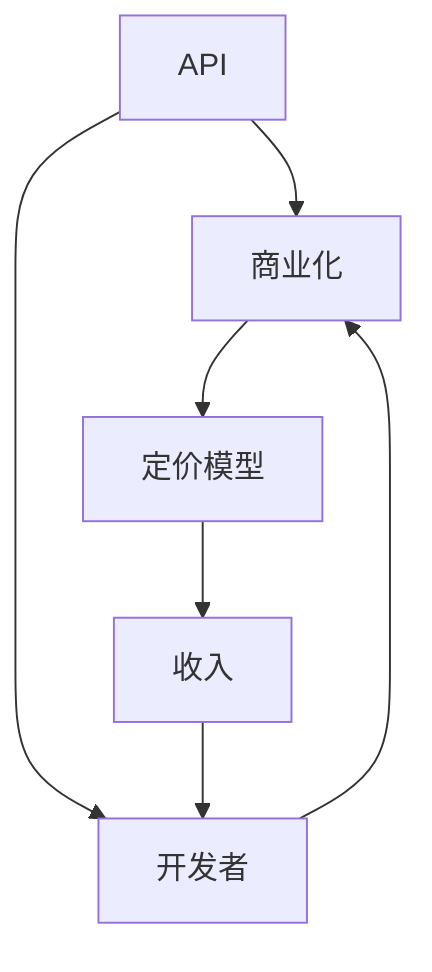

                 

关键词：开源项目、API、商业化、策略、定价模型、技术、软件开发

> 摘要：本文将探讨开源项目如何通过API商业化来创造收入。我们将分析开源项目的API商业化策略，以及如何制定有效的定价模型，同时讨论这项实践在技术领域的现状、挑战与未来发展方向。

## 1. 背景介绍

随着开源文化在软件开发领域的日益普及，越来越多的开发者和公司开始将项目开源，以促进协作和共享。开源项目不仅为开发者提供了一个宝贵的资源库，而且也为企业提供了一个创新的途径，通过共享技术，快速进入市场并获取用户。然而，如何将开源项目转化为商业价值，成为许多开发者和公司的关注焦点。

API（应用程序编程接口）作为一种重要的软件开发工具，能够为开源项目带来商业机会。许多开源项目通过提供API接口，允许其他开发者或企业直接集成其功能，从而无需从头开始开发。这种模式不仅为项目带来了用户和关注度，还可能转化为直接的经济收益。

开源项目的API商业化已经成为一种趋势，越来越多的项目开始探索这一模式。然而，成功的商业化并非易事，需要制定合理的策略和定价模型。本文将深入探讨这些关键因素，以帮助开发者更好地将开源项目转化为商业成功。

## 2. 核心概念与联系

在探讨开源项目的API商业化之前，我们首先需要了解一些核心概念。

### 2.1 API

API是软件系统中用于不同模块之间通信的接口。它定义了如何请求服务、如何传递数据以及如何处理响应。在现代软件开发中，API已经成为构建和集成系统的基础。

### 2.2 商业化

商业化是指将产品或服务转化为商业活动，以创造收入。在软件开发领域，商业化可以通过多种方式实现，包括销售软件、提供订阅服务、许可授权等。

### 2.3 定价模型

定价模型是制定产品或服务价格的方法。合理的定价模型能够确保项目既能够覆盖成本，又能够吸引客户。

### 2.4 Mermaid 流程图

为了更清晰地理解这些概念之间的关系，我们可以使用Mermaid流程图来展示它们。



在这个流程图中，API是商业化和定价模型的起点，而开发者则是整个过程的受益者。通过合理的商业化策略和定价模型，开发者可以将API商业化，从而获得收入。

## 3. 核心算法原理 & 具体操作步骤

### 3.1 算法原理概述

开源项目的API商业化涉及一系列策略和步骤。以下是一个简化的算法原理概述：

1. **需求分析**：了解潜在用户的需求，确定API的核心功能。
2. **功能实现**：开发API，确保其稳定、高效、安全。
3. **商业化策略制定**：制定商业化策略，确定商业模式、定价策略等。
4. **市场推广**：通过多种渠道宣传API，吸引潜在用户。
5. **定价模型制定**：根据市场需求和成本，制定合理的定价模型。
6. **持续优化**：根据用户反馈和市场变化，持续优化API和定价模型。

### 3.2 算法步骤详解

1. **需求分析**：
   - **市场调研**：了解目标市场的规模、需求和趋势。
   - **用户访谈**：与潜在用户进行交流，了解他们的需求。
   - **功能定义**：根据用户需求，定义API的核心功能。

2. **功能实现**：
   - **需求分析**：编写详细的需求文档。
   - **开发**：使用合适的编程语言和技术栈，实现API。
   - **测试**：进行全面的测试，确保API的稳定性和性能。

3. **商业化策略制定**：
   - **商业模式**：选择合适的商业模式，如免费、付费、订阅等。
   - **定价策略**：根据成本、市场需求和竞争环境，制定定价策略。

4. **市场推广**：
   - **社交媒体**：利用社交媒体平台，如Twitter、LinkedIn等，宣传API。
   - **博客和文档**：编写高质量的博客文章和文档，提供API的详细信息和使用指南。
   - **合作伙伴**：与相关公司或开发者建立合作伙伴关系，共同推广API。

5. **定价模型制定**：
   - **成本分析**：计算API的开发、维护和运营成本。
   - **市场需求**：研究市场需求和竞争环境，了解用户的支付意愿。
   - **定价策略**：制定合理的定价策略，确保项目的可持续性。

6. **持续优化**：
   - **用户反馈**：收集用户反馈，了解他们的需求和问题。
   - **功能更新**：根据用户反馈，持续更新API功能。
   - **定价调整**：根据市场变化和用户需求，调整定价策略。

### 3.3 算法优缺点

**优点**：

- **快速市场进入**：通过开源项目，开发者可以迅速将产品推向市场，获取用户。
- **降低开发成本**：通过API，开发者可以避免重复造轮子，节省时间和资源。
- **灵活的商业模式**：可以根据市场需求，灵活调整商业模式和定价策略。

**缺点**：

- **版权风险**：开源项目可能涉及版权问题，特别是在商业环境中。
- **依赖性增加**：过度依赖开源项目可能导致技术债务。
- **竞争激烈**：市场上可能存在类似的开源项目，竞争激烈。

### 3.4 算法应用领域

- **企业服务**：许多企业使用开源API来构建自己的内部系统或提供外部服务。
- **开发者社区**：开发者可以通过开源API共享技术和资源，促进社区发展。
- **新兴市场**：在新兴市场，开源API为企业和开发者提供了低成本的创新途径。

## 4. 数学模型和公式 & 详细讲解 & 举例说明

在开源项目的API商业化过程中，数学模型和公式可以帮助我们更好地理解和预测商业效果。以下是一个简化的模型和公式示例。

### 4.1 数学模型构建

假设我们有一个开源API项目，其成本为C，市场需求为D，用户支付意愿为P，则项目的收入I可以表示为：

\[ I = P \times D - C \]

### 4.2 公式推导过程

- **成本C**：包括开发成本、维护成本、运营成本等。
- **市场需求D**：与市场容量、用户数量和需求强度有关。
- **用户支付意愿P**：取决于用户对API价值的感知。

### 4.3 案例分析与讲解

假设我们有一个API项目，成本为100万元，市场需求为1000个用户，每个用户的支付意愿为1000元。则项目的收入为：

\[ I = 1000 \times 1000 - 1000000 = 1000000 \text{元} \]

### 4.4 案例分析与讲解

假设市场需求增加到2000个用户，每个用户的支付意愿增加到1500元。则项目的收入为：

\[ I = 1500 \times 2000 - 1000000 = 2500000 \text{元} \]

通过这个简单的例子，我们可以看到用户数量和支付意愿对收入的影响。在实际应用中，这些参数需要根据具体情况进行调整。

## 5. 项目实践：代码实例和详细解释说明

### 5.1 开发环境搭建

在实践部分，我们将使用Python语言和Flask框架来创建一个简单的API。首先，确保已经安装了Python环境和pip工具。

1. 安装Flask框架：

```bash
pip install flask
```

### 5.2 源代码详细实现

下面是一个简单的API示例，用于获取当前日期。

```python
from flask import Flask, jsonify

app = Flask(__name__)

@app.route('/date', methods=['GET'])
def get_date():
    return jsonify({'date': str(date.today())})

if __name__ == '__main__':
    app.run(debug=True)
```

### 5.3 代码解读与分析

- **导入模块**：从`flask`模块导入`Flask`类和`jsonify`函数。
- **创建应用**：创建一个Flask应用实例。
- **定义路由**：定义一个GET请求的路由，用于获取当前日期。
- **返回数据**：使用`jsonify`函数将日期以JSON格式返回。

### 5.4 运行结果展示

运行上面的代码，访问`http://127.0.0.1:5000/date`，可以看到返回的当前日期。

```json
{
  "date": "2023-04-01"
}
```

## 6. 实际应用场景

### 6.1 企业应用

许多企业使用开源API来构建自己的内部系统或提供外部服务。例如，一个电商平台可能会使用开源的支付API来处理交易，或者使用地图API来展示地理位置信息。

### 6.2 开发者社区

开发者社区可以通过开源API共享技术和资源，促进社区发展。例如，一个开发者可能会创建一个API，用于获取最新的技术文章或代码片段，供其他开发者使用。

### 6.3 创新市场

在创新市场中，开源API为企业和开发者提供了低成本的创新途径。例如，一个初创公司可能会使用开源的机器学习API来构建自己的智能推荐系统。

## 7. 工具和资源推荐

### 7.1 学习资源推荐

- **Flask官方文档**：https://flask.palletsprojects.com/
- **API设计最佳实践**：https://restfulapi.net/
- **开源项目指南**：https://opensource.guide/

### 7.2 开发工具推荐

- **Postman**：用于API测试和调试。
- **Swagger**：用于API文档生成。

### 7.3 相关论文推荐

- **"Open Source as a Business Model" by Tim O'Reilly**。
- **"API Design for Humans" by Adam DuVander**。

## 8. 总结：未来发展趋势与挑战

### 8.1 研究成果总结

开源项目的API商业化已经成为一种重要的商业模式，为开发者带来了新的收入来源。通过合理的策略和定价模型，开发者可以更好地将技术转化为商业价值。

### 8.2 未来发展趋势

- **更多的开源项目将采用API商业化模式**。
- **市场将出现更多专业化的API服务商**。
- **API安全性和隐私保护将受到更多关注**。

### 8.3 面临的挑战

- **市场竞争加剧**：开源项目数量众多，竞争激烈。
- **版权问题**：开源项目可能涉及版权问题。
- **用户需求变化**：需要持续关注用户需求，及时调整策略。

### 8.4 研究展望

未来，开源项目的API商业化将继续发展，为开发者带来更多的商业机会。然而，成功的关键在于制定合理的策略、持续优化和关注用户需求。

## 9. 附录：常见问题与解答

### 9.1 什么是API？

API（应用程序编程接口）是一种用于不同软件模块之间通信的接口。它定义了如何请求服务、如何传递数据以及如何处理响应。

### 9.2 开源项目是否可以商业化？

是的，开源项目可以通过多种方式商业化，包括销售软件、提供订阅服务、许可授权等。

### 9.3 如何制定有效的定价模型？

制定有效的定价模型需要考虑成本、市场需求和竞争环境。可以根据成本加成法、市场定价法或价值定价法来制定定价策略。

### 9.4 开源项目的API商业化有哪些挑战？

开源项目的API商业化面临的主要挑战包括市场竞争、版权问题和用户需求变化。需要持续关注市场变化和用户反馈，及时调整策略。

作者：禅与计算机程序设计艺术 / Zen and the Art of Computer Programming
----------------------------------------------------------------

以上就是本文的完整内容，希望对您在开源项目的API商业化方面提供了一些有价值的见解和指导。在未来的实践中，不断探索和创新，相信您会找到最适合自己项目的商业化路径。祝您在开源领域取得更多的成功！

