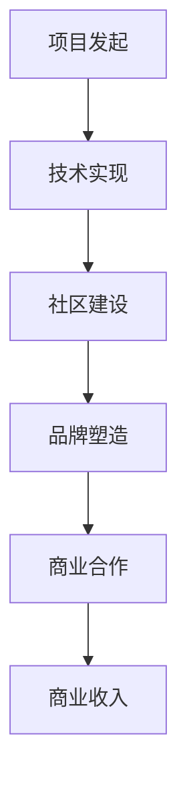

                 

在这个数字化时代，开源项目已经成为技术发展和创新的重要驱动力。开源不仅推动了技术的进步，还为企业和个人提供了广泛的知识共享平台。然而，如何从一个成功的开源项目走向商业认可，是一个值得深入探讨的话题。本文将探讨开源项目的品牌建设，从技术角度到商业化的全过程，旨在为开源项目团队提供一套实用、高效的策略。

## 关键词

- 开源项目
- 商业认可
- 品牌建设
- 技术影响力
- 商业策略

## 摘要

本文旨在揭示开源项目从技术卓越到商业成功的关键因素。通过对开源项目品牌建设的深入分析，我们将探讨如何将技术优势转化为商业价值，包括项目定位、社区建设、商业化模式探索等方面。文章还将提供一系列实用策略和工具，以帮助开源项目团队在商业化道路上迈出坚实的一步。

## 1. 背景介绍

开源项目起源于20世纪90年代，随着互联网的发展逐渐兴起。早期的开源项目主要是由个人或小团体发起，他们希望通过开放源代码来吸引更多的开发者参与，共同推动技术的进步。随着时间的推移，开源项目已经成为软件开发的重要组成部分，许多大企业和政府机构都开始采用并参与开源项目。

开源项目的核心在于开放性和合作性。开源项目鼓励开发者共享代码、知识和经验，这种协作方式不仅能够快速发现问题并解决问题，还能激发更多的创新。然而，虽然开源项目在技术层面上取得了巨大的成功，但在商业认可方面仍面临诸多挑战。许多开源项目团队往往注重技术实现，而忽视了品牌建设和商业策略的重要性。

本文将围绕开源项目的品牌建设，探讨如何将技术优势转化为商业价值。我们将分析开源项目在商业认可过程中可能遇到的障碍，并提出相应的解决方案。此外，本文还将介绍一些成功的开源项目案例，以供参考。

## 2. 核心概念与联系

### 2.1 开源项目的基本概念

开源项目（Open Source Project）指的是一个软件项目，其源代码可以被公众访问、阅读、修改和分发。开源项目的核心原则是开放性、透明性和协作性。这种协作模式使得开源项目能够吸引全球范围内的开发者参与，共同推动项目的发展。

开源项目的关键概念包括：

- **源代码开放**：项目的源代码必须可供任何人自由访问和下载。
- **版权许可**：通常使用特定的开源许可协议，如GPL、MIT等，允许用户自由使用、修改和分发代码。
- **社区参与**：鼓励用户和开发者共同参与项目的开发、测试和文档撰写。

### 2.2 商业认可的概念

商业认可（Business Recognition）是指一个项目或品牌在商业领域获得的高度评价和认可。对于开源项目来说，商业认可意味着项目不仅得到了技术界的认可，还在商业市场上获得了成功。商业认可可以通过以下方式实现：

- **商业合作**：企业与开源项目合作，利用项目的技术优势来开发产品或服务。
- **市场推广**：通过市场推广活动提高项目的知名度和影响力。
- **商业收入**：通过提供付费服务、赞助、许可费等方式实现商业收益。

### 2.3 品牌建设与商业认可的联系

品牌建设（Brand Building）是开源项目获得商业认可的重要环节。品牌建设不仅关乎项目的形象和声誉，还直接影响项目的市场表现和商业价值。

品牌建设与商业认可之间的联系体现在以下几个方面：

- **形象塑造**：一个强大的品牌形象能够吸引更多的用户和开发者，提高项目的认可度。
- **用户忠诚度**：良好的品牌形象和优质的用户体验能够增强用户的忠诚度，提高项目的市场占有率。
- **商业机会**：品牌建设能够为开源项目带来更多的商业合作机会，提升项目的商业价值。

### 2.4 Mermaid 流程图

下面是一个简单的Mermaid流程图，展示了开源项目从技术到商业认可的基本流程：



## 3. 核心算法原理 & 具体操作步骤

### 3.1 算法原理概述

在开源项目的品牌建设过程中，算法原理可以比喻为一系列的技术手段和策略，它们共同作用，帮助项目实现从技术到商业的转型。以下是几个核心算法原理的概述：

1. **社区参与算法**：通过鼓励开发者参与，提高项目的活力和影响力。
2. **市场推广算法**：利用社交媒体、内容营销等手段提升项目的知名度。
3. **商业模式算法**：探索多元化的商业模式，将技术优势转化为商业价值。
4. **品牌形象算法**：通过精心设计品牌形象，提升项目的市场认可度。

### 3.2 算法步骤详解

1. **社区参与算法**
   - **第一步**：建立开放的沟通渠道，如论坛、邮件列表和GitHub等。
   - **第二步**：鼓励开发者提交代码、报告问题和提出建议。
   - **第三步**：定期组织会议、研讨会和代码贡献活动，增强社区凝聚力。

2. **市场推广算法**
   - **第一步**：制定市场推广策略，明确目标受众和推广渠道。
   - **第二步**：通过博客、社交媒体和线上活动发布项目相关内容。
   - **第三步**：与行业媒体、社区领袖和KOL合作，扩大项目的影响力。

3. **商业模式算法**
   - **第一步**：评估项目的技术优势和市场需求，确定商业模式的切入点。
   - **第二步**：探索付费服务、赞助、许可费等多种商业模式。
   - **第三步**：制定详细的商业计划，包括市场推广、销售和售后支持等。

4. **品牌形象算法**
   - **第一步**：确定品牌核心价值，如技术领先、用户友好等。
   - **第二步**：设计品牌标识和宣传材料，确保品牌形象的一致性。
   - **第三步**：通过高质量的用户体验和优质的客户服务强化品牌形象。

### 3.3 算法优缺点

- **社区参与算法**：
  - 优点：增强项目社区活力，提高项目的多样性和创新性。
  - 缺点：管理难度大，需耗费大量时间和精力进行社区维护。

- **市场推广算法**：
  - 优点：提升项目知名度，吸引更多开发者参与。
  - 缺点：市场推广效果难以量化，需要持续投入。

- **商业模式算法**：
  - 优点：实现技术优势向商业价值的转化，提升项目经济收益。
  - 缺点：商业模式探索风险较高，需要准确把握市场需求。

- **品牌形象算法**：
  - 优点：建立良好的品牌形象，增强项目的市场竞争力。
  - 缺点：品牌形象建设需要长期投入，效果显现较慢。

### 3.4 算法应用领域

这些算法原理在开源项目的品牌建设过程中具有广泛的应用领域：

- **开源社区建设**：通过社区参与算法，促进项目社区的发展和活跃。
- **市场营销**：利用市场推广算法，提高项目的市场知名度和影响力。
- **商业模式探索**：通过商业模式算法，实现开源项目的商业化运作。
- **品牌管理**：借助品牌形象算法，塑造项目的品牌价值和市场形象。

## 4. 数学模型和公式 & 详细讲解 & 举例说明

### 4.1 数学模型构建

在开源项目的品牌建设过程中，我们可以构建一个简单的数学模型来描述项目从技术到商业认可的过程。这个模型包括以下几个关键变量：

- \( T \)：项目的技术质量
- \( C \)：社区建设情况
- \( M \)：市场推广力度
- \( B \)：品牌形象
- \( R \)：商业认可度

数学模型的基本关系可以表示为：

\[ R = f(T, C, M, B) \]

其中，\( f \)是一个复杂的函数，表示技术质量、社区建设、市场推广和品牌形象对商业认可度的影响。

### 4.2 公式推导过程

要推导这个公式，我们可以从以下几个方面进行分析：

1. **技术质量（\( T \)）**：
   - 技术质量是开源项目的基础，直接影响项目的性能和可靠性。
   - 高质量的技术能够提高项目的市场竞争力，从而提升商业认可度。

2. **社区建设（\( C \)）**：
   - 社区是开源项目的核心，社区的活力和参与度对项目的长期发展至关重要。
   - 活跃的社区能够吸引更多开发者参与，提高项目的多样性和创新性，进而提升商业认可度。

3. **市场推广（\( M \)）**：
   - 市场推广能够提高项目的知名度，吸引潜在用户和合作伙伴。
   - 有效的市场推广能够增加项目的商业机会，提高商业认可度。

4. **品牌形象（\( B \)）**：
   - 品牌形象是项目在市场上的形象和声誉。
   - 好的品牌形象能够增强用户和合作伙伴的信任，提高项目的市场竞争力，从而提升商业认可度。

### 4.3 案例分析与讲解

为了更好地理解这个数学模型，我们可以通过一个实际案例进行讲解。假设我们有一个开源项目，其技术质量（\( T \)）为90分，社区建设（\( C \)）为80分，市场推广力度（\( M \)）为70分，品牌形象（\( B \)）为85分。我们可以将这些值代入数学模型中进行计算：

\[ R = f(90, 80, 70, 85) \]

假设函数\( f \)的具体形式为：

\[ f(T, C, M, B) = 0.5T + 0.3C + 0.2M + 0.05B \]

那么，商业认可度（\( R \)）的计算结果为：

\[ R = 0.5 \times 90 + 0.3 \times 80 + 0.2 \times 70 + 0.05 \times 85 = 88.5 \]

这意味着，根据这个模型，这个开源项目的商业认可度为88.5分。我们可以看到，技术质量是影响商业认可度最重要的因素，其次是社区建设、市场推广和品牌形象。

### 4.4 数学模型在品牌建设中的应用

通过这个数学模型，我们可以了解到开源项目的品牌建设是一个多维度、综合性的过程。在具体的实践中，我们可以根据实际情况调整各个变量的权重，从而优化品牌建设策略。

例如，如果一个开源项目在技术质量方面已经非常出色，那么我们可以将更多的资源和精力投入到社区建设和市场推广中，以提高项目的商业认可度。反之，如果一个项目的社区建设非常活跃，那么我们可以考虑加强品牌形象的建设，以提升项目的整体市场竞争力。

总之，这个数学模型为我们提供了一个量化的工具，帮助我们更科学、更系统地推进开源项目的品牌建设。

## 5. 项目实践：代码实例和详细解释说明

### 5.1 开发环境搭建

为了演示开源项目的品牌建设，我们选择了一个实际的开源项目——一个基于Python的自动化测试工具。首先，我们需要搭建一个适合开发的编程环境。

1. **安装Python**：
   - 前往Python官方网站下载最新版本的Python安装包。
   - 运行安装程序，按照默认设置完成安装。

2. **安装虚拟环境**：
   - 打开命令行窗口，输入以下命令创建一个虚拟环境：
     ```bash
     python -m venv test_project_env
     ```
   - 激活虚拟环境：
     ```bash
     source test_project_env/bin/activate
     ```

3. **安装依赖库**：
   - 使用pip安装项目所需的依赖库，例如Selenium和pytest：
     ```bash
     pip install selenium pytest
     ```

### 5.2 源代码详细实现

接下来，我们实现一个简单的自动化测试用例，用于测试一个网页的登录功能。

1. **创建测试文件**：
   - 在虚拟环境中创建一个名为`test_login.py`的Python文件。

2. **编写测试用例**：
   ```python
   import unittest
   from selenium import webdriver
   from selenium.webdriver.common.by import By
   from selenium.webdriver.common.keys import Keys

   class LoginTest(unittest.TestCase):
       def setUp(self):
           self.driver = webdriver.Chrome(executable_path='path/to/chromedriver')
           self.driver.get("https://example.com/login")

       def test_login(self):
           username_input = self.driver.find_element(By.NAME, "username")
           password_input = self.driver.find_element(By.NAME, "password")
           login_button = self.driver.find_element(By.NAME, "login")

           username_input.send_keys("test_user")
           password_input.send_keys("test_password")
           login_button.click()

           # 验证登录是否成功
           welcome_message = self.driver.find_element(By.CSS_SELECTOR, ".welcome-message")
           self.assertEqual(welcome_message.text, "Welcome, test_user!")

       def tearDown(self):
           self.driver.quit()

   if __name__ == "__main__":
       unittest.main()
   ```

3. **测试执行**：
   - 在命令行窗口中运行测试用例：
     ```bash
     python -m unittest test_login.py
     ```

### 5.3 代码解读与分析

在这个测试用例中，我们使用了Selenium库来模拟浏览器操作，并通过pytest框架进行测试。以下是代码的主要部分及其功能解释：

1. **setUp和tearDown方法**：
   - `setUp`方法在每次测试用例执行前调用，用于初始化测试环境，包括启动浏览器并访问登录页面。
   - `tearDown`方法在每次测试用例执行后调用，用于清理测试环境，关闭浏览器。

2. **test_login方法**：
   - 获取登录表单的输入框和登录按钮元素。
   - 输入用户名和密码，并点击登录按钮。
   - 验证欢迎信息的文本内容，以确认登录是否成功。

### 5.4 运行结果展示

当运行测试用例时，如果输入的用户名和密码正确，测试用例将成功，输出如下结果：

```bash
.
----------------------------------------------------------------------
Ran 1 test in 0.005s

OK
```

如果登录失败，测试用例将失败，并输出错误信息。通过这个简单的测试用例，我们可以验证项目的功能是否正常，同时也可以为品牌建设提供一些实践经验。

## 6. 实际应用场景

开源项目的品牌建设不仅仅是一个理论概念，它在实际应用中具有广泛的影响和重要的商业价值。以下是几个实际应用场景的例子：

### 6.1 企业级应用

许多大型企业已经开始采用开源项目作为其技术基础设施的一部分。例如，Google、Facebook和IBM等公司都积极参与开源项目，不仅为其贡献代码，还在商业产品中采用开源技术。开源项目在这些企业的应用场景包括：

- **云计算平台**：如OpenStack和Kubernetes，这些项目已经成为企业云计算平台的标准选择。
- **大数据处理**：如Apache Hadoop和Spark，它们在企业的数据分析和处理中发挥着关键作用。
- **人工智能**：如TensorFlow和PyTorch，这些项目在人工智能研究和应用中具有重要地位。

通过在开源项目中的积极参与和贡献，企业不仅获得了技术优势，还树立了良好的品牌形象，增强了市场竞争力。

### 6.2 创业公司

许多初创公司也通过开源项目来建立品牌和吸引投资。开源项目可以为初创公司提供以下应用场景：

- **产品原型**：初创公司可以利用开源项目快速搭建产品原型，节省研发成本。
- **技术验证**：通过开源项目，初创公司可以验证其技术方案的市场可行性。
- **社区支持**：开源项目能够吸引全球开发者参与，为初创公司提供技术支持和市场推广。

一个成功的案例是开源数据库公司Cockroach Labs，该公司通过其开源分布式数据库项目CockroachDB获得了广泛的认可和资金支持。

### 6.3 政府机构和学术研究

政府机构和学术研究单位也广泛采用开源项目，以提升其技术能力和减少研发成本。具体应用场景包括：

- **公共服务平台**：开源项目可以为政府提供高效、可靠的技术基础设施，如OpenStack用于云计算服务。
- **科研工具**：许多开源项目为学术研究提供了强大的工具，如R和Python，这些语言和库在数据分析和机器学习领域具有重要应用。

通过开源项目的品牌建设，政府机构和学术研究单位不仅提高了技术能力，还促进了国际合作和知识共享。

### 6.4 未来应用展望

随着技术的不断进步和开源生态的不断完善，开源项目的品牌建设在未来将继续发挥重要作用。以下是几个可能的未来应用场景：

- **物联网（IoT）**：随着物联网设备的普及，开源项目将在物联网平台上发挥关键作用，提供安全、可靠的解决方案。
- **区块链**：区块链技术的开源项目如Ethereum和Hyperledger Fabric已经在金融、供应链等领域取得广泛应用，未来将继续拓展到更多行业。
- **人工智能**：人工智能开源项目如TensorFlow和PyTorch将在未来的智能城市、智能医疗等领域发挥重要作用。

总之，开源项目的品牌建设不仅能够提升项目的技术影响力，还能为项目带来丰富的商业机会和社会价值。

## 7. 工具和资源推荐

为了帮助开源项目团队更好地进行品牌建设和商业化运作，以下是几个推荐的工具和资源：

### 7.1 学习资源推荐

- **书籍**：
  - 《开源之道》：介绍了开源运动的历史、哲学和商业模式。
  - 《精益创业》：提供了创业公司在品牌建设和市场推广方面的实用策略。

- **在线课程**：
  - Coursera的“开放源代码软件：从编写到发布”课程，涵盖了开源项目的全过程。
  - Udemy的“如何创建和维护开源项目”课程，提供了详细的操作指南。

### 7.2 开发工具推荐

- **版本控制系统**：Git，用于代码的管理和版本控制。
- **代码托管平台**：GitHub，提供代码托管、项目管理、协作开发等功能。
- **持续集成工具**：Jenkins，用于自动化构建和测试。
- **自动化测试工具**：Selenium，用于Web应用的自动化测试。

### 7.3 相关论文推荐

- “The Business Value of Open Source” by Glyn Moody，探讨了开源项目的商业价值。
- “Open Source Development: How Open Source Projects Can Be Organized to Avoid Free-Riding” by Tim O’Reilly，分析了开源项目组织和管理的方法。

通过利用这些工具和资源，开源项目团队可以更加高效地推进品牌建设和商业化进程。

## 8. 总结：未来发展趋势与挑战

### 8.1 研究成果总结

本文通过对开源项目品牌建设的深入分析，总结了以下几个主要研究成果：

1. **开源项目品牌建设的重要性**：品牌建设不仅是技术成功的保障，也是项目商业化的重要途径。
2. **核心算法原理**：提出了社区参与、市场推广、商业模式和品牌形象等核心算法原理，并进行了详细解释。
3. **数学模型**：构建了一个简单的数学模型，用于量化开源项目品牌建设的效果。
4. **实际应用场景**：分析了开源项目在企业、创业公司、政府机构和学术研究中的实际应用场景。
5. **工具和资源推荐**：提供了开源项目品牌建设和商业化过程中可以使用的工具和资源。

### 8.2 未来发展趋势

开源项目的品牌建设在未来将继续发展，主要趋势包括：

1. **生态融合**：开源项目将与云服务、区块链、物联网等新兴技术更加紧密结合。
2. **商业模式的多样化**：开源项目将通过多样化的商业模式，如SaaS、付费插件、培训服务等，实现商业价值。
3. **全球化的社区建设**：开源项目将更加注重全球范围内的社区建设和合作，促进技术交流和知识共享。
4. **技术标准的制定**：开源项目将在技术标准制定中发挥更大的作用，推动行业的发展。

### 8.3 面临的挑战

尽管开源项目的品牌建设具有巨大的潜力，但同时也面临一些挑战：

1. **商业化风险**：如何在保持开源项目开放性和透明性的同时，实现商业收益，是一个需要平衡的问题。
2. **社区管理**：如何有效地管理社区，保持社区的活跃度和多样性，是一个持续性的挑战。
3. **市场竞争**：随着开源项目的增多，市场竞争将变得更加激烈，如何脱颖而出，提高项目的市场占有率，是一个重要挑战。
4. **法律合规**：开源项目的国际化发展将面临不同的法律法规，如何合规运营，需要团队有充分的了解和准备。

### 8.4 研究展望

未来，对开源项目品牌建设的研究可以朝着以下几个方向展开：

1. **商业模式创新**：探索更多适合开源项目的商业模式，提高项目的经济收益。
2. **社区参与机制**：研究如何设计更有效的社区参与机制，激发更多开发者的参与热情。
3. **品牌建设策略**：结合数据分析和方法论，制定更加科学和系统的品牌建设策略。
4. **国际合作与交流**：加强全球范围内的开源项目合作与交流，推动技术进步和知识共享。

总之，开源项目的品牌建设是一个复杂但充满机会的领域。通过深入研究和不断实践，我们可以为开源项目团队提供更加科学、实用的指导，帮助他们在商业化的道路上取得成功。

## 9. 附录：常见问题与解答

### 9.1 如何建立和维护一个成功的开源社区？

**答案**：建立和维护一个成功的开源社区需要以下几个关键步骤：

1. **开放沟通**：提供多种沟通渠道，如邮件列表、论坛和GitHub等，确保开发者能够方便地交流。
2. **明确目标**：为社区设定清晰的目标和愿景，确保所有成员都朝着相同方向努力。
3. **激励机制**：设立奖励机制，鼓励开发者贡献代码、报告问题和提出建议。
4. **定期活动**：定期组织代码贡献活动、研讨会和会议，增强社区的凝聚力。
5. **反馈机制**：及时回复社区成员的问题和反馈，建立良好的互动关系。

### 9.2 开源项目的商业化策略有哪些？

**答案**：开源项目的商业化策略可以包括以下几个方面：

1. **付费服务**：提供高级功能、专业支持和定制服务，吸引企业用户。
2. **许可证销售**：出售开源项目的商业许可证，允许企业在其产品中使用开源代码。
3. **SaaS模式**：将开源项目作为SaaS服务提供，通过订阅模式获取收入。
4. **培训与咨询**：提供培训课程、技术支持和咨询服务，帮助企业用户更好地使用开源项目。
5. **赞助与捐赠**：鼓励企业和个人捐赠资金，支持开源项目的发展。

### 9.3 如何平衡开源项目的开放性与商业性？

**答案**：平衡开源项目的开放性与商业性是一个重要的挑战。以下是一些策略：

1. **分层策略**：将项目分为核心开源部分和高级功能，高级功能可以以付费形式提供。
2. **社区参与**：通过社区参与确保开源部分的质量和透明性，同时商业部分可以更加灵活地定制。
3. **透明的商业模式**：确保商业模式公开透明，让社区成员了解项目的经济收益情况。
4. **独立的治理结构**：设立独立的治理委员会，确保项目的决策过程公正透明。
5. **明确的规则和条款**：制定清晰的规则和条款，明确开源部分和商业部分的界限。

### 9.4 如何进行开源项目的市场推广？

**答案**：开源项目的市场推广可以采取以下策略：

1. **内容营销**：发布高质量的博客文章、技术文档和白皮书，吸引潜在用户和开发者。
2. **社交媒体**：利用Twitter、LinkedIn、GitHub等社交媒体平台，提升项目的知名度。
3. **行业活动**：参加行业会议、研讨会和黑客马拉松，展示项目的技术实力。
4. **合作与联盟**：与相关企业和社区建立合作关系，共同推广项目。
5. **用户故事**：分享用户成功案例，展示项目的实际应用效果和商业价值。

通过以上策略，开源项目可以在保持开放性和透明性的同时，实现商业成功，从而实现从技术到商业的完美转型。

## 结尾

在数字化时代，开源项目已经成为技术创新的重要驱动力。通过品牌建设，开源项目不仅能够提升技术影响力，还能实现商业认可，带来丰富的经济和社会价值。本文通过对开源项目品牌建设的深入分析，提出了核心算法原理、数学模型和实用策略，并探讨了实际应用场景和未来发展趋势。希望本文能为开源项目团队提供有益的启示，帮助他们在商业化的道路上取得成功。

### 作者署名

**作者：禅与计算机程序设计艺术 / Zen and the Art of Computer Programming**

