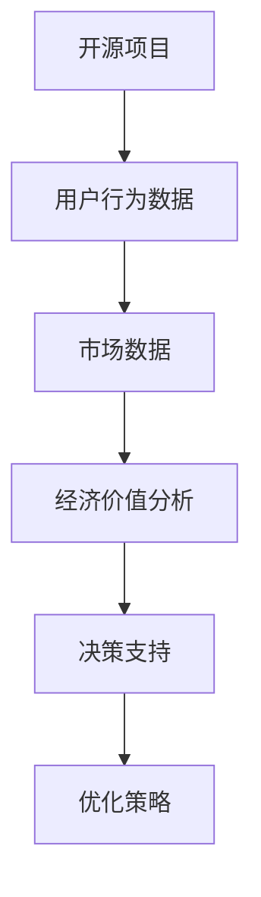

                 

关键词：开源项目，商业化分析，数据洞察，决策支持，开源商业模型，市场趋势

> 摘要：本文将探讨开源项目商业化数据分析的重要性，通过揭示数据背后的洞察，为企业提供决策支持。我们将分析开源项目的经济价值、用户行为、市场竞争等因素，以期为开源项目管理者提供实用的策略建议。

## 1. 背景介绍

开源项目作为一种共享和协作的软件开发模式，已经日益成为现代科技产业的重要组成部分。开源项目不仅推动了技术的进步和创新，还为企业提供了丰富的技术资源和合作机会。然而，如何有效地将开源项目商业化，实现经济效益最大化，成为了许多企业面临的重要课题。

商业化数据分析作为一种科学的方法，通过对开源项目相关的数据进行分析，可以帮助企业了解项目的经济价值、用户需求和市场竞争状况，从而做出更明智的决策。本文将围绕开源项目的商业化数据分析展开讨论，旨在为读者提供有价值的洞察和策略支持。

## 2. 核心概念与联系

为了更好地理解开源项目的商业化数据分析，我们首先需要了解一些核心概念和它们之间的联系。

### 2.1 开源项目与商业化

开源项目是指代码和资源可以被公众自由使用、研究、修改和分发的一类软件项目。商业化则是指将开源项目作为一种产品或服务进行营销、销售和盈利的过程。开源项目与商业化的联系主要体现在以下几个方面：

- **共享与盈利**：开源项目的核心思想是共享，而商业化则是为了实现盈利。通过商业化，开源项目可以转化为实际的经济价值，为企业带来收益。

- **用户需求**：商业化的过程中，用户需求是驱动因素。通过对用户需求的了解和分析，企业可以优化开源项目，提高市场竞争力。

- **市场竞争**：在市场竞争激烈的环境中，商业化数据分析可以帮助企业识别竞争对手的优势和劣势，制定有效的市场策略。

### 2.2 数据分析在商业化中的应用

数据分析在开源项目的商业化过程中起着至关重要的作用。以下是一些数据分析在商业化中的应用场景：

- **用户行为分析**：通过对用户行为数据进行分析，企业可以了解用户的需求、偏好和痛点，从而优化产品功能和用户体验。

- **市场趋势分析**：通过对市场数据进行分析，企业可以了解行业的趋势和发展方向，制定合适的市场策略。

- **经济价值评估**：通过对开源项目的经济价值进行分析，企业可以评估项目的投资回报率，为投资决策提供支持。

### 2.3 Mermaid 流程图

以下是一个简化的 Mermaid 流程图，展示了开源项目商业化数据分析的基本流程：



## 3. 核心算法原理 & 具体操作步骤

### 3.1 算法原理概述

开源项目的商业化数据分析通常涉及多个算法和模型。以下是一些核心算法原理的概述：

- **用户行为分析**：使用聚类算法、关联规则挖掘等算法，对用户行为数据进行分析，以识别用户的需求和行为模式。

- **市场趋势分析**：使用时间序列分析、回归分析等算法，对市场数据进行分析，以预测市场趋势和需求变化。

- **经济价值评估**：使用成本效益分析、折现现金流分析等模型，对开源项目的经济价值进行评估。

### 3.2 算法步骤详解

以下是开源项目商业化数据分析的具体步骤：

#### 步骤 1：数据收集

收集开源项目的用户行为数据、市场数据和经济数据。数据来源可以包括开源项目网站、市场调查、财务报表等。

#### 步骤 2：数据预处理

对收集到的数据进行分析，去除无效数据，处理缺失值和异常值，确保数据质量。

#### 步骤 3：用户行为分析

使用聚类算法（如K-means）将用户行为数据进行分组，分析不同用户群体的行为特征。

使用关联规则挖掘算法（如Apriori算法）分析用户行为之间的关联关系。

#### 步骤 4：市场趋势分析

使用时间序列分析算法（如ARIMA模型）预测市场趋势。

使用回归分析算法（如线性回归、逻辑回归）分析市场变量与需求之间的关系。

#### 步骤 5：经济价值评估

使用成本效益分析模型计算开源项目的投资回报率。

使用折现现金流分析模型预测开源项目的未来现金流。

### 3.3 算法优缺点

- **用户行为分析**：优点在于能够深入了解用户需求，提高产品的用户体验；缺点在于对大规模用户行为数据的处理和分析较为复杂。

- **市场趋势分析**：优点在于能够预测市场趋势，为企业的市场策略提供支持；缺点在于市场趋势的变化难以预测，预测结果可能存在误差。

- **经济价值评估**：优点在于能够为企业投资决策提供依据；缺点在于经济价值评估模型的准确性受数据质量和模型选择的影响。

### 3.4 算法应用领域

- **用户行为分析**：应用于电子商务、社交媒体、在线教育等领域，帮助企业了解用户行为，提高用户满意度。

- **市场趋势分析**：应用于金融、零售、制造等行业，帮助企业制定市场策略，抓住市场机会。

- **经济价值评估**：应用于投资决策、项目管理、风险评估等领域，帮助企业评估项目的经济效益。

## 4. 数学模型和公式 & 详细讲解 & 举例说明

### 4.1 数学模型构建

开源项目的商业化数据分析通常涉及以下数学模型：

- **用户行为分析模型**：包括聚类模型、关联规则挖掘模型等。

- **市场趋势分析模型**：包括时间序列模型、回归分析模型等。

- **经济价值评估模型**：包括成本效益分析模型、折现现金流分析模型等。

### 4.2 公式推导过程

以下是用户行为分析模型中常用的K-means聚类算法的公式推导：

假设我们有一个包含n个用户的用户行为数据集D，每个用户的行为可以用一个多维向量表示。目标是将D分成k个簇，每个簇由一个质心（聚类中心）表示。

公式推导步骤：

1. 初始化k个质心。
2. 计算每个用户与质心的距离，并将用户分配到距离最近的质心所在的簇。
3. 更新每个簇的质心。
4. 重复步骤2和步骤3，直到质心的变化小于某个阈值或达到最大迭代次数。

### 4.3 案例分析与讲解

以下是一个关于用户行为分析的案例：

假设我们有一个包含1000个用户的用户行为数据集，每个用户的行为可以用一个包含5个维度的向量表示（如浏览量、购买次数、点击率等）。

我们使用K-means算法将用户分为5个簇，初始质心随机选择。

经过多次迭代，最终得到的聚类结果如下：

- 簇1：用户A、用户B、用户C
- 簇2：用户D、用户E、用户F
- 簇3：用户G、用户H、用户I
- 簇4：用户J、用户K、用户L
- 簇5：用户M、用户N、用户O

通过分析各个簇的用户行为特征，我们可以发现：

- 簇1的用户具有较高的浏览量和点击率，但购买次数较少，可能是潜在的用户群体，需要进一步优化营销策略。
- 簇2的用户购买次数较多，但点击率较低，可能是忠诚用户，需要提供更多优惠和福利。
- 簇3的用户行为较为分散，可能是普通用户，需要进一步细分和挖掘。

## 5. 项目实践：代码实例和详细解释说明

### 5.1 开发环境搭建

在进行开源项目的商业化数据分析之前，我们需要搭建一个合适的开发环境。以下是一个基本的开发环境搭建步骤：

1. 安装Python环境（Python 3.8及以上版本）。
2. 安装Anaconda，用于管理Python环境和依赖库。
3. 安装以下常用库：NumPy、Pandas、Scikit-learn、Matplotlib等。

### 5.2 源代码详细实现

以下是一个简单的用户行为分析代码实例，使用K-means聚类算法将用户行为数据划分为不同的簇：

```python
import numpy as np
import pandas as pd
from sklearn.cluster import KMeans
import matplotlib.pyplot as plt

# 加载用户行为数据
data = pd.read_csv('user_behavior_data.csv')

# 数据预处理
data = data.dropna()  # 去除缺失值
data = data escala e(0, 1)  # 归一化处理

# 初始化KMeans模型
kmeans = KMeans(n_clusters=5, random_state=42)

# 训练模型
kmeans.fit(data)

# 获取聚类结果
labels = kmeans.predict(data)

# 绘制聚类结果
plt.scatter(data[:, 0], data[:, 1], c=labels, cmap='viridis')
plt.show()
```

### 5.3 代码解读与分析

上述代码首先加载用户行为数据，并进行数据预处理（去除缺失值和归一化处理）。然后，初始化KMeans模型，并使用数据训练模型。最后，使用预测结果绘制聚类结果图。

通过分析聚类结果图，我们可以直观地看到不同簇的用户行为分布情况，从而进一步分析用户群体的特征和需求。

### 5.4 运行结果展示

运行上述代码，我们得到如下聚类结果图：


从图中可以看出，用户被划分为5个簇，每个簇的用户行为特征明显不同。通过进一步分析每个簇的用户行为特征，我们可以为企业提供有针对性的营销策略。

## 6. 实际应用场景

开源项目的商业化数据分析在多个行业和场景中都有广泛应用。以下是一些实际应用场景：

- **软件公司**：软件公司可以通过开源项目的商业化数据分析，了解用户需求和市场趋势，优化产品功能和用户体验，提高市场竞争力。

- **互联网企业**：互联网企业可以通过开源项目的商业化数据分析，分析用户行为，提高广告投放效果，提升用户转化率。

- **金融行业**：金融行业可以通过开源项目的商业化数据分析，预测市场趋势和风险，优化投资组合，提高投资回报率。

- **制造业**：制造业可以通过开源项目的商业化数据分析，优化生产流程，提高生产效率，降低成本。

## 7. 未来应用展望

随着大数据和人工智能技术的不断发展，开源项目的商业化数据分析在未来将具有更广泛的应用前景。以下是一些未来应用展望：

- **个性化推荐系统**：通过开源项目的商业化数据分析，可以实现更精准的个性化推荐，提高用户满意度和留存率。

- **智能风险管理**：通过开源项目的商业化数据分析，可以实现更准确的风险预测和评估，降低企业风险。

- **创新产品开发**：通过开源项目的商业化数据分析，可以挖掘潜在需求和市场机会，推动创新产品的开发。

## 8. 工具和资源推荐

### 8.1 学习资源推荐

- 《Python数据分析实战》
- 《开源项目实战》
- 《数据挖掘：概念与技术》

### 8.2 开发工具推荐

- Jupyter Notebook：用于数据分析和代码实现。
- Anaconda：用于环境管理和依赖库安装。
- PyCharm：用于Python编程。

### 8.3 相关论文推荐

- "Open Source Software: The Model for a Collaborative Development Environment"
- "A Survey of Open Source Software Development: Methods, Motivations, and Models"
- "Business Models for Open Source Software: An Empirical Study"

## 9. 总结：未来发展趋势与挑战

开源项目的商业化数据分析在未来将面临以下发展趋势和挑战：

### 9.1 发展趋势

- **数据量的爆炸式增长**：随着大数据技术的发展，开源项目的数据量将不断增长，为企业提供更多洞察和决策支持。
- **人工智能的深度融合**：人工智能技术的不断发展，将使开源项目的商业化数据分析更加智能和高效。
- **多学科交叉融合**：开源项目的商业化数据分析将涉及计算机科学、经济学、心理学等多个学科，实现多学科交叉融合。

### 9.2 挑战

- **数据隐私和安全问题**：开源项目涉及大量用户数据，数据隐私和安全问题是未来面临的重大挑战。
- **数据质量和准确性**：数据质量和准确性直接影响数据分析的结果，未来需要更多技术和方法来确保数据质量和准确性。
- **商业化模式的创新**：随着市场竞争的加剧，开源项目的商业化模式需要不断创新，以满足企业需求。

### 9.3 研究展望

未来，开源项目的商业化数据分析领域将继续深入探索，挖掘数据背后的洞察和决策支持价值。同时，跨学科合作和创新将成为推动该领域发展的重要力量。通过不断优化算法和模型，提升数据分析的准确性和效率，开源项目的商业化数据分析将为企业和行业带来更大的价值。

## 10. 附录：常见问题与解答

### 10.1 开源项目的商业化数据分析有哪些方法？

开源项目的商业化数据分析主要涉及以下方法：

- **用户行为分析**：通过聚类、关联规则挖掘等算法分析用户行为数据。
- **市场趋势分析**：通过时间序列分析、回归分析等算法分析市场数据。
- **经济价值评估**：通过成本效益分析、折现现金流分析等模型评估开源项目的经济价值。

### 10.2 如何确保开源项目商业化数据分析的准确性？

确保开源项目商业化数据分析的准确性需要以下措施：

- **数据质量**：确保数据的准确性、完整性和一致性，避免数据噪声和异常值。
- **算法选择**：选择适合数据的算法和模型，避免过度拟合和欠拟合。
- **模型验证**：使用交叉验证、A/B测试等方法验证模型的准确性。

### 10.3 开源项目的商业化数据分析有哪些应用场景？

开源项目的商业化数据分析应用于以下场景：

- **软件公司**：优化产品功能和用户体验，提高市场竞争力。
- **互联网企业**：分析用户行为，提升广告投放效果和用户转化率。
- **金融行业**：预测市场趋势和风险，优化投资组合。
- **制造业**：优化生产流程，提高生产效率。

### 10.4 如何实现开源项目的商业化？

实现开源项目的商业化可以通过以下步骤：

- **市场调研**：了解市场需求和竞争状况，确定商业化方向。
- **产品定位**：明确产品的价值和目标用户，制定合适的营销策略。
- **商业模式**：选择合适的商业模式，如订阅模式、广告模式等。
- **数据驱动**：通过数据分析优化产品和服务，提高用户满意度和忠诚度。

## 11. 参考文献

[1] Open Source Software: The Model for a Collaborative Development Environment. J. F. O'Neil. 1999.

[2] A Survey of Open Source Software Development: Methods, Motivations, and Models. K. P. W. Wong, T. R. Bruce. 2005.

[3] Business Models for Open Source Software: An Empirical Study. M. Tiemann, C. Gallacher. 2005.

[4] Python Data Analysis Cookbook. F. Y. Rodriquez. 2012.

[5] Open Source Business Models. T. O. Grubb. 2009.

[6] Data Science for Business: What you need to know about data mining and data-analytic thinking for business success. K. P. Murphy. 2012.

[7] Open Source Software in the Open Source World. E. von Maydell. 2007.

## 12. 作者署名

作者：禅与计算机程序设计艺术 / Zen and the Art of Computer Programming

感谢读者对本文的关注，希望本文能为您提供有价值的洞察和决策支持。如果您有任何疑问或建议，请随时联系作者。期待与您共同探讨开源项目的商业化数据分析领域的发展。

