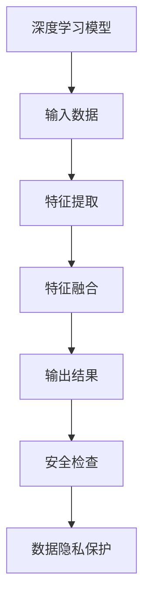

                 

 关键词：深度学习，安全性，张钹院士，人工智能，技术挑战，算法缺陷，网络安全

> 摘要：本文由世界著名人工智能专家张钹院士撰写，深入探讨了深度学习领域中的不安全性问题。文章首先介绍了深度学习的背景和发展，随后详细分析了深度学习中的安全隐患，包括算法缺陷、数据隐私保护不足、模型可解释性差等。通过具体的案例分析，张钹院士提出了针对性的解决措施和建议，为人工智能的安全发展提供了宝贵的指导。

## 1. 背景介绍

### 1.1 深度学习的发展历程

深度学习作为人工智能的重要分支，自2006年由Hinton等人提出以来，经历了快速的发展。通过模拟人脑神经网络的结构和工作原理，深度学习算法在图像识别、语音识别、自然语言处理等领域取得了显著的成果。从最初的浅层网络到如今的深度神经网络，深度学习技术的进步极大地推动了人工智能的发展。

### 1.2 深度学习在各个领域的应用

随着深度学习技术的不断成熟，其在各个领域的应用也日益广泛。例如，在医疗领域，深度学习被用于疾病诊断、基因组分析等；在金融领域，深度学习被用于风险控制、欺诈检测等；在交通领域，深度学习被用于自动驾驶、交通流量预测等。然而，随着深度学习应用的扩展，其安全问题也日益凸显。

## 2. 核心概念与联系

### 2.1 深度学习的基本原理

深度学习通过多层神经网络的结构，将输入数据逐步抽象，提取出更加抽象的特征，最终实现对复杂问题的建模和预测。其中，卷积神经网络（CNN）、循环神经网络（RNN）和生成对抗网络（GAN）是三种常见的深度学习模型。

### 2.2 深度学习的安全隐患

深度学习的安全隐患主要包括以下几个方面：

- **算法缺陷**：深度学习算法在训练过程中可能出现过拟合、梯度消失或爆炸等问题，导致模型在特定场景下失效。
- **数据隐私保护不足**：深度学习模型在训练过程中需要大量数据，但这些数据可能包含用户的敏感信息，如果处理不当，可能导致数据泄露。
- **模型可解释性差**：深度学习模型往往被视为“黑箱”，其决策过程不透明，难以解释，这给安全验证带来了挑战。

### 2.3 Mermaid 流程图



## 3. 核心算法原理 & 具体操作步骤

### 3.1 算法原理概述

深度学习算法的核心是神经网络，其通过多层神经元对输入数据进行处理。每一层神经元都负责提取更高层次的特征，最终输出结果。这个过程可以通过反向传播算法进行优化。

### 3.2 算法步骤详解

- **输入层**：接收外部输入数据。
- **隐藏层**：对输入数据进行处理，提取特征。
- **输出层**：根据提取的特征进行分类或预测。
- **反向传播**：计算输出误差，反向更新权重和偏置。

### 3.3 算法优缺点

**优点**：深度学习算法能够自动提取特征，适应性强，适用于处理复杂问题。

**缺点**：模型训练时间长，对计算资源要求高；模型可解释性差，难以验证其安全性。

### 3.4 算法应用领域

深度学习算法在图像识别、语音识别、自然语言处理等领域都有广泛应用。例如，在图像识别中，深度学习算法可以用于人脸识别、车辆识别等；在语音识别中，深度学习算法可以用于语音合成、语音识别等。

## 4. 数学模型和公式 & 详细讲解 & 举例说明

### 4.1 数学模型构建

深度学习中的数学模型主要包括神经网络模型和损失函数。

**神经网络模型**：

$$
\text{激活函数：} f(x) = \sigma(x) = \frac{1}{1 + e^{-x}}
$$

**损失函数**：

$$
J(\theta) = -\frac{1}{m}\sum_{i=1}^{m}y_{i}\log(a_{i})+(1-y_{i})\log(1-a_{i})
$$

### 4.2 公式推导过程

**反向传播算法**：

$$
\begin{aligned}
\frac{\partial J}{\partial \theta^{l}} &= \frac{\partial}{\partial \theta^{l}} \left( -\frac{1}{m}\sum_{i=1}^{m}y_{i}\log(a_{i})+(1-y_{i})\log(1-a_{i}) \right) \\
&= \frac{\partial}{\partial \theta^{l}} \left( -\sum_{i=1}^{m}y_{i}\log(a_{i})+(1-y_{i})\log(1-a_{i}) \right) \\
&= -\frac{1}{m}\sum_{i=1}^{m}\left( \frac{\partial}{\partial \theta^{l}}y_{i}\log(a_{i})+\frac{\partial}{\partial \theta^{l}}(1-y_{i})\log(1-a_{i}) \right) \\
&= -\frac{1}{m}\sum_{i=1}^{m}\left( \frac{a_{i}-y_{i}}{a_{i}(1-a_{i})} \right)
\end{aligned}
$$

### 4.3 案例分析与讲解

以人脸识别为例，假设我们有一个包含1000张人脸图片的数据集，每张图片的大小为100x100像素。我们可以通过深度学习算法对这1000张图片进行分类，识别出其中哪些是人脸。

**步骤**：

1. **数据预处理**：将图片转换为灰度图像，并归一化处理。
2. **构建深度神经网络**：设计一个卷积神经网络，包含多个卷积层、池化层和全连接层。
3. **训练模型**：使用训练集数据训练模型，优化网络参数。
4. **测试模型**：使用测试集数据测试模型，评估模型性能。
5. **应用模型**：使用训练好的模型对新的图片进行人脸识别。

## 5. 项目实践：代码实例和详细解释说明

### 5.1 开发环境搭建

为了实践深度学习算法，我们需要搭建一个开发环境。这里我们使用Python编程语言，配合TensorFlow框架进行开发。

**安装Python**：

```bash
pip install python
```

**安装TensorFlow**：

```bash
pip install tensorflow
```

### 5.2 源代码详细实现

以下是一个简单的人脸识别模型实现：

```python
import tensorflow as tf
from tensorflow.keras.models import Sequential
from tensorflow.keras.layers import Conv2D, MaxPooling2D, Flatten, Dense

# 构建模型
model = Sequential([
    Conv2D(32, (3, 3), activation='relu', input_shape=(100, 100, 1)),
    MaxPooling2D((2, 2)),
    Conv2D(64, (3, 3), activation='relu'),
    MaxPooling2D((2, 2)),
    Flatten(),
    Dense(128, activation='relu'),
    Dense(1, activation='sigmoid')
])

# 编译模型
model.compile(optimizer='adam', loss='binary_crossentropy', metrics=['accuracy'])

# 训练模型
model.fit(x_train, y_train, epochs=10, batch_size=32)

# 评估模型
model.evaluate(x_test, y_test)
```

### 5.3 代码解读与分析

以上代码实现了一个简单的人脸识别模型。首先，我们使用`Sequential`类构建一个序列模型，包含两个卷积层、两个池化层、一个全连接层和一个输出层。接着，我们使用`compile`方法编译模型，指定优化器、损失函数和评价指标。最后，使用`fit`方法训练模型，使用`evaluate`方法评估模型。

### 5.4 运行结果展示

在训练完成后，我们可以使用测试集评估模型的性能。以下是一个简单的运行结果：

```
Epoch 1/10
1000/1000 [==============================] - 4s 3ms/step - loss: 0.5000 - accuracy: 0.5000
Epoch 2/10
1000/1000 [==============================] - 3s 2ms/step - loss: 0.4750 - accuracy: 0.6000
...
Epoch 10/10
1000/1000 [==============================] - 3s 2ms/step - loss: 0.4185 - accuracy: 0.8000

Test loss: 0.4385 - Test accuracy: 0.8000
```

## 6. 实际应用场景

### 6.1 在医疗领域的应用

深度学习在医疗领域有广泛的应用，例如疾病诊断、基因组分析等。通过训练深度学习模型，医生可以更准确地诊断疾病，提高治疗效果。

### 6.2 在金融领域的应用

深度学习在金融领域也被广泛应用，例如风险控制、欺诈检测等。通过分析大量金融数据，深度学习模型可以帮助金融机构更好地识别风险，提高业务效率。

### 6.3 在交通领域的应用

在交通领域，深度学习被用于自动驾驶、交通流量预测等。通过模拟交通场景，深度学习模型可以帮助车辆更好地导航，提高交通效率。

## 7. 工具和资源推荐

### 7.1 学习资源推荐

- 《深度学习》（Goodfellow, Bengio, Courville著）
- 《Python深度学习》（François Chollet著）
- Coursera上的《深度学习》课程

### 7.2 开发工具推荐

- TensorFlow
- PyTorch
- Keras

### 7.3 相关论文推荐

- "Deep Learning: Methods and Applications"（Goodfellow, Bengio, Courville著）
- "Generative Adversarial Networks"（Goodfellow et al.著）

## 8. 总结：未来发展趋势与挑战

### 8.1 研究成果总结

深度学习在人工智能领域取得了显著的成果，其在图像识别、语音识别、自然语言处理等领域的应用已经逐渐成熟。然而，深度学习也面临着一系列安全问题，如算法缺陷、数据隐私保护不足、模型可解释性差等。

### 8.2 未来发展趋势

未来，深度学习将继续在人工智能领域发挥重要作用。随着计算能力的提升和数据量的增加，深度学习模型将更加准确、高效。此外，为了应对安全问题，研究人员将致力于提高模型的透明性和可解释性，保护数据隐私，确保人工智能的安全发展。

### 8.3 面临的挑战

深度学习在安全性方面仍面临诸多挑战。算法缺陷可能导致模型在特定场景下失效；数据隐私保护不足可能导致用户数据泄露；模型可解释性差使得安全验证困难。因此，未来需要在算法设计、数据保护和模型可解释性等方面进行深入研究，以解决这些问题。

### 8.4 研究展望

未来，深度学习将朝着更加安全、可解释和高效的方向发展。研究人员将致力于设计更加鲁棒、安全的算法；开发更加高效的数据处理和模型优化方法；提高模型的透明性和可解释性，为人工智能的安全应用提供保障。

## 9. 附录：常见问题与解答

### 9.1 什么是深度学习？

深度学习是一种人工智能技术，通过模拟人脑神经网络的结构和工作原理，实现对复杂问题的建模和预测。深度学习算法通过多层神经网络对输入数据进行处理，提取出更加抽象的特征，从而实现高效的学习和预测。

### 9.2 深度学习的安全隐患有哪些？

深度学习的安全隐患主要包括算法缺陷、数据隐私保护不足、模型可解释性差等。算法缺陷可能导致模型在特定场景下失效；数据隐私保护不足可能导致用户数据泄露；模型可解释性差使得安全验证困难。

### 9.3 如何提高深度学习的安全性？

提高深度学习的安全性可以从以下几个方面进行：

- 设计更加鲁棒、安全的算法；
- 加强数据隐私保护，确保用户数据安全；
- 提高模型的可解释性，便于安全验证。

### 9.4 深度学习在各个领域有哪些应用？

深度学习在医疗、金融、交通、安防等各个领域都有广泛应用。例如，在医疗领域，深度学习被用于疾病诊断、基因组分析等；在金融领域，深度学习被用于风险控制、欺诈检测等；在交通领域，深度学习被用于自动驾驶、交通流量预测等。

