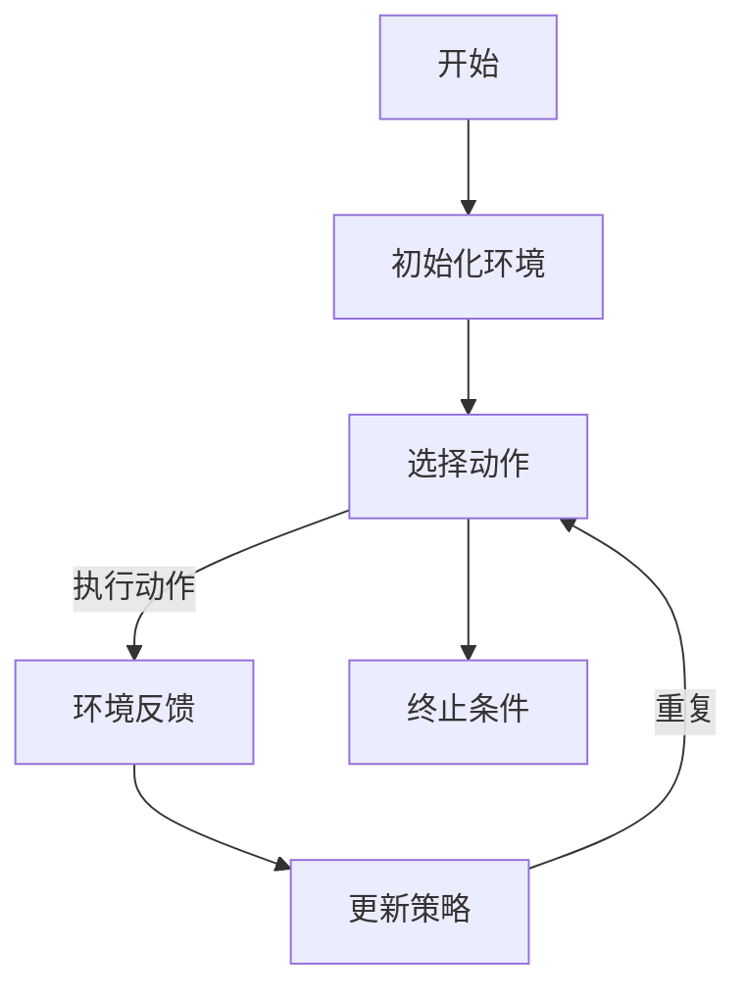

                 

强化学习（Reinforcement Learning，简称RL）是机器学习领域的一个重要分支，与监督学习和无监督学习相比，强化学习强调通过与环境交互来学习决策策略。本文将详细介绍强化学习的原理，并利用Python代码实例展示其应用。

## 关键词
- 强化学习
- 机器学习
- 决策策略
- 环境交互
- Q-learning
- Deep Q Network (DQN)

## 摘要
本文将首先介绍强化学习的核心概念和主要算法，然后通过一个简单的Python代码实例，讲解强化学习在实际项目中的应用。最后，我们将讨论强化学习的未来发展趋势和应用前景。

## 1. 背景介绍

### 1.1 强化学习的起源与发展

强化学习的概念最早由Richard Sutton和Andrew Barto在1988年提出的。强化学习的基础是行为主义理论，即通过正向或负向反馈来调整行为，使其趋向于达到某种目标。随着人工智能的快速发展，强化学习逐渐成为解决复杂决策问题的有力工具。

### 1.2 强化学习与监督学习、无监督学习的关系

强化学习与监督学习、无监督学习相比，有以下区别：

- **监督学习**：通过已知的目标数据和特征数据训练模型，用于预测新数据的标签。
- **无监督学习**：没有已知的目标数据，通过观察数据的内在结构，如聚类或降维。
- **强化学习**：通过与环境交互，根据环境的反馈调整策略，以最大化长期奖励。

## 2. 核心概念与联系

### 2.1 强化学习的基本要素

强化学习系统主要包括以下要素：

- **代理（Agent）**：执行动作的实体，如机器人、智能体等。
- **环境（Environment）**：代理行动发生的场所，包括状态、动作空间、奖励等。
- **状态（State）**：代理在环境中所处的情形。
- **动作（Action）**：代理可执行的行为。
- **奖励（Reward）**：对代理行为的即时反馈，用来评估动作的好坏。

### 2.2 基本模型原理

强化学习的主要目标是学习一个最优策略，使得代理能够最大化累积奖励。这通常通过以下模型来实现：

- **策略（Policy）**：从状态到动作的映射，即给定状态，选择最佳动作。
- **价值函数（Value Function）**：评估状态或状态-动作对的好坏，分为状态值函数和动作值函数。
- **模型（Model）**：对环境的动态进行建模，预测下一状态和奖励。

下面是强化学习的基本流程的Mermaid流程图：



## 3. 核心算法原理 & 具体操作步骤

### 3.1 算法原理概述

强化学习算法可以分为基于价值的算法和基于策略的算法。其中，Q-learning是典型的基于价值的算法，而Deep Q Network (DQN) 是其在深度学习框架下的扩展。

### 3.2 算法步骤详解

#### 3.2.1 Q-learning算法

Q-learning是一种值迭代算法，其核心思想是通过试错学习最优策略。具体步骤如下：

1. 初始化Q值表。
2. 在环境中随机选择一个状态。
3. 在当前状态下，选择动作。
4. 执行动作，获得下一状态和奖励。
5. 更新Q值表：\( Q(s, a) \leftarrow Q(s, a) + \alpha [r + \gamma \max_{a'} Q(s', a') - Q(s, a)] \)
6. 重复步骤2-5，直到满足终止条件。

#### 3.2.2 DQN算法

DQN算法是Q-learning在深度学习框架下的实现，主要解决了Q-learning中的样本偏差和样本相关性问题。具体步骤如下：

1. 初始化深度神经网络和经验回放缓冲。
2. 在环境中随机选择一个状态。
3. 选择动作，执行动作，获得下一状态和奖励。
4. 将当前状态和动作存入经验回放缓冲。
5. 当达到批量大小时，从缓冲中随机采样一组状态-动作对。
6. 使用目标Q网络计算目标Q值。
7. 更新当前Q网络：\( y = r + \gamma \max_{a'} \hat{Q}(s', a') \)
8. 利用梯度下降法更新Q网络权重。
9. 重复步骤2-8，直到满足终止条件。

### 3.3 算法优缺点

#### 3.3.1 Q-learning算法

**优点**：

- 算法简单，易于实现。
- 可以解决非静态环境问题。

**缺点**：

- 学习速度较慢，需要大量样本。
- 需要大量存储空间。

#### 3.3.2 DQN算法

**优点**：

- 可以处理高维状态空间问题。
- 解决了Q-learning中的样本偏差问题。

**缺点**：

- 需要大量计算资源。
- 目标Q网络与当前Q网络之间的更新延迟可能影响性能。

### 3.4 算法应用领域

强化学习在以下领域有着广泛的应用：

- **游戏**：如Atari游戏、棋类游戏等。
- **机器人**：路径规划、智能控制等。
- **推荐系统**：如协同过滤、广告投放等。
- **金融**：如股票交易、风险管理等。

## 4. 数学模型和公式 & 详细讲解 & 举例说明

### 4.1 数学模型构建

强化学习的基本模型可以表示为马尔可夫决策过程（MDP），其数学模型如下：

- **状态空间 \( S \)**：环境可能的状态集合。
- **动作空间 \( A \)**：代理可执行的动作集合。
- **状态-动作值函数 \( Q(s, a) \)**：在状态 \( s \) 下执行动作 \( a \) 的预期累积奖励。
- **策略 \( \pi(a|s) \)**：在状态 \( s \) 下选择动作 \( a \) 的概率分布。
- **奖励函数 \( R(s, a) \)**：在状态 \( s \) 下执行动作 \( a \) 所获得的即时奖励。
- **状态转移概率 \( P(s', s | s, a) \)**：在状态 \( s \) 下执行动作 \( a \) 后转移到状态 \( s' \) 的概率。

### 4.2 公式推导过程

强化学习的目标是最小化策略损失函数 \( J(\pi) \)，即：

\[ J(\pi) = \sum_{s \in S} \pi(s) \sum_{a \in A} \pi(a|s) [R(s, a) - Q^{\pi}(s, a)] \]

其中，\( Q^{\pi}(s, a) \) 表示在策略 \( \pi \) 下，状态 \( s \) 下执行动作 \( a \) 的累积奖励。

### 4.3 案例分析与讲解

假设有一个简单的环境，状态空间 \( S = \{0, 1\} \)，动作空间 \( A = \{0, 1\} \)。奖励函数 \( R(s, a) = 1 \) 如果 \( s = a \)，否则 \( R(s, a) = -1 \)。状态转移概率为 \( P(s', s | s, a) = 0.5 \)。

我们使用Q-learning算法来学习最优策略。

1. 初始化Q值表 \( Q(s, a) = 0 \)。
2. 在状态 \( s = 0 \) 下，随机选择动作 \( a = 1 \)。
3. 执行动作 \( a = 1 \)，获得奖励 \( R(s, a) = -1 \)，状态变为 \( s' = 1 \)。
4. 更新Q值表：\( Q(0, 1) \leftarrow Q(0, 1) + \alpha [R(0, 1) + \gamma \max_{a'} Q(1, a') - Q(0, 1)] \)。

假设 \( \alpha = 0.1 \)，\( \gamma = 0.9 \)，计算得到 \( Q(0, 1) = 0.1 [-1 + 0.9 \max_{a'} Q(1, a')] \)。

由于当前状态为 \( s' = 1 \)，我们选择 \( a' = 0 \)，因此 \( Q(0, 1) = 0.1 [-1 + 0.9 Q(1, 0)] \)。

重复以上过程，最终可以得到最优策略。具体过程如下：

- 初始Q值表：\( Q(s, a) = 0 \)
- 更新过程：
  - \( Q(0, 0) \leftarrow Q(0, 0) + \alpha [R(0, 0) + \gamma \max_{a'} Q(1, a')] \)
  - \( Q(0, 1) \leftarrow Q(0, 1) + \alpha [R(0, 1) + \gamma \max_{a'} Q(1, a')] \)
  - \( Q(1, 0) \leftarrow Q(1, 0) + \alpha [R(1, 0) + \gamma \max_{a'} Q(0, a')] \)
  - \( Q(1, 1) \leftarrow Q(1, 1) + \alpha [R(1, 1) + \gamma \max_{a'} Q(0, a')] \)

经过多次迭代，最终得到最优策略为 \( \pi(s) = 1 \)。

## 5. 项目实践：代码实例和详细解释说明

### 5.1 开发环境搭建

为了运行下面的代码实例，我们需要安装以下依赖：

```bash
pip install numpy matplotlib gym
```

### 5.2 源代码详细实现

下面是一个使用Q-learning算法在OpenAI Gym环境中学习走迷宫的Python代码实例：

```python
import numpy as np
import matplotlib.pyplot as plt
import gym

# 创建环境
env = gym.make("ClassicControl-v1")

# 初始化Q值表
n_states = env.observation_space.n
n_actions = env.action_space.n
q_table = np.zeros((n_states, n_actions))

# 设置参数
alpha = 0.1
gamma = 0.9
epsilon = 0.1

# Q-learning算法
for episode in range(1000):
    state = env.reset()
    done = False
    total_reward = 0
    
    while not done:
        # 探索-利用策略
        if np.random.uniform(0, 1) < epsilon:
            action = env.action_space.sample()
        else:
            action = np.argmax(q_table[state])
        
        # 执行动作
        next_state, reward, done, _ = env.step(action)
        total_reward += reward
        
        # 更新Q值
        q_table[state, action] = q_table[state, action] + alpha * (reward + gamma * np.max(q_table[next_state]) - q_table[state, action])
        
        state = next_state
    
    print(f"Episode {episode+1}: Total Reward = {total_reward}")
    
    # 减少探索概率
    if episode > 100 and total_reward > 195:
        epsilon *= 0.99

# 渲染迷宫
def render_maze(q_table):
    n_rows, n_cols = q_table.shape
    maze = np.zeros((n_rows, n_cols))
    
    for i in range(n_rows):
        for j in range(n_cols):
            action = np.argmax(q_table[i, :])
            if action == 0:
                maze[i, j] = 1
            elif action == 1:
                maze[i, j] = 2
            elif action == 2:
                maze[i, j] = 3
            elif action == 3:
                maze[i, j] = 4
    
    plt.imshow(maze, cmap="gray")
    plt.show()

render_maze(q_table)

# 关闭环境
env.close()
```

### 5.3 代码解读与分析

1. **环境创建**：我们使用OpenAI Gym创建了一个经典的控制环境。
2. **Q值表初始化**：初始化一个全零的Q值表，用于存储状态-动作值。
3. **参数设置**：设置学习率 \( \alpha \)，折扣因子 \( \gamma \)，和探索概率 \( \epsilon \)。
4. **Q-learning算法**：在每个episode中，使用探索-利用策略选择动作，执行动作，并更新Q值。
5. **渲染迷宫**：使用matplotlib绘制Q值表对应的迷宫。

通过以上代码，我们可以训练出一个能够自主走迷宫的智能体。

## 6. 实际应用场景

强化学习在多个领域有着广泛的应用，以下是几个典型的应用场景：

- **游戏**：如Atari游戏、棋类游戏等。
- **机器人**：路径规划、智能控制等。
- **推荐系统**：如协同过滤、广告投放等。
- **金融**：如股票交易、风险管理等。

## 7. 工具和资源推荐

### 7.1 学习资源推荐

- 《强化学习：原理与数学》（作者：理查德·S·萨顿，安德鲁·巴特沃斯）
- 《深度强化学习》（作者：Ilya Shpitser）

### 7.2 开发工具推荐

- OpenAI Gym：用于创建和测试强化学习环境。
- TensorFlow：用于实现深度强化学习算法。

### 7.3 相关论文推荐

- “Q-Learning”（作者：Richard S. Sutton，Andrew G. Barto）
- “Deep Q-Learning”（作者：Vitaly Mnih et al.）

## 8. 总结：未来发展趋势与挑战

### 8.1 研究成果总结

近年来，强化学习在理论研究和实际应用方面都取得了显著进展。深度强化学习的崛起，使得强化学习在处理高维状态空间和动作空间方面取得了巨大成功。

### 8.2 未来发展趋势

- **算法优化**：进一步优化强化学习算法，提高收敛速度和稳定性。
- **多智能体强化学习**：研究多智能体强化学习，解决多智能体协作问题。
- **理论突破**：深入探讨强化学习的数学基础，提高理论可解释性。

### 8.3 面临的挑战

- **计算资源**：强化学习算法通常需要大量的计算资源，如何优化算法以降低计算成本是一个重要挑战。
- **样本效率**：如何提高样本利用率，减少样本数量，是强化学习面临的一个重要问题。

### 8.4 研究展望

未来，随着计算能力和算法研究的进步，强化学习将在更多领域得到应用，如自动驾驶、医疗、智能制造等。同时，强化学习与其他领域技术的融合，如联邦学习、区块链等，也将带来新的研究机遇。

## 9. 附录：常见问题与解答

### 9.1 强化学习与深度学习的区别是什么？

强化学习关注于决策过程，通过与环境交互学习最优策略。深度学习则关注于特征表示和学习，通过多层神经网络提取特征，用于分类、回归等任务。

### 9.2 强化学习算法如何避免过度探索和过度利用？

通过探索-利用策略平衡探索和利用。常见的策略包括epsilon-greedy策略和UCB算法等。

### 9.3 强化学习中的价值函数和策略函数有什么区别？

价值函数评估状态或状态-动作对的好坏，而策略函数则决定了在给定状态下应该执行哪个动作。

### 9.4 强化学习中的奖励设置原则是什么？

奖励设置应鼓励代理向目标状态转换，同时避免奖励偏差和奖励欺骗。

作者：禅与计算机程序设计艺术 / Zen and the Art of Computer Programming
------------------------------------------------------------------

