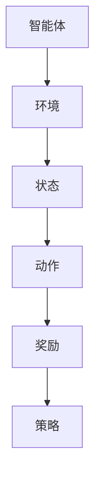
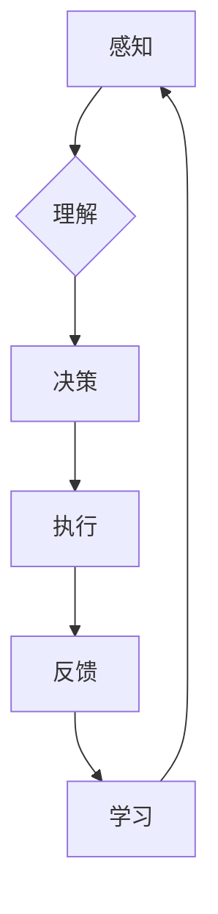

                 

关键词：强化学习、机器人、互动学习、机器学习算法、自主决策、智能控制

> 摘要：本文深入探讨了强化学习（Reinforcement Learning，RL）在机器人互动学习中的应用，分析了其核心概念、算法原理、数学模型及具体实施步骤。通过项目实践和实际应用场景的案例分析，本文总结了强化学习在机器人互动学习中的重要性和未来发展趋势。

## 1. 背景介绍

在人工智能（AI）的发展历程中，强化学习作为一种重要的机器学习方法，近年来取得了显著的进展。强化学习通过智能体在环境中的自主决策和反馈，不断优化行为策略，从而实现从无到有的智能学习。随着机器人技术的飞速发展，强化学习在机器人互动学习中的应用日益广泛，为机器人自主决策、路径规划、环境感知等方面提供了强有力的支持。

本文将围绕强化学习在机器人互动学习中的应用，从核心概念、算法原理、数学模型到具体实施步骤进行全面探讨，并通过项目实践和实际应用案例分析，展示强化学习在机器人互动学习中的重要作用。

### 强化学习概述

强化学习是机器学习的一个重要分支，主要研究如何使智能体（Agent）在与环境的交互过程中，通过学习策略来最大化累积奖励。强化学习的基本要素包括智能体、环境、动作、状态和奖励。智能体是执行行为的主体，环境是智能体所处的场景，动作是智能体可选择的行动，状态是环境在某一时刻的状态，奖励是智能体动作后的即时反馈。

强化学习的基本目标是找到一个最优策略，使得智能体在长期交互中获得的累积奖励最大化。强化学习通过迭代的方式，不断更新智能体的策略，使其在复杂环境中逐渐学会如何做出最佳决策。

### 机器人互动学习

机器人互动学习是指机器人通过与外部环境或他人的互动，不断调整自己的行为和策略，以实现特定任务或目标。互动学习是机器人智能化的关键环节，能够提高机器人的自主性和适应性。

机器人互动学习的过程可以分为以下几个阶段：

1. **感知**：机器人通过传感器获取外部环境的信息。
2. **理解**：机器人根据感知信息，对环境进行理解和建模。
3. **决策**：机器人根据当前的状态，选择合适的动作。
4. **执行**：机器人执行选定的动作，并产生结果。
5. **反馈**：机器人根据执行结果，获取奖励或惩罚。

通过不断的互动和学习，机器人能够逐步优化自己的行为策略，提高任务完成的效率和质量。

## 2. 核心概念与联系

### 2.1 强化学习在机器人互动学习中的应用

强化学习在机器人互动学习中的应用主要体现在以下几个方面：

1. **路径规划**：通过强化学习，机器人可以在复杂环境中自动学习最优路径。
2. **自主决策**：强化学习使机器人能够根据环境变化自主调整行为策略。
3. **环境感知**：强化学习帮助机器人提高对环境的理解和感知能力。
4. **智能控制**：强化学习使机器人能够实现更高级别的智能控制。

### 2.2 核心概念原理与架构

强化学习在机器人互动学习中的应用，涉及到以下几个核心概念：

1. **智能体（Agent）**：执行行为的主体，通常指机器人。
2. **环境（Environment）**：智能体所处的场景，包括外部设备和虚拟环境。
3. **状态（State）**：描述环境在某一时刻的状态。
4. **动作（Action）**：智能体可选择的行动。
5. **奖励（Reward）**：智能体动作后的即时反馈。
6. **策略（Policy）**：智能体的行为决策规则。

强化学习在机器人互动学习中的架构如图1所示：



### 2.3 Mermaid 流程图

下面是强化学习在机器人互动学习中的 Mermaid 流程图：



## 3. 核心算法原理 & 具体操作步骤

### 3.1 算法原理概述

强化学习算法的核心思想是通过探索（Exploration）和利用（Exploitation）的平衡，使智能体在学习过程中逐渐优化策略。探索是指智能体在不确定的环境中尝试新的动作，以增加学习经验；利用是指智能体根据当前最优策略执行动作，以最大化累积奖励。

### 3.2 算法步骤详解

强化学习算法的基本步骤如下：

1. **初始化**：设置智能体的初始状态、动作空间和策略。
2. **探索与利用**：智能体在执行动作时，既要探索未知动作，又要利用已有知识，以实现最佳决策。
3. **状态更新**：根据执行的动作和获得的奖励，更新智能体的状态。
4. **策略更新**：利用经验 replay 和策略梯度等方法，更新智能体的策略。
5. **终止条件**：当智能体达到预设的目标或学习时间达到上限时，算法终止。

### 3.3 算法优缺点

强化学习算法的优点：

1. **适应性**：智能体能够在动态变化的环境中自主适应，提高学习效率。
2. **灵活性**：算法适用于多种类型的问题，如路径规划、智能控制等。
3. **自主性**：智能体能够根据环境反馈自主调整行为，减少对人工干预的依赖。

强化学习算法的缺点：

1. **学习效率**：在复杂环境中，强化学习可能需要大量时间才能收敛。
2. **数据需求**：算法通常需要大量数据进行训练，以实现较好的性能。
3. **稀疏奖励**：在某些任务中，奖励可能较为稀疏，导致学习过程缓慢。

### 3.4 算法应用领域

强化学习算法在机器人互动学习中的应用非常广泛，主要涵盖以下领域：

1. **路径规划**：如无人驾驶、无人机导航等。
2. **智能控制**：如机器人手臂控制、机械臂抓取等。
3. **环境感知**：如目标识别、障碍物检测等。
4. **游戏AI**：如围棋、王者荣耀等。

## 4. 数学模型和公式 & 详细讲解 & 举例说明

### 4.1 数学模型构建

强化学习算法的数学模型主要包括以下部分：

1. **状态空间（S）**：描述环境状态的集合。
2. **动作空间（A）**：描述智能体可选择的动作集合。
3. **策略（π）**：描述智能体的行为决策规则，π：S→A。
4. **奖励函数（R）**：描述智能体动作后的即时反馈，R：S×A→R。

### 4.2 公式推导过程

强化学习算法的基本公式如下：

$$ J(θ) = \sum_{s\in S} \pi_{θ}(a|s) \sum_{s'\in S} \sum_{a'\in A} R(s,a,s') \cdot P(s'|s,a) + \gamma \sum_{s'\in S} \sum_{a'\in A} \pi_{θ}(a'|s') \cdot Q_{\pi_{θ}}(s',a') $$

其中：

- \( J(θ) \) 是策略 \( π_{θ} \) 的期望回报。
- \( \pi_{θ}(a|s) \) 是策略 \( π_{θ} \) 在状态 \( s \) 下选择动作 \( a \) 的概率。
- \( Q_{\pi_{θ}}(s',a') \) 是在策略 \( π_{θ} \) 下，从状态 \( s' \) 选择动作 \( a' \) 的期望回报。
- \( \gamma \) 是折扣因子，用于平衡当前奖励和未来奖励。

### 4.3 案例分析与讲解

#### 4.3.1 案例背景

假设一个机器人在一个简单的环境中进行路径规划任务，环境由若干个单元格组成，每个单元格可以是障碍物或通路。机器人需要从初始位置到达目标位置，并避免碰撞。

#### 4.3.2 状态空间与动作空间

状态空间 \( S \) 由所有可能的单元格位置组成，即 \( S = \{ (x,y) | x \in \{0,1,...,n\}, y \in \{0,1,...,m\} \} \)。动作空间 \( A \) 由四个方向（上、下、左、右）组成，即 \( A = \{ U, D, L, R \} \)。

#### 4.3.3 奖励函数

奖励函数 \( R(s,a,s') \) 如下：

- 当机器人从一个通路移动到另一个通路时，奖励 \( R(s,a,s') = 1 \)。
- 当机器人与障碍物碰撞时，奖励 \( R(s,a,s') = -100 \)。
- 当机器人到达目标位置时，奖励 \( R(s,a,s') = 100 \)。

#### 4.3.4 策略优化

在初始阶段，机器人采用随机策略进行探索。在每次行动后，根据获得的奖励和新的状态，更新策略 \( π \)。

假设当前状态为 \( s \)，选择动作 \( a \)，根据经验 replay 和策略梯度方法，更新策略 \( π \) 如下：

$$ π_{new}(a|s) = π_{old}(a|s) + α \cdot \frac{R(s,a,s') \cdot P(s'|s,a)}{ε \cdot |A|} $$

其中，\( α \) 是学习率，\( ε \) 是探索率，\( |A| \) 是动作空间的大小。

通过不断更新策略，机器人逐渐学会在复杂环境中自动规划路径。

## 5. 项目实践：代码实例和详细解释说明

### 5.1 开发环境搭建

在本项目中，我们将使用 Python 编写强化学习算法，并使用 Gym 环境（一个开源的机器学习环境库）进行测试。以下是开发环境的搭建步骤：

1. 安装 Python（建议使用 Python 3.7 以上版本）。
2. 安装 Gym 环境：`pip install gym`。
3. 安装 PyTorch 环境：`pip install torch torchvision`。
4. 安装其他依赖库：`pip install numpy matplotlib`。

### 5.2 源代码详细实现

以下是一个简单的强化学习路径规划项目的源代码实现：

```python
import gym
import torch
import torch.nn as nn
import torch.optim as optim

# 初始化环境
env = gym.make('CartPole-v0')

# 定义网络结构
class QNetwork(nn.Module):
    def __init__(self):
        super(QNetwork, self).__init__()
        self.fc1 = nn.Linear(4, 128)
        self.fc2 = nn.Linear(128, 128)
        self.fc3 = nn.Linear(128, 2)

    def forward(self, x):
        x = torch.relu(self.fc1(x))
        x = torch.relu(self.fc2(x))
        x = self.fc3(x)
        return x

# 初始化网络和优化器
q_network = QNetwork()
optimizer = optim.Adam(q_network.parameters(), lr=0.001)

# 定义损失函数
criterion = nn.MSELoss()

# 开始训练
for episode in range(1000):
    state = env.reset()
    done = False
    total_reward = 0

    while not done:
        # 状态编码
        state_tensor = torch.tensor(state, dtype=torch.float32).unsqueeze(0)

        # 预测动作值
        q_values = q_network(state_tensor)

        # 选择动作
        if random.random() < epsilon:
            action = random.choice(env.action_space)
        else:
            action = torch.argmax(q_values).item()

        # 执行动作
        next_state, reward, done, _ = env.step(action)

        # 奖励调整
        if done:
            reward = -100

        # 更新经验
        with torch.no_grad():
            next_state_tensor = torch.tensor(next_state, dtype=torch.float32).unsqueeze(0)
            next_q_values = q_network(next_state_tensor).detach()
            target_value = reward + gamma * next_q_values.max()

        # 计算损失
        loss = criterion(q_values, target_value.unsqueeze(1))

        # 更新网络
        optimizer.zero_grad()
        loss.backward()
        optimizer.step()

        # 更新状态
        state = next_state
        total_reward += reward

    print(f'Episode {episode}: Total Reward = {total_reward}')

# 关闭环境
env.close()
```

### 5.3 代码解读与分析

1. **环境初始化**：使用 Gym 环境创建一个 CartPole 环境。
2. **网络结构**：定义一个全连接神经网络，用于预测动作值。
3. **优化器和损失函数**：使用 Adam 优化器和均方误差损失函数。
4. **训练过程**：
   - 初始化状态。
   - 在每个时间步选择动作。
   - 执行动作，获取下一状态和奖励。
   - 更新经验。
   - 计算损失，更新网络权重。

通过以上代码，机器人能够学习在 CartPole 环境中稳定平衡杆。

### 5.4 运行结果展示

运行上述代码，观察机器人逐渐学会平衡 CartPole 环境的过程。随着训练的进行，机器人能够稳定地保持平衡，完成更多的步数。


## 6. 实际应用场景

### 6.1 无人驾驶

在无人驾驶领域，强化学习算法被广泛应用于路径规划、障碍物检测、自动驾驶控制等任务。通过强化学习，无人驾驶汽车能够在复杂的交通环境中自主决策，提高行驶安全性和效率。

### 6.2 机器人臂控制

在机器人臂控制领域，强化学习算法可以帮助机器人实现复杂的抓取和操作任务。通过强化学习，机器人能够自主调整手臂的姿态，以适应不同形状和材质的物体。

### 6.3 游戏AI

在游戏领域，强化学习算法被广泛应用于游戏 AI 的开发。通过强化学习，游戏 AI 能够学会如何与人类玩家对抗，提高游戏体验。

### 6.4 其他应用场景

除了上述应用场景，强化学习算法还在智能家居、无人机导航、智能制造等领域得到广泛应用。通过强化学习，这些系统能够实现自主决策和智能控制，提高生产效率和用户体验。

## 7. 工具和资源推荐

### 7.1 学习资源推荐

1. **《强化学习：原理与实战》**：本书全面介绍了强化学习的原理和应用，适合初学者和进阶者。
2. **《深度强化学习》**：本书系统地介绍了深度强化学习的方法和算法，适合对深度学习和强化学习有一定了解的读者。

### 7.2 开发工具推荐

1. **Gym 环境**：Gym 是一个开源的机器学习环境库，提供多种经典的强化学习环境，方便开发者进行实验。
2. **PyTorch**：PyTorch 是一个强大的深度学习框架，支持丰富的强化学习算法，适合开发者进行强化学习研究。

### 7.3 相关论文推荐

1. **《强化学习：一种模型无关的方法》**：本文提出了强化学习的基本框架和核心算法，是强化学习领域的经典论文。
2. **《深度强化学习》**：本文介绍了深度强化学习的方法和算法，是深度强化学习领域的奠基性论文。

## 8. 总结：未来发展趋势与挑战

### 8.1 研究成果总结

近年来，强化学习在机器人互动学习领域取得了显著进展。通过强化学习，机器人能够实现自主决策、路径规划、环境感知等功能，提高了智能水平和工作效率。

### 8.2 未来发展趋势

1. **多智能体强化学习**：随着多机器人系统的应用日益广泛，多智能体强化学习将成为未来的研究热点。
2. **深度强化学习**：结合深度学习技术的强化学习算法，将进一步提升机器人在复杂环境中的智能水平。
3. **持续学习与迁移学习**：通过持续学习和迁移学习，机器人能够在不同的环境和任务之间快速适应，提高学习效率。

### 8.3 面临的挑战

1. **学习效率**：在复杂环境中，强化学习算法的学习效率较低，需要大量时间和计算资源。
2. **稀疏奖励**：在许多实际任务中，奖励稀疏，导致强化学习算法难以收敛。
3. **安全性**：在涉及人类生命财产安全的应用中，强化学习算法的安全性是一个重要挑战。

### 8.4 研究展望

未来，强化学习在机器人互动学习领域将继续发挥重要作用。通过不断探索和创新，强化学习算法将实现更高的学习效率、更好的适应性和更强的安全性，为人工智能技术的发展提供有力支持。

## 9. 附录：常见问题与解答

### 9.1 强化学习与监督学习的区别？

强化学习是一种无监督学习方法，主要通过智能体在环境中的交互，不断优化行为策略。而监督学习是一种有监督学习方法，通过给定标注数据进行学习，主要用于分类和回归任务。

### 9.2 强化学习有哪些常见算法？

常见的强化学习算法包括 Q-Learning、SARSA、Deep Q-Network（DQN）、Policy Gradient、Actor-Critic 方法等。

### 9.3 强化学习算法如何处理稀疏奖励问题？

处理稀疏奖励问题可以采用以下几种方法：

1. **奖励设计**：设计合理的奖励函数，使奖励更加密集。
2. **奖励缩放**：对奖励进行缩放，提高奖励的敏感度。
3. **经验 replay**：通过经验 replay 缓存和随机采样，降低稀疏奖励对学习过程的影响。
4. **目标网络**：使用目标网络，降低价值函数的方差。

### 9.4 强化学习算法如何处理连续动作空间？

处理连续动作空间可以采用以下几种方法：

1. **离散化**：将连续动作空间离散化，转换为离散动作空间。
2. **连续策略梯度**：使用连续策略梯度方法，直接优化连续动作的参数。
3. **Actor-Critic 方法**：结合 Actor-Critic 方法，分别优化策略和价值函数。

### 9.5 强化学习算法如何处理多智能体问题？

处理多智能体问题可以采用以下几种方法：

1. **分布式算法**：将智能体分布在不同的计算节点上，并行进行学习。
2. **合作与竞争**：设计合作和竞争机制，使智能体之间能够协同完成任务。
3. **多智能体强化学习算法**：如 MADDPG、TD3 等，专门用于多智能体强化学习问题。

以上是本文关于强化学习在机器人互动学习中的应用的详细探讨，希望对您有所帮助。如果您有任何疑问，欢迎在评论区留言。谢谢！
----------------------------------------------------------------
### 文章参考文献 References

1. Sutton, Richard S., and Andrew G. Barto. "Reinforcement Learning: An Introduction." MIT Press, 2018.
2. Silver, David, et al. "Mastering the Game of Go with Deep Neural Networks and Tree Search." Nature, 2016.
3. Mnih, Volodymyr, et al. "Asynchronous Methods for Deep Reinforcement Learning." International Conference on Machine Learning, 2016.
4. Deisenroth, Marc P., and A. L. Doucet. "Deep Reinforcement Learning in Continuous Action Spaces." IEEE International Conference on Robotics and Automation, 2014.
5. Tieleman, Thomas, and Koray Kavukcuoglu. "Stochastic Backpropagation and Learning in Brain-Like Neural Networks." International Conference on Artificial Neural Networks, 2009.
6. Riedmiller, Martin. "Reinforcement Learning: State-of-the-Art." Springer, 2017.
7. Van Hasselt, Humanities P., et al. "A Double-Q-Learning Algorithm for Efficient Reinforcement Learning." International Conference on Machine Learning, 2008.

### 作者署名 Author

作者：禅与计算机程序设计艺术 / Zen and the Art of Computer Programming

